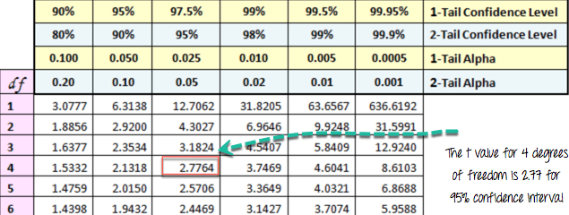
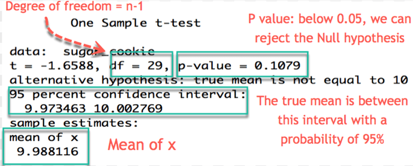
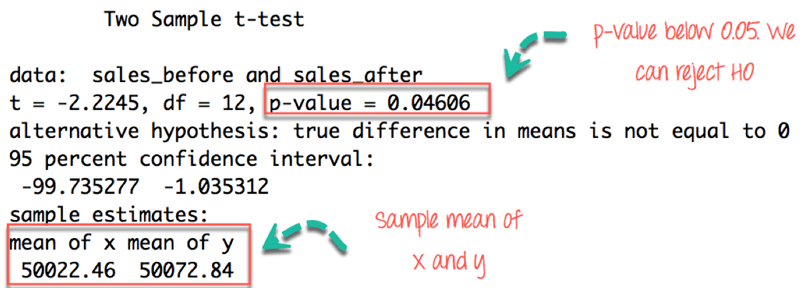

# T 검정 : 단일 표본, 쌍대 (예제 포함)


## 통계적 추론

통계적 추론은 데이터의 분포에 대한 결론을 내리는 기술이다. 데이터 과학자는 종종 과학적으로만 대답할 수 있는 질문에 노출된다. 따라서 통계적 추론은 가설이 사실인지, 즉 데이터에 의해 검정되었는지 여부를 검정하기 위한 전략이다.

가설을 평가하는 일반적인 전략은 t-검정을 실시하는 것이다. t-검정은 두 그룹의 평균이 동일한지 여부를 구별할 수 있다. t-검정을 **Student 검정**이라고도 한다. t-검정은 다음에 대해 추정할 수 있다.

1. 단일 벡터(즉, 1-표본 t-검정)
2. 동일한 샘플 그룹의 벡터 2개(즉, 쌍대 t-검정).

당신은 두 벡터가 무작위로 샘플링되고 독립적이며, 그 값을 알 수는 없지만 동일한 분산을 가진 정규 분포 모집단에서 왔다고 가정한다.

이 튜토리얼에서는 다음에 대하여 학습한다.

- [통계적 추론](./r-t-test-one-sample_kr.html#1)
- [t-검정](./r-t-test-one-sample_kr.html#2)
- [단일 표본 t-검정](./r-t-test-one-sample_kr.html#3)
- [쌍대 t-검정](./r-t-test-one-sample_kr.html#4)


## t-검정

t-검정 이면의 기본적인 아이디어는 통계학을 사용하여 두 개의 반대 가설들을 평가하는 것이다.

- H~0~: 거짓(NULL) 가설: 모평균이 표본평균과 같다.
- H~1~: 참(TRUE) 가설: 모평균이 표본평균과 다르다.

t-검정은 일반적으로 작은 표본 크기로 사용된다. t-검정을 수행하려면 데이터의 정규성을 가정해야 한다.

`t.test()`의 기본 구문은 다음과 같다 :

```
t.test(x, y = NULL,
       mu = 0, var.equal = FALSE)
```

**인수 :**

- x : 단일 표본 t-검정 계산을 위한 벡터
- y : 두 표본 t-검정을 계산하기 위한 두번째 벡터
- mu: 모집단의 평균
- var.equal : 두 벡터의 분산이 같은지 설정한다. 기본 값은 `FALSE`


## 단일 표본 t-검정

t-검정은 이론적 평균( [](https://www.guru99.com/images/r_programming/032918_0821_TTestinROn6.jpg))에 대하여 벡터의 평균을 비교한다. t-검정을 위해 사용되는 공식은 다음과 같다 :
$$
t = \frac{(m-\mu)} {{s}/{\sqrt{n}}}
$$
여기서, 

- [](https://www.guru99.com/images/r_programming/032918_0821_TTestinROn5.jpg) : 표본평균
- [](https://www.guru99.com/images/r_programming/032918_0821_TTestinROn6.jpg) : 모집단의 평균 (이론적 평균)
- s : 표본의 표준편차
- n : 관측치의 수

 t-검정의 통계적 유의성을 평가하려면 **p-값**을 계산해야 한다. **p-값**의 범위는 0에서 1까지이며, 다음과 같이 해석된다.

- p-값이 0.05보다 낮다는 것은 **귀무 가설을 기각**할 확신이 강하다는 것을 의미하므로 H~1~이 승인된다.
- p-값이 0.05보다 높으면 **귀무 가설을 기각할 만한 증거가 충분하지 않다**는 것을 의미한다.  

자유도가 `df = n-1`인 Student 분포(Student distribution)에서 t-검정의 해당 절대값을 보고 p-값을 구성할 수 있다.

For instance, if you have 5 observations, you need to compare our t-value with the t-value in the Student distribution with 4 degrees of freedom and at 95 percent confidence interval. To reject the null hypothesesis, the t-value should be higher than 2.77.

예를 들어, 5개의 관측치가 있는 경우, 우리의 t-값과 Student 분포의 t-값을 4( = 5-1)의 자유도와 95% 신뢰 구간에서 비교할 필요가 있다. 귀무 가설을 기각하려면 t-값이 2.77보다 높아야 한다.


[](https://www.guru99.com/images/r_programming/032918_0821_TTestinROn1.png)


**예제 : **

당신이 쿠키를 생산하는 회사라고 가정해보자. 각각의 쿠키에는 10그램의 설탕이 들어있어야 한다. 쿠키는 모든 것을 혼합하기 전 그릇에 설탕을 첨가하는 기계에 의해 만들어진다. 당신은 기계가 각 쿠키에 10그램의 설탕을 첨가하지 않는다고 믿고 있다. 만약 당신의 가정이 사실이라면, 그 기계는 수리되어야 한다. 당신의 30개의 쿠키에 대한 설탕의 양을 측정하였다.

**주의 :** `rnorm()` 함수를 사용하여 랜덤화된 벡터를 만들 수 있다. 이 함수는 정규 분포 값을 생성한다. 기본 구문은 다음과 같다.

```
rnorm(n, mean, sd)
```

**인수 :** 

- n : 생성하는 관측치 수
- mean : 분포의 평균. 선택사항임.
- sd : 분포의 표준편차. 선택사항임.


평균 9.99, 표준 편차 0.04를 30개 관측치를 갖는 분포를 생성할 수 있다.

```
set.seed(123) 
sugar_cookie <- rnorm(30, mean = 9.99, sd = 0.04)
head(sugar_cookie)
```

**결과 :**

```
## [1]  9.967581  9.980793 10.052348  9.992820  9.995172 10.058603
```


단일 표본 t-검정을 사용하여 설탕의 농도가 조리법과 다른지 여부를 확인할 수 있다. 가설 검정을 진행할 수 있다.

- H~0~: 설탕의 평균이 10.
- H~1~: 설탕의 평균이 10이 아니다.

유의수준(significance level)은 0.05.

```
# H0 : mu = 10
t.test(sugar_cookie, mu = 10)		
```

**결과 :** 

[](https://www.guru99.com/images/r_programming/032918_0821_TTestinROn2.png)

단일 표본 t-검정의 p-값은 0.1079이고 0.05 이상이다. 기계에 의해 첨가된 설탕의 양이 9.973~10.002 그램 사이라는 것을 95%로 확신할 수 있다. 당신은 귀무가설(H~0~)을 기각할 수 없다. 기계가 첨가한 설탕의 양이 조리법을 따르지 않는다는 증거가 충분하지 않다.


## 쌍대 t-검정

**쌍대 t-검정(paired t-test)** 또는 종속 표본 t-검정은 처리된 그룹의 평균이 두 번 계산될 때 사용된다. 쌍대 t-검정의 기본 적용은 다음과 같다.

- A/B 테스트 : 두 가지 변형 비교
- 사례 통제 연구 : 치료 전/후


**예제 :**

한 음료 회사는 판매에 대한 할인 프로그램의 성과를 알고 싶어 한다. 이 회사는 이 프로그램이 추진되고 있는 점포 중 한 곳의 일일 매출을 추적하기로 결정했다. 프로그램이 끝날 때, 회사는 프로그램 전후의 점포 평균 매출액에 통계적인 차이가 있는지 알고 싶다.

- 회사는 프로그램 시작 전 매일 매출을 추적했다. 이것이 우리의 첫 번째 데이터 벡터이다.
- 프로그램은 1주일간 홍보하고 매출액을 매일 기록한다. 이것이 우리의 두번째 벡터이다.
- 프로그램의 효과를 판단하기 위해 t-검정을 실시한다. 이는 두 벡터의 값이 같은 분포(즉, 동일한 점포라는 같은 모집단)에서 나오기 때문에 **쌍대 t-검정**이라고 한다.


가설 검정은 다음과 같다.

- H~0~ : 평균에 차이가 없다.
- H~1~ : 두 평균은 다르다.  


t-검정의 한 가지 가정은 분산 값은 알 수 없지만 같다는 것임을 기억하라. 실제로 데이터는 평균이 거의 같지 않고, t-검정에 대한 부정확한 결과를 가져온다.

균등분산 가정을 완화하기 위한 한 가지 해결책은 Welch의 시험을 사용하는 것이다. R은 두 분산이 기본적으로 같지 않다고 가정한다. 데이터 세트에서 두 벡터의 분산이 동일하므로 `var.equal= TRUE`라고 설정할 수 있다.

프로그램 이후의 높아진 평균 매출액에 대해 가우스 분포를 이용하여 두 개의 랜덤 벡터를 생성한다.

```
# paired t-test
set.seed(123)
# sales before the program
sales_before <- rnorm(7, mean = 50000, sd = 50)
# sales after the program.This has higher mean
sales_after <- rnorm(7, mean = 50075, sd = 50)
# draw the distribution
t.test(sales_before, sales_after,var.equal = TRUE)
```

[](https://www.guru99.com/images/r_programming/032918_0821_TTestinROn3.png)

p-값이 0.04606이다. 이 p-값이 0.05보다 낮으므로, 귀무가설을 받아들일 수 없다. 따라서 두 그룹의 평균이 같지 않다고 결론을 내린다. 그 프로그램은 가게의 매출액을 향상시켰다.


## 요약

t-검정은 추론 통계의 계열에 속한다. 일반적으로 두 집단의 평균 사이에 통계적 차이가 있는지 알아내기 위해 사용된다.

t-검정을 아래의 표로 요약할 수 있다.

| 검정             | 검정할 가설                                      | p-값 | 코드                     | 인수의 선택사항   |
| :--------------- | :----------------------------------------------- | :--- | :----------------------- | :---------------- |
| 단일 표본 t-검정 | 한 벡터의 평균이 이론적 평균과 다르다.           | 0.05 | `t.test(x, mu = mean)`   |                   |
| 쌍대 표본 t-검정 | 같은 그룹에 속하는 A의 평균이 B의 평균과 다르다. | 0.06 | `t.test(A,B, mu = mean)` | `var.equal= TRUE` |

분산이 동일하다고 가정할 경우 변수 var.equal= TRUE를 변경해야 한다.


 