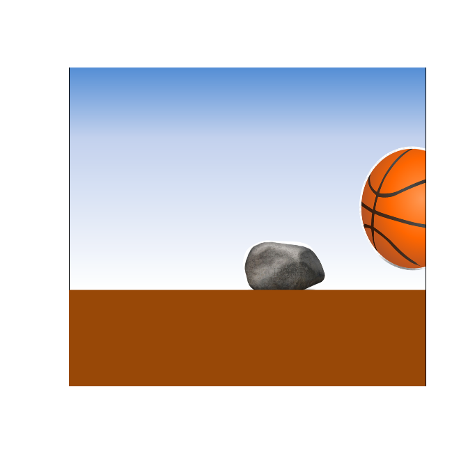

## 제8장 텍스트 마이닝과 워드 클라우드 활용


### 2. 지역별 인구수의 변화에 대한 클라우드 출력


#### 2-1. 지역별 순이동에 따른 워드 클라우드

```{r}
install.packages("wordcloud")
library(wordcloud)

word<- c("서울특별시", "부산광역시", "대구광역시", "광주광역시", "대전광역시",  "인천광역시")        # Keywords
frequency <- c(351, 285, 199, 161, 148, 125)                   # frequencies of Keywords 

wordcloud(word, frequency, colors="blue")     # wordcloud
```

**결과 :**


```{r}
wordcloud(word, frequency, colors=rainbow(length(word)))     # wordcloud
```

**결과 :**


#### 2-2. 단어들의 색 변환

```{r}
wordcloud(word, 
          frequency, 
          random.order=F, 
          random.color=F, 
          colors=rainbow(length(word)))
```

**결과 :**


#### 2-3. 다양한 단어 색 출력을 위한 팔레트 패키지의 활용

```{r}
install.packages("RColorBrewer")
library(RColorBrewer)      

display.brewer.all()                        # display all pallettes
```

결과 :


```{r}
display.brewer.pal(n = 8, name = 'Dark2')   # Dark2 팔렛트
```

결과 :


```{r}
pal2 <- brewer.pal(8,"Dark2")     # (참고) https://statkclee.github.io/viz/viz-r-colors.html
pal2                              # 16진수 문자열 parsing

word<- c("서울특별시", "부산광역시", "대구광역시", "광주광역시", "대전광역시",  "인천광역시")        # Keywords
frequency <- c(351, 285, 199, 161, 148, 125)                   # frequencies of Keywords 

wordcloud(word, frequency, colors=pal2)
```

**결과 :**


### 3. 순이동 인구수가 0보다 큰 지역을 추출해서 워드 클라우드로 출력하기

#### 3-1. 페이지 로딩 및 데이터 파일 열기

```{r}
library(wordcloud)
library(RColorBrewer)
pal2 <- brewer.pal(8,"Dark2")

# Data/101_DT_1B26001_A01_M.csv 파일 불러오기 (wide table 형식)
data <- read.csv(file.choose(), header=T) 
head(data)
str(data)
```

**결과 :**


#### 3-2. 데이터 정제: 불필요 지역 제외 ('전국' 제외)

```{r}
data2 <- data[data$행정구역.시군구.별 != "전국", ]   # 전국이 아닌 데이터만 data2 값으로...
head(data2)
```

**결과 :**


#### 3-3. '구’ 단위 지역 통계 삭제

```{r}
x <- grep("구$", data2$행정구역.시군구.별)      # grep() : 특정 텍스트를 갖는 색인 번호 검색 
x                                             # (참고) http://blog.naver.com/PostView.nhn?blogId=coder1252&logNo=220947332269&parentCategoryNo=&categoryNo=10&viewDate=&isShowPopularPosts=true&from=search

data3 <- data2[-c(x), ]
head(data3)
```


### 4. 굴러가는 공

```{r}
library(animation)
library(png)
ani.options(interval = 0.1)
plot.new()
rect(0, 0, 1, 1, col="white")
for (i in 1:6) {
    img <- paste("data/ball", i, ".png", sep="")
    img <- readPNG(img)
    rasterImage(img, 0, 0, 1, 1)
    ani.pause()
}
dev.off()
```

**결과 :**



------

 [](source/ch_06_Animation.R) [](pdf/ch_06_Animation.pdf)