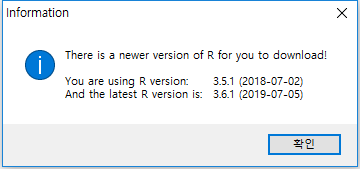

## R과 R 패키지 업데이트


### 1. R 업데이트

```{r}
install.packages("installr")
library(installr)
updateR()
```

결과 :

```
> install.packages("installr")
## ‘C:/Users/Dae Ho Kim/Documents/R/win-library/3.5’의 위치에 패키지(들)을 설치합니다.
## (왜냐하면 ‘lib’가 지정되지 않았기 때문입니다)
## URL 'https://cran.csiro.au/bin/windows/contrib/3.5/installr_0.22.0.zip'을 시도합니다
## Content type 'application/zip' length 337398 bytes (329 KB)
## downloaded 329 KB
## 
## 패키지 ‘installr’를 성공적으로 압축해제하였고 MD5 sums 이 확인되었습니다
## 
## 다운로드된 바이너리 패키지들은 다음의 위치에 있습니다
         C:\Users\Public\Documents\ESTsoft\CreatorTemp\Rtmp84bBQg\downloaded_packages
> library(installr)
## 필요한 패키지를 로딩중입니다: stringr
## 
## Welcome to installr version 0.22.0
## 
## More information is available on the installr project website:
## https://github.com/talgalili/installr/
## 
## Contact: <tal.galili@gmail.com>
## Suggestions and bug-reports can be submitted at: https://github.com/talgalili/installr/issues
## 
##                         To suppress this message use:
##                         suppressPackageStartupMessages(library(installr))
## 
## 경고메시지(들): 
## 1: 패키지 ‘installr’는 R 버전 3.5.3에서 작성되었습니다 
## 2: 패키지 ‘stringr’는 R 버전 3.5.3에서 작성되었습니다 
> updateR()
## Installing the newest version of R,
##  please wait for the installer file to be download and executed.
##  Be sure to click 'next' as needed...
## URL 'https://cran.rstudio.com/bin/windows/base/R-3.6.1-win.exe'을 시도합니다
## Content type 'application/x-msdownload' length 84681344 bytes (80.8 MB)
## downloaded 80.8 MB
## 
## 
## The file was downloaded successfully into:
 C:\Users\Public\Documents\ESTsoft\CreatorTemp\Rtmp84bBQg/R-3.6.1-win.exe 
## 
## Running the installer now...
## 
## Installation status:  FALSE . Removing the file:
##  C:\Users\Public\Documents\ESTsoft\CreatorTemp\Rtmp84bBQg/R-3.6.1-win.exe 
##  (In the future, you may keep the file by setting keep_install_file=TRUE) 
## [1] FALSE
## 경고메시지(들): 
## In shell(install_cmd, wait = wait, ...) :
##   'C:\Users\Public\Documents\ESTsoft\CreatorTemp\Rtmp84bBQg/R-3.6.1-win.exe' execution failed with error code 1
> 
```





설치 과정이 이어짐..


### 2. 이전 버전의 패키지 가져오기

#### 2-1. 이전 버전의 패키지 복사해 오기

이전 R 버전 폴더의 모든 라이브러리들을 새로운 R 버전 폴더로 복사해서 붙여넣기를 한다.

저는 R 3.4.* 버전에서 R 3.6.1. 버전으로 업데이트하였는데, 경로는 아래와 같습니다.

```
C:\Users\Username\Documents\R\win-library\3.4
C:\Users\Username\Documents\R\win-library\3.6.1
```

#### 2-2. 패키지 업데이트

```{r}
update.packages(checkBuilt=TRUE)
```

팝업 박스가 나오면서 `yes`, `No`선택화면에서 `yes`를 계속 클릭한다.

### 3. 패키지 설치 확인

```{r}
version
packageStatus()
```


------

[](https://misdb.github.io/R/R-for-BigData-Analysis/source/ch_02_R_Update.R)  [](https://misdb.github.io/R/R-for-BigData-Analysis/pdf/ch_02_R_Update.pdf)  

---

[](index.html)    [](index.html)    [](ch_03_Data_Types.html)

