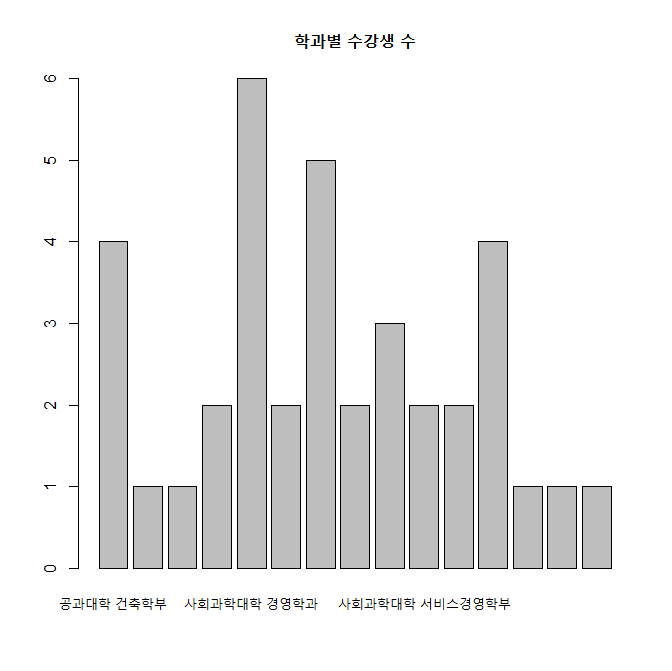

## 파일 불러오기(Import)


[TOC]


### 1. 외부 파일의 종류		

1) 텍스트파일	
2) 엑셀파일	
3) xml/json파일	
4) 기타 : SPSS, SAS 데이터 파일	
		

### 2. 텍스트 파일 불러오기	

#### 2-1. 텍스 파일의 형식

​	1) 텍스트자료에서 첫번째 줄은 '변수이름'을 나타내며, 두번째 줄부터 '데이터'가 입력됨	

​	2) '데이터'와  '데이터'를 구분하는 문자를 '구분자(seperator)'라고 하며 주로 '공백(" ")', 콤마(","), TAB("\t") 등이 사용됨	

​	•  텍스트 파일의 예 (첫줄은 변수명, 두번째부터는 공백으로 구분된 자료값)

```
	Surv N Class Age Sex 	
	20 23 Crew Adult Female 	
	192 862 Crew Adult Male 	
	1 1 First Child Female 	
	5 5 First Child Male 	
	13 13 Second Child Female 
```

​	•  구분자가 콤마인 파일: 보통 CSV파일(Comma Separated Values)로 저장됨

```
	Surv,N,Class,Age,Sex	
	20,23,Crew,Adult,Female	
	192,862,Crew,Adult,Male	
	1,1,First,Child,Female	
	5,5,First,Child,Male	
	13,13,Second,Child,Female	
```


​		

#### 2-2. 텍스트파일 읽는 함수		

​	1) read.table(), read.csv(), read.delim()	
​	2) read_csv(), read_delim() : readr패키지를 이용	
​	

###### 1) read.table(), read.csv() 함수 예제	

데이터 세트 : [titanic.txt](data/titanic.txt)

	titanic <- read.table("c:/temp/titanic.txt", header=T, sep="\t")	
	head(titanic)

**결과 :** 

```
> titanic <- read.table("c:/temp/titanic.txt", header=T, sep="\t")
> head(titanic)
##   X                                          Name PClass   Age
## 1 1                  Allen, Miss Elisabeth Walton    1st 29.00
## 2 2                   Allison, Miss Helen Loraine    1st  2.00
## 3 3           Allison, Mr Hudson Joshua Creighton    1st 30.00
## 4 4 Allison, Mrs Hudson JC (Bessie Waldo Daniels)    1st 25.00
## 5 5                 Allison, Master Hudson Trevor    1st  0.92
## 6 6                            Anderson, Mr Harry    1st 47.00
##      Sex Survived SexCode
## 1 female        1       1
## 2 female        0       1
## 3   male        0       0
## 4 female        0       1
## 5   male        1       0
## 6   male        1       0
```


###### 2) read_csv 함수 예제	

데이터 세트 : [titanic.csv](data/titanic.csv)

```{r}
#install.packages("readr")	
library(readr)	
titanic3 <- read_csv("c:/temp/titanic.csv")      ## file name
```

**결과 :** 

```
## Parsed with column specification:
## cols(
##   X1 = col_double(),
##   Name = col_character(),
##   PClass = col_character(),
##   Age = col_double(),
##   Sex = col_character(),
##   Survived = col_double(),
##   SexCode = col_double()
## )
## 경고메시지(들): 
## Missing column names filled in: 'X1' [1] 
> 
```

###### 

###### 3) 예제: 수강생 자료	

• [test.csv](data/test.csv) 자료 읽기

```{r}
# fileEncoding = "UTF-8": csv파일에서 한글 입력 코딩방식, CP949 또는 UTF-8	

test <- read.csv("c:/temp/test.csv")	
head(test)	
names(test)	
dim(test)	
```

**결과 :** 

```
> test <- read.csv("c:/temp/test.csv")
> head(test)
##   ID Stud_ID   Name                              Dept  Mid Final
## 1  1  191011 김예리             사회과학대학 경제학과 25.0    36
## 2  2  191041 이예빈         미술·디자인대학 미술학부 30.0    44
## 3  3  192047 이지현                 공과대학 건축학부 35.0    24
## 4  4  191055 조지숙       테크노과학대학 지식재산학과 25.0    32
## 5  5  199011 김한별 사회과학대학 마케팅정보컨설팅학과 37.5    36
## 6  6  141027 박용빈       사회과학대학 서비스경영학부 30.0    52
##   Attendance
## 1       11.0
## 2       20.0
## 3       11.5
## 4       18.2
## 5       14.7
## 6       11.5
> names(test)
## [1] "ID"         "Stud_ID"    "Name"       "Dept"      
## [5] "Mid"        "Final"      "Attendance"
> dim(test)
## [1] 37  7
```


• test 데이터프레임에서 학과별 수강생 수를 구하고, 막대 그래프 그리기	

```
unique(test$Dept)	
(nid <- table(test$Dept))	
barplot(nid, main="학과별 수강생 수")	
```

**결과 :** 

```
> unique(test$Dept)
##  [1] 사회과학대학 경제학과             미술·디자인대학 미술학부        
##  [3] 공과대학 건축학부                 테크노과학대학 지식재산학과      
##  [5] 사회과학대학 마케팅정보컨설팅학과 사회과학대학 서비스경영학부      
##  [7] 공과대학 융합컴퓨터ㆍ미디어학부   공과대학 지능로봇공학과          
##  [9] 사회과학대학 경영학과             사회과학대학 행정학과            
## [11] 테크노과학대학 수학과             인문대학 사회복지학과            
## [13] 테크노과학대학 생의약화장품학부   사회과학대학 무역학과            
## [15] 사회과학대학 광고홍보언론학과    
## 15 Levels: 공과대학 건축학부 공과대학 융합컴퓨터ㆍ미디어학부 ... 테크노과학대학 지식재산학과
> (nid <- table(test$Dept))
## 
##                 공과대학 건축학부   공과대학 융합컴퓨터ㆍ미디어학부 
##                                 4                                 1 
##           공과대학 지능로봇공학과         미술·디자인대학 미술학부 
##                                 1                                 2 
##             사회과학대학 경영학과             사회과학대학 경제학과 
##                                 6                                 2 
##     사회과학대학 광고홍보언론학과 사회과학대학 마케팅정보컨설팅학과 
##                                 5                                 2 
##             사회과학대학 무역학과       사회과학대학 서비스경영학부 
##                                 3                                 2 
##             사회과학대학 행정학과             인문대학 사회복지학과 
##                                 2                                 4 
##   테크노과학대학 생의약화장품학부             테크노과학대학 수학과 
##                                 1                                 1 
##       테크노과학대학 지식재산학과 
##                                 1 
```



###### 

### 3. 엑셀 파일 불러오기		

• readxl() /writexl()	
• 적은 메모리 사용으로 빠르게 데이터를 읽어옴	
• 결과는 데이터프레임이 아니라 tibble형식으로 저장됨 - tibble형식은 데이터프레임의 확장된 데이터클래스임	
	
• 1980~2018년까지 연도별/성별 고용률 자료 (http://www.index.go.kr/potal/stts/idxMain/selectPoSttsIdxSearch.do?idx_cd=1494)	

#### 3-1. 엑셀파일 불러오기

데이터 세트 : [고용률.xls](data/고용률.xls)

```{r}
# install.packages("readxl", dependencies=T)	

library(readxl)	
o <- read_excel("c:/temp/고용률.xls", sheet=1); head(o)	
```

**결과 :** 

```
> library(readxl)
> o <- read_excel("c:/temp/고용률.xls", sheet=1); head(o)
## # A tibble: 6 x 14
##   년도  `15세이상 인구` 경제활동인구 취업자 `취업자 증감` 실업자 비경제활동인구
##   <chr> <chr>           <chr>        <chr>  <chr>         <chr>  <chr>         
## 1 1980  24,463          14,431       13,683 81            748    10,032        
## 2 1981  25,100          14,683       14,023 340           660    10,417        
## 3 1982  25,638          15,032       14,379 356           654    10,605        
## 4 1983  26,212          15,118       14,505 126           613    11,094        
## 5 1984  26,861          14,997       14,429 -76           568    11,865        
## 6 1985  27,553          15,592       14,970 541           622    11,961        
## # ... with 7 more variables: `경제활동참가율(15-64세)` <chr>,
## #   `- 남자 경활참가율(15-64세)` <chr>, `- 여자 경활참가율(15-64세)` <chr>,
## #   `고용률(15-64세)` <chr>, 실업률 <chr>, 취업준비자 <chr>, 구직단념자 <chr>
```


#### 3-2. 엑셀 파일로 저장하기

```{r}
# 엑셀 파일로 저장하기
# install.packages("writexl")

library(writexl)	
write_xlsx(o, "c:/temp/고용률(저장).xlsx")	

list.files(pattern="*.xlsx")
```

**결과 :** 

```
> list.files(pattern="*.xlsx")
## [1] "고용률(저장).xlsx"
```


------

[](https://misdb.github.io/R/R-for-BigData-Analysis/source/ch_03_02_Data_Import.R) [](https://misdb.github.io/R/R-for-BigData-Analysis/pdf/ch_03_02_Data_Import.pdf)

