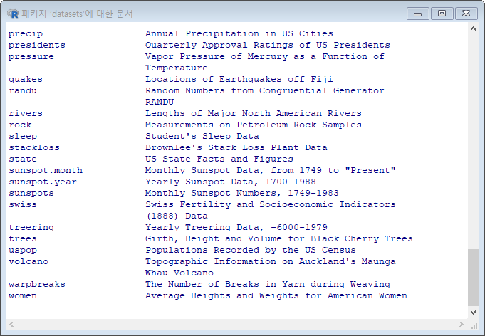
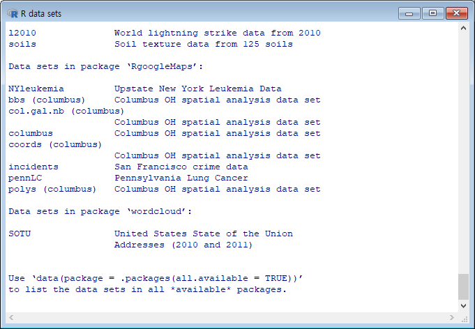

## 제3장 데이터 구조의 이해와 코딩의 시작

[TOC]


### I. 벡터

#### 1. 벡터 만들기
```{r}
x <- c(80, 85, 70)         # 처리할 데이터의 변수 정의
x                          # 변수 내용의 확인

c(80, 85, 70) -> x         # 바람직하지 않음.
x

x <- c(1,2,3,4) ; x

y <- c(2,3,4,5) ; y

(z <- c(1,2))
```

**결과 :** 

```
> x <- c(80, 85, 70)
> x
## [1] 80 85 70

> c(80, 85, 70) -> x
> x
## [1] 80 85 70

> x <- c(1,2,3,4) ; x
## [1] 1 2 3 4

> y <- c(2,3,4,5) ; y
## [1] 2 3 4 5

> (z <- c(1,2))
## [1] 1 2
```

#### 2. 벡터 원소가 하나일 때

```{r}
x <- c(80)
x

x <- 80
x
```

**결과 :** 

```
> x <- c(80)
> x
## [1] 80

> x <- 80
> x
## [1] 80
```

#### 3. 산술연산

```{r}
x <- 5+2
x

x <- 5/3
x

x <- 5^2
x

x <- 5%%3
x

x <- 5%/%3
x
```

**결과 :** 

```
> x <- 5+2
> x
## [1] 7
> 
> x <- 5/3
> x
## [1] 1.666667
> 
> x <- 5^2
> x
## [1] 25
> 
> x <- 5%%3
> x
## [1] 2
> 
> x <- 5%/%3
> x
## [1] 1
```

##### 3-1. 벡터의 사칙연산 

```{r}
x <- c(1, 2, 3, 4) # 4개 원소
y <- c(2, 3, 4, 5) # 4개 원소
z <- c(1, 2)       # 2개 원소

w <- x+y
w

w <- x+5
w

w <- y/2
w

w <- x+z
w

w <- x/z
w

w <- z/x
w

w <- y %/% x     # 몫

w <- y %% x      # 나머지
```

**결과 :** 

```
> x <- c(1, 2, 3, 4) # 4개 원소
> y <- c(2, 3, 4, 5) # 4개 원소
> z <- c(1, 2)       # 2개 원소
> 
> w <- x+y
> w
## [1] 3 5 7 9
> 
> w <- x+5
> w
## [1] 6 7 8 9
> 
> w <- y/2
> w
## [1] 1.0 1.5 2.0 2.5
> 
> w <- x+z
> w
## [1] 2 4 4 6
> 
> w <- x/z
> w
## [1] 1 1 3 2
> 
> w <- z/x
> w
## [1] 1.0000000 1.0000000 0.3333333 0.5000000
> 
> w <- y %/% x ; w
## [1] 2 1 1 1
> 
> w <- y %% x ; w
## [1] 0 1 1 1
```

##### 3-2. 서로 다른 데이터 유형과 연산

```{r}
x <- c(1, 2, 3)                 # 숫자 벡터
x

y <- c("A", "B", "c")           # 문자 벡터 : ""로 묶는다.
y

y <- c("A", 1, 2)               # 문자와 숫자의 혼합 -> 모두 문자로 처리함.
y

z <- y + 1           # Error 발생
```

**결과 :** 

```
> y <- c("A", "B", "c")
> y
## [1] "A" "B" "c"
> 
> y <- c("A", 1, 2)
> y
## [1] "A" "1" "2"
> 
> z <- y + 1
## Error in y + 1 : 이항연산자에 수치가 아닌 인수
```

#### 4. 비교 연산자

( >=, >, ==, <, <= ) => 결과는 'TRUE' 또는 'FALSE'

```{r}
x <- 5 < 3
x 

y <- c(10, 20, 30)
z <- y <= 10
z
```

**결과 :** 

```
> x <- 5 < 3
> x 
## [1] FALSE
> 
> y <- c(10, 20, 30)
> z <- y <= 10
> z
## [1]  TRUE FALSE FALSE
```

#### 5. 논리 연산자

```{r}
x <- TRUE
y <- FALSE
x | y

x & y

# p.67
x <- 3
!x

isTRUE(y)

z <- c(TRUE, FALSE, FALSE)
z | y
```

**결과 :** 

```
> x <- TRUE
> y <- FALSE
> x | y
## [1] TRUE
> 
> x & y
## [1] FALSE
> 
> x <- 3
> !x
## [1] FALSE
> 
> isTRUE(y)
## [1] FALSE
> 
> z <- c(TRUE, FALSE, FALSE)
> z | y
## [1]  TRUE FALSE FALSE
```

#### 6. 연속적인 값들의 벡터 만들기

```{r}
x <- seq(1, 10)
x

x <- 1:10
x

x <- seq(10, 1)
x

y <- 10:1
y

x <- seq(1, 10, by=3)
x

y <- seq(1, 10, length.out=5)
y
```

**결과 :** 

```
> x <- seq(10, 1)
> x
## [1] 10  9  8  7  6  5  4  3  2  1
> 
> y <- 10:1
> x <- seq(1, 10)
> x
## [1]  1  2  3  4  5  6  7  8  9 10
> 
> x <- 1:10
> x
## [1]  1  2  3  4  5  6  7  8  9 10
> 
> x <- seq(10, 1)
> x
## [1] 10  9  8  7  6  5  4  3  2  1
> 
> y <- 10:1
> y
## [1] 10  9  8  7  6  5  4  3  2  1
> 
> x <- seq(1, 10, by=3)
> x
## [1]  1  4  7 10
> 
> y <- seq(1, 10, length.out=5)
> y
## [1]  1.00  3.25  5.50  7.75 10.00
```

#### 7. 반복적인 값들의 벡터 만들기

```{r}
x <- c(1, 2, 3)
rep(x, times=2)

rep(x, each=2)

x1 <- rep(1:4, 2) ; x1

x2 <- rep(1:4, each = 2) ; x2

x3 <- rep(1:4, c(2,2,2,2)) ; x3   

x4 <- rep(1:4, c(2,1,2,1)) ; x4
```

**결과 :** 

```
> x <- c(1, 2, 3)
> rep(x, times=2)
## [1] 1 2 3 1 2 3
> 
> rep(x, each=2)
## [1] 1 1 2 2 3 3
> 
> x1 <- rep(1:4, 2) ; x1
## [1] 1 2 3 4 1 2 3 4
> 
> x2 <- rep(1:4, each = 2) ; x2
## [1] 1 1 2 2 3 3 4 4
> 
> x3 <- rep(1:4, c(2,2,2,2)) ; x3   
## [1] 1 1 2 2 3 3 4 4
> 
> x4 <- rep(1:4, c(2,1,2,1)) ; x4
## [1] 1 1 2 3 3 4
```

#### 8. 벡터 요소의 확인

##### 8-1) 벡터의 색인에 의한 확인

```{r}
x <- c(1, 2, 3, 4, 5)
x[2]

x[c(1, 3, 5)]

x[-c(2, 4)]
```

**결과 :**

```
> x <- c(1, 2, 3, 4, 5)
> x[2]
## [1] 2
> 
> x[c(1, 3, 5)]
## [1] 1 3 5
> 
> x[-c(2, 4)]
## [1] 1 3 5
```

##### 8-2) 요소 값의 조건 비교에 따른 확인

```{r}
x <- c(1, 2, 3, 4, 5)
x[x > 2]

x[x >=2 & x <=4]
```

**결과 :**

```
> x <- c(1, 2, 3, 4, 5)
> x[x > 2]
## [1] 3 4 5
> 
> x[x >=2 & x <=4]
## [1] 2 3 4
```

#### 9. 원소 값의 수정 

##### 9-1) 벡터의 색인을 참조한 수정

```{r}
x <- c(1, 2, 3, 4, 5)
x[2] <- 20
x

x[c(3, 4)] <- 15
x
```

**결과 :**

```
> x <- c(1, 2, 3, 4, 5)
> x[2] <- 20
> x
## [1]  1 20  3  4  5
> 
> x[c(3, 4)] <- 15
> x
## [1]  1 20 15 15  5
```

##### 9-2) 벡터 요소 값 비교에 의한 수정

```{r}
x <- c(1, 2, 3, 4, 5)
x[ x <= 3 ] <- 10
```

**결과 :**

```
> x <- c(1, 2, 3, 4, 5)
> x[x <= 3] <- 10
> x
## [1] 10 10 10  4  5
```

#### [연습문제]

 `Ramen` 변수에 (Cup, Bowl, Cup, Bowl)의 데이터를 입려하고, Cup을 Bowl로 Bowl은 컵으로 데이터를 변경하라.

```{r}  
Ramen <- c("Cup", "Bowl", "Cup", "Bowl")

Ramen[Ramen == "Cup"] <- "x"
Ramen
Ramen[Ramen == "Bowl"] <- "Cup"
Ramen
Ramen[Ramen == "x"] <- "Bowl"
Ramen
```

**결과 :**

```
> Ramen <- c("Cup", "Bowl", "Cup", "Bowl")
> 
> Ramen[Ramen == "Cup"] <- "x"
> Ramen
## [1] "x"    "Bowl" "x"    "Bowl"
> Ramen[Ramen == "Bowl"] <- "Cup"
> Ramen
## [1] "x"   "Cup" "x"   "Cup"
> Ramen[Ramen == "x"] <- "Bowl"
> Ramen
## [1] "Bowl" "Cup"  "Bowl" "Cup" 
```

#### 10. 함수의 사용

```{r}
x <- seq(1:10)

sum(x)
mean(x)
var(x)
sd(x)
sqrt(x)
length(x)

x <- c(1, 2, -3)
abs(x)

summary(x)
```

**결과 :**

```
> x <- seq(1:10)
> 
> sum(x)
## [1] 55
> mean(x)
## [1] 5.5
> var(x)
## [1] 9.166667
> sd(x)
## [1] 3.02765
> sqrt(x)
##  [1] 1.000000 1.414214 1.732051 2.000000 2.236068
##  [6] 2.449490 2.645751 2.828427 3.000000 3.162278
> length(x)
## [1] 10
> 
> x <- c(1, 2, -3)
> abs(x)
## [1] 1 2 3
> 
> summary(x)
##    Min. 1st Qu.  Median    Mean 3rd Qu.    Max. 
##    -3.0    -1.0     1.0     0.0     1.5     2.0 
```

##### 10-1. 문자열의 결합 : `paste()`

```{r}
x <- c("이","박","김","최","차")
y <- c("순신", "원순",
"재경", "창원", "태균")
paste(x,y)
paste(x, y, sep=",")
paste(x, y, sep="")
```

**결과 :**

```
> x <- c("이","박","김","최","차")
> y <- c("순신", "원순", "재경", "창원", "태균")
> paste(x,y)
## [1] "이 순신" "박 원순" "김 재경" "최 창원"
## [5] "차 태균"
> paste(x, y, sep=",")
## [1] "이,순신" "박,원순" "김,재경" "최,창원"
## [5] "차,태균"
> paste(x, y, sep="")
## [1] "이순신" "박원순" "김재경" "최창원" "차태균"
```

##### 10-2. 결측치 : `NULL`, `NA`

```{r}
# NULL, NA(not available)
x <- NULL
is.null(x)

y <- c(1, 2, 3, NA, 5)
y
```

**결과 :**

```
> x <- NULL
> is.null(x)
## [1] TRUE
> 
> y <- c(1, 2, 3, NA, 5)
> y
## [1]  1  2  3 NA  5
```

##### 10-3. `Inf`, `NaN`

```{r}
z <- 10/0
z

w <- 0/0
w
```

**결과 :**

```
> z <- 10/0
> z
## [1] Inf
> 
> w <- 0/0
> w
## [1] NaN
```


### II. 배열

`array()` 함수 사용

#### 1. 1차원 배열
```{r}
x <- array(1:3, dim=c(3))
x
```

**결과 :**

```
> x <- array(1:3, dim=c(3))
> x
## [1] 1 2 3
```

#### 2. 2차원 배열 만들기

##### 2-1. `array()` 함수 사용

```{r}
x <- array(1:6, dim=c(2, 3))     # dim=c(2, 3) : 2행, 3열
x

x <- array(c(2, 4, 6, 8, 10, 12), dim=c(2, 3))
x
```

` array(x, dim = c(a,b))`

**인수 :** 

- `x` : 배열로 표현한 벡터

- `dim = c(a, b)` : 배열의 크기 지정, a개 행 b개 열

**결과 :**

```
> x <- array(1:6, dim=c(2, 3))
> x
##      [,1] [,2] [,3]
## [1,]    1    3    5
## [2,]    2    4    6
> 
> x <- array(c(2, 4, 6, 8, 10, 12), dim=c(2, 3))
> x
##      [,1] [,2] [,3]
## [1,]    2    6   10
## [2,]    4    8   12
```

##### 2-2. 벡터 결합으로 배열 만들기

```{r}
v1 <- c(1,2,3,4)
v2 <- c(5,6,7,8)
v3 <- c(9,10,11,12)

x <- cbind(v1, v2, v3)   # cbind() : 열(column) 단위로 묶기(bind)
x

y <- rbind(v1, v2, v3)   # rbind() : 행(row) 단위로 묶기(bind)
y
```

**결과 :**

```
> v1 <- c(1,2,3,4)
> v2 <- c(5,6,7,8)
> v3 <- c(9,10,11,12)
> 
> x <- cbind(v1, v2, v3)   # cbind() : 열(column) 단위로 묶기(bind)
> x
##      v1 v2 v3
## [1,]  1  5  9
## [2,]  2  6 10
## [3,]  3  7 11
## [4,]  4  8 12
> 
> y <- rbind(v1, v2, v3)   # rbind() : 행(row) 단위로 묶기(bind)
> y
##    [,1] [,2] [,3] [,4]
## v1    1    2    3    4
## v2    5    6    7    8
## v3    9   10   11   12
```

#### 3. 2차원 배열의 요소 값 보기와 수정

```{r}
x[1, 3] 

x[, 3]

x[,-3]

x[1, 2] <- 20
x
```

**결과 :**

```
> x[1, 3] 
## v3 
## 9 
> 
> x[, 3]
## [1]  9 10 11 12
> 
> x[,-3]
##      v1 v2
## [1,]  1  5
## [2,]  2  6
## [3,]  3  7
## [4,]  4  8
> 
> x[1, 2] <- 20
> x
##      v1 v2 v3
## [1,]  1 20  9
## [2,]  2  6 10
## [3,]  3  7 11
## [4,]  4  8 12
```

#### 4. 2차원 배열의 행과 열 이름 추가

##### 4-1. (방법 1) : `colnames()`, `rownames()` 함수 이용

```{r}
x1 <- array(c(2, 4, 6, 8, 10, 12), dim=c(2, 3))
x1

colnames(x1) <- c("1열", "2열", "3열")
x1

rownames(x1) <- c("1행", "2행")
x1

x1["1행", ]

x1[ ,"2열"]
```

**결과 :**

```
> x1 <- array(c(2, 4, 6, 8, 10, 12), dim=c(2, 3))
> x1
##      [,1] [,2] [,3]
## [1,]    2    6   10
## [2,]    4    8   12
> 
> colnames(x1) <- c("1열", "2열", "3열")
> x1
##      1열 2열 3열
## [1,]   2   6  10
## [2,]   4   8  12
> 
> rownames(x1) <- c("1행", "2행")
> x1
##     1열 2열 3열
## 1행   2   6  10
## 2행   4   8  12
> 
> x1["1행", ]
## 1열 2열 3열 
##   2   6  10 
> 
> x1[ ,"2열"]
## 1행 2행 
##   6   8 
```

##### 4-2. (방법 2) : `dimnames = ` 인수 이용

```{r}
names <- list(c("Row 1", "Row 2"), c("Col 1", "Col 2", "Col 3"))
x2 <- array(c(8, 10, 12, 14, 16, 18), dim=c(2, 3), dimnames=names)
x2

x2["Row 1", ]
x2[ ,"Col 2"]
```

**결과 :**

```
> names <- list(c("Row 1", "Row 2"), c("Col 1", "Col 2", "Col 3"))
> x2 <- array(c(8, 10, 12, 14, 16, 18), dim=c(2, 3), dimnames=names)
> x2
##       Col 1 Col 2 Col 3
## Row 1     8    12    16
## Row 2    10    14    18
> 
> x2["Row 1", ]
## Col 1 Col 2 Col 3 
##     8    12    16 
> x2[ ,"Col 2"]
## Row 1 Row 2 
##    12    14 
```

#### 5. 배열 요소 값 확인

##### 5-1. 배열의 색인에 의한 확인

```{r}
x <- array(1:6, dim=c(2, 3))

x[1,3]      # 1행 3열 요소의 값 확인

x[1,]       # 1행 전체 요소의 값 확인
x[,3]       # 3열 전체 요소의 값 확인

x[,-3]      # 3열을 제외한 전체 요소의 값 확인
x[-1,]      # 1행을 제외한 전체 요소의 값 확인
```

**결과 :**

```
> x <- array(1:6, dim=c(2, 3))
> 
> x[1,3]      # 1행 3열 요소의 값 확인
## [1] 5
> 
> x[1,]       # 1행 전체 요소의 값 확인
## [1] 1 3 5
> x[,3]       # 3열 전체 요소의 값 확인
## [1] 5 6
> 
> x[,-3]      # 3열을 제외한 전체 요소의 값 확인
##      [,1] [,2]
## [1,]    1    3
## [2,]    2    4
> x[-1,]      # 1행을 제외한 전체 요소의 값 확인
## [1] 2 4 6
```

##### 5-2. 배열 요소의 값 비교에 의한 확인

```{r}
x <- array(1:6, dim=c(2, 3))

x[ x<6 ]
x[ x>2 & x<6 ]
```

**결과 :**

```
> x <- array(1:6, dim=c(2, 3))
> 
> x[ x<6 ]
## [1] 1 2 3 4 5
> x[ x>2 & x<6 ]
## [1] 3 4 5
```

##### 5-3. 행/열의 이름을 이용한 요소의 확인

```{r}
names <- list(c("Row 1", "Row 2"), c("Col 1", "Col 2", "Col 3"))
x2 <- array(c(8, 10, 12, 14, 16, 18), dim=c(2, 3), dimnames=names)

x2["Row 1", ]
x2[ ,"Col 2"]
```

**결과 :**

```
> names <- list(c("Row 1", "Row 2"), c("Col 1", "Col 2", "Col 3"))
> x2 <- array(c(8, 10, 12, 14, 16, 18), dim=c(2, 3), dimnames=names)
> 
> x2["Row 1", ]
## Col 1 Col 2 Col 3 
##     8    12    16 
> x2[ ,"Col 2"]
## Row 1 Row 2 
##    12    14 
```

#### 6. 배열 요소 값의 수정

##### 6-1. 배열의 색인을 이용한 수정

```{r}
x <- array(1:6, dim=c(2, 3))

x[1,2] <- 30
x
```

**결과 :**

```
> x <- array(1:6, dim=c(2, 3))
> 
> x[1,2] <- 30
> x
##      [,1] [,2] [,3]
## [1,]    1   30    5
## [2,]    2    4    6
```

##### 6-2. 배열 요소의 비교에 의한 확인

```{r}
x <- array(1:6, dim=c(2, 3))

x[ x<6 ]  <- 3
x
```

**결과 :**

```
> x <- array(1:6, dim=c(2, 3))
> 
> x[ x<6 ]  <- 3
> x
##      [,1] [,2] [,3]
## [1,]    3    3    3
## [2,]    3    3    6
```

#### 5. 3차원 배열

```{r}
x <- array(1:24, dim=c(2, 3, 4))   # 2행, 3열의 배열 4개
x
```

**결과 :**

```
> x <- array(1:24, dim=c(2, 3, 4))   # (2 X 3) 배열이 4개 있는 것과 같음.
> x
## , , 1
## 
##      [,1] [,2] [,3]
## [1,]    1    3    5
## [2,]    2    4    6
## 
## , , 2
## 
##      [,1] [,2] [,3]
## [1,]    7    9   11
## [2,]    8   10   12
## 
## , , 3
## 
##      [,1] [,2] [,3]
## [1,]   13   15   17
## [2,]   14   16   18
## 
## , , 4
## 
##      [,1] [,2] [,3]
## [1,]   19   21   23
## [2,]   20   22   24
```

#### 6. 함수 적용

```{r}
x <- array(c(2,4,6,8,10,12), dim=c(2,3))

apply(x, MARGIN = 1, sum)
apply(x, 1, mean)
apply(x, 1, sd)

apply(x, MARGIN = 2, sum)
apply(x, 2, mean)
apply(x, 2, sd)
```

`apply(x, MARGIN, FUN, …)`

**인수 :**

- `x` :  함수를 적용할 배열

- `MARGIN = ` : `1`이면 행단위, `2`이면 열단위,  `c(1, 2)`이면 행과 열 동시에
- `FUN` : 적용할 함수 (sum, mena, sd, median, ...  사용자정의 함수도 가능)

**결과 :**

```
> x <- array(c(2,4,6,8,10,12), dim=c(2,3))
> 
> apply(x, MARGIN = 1, sum)
## [1] 18 24
> apply(x, 1, mean)
## [1] 6 8
> apply(x, 1, sd)
## [1] 4 4
> 
> apply(x, MARGIN = 2, sum)
## [1]  6 14 22
> apply(x, 2, mean)
## [1]  3  7 11
> apply(x, 2, sd)
## [1] 1.414214 1.414214 1.414214
```

##### 

### III. 행렬

#### 1. 행렬 만들기 : matrix() 함수이용.
```{r}
x <- matrix(1:6, nrow=2)
x

x <- matrix(1:6, nrow=2, byrow=TRUE)
x

x[1, 3]
```

**결과 :**

```
> x <- matrix(1:6, nrow=2)
> x
##      [,1] [,2] [,3]
## [1,]    1    3    5
## [2,]    2    4    6
> 
> x <- matrix(1:6, nrow=2, byrow=TRUE)
> x
##      [,1] [,2] [,3]
## [1,]    1    2    3
## [2,]    4    5    6
>
> x[1, 3]
## [1] 3

```

#### 2. 행과 열 이름 주기

```{r}
names <- list(c("1행", "2행"), c("1열", "2열", "3열"))

matrix(1:6, nrow=2, byrow=TRUE, dimnames=names)
```

**결과 :**

```
> names <- list(c("1행", "2행"), c("1열", "2열", "3열"))
> 
> matrix(1:6, nrow=2, byrow=TRUE, dimnames=names)
##     1열 2열 3열
## 1행   1   2   3
## 2행   4   5   6
```

#### 3. 벡터 결합에 의한 행렬 만들기

```{r}
v1 <- c(1, 2, 3, 4)
v2 <- c(5, 6, 7, 8)
v3 <- c(9, 10, 11, 12)
x <- cbind(v1, v2, v3)
x

x[c(2,4), c(1,3)]   # 행렬 중 2,4 행과, 1,3 열로 구성된 행렬 출력   <<<++++++++++
```

**결과 :**

```
> v1 <- c(1, 2, 3, 4)
> v2 <- c(5, 6, 7, 8)
> v3 <- c(9, 10, 11, 12)
> x <- cbind(v1, v2, v3)
> x
##      v1 v2 v3
## [1,]  1  5  9
## [2,]  2  6 10
## [3,]  3  7 11
## [4,]  4  8 12
>
> rbind(v1, v2, v3)
##    [,1] [,2] [,3] [,4]
## v1    1    2    3    4
## v2    5    6    7    8
## v3    9   10   11   12
```

#### 4. 행과 열 이름 달기

```{r}
rownames(x) <- c("1행", "2행", "3행", "4행")
x

colnames(x) <- c("1열", "2열", "3열")
x
```

**결과 :**

```
> rownames(x) <- c("1행", "2행", "3행", "4행")
> x
##     v1 v2 v3
## 1행  1  5  9
## 2행  2  6 10
## 3행  3  7 11
## 4행  4  8 12
> 
> colnames(x) <- c("1열", "2열", "3열")
> x
##     1열 2열 3열
## 1행   1   5   9
## 2행   2   6  10
## 3행   3   7  11
## 4행   4   8  12
```

#### 5. 대각행렬 만들기

**대각행렬(diagonal matrix)** : 행렬의 대각선 요소를 제외한 나머지 요소는 모두 `0`인 행렬

```{r}
x2 <- diag(1, 5)          # 항등행렬(Identity Matrix)
x2

x3 <- diag(10)
x3

x4 <- diag(1:10) ; x4  

( x5 <- diag(c(1,3,5,7,9)) )
```

**결과 :**

```
> x2 <- diag(1, 5)          # 항등행렬(Identity Matrix)
> x2
##      [,1] [,2] [,3] [,4] [,5]
## [1,]    1    0    0    0    0
## [2,]    0    1    0    0    0
## [3,]    0    0    1    0    0
## [4,]    0    0    0    1    0
## [5,]    0    0    0    0    1
> 
> x3 <- diag(10)
> x3
##       [,1] [,2] [,3] [,4] [,5] [,6] [,7] [,8] [,9] [,10]
##  [1,]    1    0    0    0    0    0    0    0    0     0
##  [2,]    0    1    0    0    0    0    0    0    0     0
##  [3,]    0    0    1    0    0    0    0    0    0     0
##  [4,]    0    0    0    1    0    0    0    0    0     0
##  [5,]    0    0    0    0    1    0    0    0    0     0
##  [6,]    0    0    0    0    0    1    0    0    0     0
##  [7,]    0    0    0    0    0    0    1    0    0     0
##  [8,]    0    0    0    0    0    0    0    1    0     0
##  [9,]    0    0    0    0    0    0    0    0    1     0
## [10,]    0    0    0    0    0    0    0    0    0     1
> 
> x4 <- diag(1:10) ; x4  
##       [,1] [,2] [,3] [,4] [,5] [,6] [,7] [,8] [,9] [,10]
##  [1,]    1    0    0    0    0    0    0    0    0     0
##  [2,]    0    2    0    0    0    0    0    0    0     0
##  [3,]    0    0    3    0    0    0    0    0    0     0
##  [4,]    0    0    0    4    0    0    0    0    0     0
##  [5,]    0    0    0    0    5    0    0    0    0     0
##  [6,]    0    0    0    0    0    6    0    0    0     0
##  [7,]    0    0    0    0    0    0    7    0    0     0
##  [8,]    0    0    0    0    0    0    0    8    0     0
##  [9,]    0    0    0    0    0    0    0    0    9     0
## [10,]    0    0    0    0    0    0    0    0    0    10
> 
> ( x5 <- diag(c(1,3,5,7,9)) )
##      [,1] [,2] [,3] [,4] [,5]
## [1,]    1    0    0    0    0
## [2,]    0    3    0    0    0
## [3,]    0    0    5    0    0
## [4,]    0    0    0    7    0
## [5,]    0    0    0    0    9
```

#### 6. 행렬의 연산

##### 6-1. 행렬의 곱

```{r}
x <- matrix(c(1:6), ncol=3); x
y <- matrix(c(1,-1,2,3,2,-1), ncol=3); y

x*y

a <- matrix(c(2,1,0,1,2,1,0,1,2),ncol=3); a
p <- matrix(c(1,0,0,0,0,1,0,1,0),ncol=3); p

p %*% a       #  p의 열의 갯수와 a의 행의 갯수가 같아야 함.
```

**결과 :**

```
> x <- matrix(c(1:6), ncol=3); x
##      [,1] [,2] [,3]
## [1,]    1    3    5
## [2,]    2    4    6
> y <- matrix(c(1,-1,2,3,2,-1), ncol=3); y
##      [,1] [,2] [,3]
## [1,]    1    2    2
## [2,]   -1    3   -1
> 
> x*y
##      [,1] [,2] [,3]
## [1,]    1    6   10
## [2,]   -2   12   -6
> a <- matrix(c(2,1,0,1,2,1,0,1,2),ncol=3); a
##      [,1] [,2] [,3]
## [1,]    2    1    0
## [2,]    1    2    1
## [3,]    0    1    2
> p <- matrix(c(1,0,0,0,0,1,0,1,0),ncol=3); p
##      [,1] [,2] [,3]
## [1,]    1    0    0
## [2,]    0    0    1
## [3,]    0    1    0
> 
> p %*% a       #  p의 열의 갯수와 a의 행의 갯수가 같아야 함.
##      [,1] [,2] [,3]
## [1,]    2    1    0
## [2,]    0    1    2
## [3,]    1    2    1
```

##### 6-2. 전치행렬(transpose matrix) : `t()` 함수 사용

```{r}
x <- matrix(c(1:6), ncol=3); x
t(x)

x <- matrix(c(1:6), ncol=3); x
y <- matrix(c(1,-1,2,3,2,-1), ncol=3); y
z <- t(x)%*%y ; z
```

**결과 :**

```
> x <- matrix(c(1:6), ncol=3); x
##      [,1] [,2] [,3]
## [1,]    1    3    5
## [2,]    2    4    6
> t(x)
##      [,1] [,2]
## [1,]    1    2
## [2,]    3    4
## [3,]    5    6
>
> x <- matrix(c(1:6), ncol=3); x
##      [,1] [,2] [,3]
## [1,]    1    3    5
## [2,]    2    4    6
> y <- matrix(c(1,-1,2,3,2,-1), ncol=3); y
##      [,1] [,2] [,3]
## [1,]    1    2    2
## [2,]   -1    3   -1
> z <- t(x)%*%y ; z
##      [,1] [,2] [,3]
## [1,]   -1    8    0
## [2,]   -1   18    2
## [3,]   -1   28    4
```

##### 6-3. 역행렬(martix inversion) : solve()

A가 n×n 행렬일 때, 아래를 만족하는 n×n 행렬 B가 존재하면, B를 A의 역행렬이라고 하고, A−1로 표시함.

AB = BA = I (identity matrix)

```{r}
a <- matrix(c(1,2,3,3,0,1,5,4,2), ncol=3); a
solve(a)
```

**결과 :**

```
> a <- matrix(c(1,2,3,3,0,1,5,4,2), ncol=3); a
##      [,1] [,2] [,3]
## [1,]    1    3    5
## [2,]    2    0    4
## [3,]    3    1    2
> solve(a)
##             [,1]        [,2] [,3]
## [1,] -0.13333333 -0.03333333  0.4
## [2,]  0.26666667 -0.43333333  0.2
## [3,]  0.06666667  0.26666667 -0.2
```

##### 6-4. 행렬식(determinant)

```{r}
a <- matrix(c(1,2,3,4,5,6,7,8,9), c(3,3)) 
det(a)

b <- matrix(c(0,1,2,3,4,5,6,7,9), c(3,3)) 
det(b)
```

**결과 :**

```
> a <- matrix(c(1,2,3,4,5,6,7,8,9), c(3,3)) 
> det(a)
## [1] 0
> 
> b <- matrix(c(0,1,2,3,4,5,6,7,9), c(3,3)) 
> det(b)
## [1] -3
```

##### 

### IV. 리스트

#### 1. 리스트 만들기 : list( ) 함수 이용
```{r}
x <- list("홍길동", "2016001", 20, c("IT융합", "데이터 관리"))
x

str(x)

# 참고자료 : 
# https://jeongchul.tistory.com/485
# https://jeongchul.tistory.com/486?category=558492
```

**결과 :**

```
> x <- list("홍길동", "2016001", 20, c("IT융합", "데이터 관리"))
> x
## [[1]]
## [1] "홍길동"
## 
## [[2]]
## [1] "2016001"
## 
## [[3]]
## [1] 20
## 
## [[4]]
## [1] "IT융합"      "데이터 관리"

> 
> str(x)
## List of 4
##  $ : chr "홍길동"
##  $ : chr "2016001"
##  $ : num 20
##  $ : chr [1:2] "IT융합" "데이터 관리"
```

##### 1-1. 리스트의 원소 출력
```{r}
x[1]           # 1번째 요소 출력, [] 하나만 사용되면 부분 리스트.

x[[1]]         # 1번째 요소 출력, [[]] 두개면 벡터로 처리됨.

x[4]           # 4번째 요소 출력 {리스트}   : x[4]가 벡터 요소임.

x[4][1]        # x[4]와 같음 (리스트)


x[[4]]         # 4번째 요소를 벡터로 출력

x[4][[1]]      # x[[4]]와 같음.


x[[4]][1]      # 4번째 요소의 첫 번째 요소를 출력

x[[4]][2]      # 4번째 요소의 두 번째 요소를 출력
```

**결과 :**

```
> x[1]           # 1번째 요소 출력, [] 하나만 사용되면 부분 리스트.
## [[1]]
## [1] "홍길동"
## 
> 
> x[[1]]         # 1번째 요소 출력, [[]] 두개면 벡터로 처리됨.
## [1] "홍길동"
> 
> x[4]           # 4번째 요소 출력 {리스트}   : x[4]가 벡터 요소임.
## [[1]]
## [1] "IT융합"      "데이터 관리"
## 
> 
> x[4][1]        # x[4]와 같음 (리스트)
## [[1]]
## [1] "IT융합"      "데이터 관리"
## 
> 
> 
> x[[4]]         # 4번째 요소를 벡터로 출력
## [1] "IT융합"      "데이터 관리"
> 
> x[4][[1]]      # x[[4]]와 같음.
## [1] "IT융합"      "데이터 관리"
> 
> 
> x[[4]][1]      # 4번째 요소의 첫 번째 요소를 출력
## [1] "IT융합"
> 
> x[[4]][2]      # 4번째 요소의 두 번째 요소를 출력
## [1] "데이터 관리"
```

##### 1-2. []와 [[ ]]의 차이

- `[ ]` : 리스트출력

- `[[ ]]` : 벡터출력

- `[ ][ ]` : 리스트출력
- `[ ][[ ]]` : 벡터출력

- `[[ ]][ ]` : 벡터

```{r}
x[c(1,3)]      # 1번째 요소와 3번째 요소로 구성된 리스트 출력

x[c(1,4)]      # 1번째 요소와 4번째 요소로 구성된 리스트 출력   
```

**결과 :**

```
> x[c(1,4)]      # 1번째 요소와 4번째 요소로 구성된 리스트 출력   
## [[1]]
## [1] "홍길동"
## 
## [[2]]
## [1] "IT융합"      "데이터 관리"
## 
```

##### 1-3. 리스트에 원소 추가

```{r}
x[[5]] <- c("서울", "동대문")    # 5번째 요소로 문자벡터 추가
x

x[6:8] <- c(FALSE, TRUE, FALSE)  # 6 ~ 8번째 요소 추가
x
```

**결과 :**

```
> x[[5]] <- c("서울", "동대문")    # 5번째 요소로 문자벡터 추가
> x
## [[1]]
## [1] "홍길동"
## 
## [[2]]
## [1] "2016001"
## 
## [[3]]
## [1] 20
## 
## [[4]]
## [1] "IT융합"      "데이터 관리"
## 
## [[5]]
## [1] "서울"   "동대문"
## 
> 
> x[6:8] <- c(FALSE, TRUE, FALSE)  # 6 ~ 8번째 요소 추가
> x
## [[1]]
## [1] "홍길동"
## 
## [[2]]
## [1] "2016001"
## 
## [[3]]
## [1] 20
## 
## [[4]]
## [1] "IT융합"      "데이터 관리"
## 
## [[5]]
## [1] "서울"   "동대문"
## 
## [[6]]
## [1] FALSE
## 
## [[7]]
## [1] TRUE
## 
## [[8]]
## [1] FALSE
## 
```

##### 1-4. 리스트에서 구성요소 제거

```{r}
x[[7]] <- NULL
x
```

**결과 :**

```
> x[[7]] <- NULL
> x
## [[1]]
## [1] "홍길동"
## 
## [[2]]
## [1] "2016001"
## 
## [[3]]
## [1] 20
## 
## [[4]]
## [1] "IT융합"      "데이터 관리"
## 
## [[5]]
## [1] "서울"   "동대문"
## 
## [[6]]
## [1] FALSE
## 
## [[7]]
## [1] FALSE
## 
```

##### 1-5. 리스트 합치기

```{r}
x1 <- list(3, 4)
x2 <- list("Son", "Lee")

x3 <- c(x1,x2)
x3
```

**결과 :**

```
> x1 <- list(3, 4)
> x2 <- list("Son", "Lee")
> 
> x3 <- c(x1,x2)
> x3
## [[1]]
## [1] 3
## 
## [[2]]
## [1] 4
## 
## [[3]]
## [1] "Son"
## 
## [[4]]
## [1] "Lee"
## 
```

##### 1-6. 리스트 요소의 갯수 확인 : length()

```{r}
length(x)

length(x1)

length(x2)

length(x3)
```

**결과 :**

```
> length(x)
## [1] 7
> 
> length(x1)
## [1] 2
> 
> length(x2)
## [1] 2
> 
> length(x3)
## [1] 4
```

#### 2. 요소별로 키워드 지정하기

```{r}
y <- list( 성명 = "홍길동", 학번 = "2016001", 나이 = 20, 수강과목 = c("IT융합", "데이터 관리") )
y

str(y)              # 변수 y의 구조 보기
```

**결과 :**

```
> y <- list( 성명 = "홍길동", 학번 = "2016001", 나이 = 20, 수강과목 = c("IT융합", "데이터 관리") )
> y
## $`성명`
## [1] "홍길동"
## 
## $학번
## [1] "2016001"
## 
## $나이
## [1] 20
## 
## $수강과목
## [1] "IT융합"      "데이터 관리"
## 
> 
> str(y)              # 변수 y의 구조 보기
## List of 4
##  $ 성명    : chr "홍길동"
##  $ 학번    : chr "2016001"
##  $ 나이    : num 20
##  $ 수강과목: chr [1:2] "IT융합" "데이터 관리"
```

##### 2-1. 리스트의 원소 출력

```{r}
y["성명"]            # '성명' 요소를 리스트로 출력

y[["성명"]]          # '성명' 요소를 벡터로 출력 

y$성명               # '성명' 요소를 벡터로 출력 

y$수강과목            # '수강과목' 요소를 벡터로 출력 

y$수강과목[1]         # '수강과목'의 첫번째 요소를 출력  <<<########
```

**결과 :**

```
> y["성명"]            # '성명' 요소를 리스트로 출력
## $`성명`
## [1] "홍길동"
## 
> 
> y[["성명"]]          # '성명' 요소를 벡터로 출력 
## [1] "홍길동"
> 
> y$성명               # '성명' 요소를 벡터로 출력 
## [1] "홍길동"
> 
> y$수강과목            # '수강과목' 요소를 벡터로 출력 
## [1] "IT융합"      "데이터 관리"
> 
> y$수강과목[1]         # '수강과목'의 첫번째 요소를 출력  <<<########
## [1] "IT융합"
```

##### 2-2. 리스트에 원소 추가

```{r}
y$취미 <- "낚시"
y
```

**결과 :**

```
> y$취미 <- "낚시"
> y
## $`성명`
## [1] "홍길동"
## 
## $학번
## [1] "2016001"
## 
## $나이
## [1] 20
## 
## $수강과목
## [1] "IT융합"      "데이터 관리"
## 
## $취미
## [1] "낚시"
## 
```

##### 2-3. 리스트에서 구성요소 제거

```{r}
y$취미 <- NULL
y
```

**결과 :**

```
> y$취미 <- NULL
> y
## $`성명`
## [1] "홍길동"
## 
## $학번
## [1] "2016001"
## 
## $나이
## [1] 20
## 
## $수강과목
## [1] "IT융합"      "데이터 관리"
## 
```

##### 

### V. 데이터 프레임

두 명의 고객 정보에 대한 데이터 프레임 만들기 (열(column)이 하나의 요소가 됨)

```
# ----------------------
#   성명    나이    주소
# ----------------------
#  홍길동    20    서울
#  손오공    30    부산
```

#### 1. 데이터 프레임 생성 <방법 1>

```{r}
name <- c("홍길동", "손오공")
age <- c(20,30)
address <- c("서울", "부산")

student <- data.frame(name, age, address)  # 3개의 열 벡터로 데이터 프레임 생성
student         # 벡터 이름이 자동으로 열의 이름으로 지정됨

str(student)    # student 변수의 구조 보기
```

**결과 :**

```
> name <- c("홍길동", "손오공")
> age <- c(20,30)
> address <- c("서울", "부산")
> 
> student <- data.frame(name, age, address)  # 3개의 열 벡터로 데이터 프레임 생성
> student         # 벡터 이름이 자동으로 열의 이름으로 지정됨
##     name age address
## 1 홍길동  20    서울
## 2 손오공  30    부산
> 
> str(student)    # student 변수의 구조 보기
## 'data.frame':   2 obs. of  3 variables:
##  $ name   : Factor w/ 2 levels "손오공","홍길동": 2 1
##  $ age    : num  20 30
##  $ address: Factor w/ 2 levels "부산","서울": 2 1
```

##### 1-1. 옵션 : stringsAsFactors= FALSE

```{r}
student1 <- data.frame(name, age, address, stringsAsFactors=FALSE)
student1

str(student1)
```

**결과 :**

```
> student1 <- data.frame(name, age, address, stringsAsFactors=FALSE)
> student1
##     name age address
## 1 홍길동  20    서울
## 2 손오공  30    부산
> 
> str(student1)
## 'data.frame':   2 obs. of  3 variables:
##  $ name   : chr  "홍길동" "손오공"
##  $ age    : num  20 30
##  $ address: chr  "서울" "부산"
```

#### 2. 데이터 프레임 생성 <방법 2>

```{r}
x <- data.frame(성명=c("홍길동", "손오공"), 나이=c(20, 30), 주소=c("서울", "부산"))
x

str(x)          # x 변수의 구조 보기
# 동일한 결과

x <- data.frame("성명"=c("홍길동", "손오공"), "나이"=c(20, 30), "주소"=c("서울", "부산"))
x
```

**결과 :**

```
> x <- data.frame(성명=c("홍길동", "손오공"), 나이=c(20, 30), 주소=c("서울", "부산"))
> x
##     성명 나이 주소
## 1 홍길동   20 서울
## 2 손오공   30 부산
> 
> str(x)          # x 변수의 구조 보기
## 'data.frame':   2 obs. of  3 variables:
##  $ 성명: Factor w/ 2 levels "손오공","홍길동": 2 1
##  $ 나이: num  20 30
##  $ 주소: Factor w/ 2 levels "부산","서울": 2 1
> 
> # 동일한 결과
> x <- data.frame("성명"=c("홍길동", "손오공"), "나이"=c(20, 30), "주소"=c("서울", "부산"))
> x
##     성명 나이 주소
## 1 홍길동   20 서울
## 2 손오공   30 부산
```

#### 3.  데이터 프레임에 열과 행 단위 추가

##### 3-1. 열 추가

```{r}
x <- cbind(x, 학과=c("전산학", "경영학"))  # 새로운 열요소로 학과 추가
x
```

**결과 :**

```
> x <- cbind(x, 학과=c("전산학", "경영학"))  # 새로운 열요소로 학과 추가
> x
##     성명 나이 주소   학과
## 1 홍길동   20 서울 전산학
## 2 손오공   30 부산 경영학
```

##### 3-2. 행 추가

```{r}
x <- rbind(x, data.frame(성명="장발장", 나이=25, 주소="파리", 학과="전산학"))
x

x2 <- list(성명="장발장", 나이=25, 주소="파리", 학과="전산학")
x3 <- rbind(x, x2 )
x3
```

**결과 :**

```
> x <- rbind(x, data.frame(성명="장발장", 나이=25, 주소="파리", 학과="전산학"))
> x
##     성명 나이 주소   학과
## 1 홍길동   20 서울 전산학
## 2 손오공   30 부산 경영학
## 3 장발장   25 파리 전산학
> 
> x2 <- list(성명="장발장", 나이=25, 주소="파리", 학과="전산학")
> x3 <- rbind(x, x2 )
> x3
##     성명 나이 주소   학과
## 1 홍길동   20 서울 전산학
## 2 손오공   30 부산 경영학
## 3 장발장   25 파리 전산학
## 4 장발장   25 파리 전산학
```

#### 4. 데이터 프레임의 요소 값 확인

##### 4-1. 색인으로 확인하기

```{r}
x[3, 2]      # 3번째 행의 2번 째 열에 있는 요소 값 하나 출력

x[3,]        # 3번째 행을 하나의 데이터 프레임으로 출력

x[, 2]               # 2번째 열을 하나의 벡터로 출력
x[, 2, drop=FALSE]   # drop=FALSE : 열의 형태로 벡터 출력

x[-2,]       # 2번째 행을 제외한 나머지를 데이터 프레임으로 출력

x[[4]]         # 4번째 요소 -> 벡터 출력

x[4]           # 4번째 벡터의 두 번째 요소

x[1, 2] <- 21  # 요소 값 변경
x
```

**결과 :**

```
> x[3, 2]      # 3번째 행의 2번 째 열에 있는 요소 값 하나 출력
## [1] 25
> 
> x[3,]        # 3번째 행을 하나의 데이터 프레임으로 출력
##     성명 나이 주소   학과
## 3 장발장   25 파리 전산학
> 
> x[, 2]       # 2번째 열을 하나의 벡터로 출력
## [1] 20 30 25
> 
> x[-2,]       # 2번째 행을 제외한 나머지를 데이터 프레임으로 출력
##     성명 나이 주소   학과
## 1 홍길동   20 서울 전산학
## 3 장발장   25 파리 전산학
> 
> x[[4]]         # 4번째 요소 -> 벡터 출력
## [1] 전산학 경영학 전산학
## Levels: 경영학 전산학
> 
> x[[4]][2]      # 4번째 벡터의 두 번째 요소
## [1] 경영학
## Levels: 경영학 전산학
> 
> 
> x[1, 2] <- 21  # 요소 값 변경
> x
##     성명 나이 주소   학과
## 1 홍길동   21 서울 전산학
## 2 손오공   30 부산 경영학
## 3 장발장   25 파리 전산학
```

##### 4-2. 열의 이름으로 확인하기

```{r}
x["나이"]   # 나이 열만 하나의 <데이터프레임>으로 출력  -> x[ ,2]와 다름

x$나이      # 나이 열만 하나의 <벡터>로 출력 -> x[ ,2]와 같음

x["학과"]   # 학과 열만 하나의 <데이터프레임>으로 출력

x$학과      # 학과 열만 하나의 <벡터>로 출력

x[["학과"]]  # 학과 열의 factor를 출력 => 경영학, 전산학

x[["성명"]]  # 성명 열의 factor를 출력
```

**결과 :**

```
> x["나이"]   # 나이 열만 하나의 <데이터프레임>으로 출력  -> x[ ,2]와 다름
##   나이
## 1   21
## 2   30
## 3   25
> 
> x$나이      # 나이 열만 하나의 <벡터>로 출력 -> x[ ,2]와 같음
## [1] 21 30 25
> 
> x["학과"]   # 학과 열만 하나의 <데이터프레임>으로 출력
##     학과
## 1 전산학
## 2 경영학
## 3 전산학
> 
> x$학과      # 학과 열만 하나의 <벡터>로 출력
## [1] 전산학 경영학 전산학
## Levels: 경영학 전산학
> 
> x[["학과"]]  # 학과 열의 factor를 출력 => 경영학, 전산학
## [1] 전산학 경영학 전산학
## Levels: 경영학 전산학
> 
> x[["성명"]]  # 성명 열의 factor를 출력
## [1] 홍길동 손오공 장발장
## Levels: 손오공 홍길동 장발장
```

##### 4-3. 요소 값의 비교에 의한 확인

```{r}
x[ x$학과=='전산학', ]

x[x$나이 >= 25,   ]   # 나이가 25세 이상(x$Age >= 25)인 행 전체 출력
```

**결과 :**

```
> x[ x$학과=='전산학', ]
##     성명 나이 주소   학과
## 1 홍길동   21 서울 전산학
## 3 장발장   25 파리 전산학
> 
> x[x$나이 >= 25,   ]   # 나이가 25세 이상(x$Age >= 25)인 행 전체 출력
##     성명 나이 주소   학과
## 2 손오공   30 부산 경영학
## 3 장발장   25 파리 전산학
```

#### 4. 요소 값 수정

```{r}
x[1, "나이"] <- 22
x

x[1, 2] <- 21
x
```

**결과 :**

```
> x[1, "나이"] <- 22
> x
##     성명 나이 주소   학과
## 1 홍길동   22 서울 전산학
## 2 손오공   30 부산 경영학
## 3 장발장   25 파리 전산학
> 
> x[1, 2] <- 21
> x
##     성명 나이 주소   학과
## 1 홍길동   21 서울 전산학
## 2 손오공   30 부산 경영학
## 3 장발장   25 파리 전산학
```

#### 5. 데이터 프레임의 factor 데이터 수정

data frame에서 문자열 항목은 데이터 유형이 factor형으로 인식된다.

이를 문자형으로 바꾸려면 다음과 같이 처리한다.

```{r}
str(x)                              # 데이터 프레임 변수 x의 구조 확인
x[3] <- lapply(x[3], as.character)  # x[3]의 데이터 타입이 factor인 것을 문자 타입으로 변환
str(x)

# 장발장의 주소를 "제주"로 변경
x[3, 3] <- "제주"
x
```

**결과 :**

```
> str(x)
## 'data.frame':   3 obs. of  4 variables:
##  $ 성명: Factor w/ 3 levels "손오공","홍길동",..: 2 1 3
##  $ 나이: num  22 30 25
##  $ 주소: Factor w/ 3 levels "부산","서울",..: 2 1 3
##  $ 학과: Factor w/ 2 levels "경영학","전산학": 2 1 2
> x[3] <- lapply(x[3], as.character)
> str(x)
## 'data.frame':   3 obs. of  4 variables:
##  $ 성명: Factor w/ 3 levels "손오공","홍길동",..: 2 1 3
##  $ 나이: num  22 30 25
##  $ 주소: chr  "서울" "부산" "파리"
##  $ 학과: Factor w/ 2 levels "경영학","전산학": 2 1 2
> 
> # 장발장의 주소를 "제주"로 변경
> x[3, 3] <- "제주"
> x
##     성명 나이 주소   학과
## 1 홍길동   22 서울 전산학
## 2 손오공   30 부산 경영학
## 3 장발장   25 제주 전산
```

##### 

### VI. 데이터 세트

#### 1. 데이터 세트 목록 보기

##### 1-1. 데이터 세트 목록 보기

```{r}
library(help = datasets)    #  패키지 ‘datasets’에 대한 설명
data()        # Data sets in package 'datasets' (91 ~ 93 페이지)
```

**결과 :






##### 1-2. 데이터 세트의 이용

목록에 있는 변수명이 데이터 세트이다.

```{r}
AirPassengers
BOD

Titanic
str(Titanic)

quakes
head(quakes, n=10)      # quakes의 앞 부분의 10개 데이터 보기
tail(quakes, n=10)        # quakes의 뒤 부분의 10개 데이터 보기
```

**결과 :**

```
> AirPassengers
##      Jan Feb Mar Apr May Jun Jul Aug Sep Oct Nov Dec
## 1949 112 118 132 129 121 135 148 148 136 119 104 118
## 1950 115 126 141 135 125 149 170 170 158 133 114 140
## ...(중략)
> BOD
##   Time demand
## 1    1    8.3
## 2    2   10.3
## 3    3   19.0
## 4    4   16.0
## 5    5   15.6
## 6    7   19.8
> 
> Titanic
## , , Age = Child, Survived = No
## 
##       Sex
## Class  Male Female
##   1st     0      0
##   2nd     0      0
##   3rd    35     17
##   Crew    0      0
## ...(중략)
> str(Titanic)
##  'table' num [1:4, 1:2, 1:2, 1:2] 0 0 35 0 0 0 17 0 118 154 ...
##  - attr(*, "dimnames")=List of 4
##   ..$ Class   : chr [1:4] "1st" "2nd" "3rd" "Crew"
##   ..$ Sex     : chr [1:2] "Male" "Female"
##   ..$ Age     : chr [1:2] "Child" "Adult"
##   ..$ Survived: chr [1:2] "No" "Yes"
> 
> quakes
##         lat   long depth mag stations
## 1    -20.42 181.62   562 4.8       41
## 2    -20.62 181.03   650 4.2       15
## 3    -26.00 184.10    42 5.4       43
## 4    -17.97 181.66   626 4.1       19
## 5    -20.42 181.96   649 4.0       11
## ...(중략)
> str(quakes)
## 'data.frame':   1000 obs. of  5 variables:
##  $ lat     : num  -20.4 -20.6 -26 -18 -20.4 ...
##  $ long    : num  182 181 184 182 182 ...
##  $ depth   : int  562 650 42 626 649 195 82 194 211 622 ...
##  $ mag     : num  4.8 4.2 5.4 4.1 4 4 4.8 4.4 4.7 4.3 ...
##  $ stations: int  41 15 43 19 11 12 43 15 35 19 ...
> 
> head(quakes, n=10)
##       lat   long depth mag stations
## 1  -20.42 181.62   562 4.8       41
## 2  -20.62 181.03   650 4.2       15
## 3  -26.00 184.10    42 5.4       43
## 4  -17.97 181.66   626 4.1       19
## 5  -20.42 181.96   649 4.0       11
## 6  -19.68 184.31   195 4.0       12
## 7  -11.70 166.10    82 4.8       43
## 8  -28.11 181.93   194 4.4       15
## 9  -28.74 181.74   211 4.7       35
## 10 -17.47 179.59   622 4.3       19
> tail(quakes, n=6)
##         lat   long depth mag stations
## 995  -17.70 188.10    45 4.2       10
## 996  -25.93 179.54   470 4.4       22
## 997  -12.28 167.06   248 4.7       35
## 998  -20.13 184.20   244 4.5       34
## 999  -17.40 187.80    40 4.5       14
## 1000 -21.59 170.56   165 6.0      119
```

##### 1-3. 데이터 세트의 구조 보기

```{r}
names(quakes)   # quakes의 변수 명 확인
str(quakes)        # quakes의 구조 확인
dim(quakes)       # quakes의 행과 열의 개수
```

**결과 :**

```
> names(quakes)
## [1] "lat"      "long"     "depth"    "mag"      "stations"
> str(quakes)
## 'data.frame':   1000 obs. of  5 variables:
##  $ lat     : num  -20.4 -20.6 -26 -18 -20.4 ...
##  $ long    : num  182 181 184 182 182 ...
##  $ depth   : int  562 650 42 626 649 195 82 194 211 622 ...
##  $ mag     : num  4.8 4.2 5.4 4.1 4 4 4.8 4.4 4.7 4.3 ...
##  $ stations: int  41 15 43 19 11 12 43 15 35 19 ...
> dim(quakes)
## [1] 1000    5
```

##### 1-4. 데이터 세트의 요약 정보

```{r}
summary(quakes)
summary(quakes$mag)
```

**결과 :**

```
> summary(quakes)
##       lat              long           depth            mag      
##  Min.   :-38.59   Min.   :165.7   Min.   : 40.0   Min.   :4.00  
##  1st Qu.:-23.47   1st Qu.:179.6   1st Qu.: 99.0   1st Qu.:4.30  
##  Median :-20.30   Median :181.4   Median :247.0   Median :4.60  
##  Mean   :-20.64   Mean   :179.5   Mean   :311.4   Mean   :4.62  
##  3rd Qu.:-17.64   3rd Qu.:183.2   3rd Qu.:543.0   3rd Qu.:4.90  
##  Max.   :-10.72   Max.   :188.1   Max.   :680.0   Max.   :6.40  
##     stations     
##  Min.   : 10.00  
##  1st Qu.: 18.00  
##  Median : 27.00  
##  Mean   : 33.42  
##  3rd Qu.: 42.00  
##  Max.   :132.00  
> summary(quakes$mag)
##    Min. 1st Qu.  Median    Mean 3rd Qu.    Max. 
##    4.00    4.30    4.60    4.62    4.90    6.40 
```

##### 1-5. 데이터 세트의 저장

```{r}
setwd("c:/temp")                       # 저장할 폴더 지정
write.table(quakes, "quakes.txt", sep=",")    # ,로 구분하여, csv파일로 저장하기

list.files(pattern="quakes.txt")       # 파일 저장 확인
```

**결과 :**

```
> setwd("c:/temp")        # 저장할 폴더 지정
> write.table(quakes, "c:/temp/quakes.txt", sep=",")
> list.files(pattern="quakes.txt")
## [1] "quakes.txt"
```


##### 1-6. 저장한 파일을 data 변수로 불러오기

```{r}
data <- read.csv("quakes.txt", header=TRUE)  # quakes.txt 파일을 data변수로 불러오기
# x <- read.csv(file.choose(), header=T)
head(data)
```

**결과 :**

```
> data <- read.csv("c:/temp/quakes.txt", header=T)
> # data <- read.csv(file.choose(), header=T)
> head(data)
##      lat   long depth mag stations
## 1 -20.42 181.62   562 4.8       41
## 2 -20.62 181.03   650 4.2       15
## 3 -26.00 184.10    42 5.4       43
## 4 -17.97 181.66   626 4.1       19
## 5 -20.42 181.96   649 4.0       11
## 6 -19.68 184.31   195 4.0       12
```

##### 

### VII. 웹 사이트의 데이터 불러오기

#### 1. 웹사이트의 데이터 파일 읽기

웹 사이트에 저장되어 있는 csv 파일을 직접(하드디스크에 저장하지 않고) R로 가져온다

원하는 데이터 세트의 'CSV'링크에 마우스를 갖다 놓고, 마우스의 오른쪽 버튼 클릭하여, "링크 주소 복사"를 클릭한다.

(예: Titanic의 CSV). https://vincentarelbundock.github.io/Rdatasets/csv/Stat2Data/Titanic.csv

```{r}
url <- "https://vincentarelbundock.github.io/Rdatasets/csv/datasets/
Titanic.csv"
x <- read.csv(url)
head(x)
```

**결과 :**

```
> url <- "https://vincentarelbundock.github.io/Rdatasets/csv/datasets/
+ Titanic.csv"
> x <- read.csv(url)
> head(x)
##   X Class    Sex   Age Survived Freq
## 1 1   1st   Male Child       No    0
## 2 2   2nd   Male Child       No    0
## 3 3   3rd   Male Child       No   35
## 4 4  Crew   Male Child       No    0
## 5 5   1st Female Child       No    0
## 6 6   2nd Female Child       No    0
```


### VIII. 사용자 정의 함수

#### 1. 함수 만들기
##### 1-1. 원의 면적을 구하는 함수의 정의와 호출

```{r}
getCircleArea <- function(r) {
    area <- 3.14 * r^2
    return(area)
}

getCircleArea(3)
```

**결과 :**

```
> getCircleArea <- function(r) {
+     area <- 3.14 * r^2
+     return(area)
+ }
> 
> getCircleArea(3)
## [1] 28.26
```


------

[](https://misdb.github.io/R/R-for-BigData-Analysis/source/ch_03_Data_Types.R) [](https://misdb.github.io/R/R-for-BigData-Analysis/pdf/ch_03_Data_Types.pdf)

