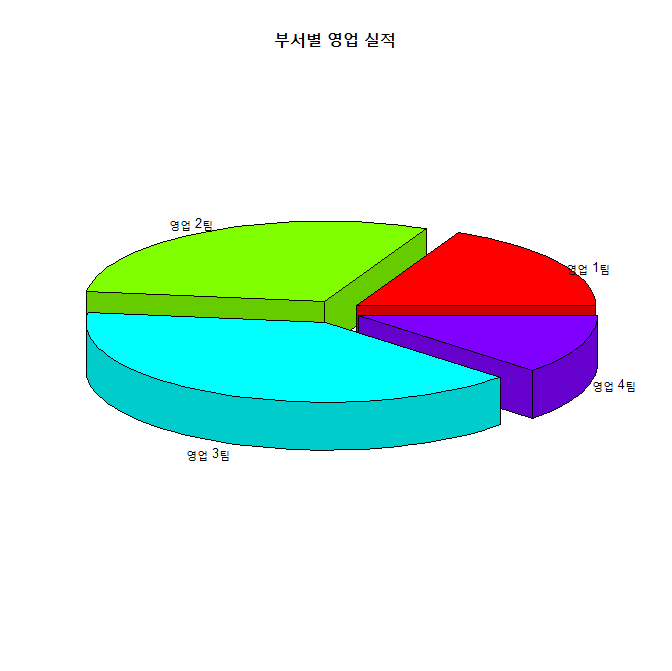
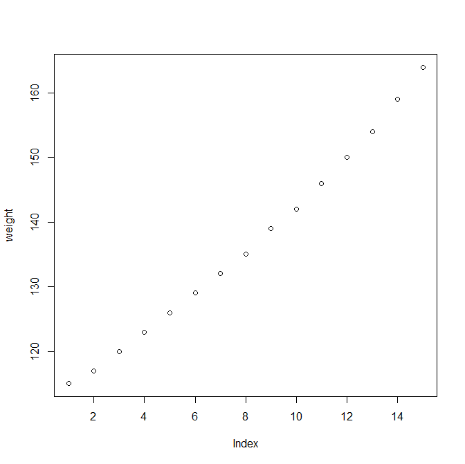
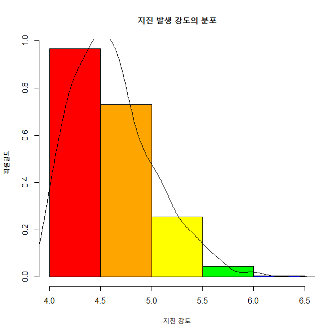
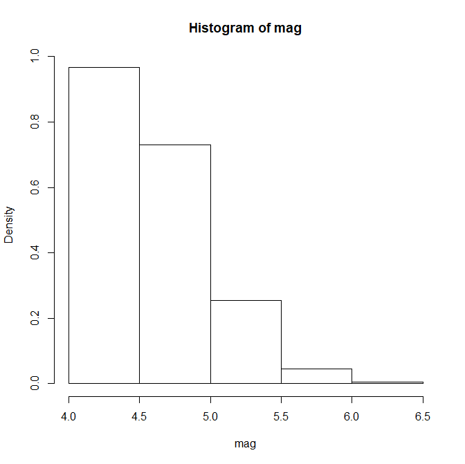
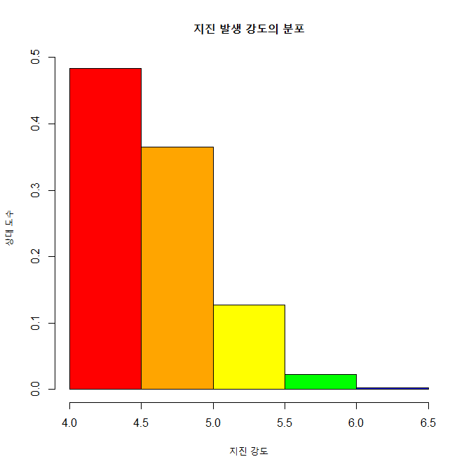
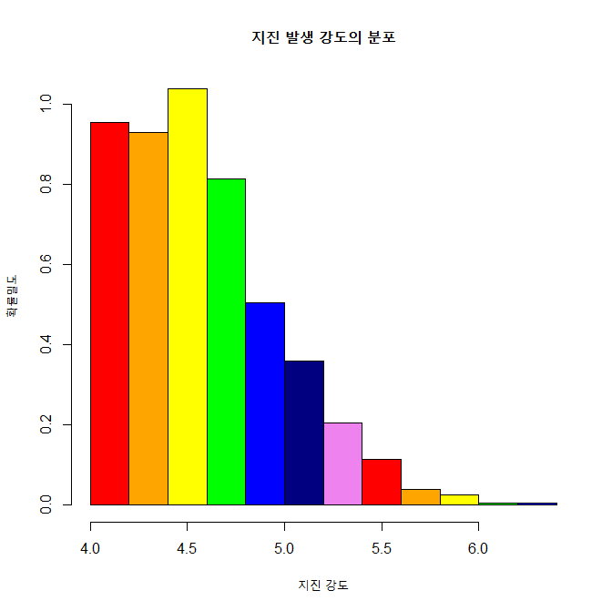
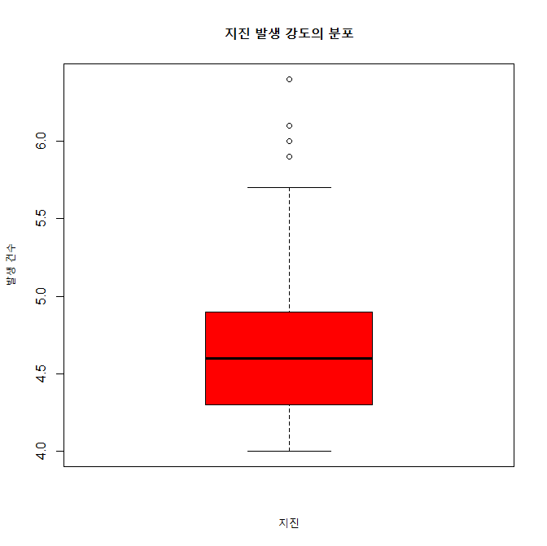
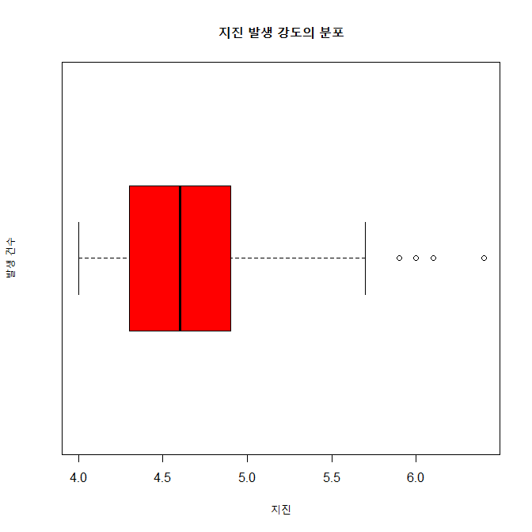

## 제5장 차트 프로그래밍

**차트(Chart)**는 1) **데이터의 분포**를 파악하고, 2) 데이터 **분석 결과를 효과적으로 전달**하기 위해 유횽하게 사용된다.


[TOC]

<div style="page-break-after: always;"></div>
### 2. 파이차트

#### 2-1. 기본 파이차트 출력 :  `pie()`

```{r}
# 데이터 입력
x <- c(9, 15, 20, 6)
label <- c("영업 1팀", "영업 2팀", "영업 3팀", "영업 4팀")

# 파이차트 그리기
pie(x,                     # 파이조각으로 표시될 데이터 : x (벡터)
    labels = label,          # 파이의 조각에 부서명 표시
    main = "부서별 영업 실적")  # 차트의 전체 제목
```


<div style="page-break-after: always;"></div>
#### 2-2. 기준선 변경

`init.angle=90`으로 기준선 변경. 

```{r}
pie (x, 
     init.angle = 90,          # 12시에 기준선 설정 
     labels = label, 
     main = "부서별 영업 실적")
```

**참고 :** `clockwise = TRUE` => 시계방향으로 설정. (기본값 : 시계반대 방향)


<div style="page-break-after: always;"></div>
#### 2-3. 색과 라벨 수정

- `col =` 로 색 지정.
- `paste()` 함수를 이용하여 문자열 조작

```{r}
pct <- round(x/sum(x)*100)

# label 조작. 
label <- paste(label, pct, sep=" : ")         # "영업 1팀 : 18"
label <- paste(label,"%",sep="")              # "영업 1팀 : 18%""

pie(x,
    labels=label, 
    init.angle=90, 
    col=rainbow(length(x)),   # 무지개색, 색깔의 갯수: length(x)
    main="부서별 영업 실적")
```


<div style="page-break-after: always;"></div>
#### 2-4. 3D 파이 차트 : `pie3D()`

- `explode()`로 조작 간의 간격 조정.
- `labelcex = 	`로 글자의 크기 조정

```{r}
install.packages("plotrix")
library(plotrix)

pie3D(x,
      labels = label, 
      explode = 0.1,          # 파이 조작 간의 간격. 0이면 간격이 없음.
      labelcex = 0.8,         # 라벨 글자 크기. (0.8배로 축소)
      main = "부서별 영업 실적")
```

**결과 :**



<div style="page-break-after: always;"></div>
### 3. 바차트

#### 3-1. 기본 바 차트 출력 : `barplot()`

```{r}
height <- c(9, 15, 20, 6)
name <- c("영업 1팀", "영업 2팀", "영업 3팀", "영업 4팀")

barplot(height,                     # 막대로 표시되는 데이터 : height (벡터)
        names.arg = name,             # 막대 밑에 표시되는 이름 데이터 : name (벡터)
        main = "부서별 영업 실적")      # 바차트의 제목 
```


<div style="page-break-after: always;"></div>
#### 3-2. 막대의 색 지정

`col = ` 인수로 색 지정

```{r}
barplot(height, 
        names.arg = name, 
        main = "부서별 영업 실적", 
        col = rainbow(length(height)))    # height 벡터의 요소 갯수의 무지개색
```


<div style="page-break-after: always;"></div>
#### 3-3. x, y축의 제목 달기

`xlab =" " ` 과  `ylab =" "  `이용하여, x축의 제목과 y축의 제목 지정

```{r}
barplot(height, 
        names.arg = name,                
        main = "부서별 영업 실적", 
        col = rainbow(length(height)), 
        xlab = "부서",                    # x축의 제목
        ylab = "영업 실적(억 원)")         # y축의 제목
```


<div style="page-break-after: always;"></div>
#### 3-4. y축의 상한치 조정

`ylim = c(min, max)`로 y축의 하한치와 상한치 조정

```{r}
barplot(height, 
        names.arg = name, 
        main = "부서별 영업 실적", 
        col = rainbow(length(height)), 
        xlab = "부서", 
        ylab = "영업 실적(억 원)", 
        ylim = c(0,25))            # y축의 표시값을 0 ~ 25표 지정
```


<div style="page-break-after: always;"></div>
#### 3-5. 데이터 라벨 출력

##### 1) 바의 상단면 위에 라벨 출력 : `text()`

```{r}
bp <- barplot(height,                 # 바차트를 그리고 그 결과를 변수 bp에 저장
              names.arg = name, 
              main = "부서별 영업 실적",
              col = rainbow(length(height)), 
              xlab = "부서", 
              ylab = "영업 실적(억 원)", 
              ylim = c(0,25))
bp                              # bp는 리스트 변수임.
height
text(x = bp,                    # 바에 라벨 출력, x값은 bp
     y = height,                # y 값은 바차트의 x값인 height
     labels = round(height,0),  # 바에 표시할 값 height, round(height, 0) : 소수점이하 반올림
     pos = 3)                   # 바에 라벨이 표시되는 위치 : 1, 2, 3, 4 => 3은 바의 위에...
```


<div style="page-break-after: always;"></div>
##### 2) 바의 상단면 하단에 라벨 출력

```{r}
bp <- barplot(height, 
              names.arg=name, 
              main="부서별 영업 실적",
              col=rainbow(length(height)), 
              xlab="부서", 
              ylab="영업 실적(억 원)", 
              ylim=c(0,25))

text(x=bp, 
     y=height, 
     labels=round(height,0), 
     pos=1)                    # 1은 바의 밑에 표시
```


<div style="page-break-after: always;"></div>
#### 3-6. 바 차트의 수평 회전(가로 막대)

`horiz = TRUE`로 바 차트의 방향을 수평을 바꿈.

```{r}
barplot(height, 
        names.arg=name, 
        main="부서별 영업 실적",
        col=rainbow(length(height)),
        xlab="영업 실적(억 원)", 
        ylab="부서", 
        horiz=TRUE,                 ###
        width=50)
```


<div style="page-break-after: always;"></div>
### 4. 스택형/그룹형 바 차트

- `beside = TRUE`로 바차트를 그룹형으로 바꿀 수 있음. 
- 기본값은 `beside=FALSE`(스택형)

#### 4-1. 스택형 바 차트(Stacked Bar Chart)		

```{r}
height1 <- c(4, 18, 5, 8)
height2 <- c(9, 15, 20, 6)

height <- rbind(height1, height2)
height
		
name <- c("영업 1팀", "영업 2팀", "영업 3팀", "영업 4팀")
legend_lbl <- c("2014년", "2015년")

barplot(height, main="부서별 영업 실적",
        names.arg=name,
        xlab="부서", 
        ylab="영업 실적(억 원)",
        col=c("darkblue","red"),
        legend.text=legend_lbl,      # 차트에 범례 표시
        ylim=c(0, 35))
```


<div style="page-break-after: always;"></div>
#### 4-2. 그룹형 바 차트(Grouped Bar Chart)

```{r}
barplot(height, main="부서별 영업 실적",
        names.arg=name,
        xlab="부서", 
        ylab="영업 실적(억 원)",
        col=c("darkblue","red"),
        legend.text=legend_lbl,
        ylim=c(0, 30),
        beside=TRUE,                  # 그룹형 바차트로 변경함
        args.legend=list(x='top'))    # 범례의 위치 지정
```


<div style="page-break-after: always;"></div>
### 5. X-Y 플로팅

#### 5-1. 기본 x-y 플로팅


**변수가 한 개인 경우**, x축은 그 변수의 색인번호가 출력되고, y축에 그 값이 표시됨.

```{r}
women     # data set
str(women)

weight <- women$weight  
plot(weight)               # weight 출력
```



<div style="page-break-after: always;"></div>
**변수가 2개인 경우**, x-축, y축 출력됨.

```{r}
height <- women$height

plot(height, weight,       # x축에 height, y 축에 weight
     xlab="키", 
     ylab="몸무게")
```


<div style="page-break-after: always;"></div>
#### 5-2. 그래프 출력 모양 지정하기

`type = `에 따를 출력 모향 지정. 교재 p. 135 참고

```{r}
plot(height, weight,       
     xlab="키", 
     ylab="몸무게",
     type="b")             # p. 135 참고 (점과 선)
```


<div style="page-break-after: always;"></div>
#### 5-3. 그래프 선의 유형

`type = "l"`로 지정하면 그래프가 선의 모양이 됨

이 때 

- `lty = `   : 1~6 으로 선의 유형 지정
- `lwd = ` : 1의 값이 기본 값. 2로 지정하면 2배 굵게 표시됨

```{r}
plot(height, weight,       
     xlab="키", 
     ylab="몸무게",
     type="l",       # 선 그리기
     lty=1,          # 실선
     lwd=1)          # 기본 값
```


<div style="page-break-after: always;"></div>
#### 5-4. 플로팅 문자의 출력 

`pch = `에 의해 플로팅 문자 지정. **교재 137, 참고**

```{r}
plot(height, weight,    # x축에 height, y 축에 weight
     xlab="키", 
     ylab="몸무게", 
     pch=23,               # 다이아몬드 모양
     col="blue", 
     bg="yellow", 
     cex=1.5)              # 다이아몬드 크기. 1.5배
```


<div style="page-break-after: always;"></div>
<div style="page-break-after: always;"></div>
### 6. 히스토그램

- 바차트 : x 축이 범주형 변수
- 히스토그램 : x 축이 연속형 변수

#### 6-1. 지진의 강도에 대한 히스토그램 : `quakes` 데이터 세트 이용 

```{r}
head(quakes)
str(quakes)

mag <- quakes$mag                     # mag : 지진의 강도, 연속형 변수
mag

hp <- hist(mag,                          
           main="지진 발생 강도의 분포", 
           xlab="지진 강도", 
           ylab="발생 건수")
hp
```


<div style="page-break-after: always;"></div>
```{r}
#====== hist() -> barplot()으로 전환해서 라벨달기
head(quakes)

mag <- quakes$mag
hp <- hist(mag, 
           main="지진 발생 강도의 분포", 
           xlab="지진 강도", 
           ylab="발생 건수")

(height <- hp$counts)
(name=as.character(hp$mids))

bp <- barplot(height, 
              names.arg=name, 
              col=rainbow(length(height)), 
              xlab="지진강도", 
              ylab="발생빈도", 
              ylim=c(0,250))
```


<div style="page-break-after: always;"></div>
```{r}
text(x=bp, 
     y=height, 
     labels=round(height,0), 
     pos=3)
#======= 라벨달기 끝
```


<div style="page-break-after: always;"></div>
#### 6-2. 계급 구간과 색 

- `col = ` : 계급의 색 지정
- `breaks = ` : 계급의 구간 지정

```{r}
colors <- c("red", "orange", "yellow", "green", "blue", "navy", "violet")
hp <- hist(mag, 
           main="지진 발생 강도의 분포", 
           xlab="지진 강도", 
           ylab="발생 건수",
           col=colors,                     # 막대의 색깔 지정, colors 변수
           breaks=seq(4, 6.5, by=0.5))     # 계급의 구간 지정, 4 ~ 6.5를 0.5 간격으로
hp
```


<div style="page-break-after: always;"></div>
```{r}
#====== hist() -> barplot()으로 전환해서 라벨달기
head(quakes)

mag <- quakes$mag
colors <- c("red", "orange", "yellow", "green", "blue", "navy", "violet")
hp <- hist(mag, 
           main="지진 발생 강도의 분포", 
           xlab="지진 강도", 
           ylab="발생 건수",
           col=colors, 
           breaks=seq(4, 6.5, by=0.5))

(height <- hp$counts)
(name=as.character(hp$mids))

bp <- barplot(height, 
              names.arg=name, 
              col=rainbow(length(height)), 
              xlab="지진강도", 
              ylab="발생빈도", 
              ylim=c(0,500))
bp
```


<div style="page-break-after: always;"></div>
```{r}
text(x=bp, 
     y=height, 
     labels=round(height,0), 
     pos=3)

#======= 라벨달기 끝
```


**주의 :** 이 그림의 경우 y축의 최대값이 500으로 되어 있어서 지진강도 4.25에 대한 라벨이 잘 안 보인다.

`ylim = c(0, 600)` 을 추가하면 잘 보임.

<div style="page-break-after: always;"></div>
```{r}
bp <- barplot(height, 
              names.arg = name, 
              col=rainbow(length(height)), 
              xlab="지진강도", 
              ylab="발생빈도", 
              ylim=c(0,600))        # ylim = c(0, 600) 으로 수정
bp

text(x=bp, 
     y=height, 
     labels=round(height,0), 
     pos=3)
```


<div style="page-break-after: always;"></div>
#### 6-3. 확률밀도

연속 변수의 빈도수를 히스트로그램으로 그린 것이 **확률밀도**그림이다. 

```{r}
mag <- quakes$mag

hist(mag, 
     main="지진 발생 강도의 분포", 
     xlab="지진 강도", 
     ylab="확률밀도",
     col=colors, 
     breaks=seq(4, 6.5, by=0.5), 
     freq=FALSE)	 
```


<div style="page-break-after: always;"></div>
```{r}
lines(density(mag)) 
```



<div style="page-break-after: always;"></div>
#### 6-4. 상대도수 출력하기

빈도수를 전체 관측수로 나누면 이것이 **상대도수**가 된다. 

```{r}
colors <- c("red", "orange", "yellow", "green", "blue", "navy", "violet")

mag <- quakes$mag
h <- hist(mag, 
          breaks=seq(4, 6.5, by=0.5), 
          freq=FALSE)	 
h
```



<div style="page-break-after: always;"></div>
```{r}
h$density <- h$counts/sum(h$counts)       # 상대도수 구하기.
plot(h,                                   # 상대도수 그림 그리기
     freq=FALSE,
     main="지진 발생 강도의 분포", 
     xlab="지진 강도", 
     ylab="상대 도수",
     col=colors)
```




<div style="page-break-after: always;"></div>
#### 6-5. 계급의 수

`breaks = "Sturges"`가 기본값임.

```{r}
hist(mag, 
     main="지진 발생 강도의 분포", 
     xlab="지진 강도", 
     ylab="확률밀도",
     col=colors, 
     breaks="Sturges", 
     freq=FALSE)
```




<div style="page-break-after: always;"></div>
### 7. 박스 플롯

`summary( )`를 그림으로 나타내는 것이 `boxplot()`이다.

#### 7-1. 기본 박스 플롯

```{r}
mag ＜- quakes$mag

min(mag)
max(mag)
median(mag)
quantile(mag, c(0.25, 0.5, 0.75))

summary(mag)     # 앞의 min, max, median, quantile 과 비교바람.

boxplot(mag,     # summary(mag)를 그림으로 표시함.
        main="지진 발생 강도의 분포", 
        xlab="지진", 
        ylab="발생 건수",
        col="red")
```



<div style="page-break-after: always;"></div>
#### 7-2. 수평 박스 플롯

`horizontal = TRUE`로 박스 플롯의 방향을 수평으로 바꾼다.

```{r}
boxplot(mag,     # summary(mag)를 그림으로 표시함.
        main="지진 발생 강도의 분포", 
        xlab="지진", 
        ylab="발생 건수",
        horizontal=TRUE,
        col="red")
```



<div style="page-break-after: always;"></div>
#### 7-3. V자형 박스 플롯

`notch = TRUE`를 이용하여 V자형 박스 플롯을 그린다.

```{r}
boxplot(mag,     # summary(mag)를 그림으로 표시함.
        main="지진 발생 강도의 분포", 
        xlab="지진", 
        ylab="발생 건수",
        horizontal=TRUE,
        notch=TRUE,     
        col="red")
```


------

](images/R.png)  ](images/pdf.png)

