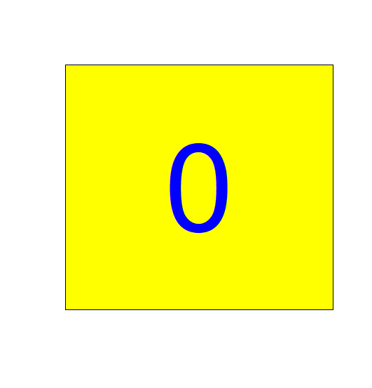
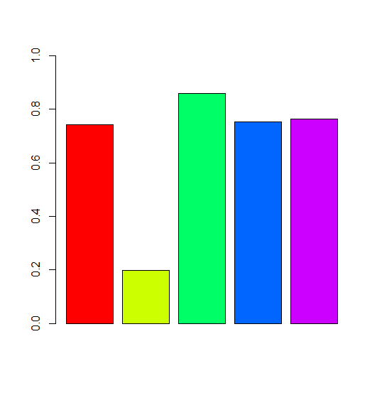
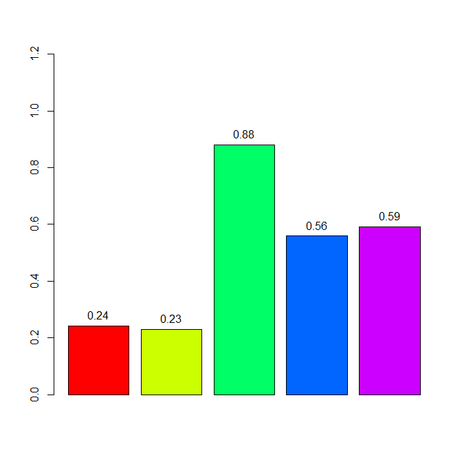
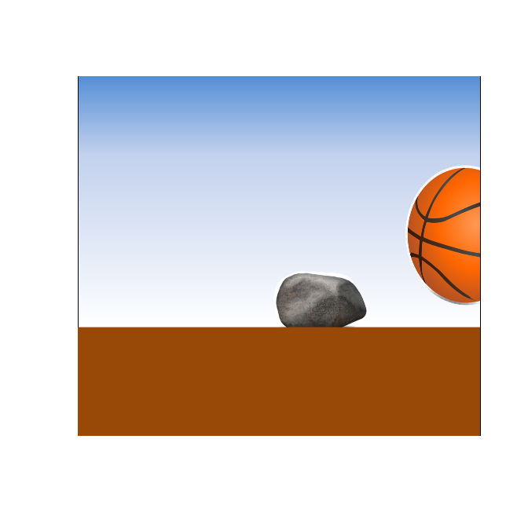

## 제6장 애니메이션


### 2. 애니메이션 1 : 카운트 다운


#### 2-1. 숫자 출력: 카운트 다운

```{r}
install.packages("animation")
library(animation)
ani.options(interval = 1)

plot.new()
for (i in 10:0) {
    rect(0, 0, 1, 1, col="yellow")
    size = 11-i
    text(0.5, 0.5, i, cex=size, col=rgb(0,0,1,1)) 
    ani.pause()
}
```

**결과 :**



### 3. 애니메이션 2: 움직이는 차트


#### 3-1. 1초 간격으로 그래프 그리기

```{r}
library(animation)
ani.options(interval = 1)
while(TRUE) {
    y <- runif(5, 0, 1)
    barplot(y, ylim = c(0, 1), col=rainbow(5))
    ani.pause()
}
```

**결과 :**



애니메이션을 종료하려면 console 화면에서 <Esc>를 누른다.


#### 3-2. 1초 간격으로 그래프 그리기 : 데이터 라벨링 포함

```{r}
library(animation)
ani.options(interval = 1)
while(TRUE) {
    y <- runif(5, 0, 1)
    bp <- barplot(y, ylim = c(0, 1.2), col=rainbow(5))
    text(x=bp, y=y, labels=round(y,2), pos=3)   
    ani.pause()
}
```

**결과 :**



### 4. 굴러가는 공

```{r}
library(animation)
library(png)
ani.options(interval = 0.1)
plot.new()
rect(0, 0, 1, 1, col="white")
for (i in 1:6) {
    img <- paste("data/ball", i, ".png", sep="")
    img <- readPNG(img)
    rasterImage(img, 0, 0, 1, 1)
    ani.pause()
}
dev.off()
```

**결과 :**



------

 [](source/ch_06_Animation.R) [](pdf/ch_06_Animation.pdf)

