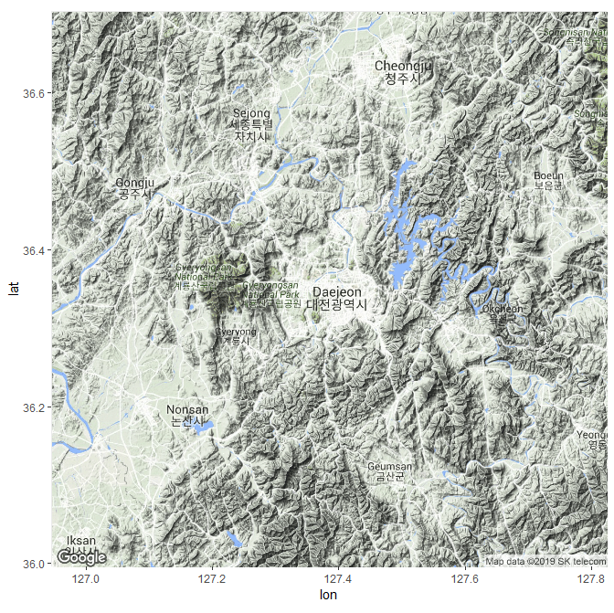
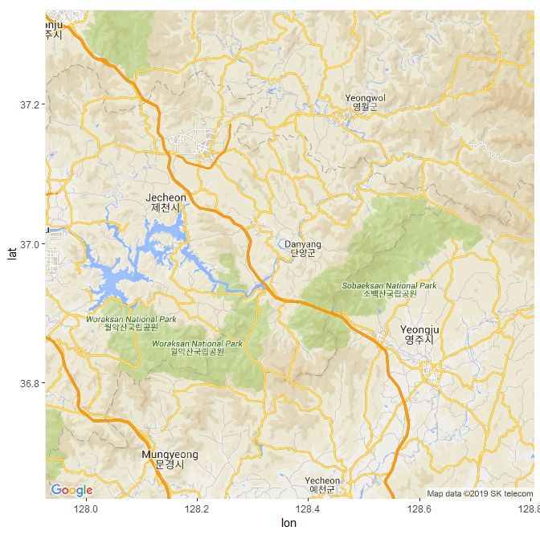
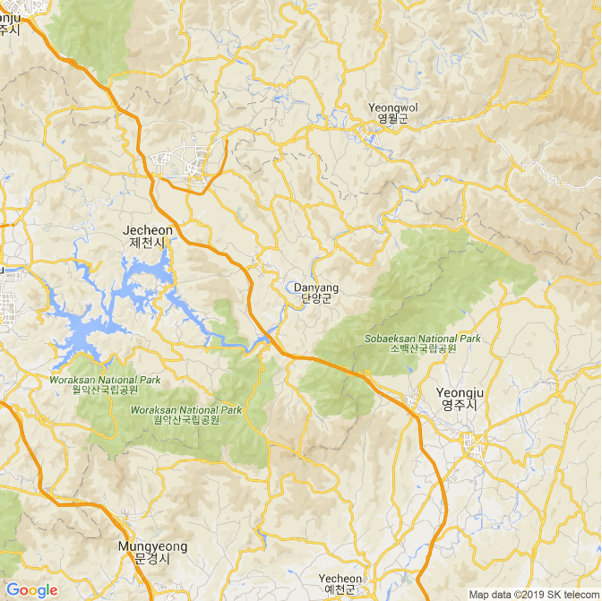
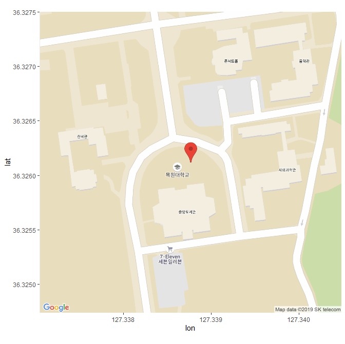
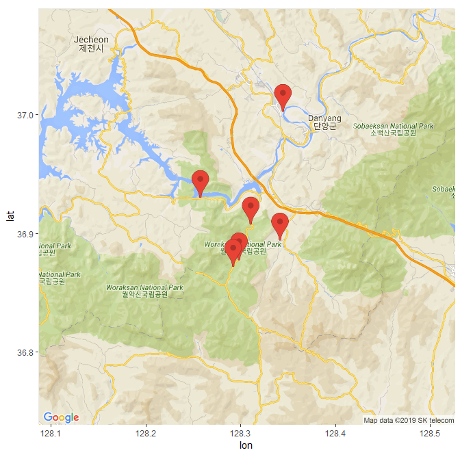
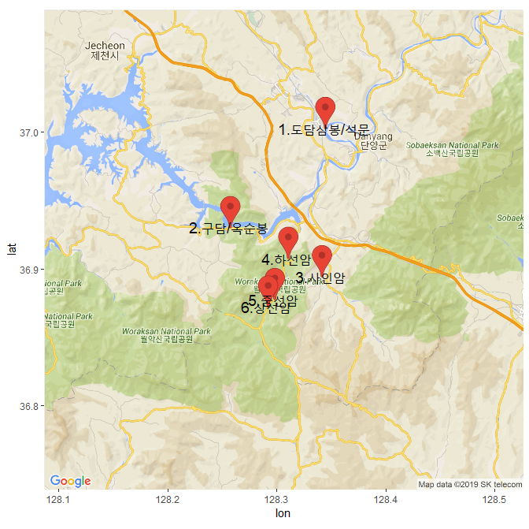
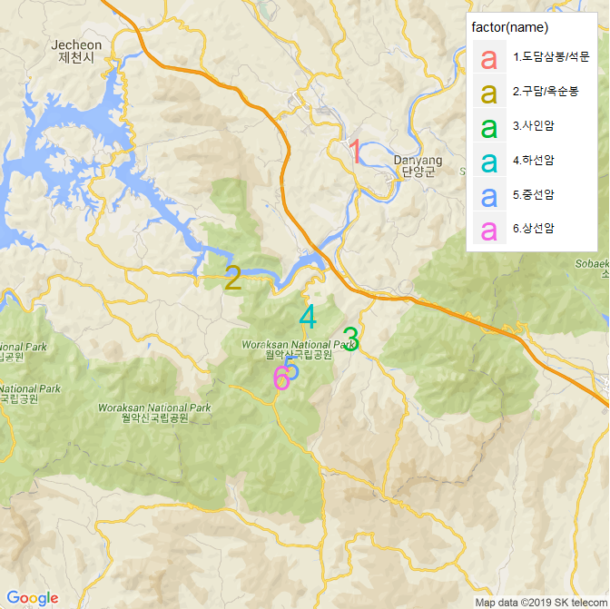
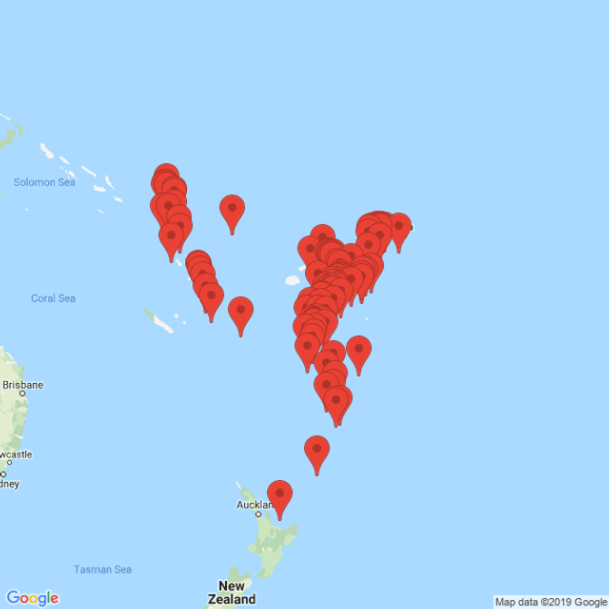
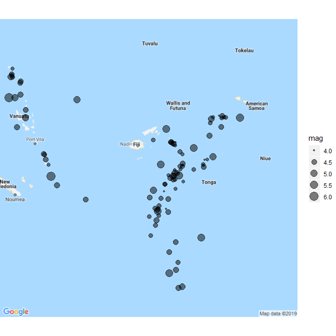

## 제7장 지도 활용하기


[TOC]

### 2. 구글 맵 다루기


#### 2-1. 도시(서울) 중심의 지도 출력

##### 1) 패키지 설치

```{r}
install.packages("ggmap")
library(ggmap)
```


##### 2) 구글 API 인증

```{r}
register_google(key="Google API Key") # https://console.cloud.google.com 에서 확인
```


##### 3) geocode 다운로드

```{r}
gc <- geocode(enc2utf8('서울'))       # 1) 원하는 지역의 geocode확인 : '대전', '대구', Daejeon, Daegu, Seoul
gc
```

```{}
## # A tibble: 1 x 2
##     lon   lat
##   <dbl> <dbl>
## 1  127.  37.6
```


```{r}
gc <- geocode('Daejeon')             #    gc <- geocode('Seoul') : 지역명을 영문으로 하는 경우 코드변환 불필요
gc
```

```{}
## # A tibble: 1 x 2
##     lon   lat
##   <dbl> <dbl>
## 1  127.  36.4
```


##### 4) 지도의 중심점

```{r}
cen <- as.numeric(gc); cem          # 2) geocode를 수치형 데이터로 변형하고, 그 중심위치 찾기
```

```{r}
## [1] 127.38455  36.35041
```


##### 5) 지도 정보 확인 및 지도 그리기

```{r}
map <- get_googlemap(center=cen)     # 3) 중심점(cen)을 중심으로 하는 지도정보 확인
ggmap(map)                           # 4) 지도 그리기
```




#### 2-2. 임의 주소지(충청북도 단양군) 중심의 지도 출력


##### 1) 지역의 geocode 다운로드 및 중심지점 확인

```{r}
gc <- geocode(enc2utf8('충청북도 단양군'))          # 1) 원하는 지역의 geocode 확인
cen <- as.numeric(gc); cen                        # 2) geocode를 수치로 변형하고, 중심점 찾기
```

```{r}
## [1] 128.36552  36.98455
```


##### 2) 지도정보 확인 및 지도 그리기

```{r}
map <- get_googlemap(center=cen,                 # 3) 지도정보 확인 : ?get_googlemap()
       maptype="roadmap")                        #    단, 지도형태를 'terrain'으로 한다.
                            # maptype = c("terrain", "satellite", "roadmap", "hybrid")
ggmap(map)                                       # 4) 지도 그리기
```





#### 2-3. 전체 영역으로 지도 출력
```{r}
map <- get_googlemap(center=cen, maptype="roadmap")    # 3) 지도형태 변경 'roadmap'
ggmap(map, extent="device")                            # 4) 지도 그리기 형태 변경 : 환면 전체 
```



**주의 :** 위의 2-2. 2)와의 차이점을 주목하기 바람. 이 지도는 위도와 경도의 표시가 없다.


#### 2-4. 마커 출력

```{r}
gc <- geocode(enc2utf8('대전광역시 서구 도안북로 88'))       # 1) geocode 확인
cen <- as.numeric(gc)                         # 2) 중심점 확인
map <- get_googlemap(center=cen,              # 3) gc 코드를 마커로 지정
                     maptype="roadmap", 
                     zoom=18,
                     marker=gc)
ggmap(map, extent="device")                   # 4) 지도 그리기
ggmap(map) 
```




### 3. 여러 지역(단양팔경)을 지도 위에 표시하기

#### 3-1.  단양팔경 위치의 마커 출력


##### 1) 주소록의 작성과 주소록의 geocode 다운로드

```{r}
names <- c("1.도담삼봉/석문",                 # names : 단양팔경의 명칭, 문자벡터
           "2.구담/옥순봉", 
           "3.사인암", 
           "4.하선암", 
           "5.중선암", 
           "6.상선암")
addr <- c("충청북도 단양군 매포읍 삼봉로 644-33", # addr : 각 지점의 주소, 문자벡터
          "충청북도 단양군 단성면 월악로 3827",
          "충청북도 단양군 대강면 사인암2길 42",
          "충청북도 단양군 단성면 선암계곡로 1337",
          "충청북도 단양군 단성면 선암계곡로 868-2",
          "충청북도 단양군 단성면 선암계곡로 790")
gc <- geocode(enc2utf8(addr))               # 1) addr 각 요소에 대한 geocode 확인
gc
```

**결과 :** 6개 지점의 위도와 경도 (`gc`)

```{}
## # A tibble: 6 x 2
##     lon   lat
##   <dbl> <dbl>
## 1  128.  37.0
## 2  128.  36.9
## 3  128.  36.9
## 4  128.  36.9
## 5  128.  36.9
## 6  128.  36.9
```


##### 2) 지명과 geocode로 구성된 `df `변수 생성

```{}
df <- data.frame(name=names,                # 2-1) gc를 데이터프레임으로 변화
                 lon=gclon, 
                 lat=gclat)   
df
```

**결과 :** `df` 변수의 내용

```{}
##              name      lon      lat
## 1 1.도담삼봉/석문 128.3433 37.00300
## 2   2.구담/옥순봉 128.2560 36.93046
## 3        3.사인암 128.3404 36.89439
## 4        4.하선암 128.3094 36.90788
## 5        5.중선암 128.2969 36.87783
## 6        6.상선암 128.2907 36.87222
```


##### 3) 6개 지역의 중앙지점 확인

```{r}
cen <- c(mean(dflon), mean(dflat))        # 2-2) gc의 중심위치 찾기
cen
```

```{}
## [1] 128.3061  36.9143
```


##### 4) 지도 정보 확인(get_googlemap)과 지도 그리기(ggmap)

```{r}
map <- get_googlemap(center=cen,            # 3) 지도 정보 확인
                     maptype="roadmap",     #    지도 형태
                     zoom=11,               #    지도 크기
                     marker=gc)             #    addr의 요소를 지도에 marker 

ggmap(map)                                  # 4) 지도 그리기
```




#### 3-2. 단양팔경 이름 출력
```{r}
gmap <- ggmap(map)                          # 5) 지도 그리기를 변수로 지정
gmap + geom_text(data=df,                   # 6) 지도정보
                 aes(x=lon, y=lat), 
                 size=5, 
                 label=df$name)             # 7) 지점정보 (라벨 지정)
```



#### 3-3. 범례 출력
```{r}
map <- get_googlemap(center=cen,                # 3) 기본적인 지도 정보 확인
                     maptype = "roadmap",       
                     zoom=11)
gmap <- ggmap(map,                              # 4) 지도그림 정보
              extent="device", 
              legend="topright")

gmap + geom_text(data=df,                       # 5) 지도위에 표시될 라벨 지정 
                 aes(lon, lat, colour=factor(name)), 
                 size=10, 
                 label=seq_along(df$name))
```




### 4. 지진 위치 출력 (`quakes`)


#### 4-1. 지진 지역 지리정보 학인


##### 1) quakes 데이터 세트 불러오기 (100개)

```{r}
library(ggmap)

df <- head(quakes, 100)                   # 1) 지진 위치 정보 데이터 : geocode
df
```

```{r}
##        lat   long depth mag stations
## 1   -20.42 181.62   562 4.8       41
## 2   -20.62 181.03   650 4.2       15
## 3   -26.00 184.10    42 5.4       43
## 4   -17.97 181.66   626 4.1       19
## 5   -20.42 181.96   649 4.0       11
## 6   -19.68 184.31   195 4.0       12
## 7   -11.70 166.10    82 4.8       43
## 8   -28.11 181.93   194 4.4       15
## 9   -28.74 181.74   211 4.7       35
## ...
```

**주의 :** `df` 변수에 이미 위치별 경도(`long`)와 위도(`lat`) 값이 입력되어 있다. (`lat` 값이 `-` 인 것은 남반구이기 때문, 경도(`long`)가 180도가 넘으면 '서경'이 되어 'long - 360'으로 재계산 되어야 함.)


##### 2) 중심위치 확인

```{r}
cen <- c(mean(dflong), mean(dflat))     # 2) 중심지점 확인
cen
```

```{}
## [1] 179.1387 -19.9468
```


##### 3)  경도의 재계산

```{r}
gc <- data.frame(lon=dflong, lat=dflat)  
gclon <- ifelse(gclon>180, -(360-gclon), gclon)
gc
```

```{}
##         lon    lat
## 1   -178.38 -20.42
## 2   -178.97 -20.62
## 3   -175.90 -26.00
## 4   -178.34 -17.97
## 5   -178.04 -20.42
## 6   -175.69 -19.68
## 7    166.10 -11.70
## 8   -178.07 -28.11
## 9   -178.26 -28.74
## 10   179.59 -17.47
## ...
```

**주의 :** 1)의 결과와 비교하기 바람.


#### 4-2. 여백없이 마커로 표시된 지도 출력

```{r}
map <- get_googlemap(center=cen, 
                     scale=1, 
                     maptype="roadmap",
                     zoom=4, 
                     marker=gc)
ggmap(map, extent="device")       # extent = "device"
```




#### 4-3. 지진 규모 표시

`geom_point()` 함수를 이용하여 **지진의 규모**에 따라 **점의 크기**로 표시.

```{r}
map <- get_googlemap(center=cen, 
                     scale=1, 
                     maptype="roadmap",
                     zoom=5)

ggmap(map, fullpage = TRUE) + 
      geom_point(data=df, 
                 aes(x=long, y=lat, size=mag), 
                 alpha=0.5)
```




------

 [](source/ch_07_Google_Map.R) [](pdf/ch_07_Google_Map.pdf)

------

[](ch_06_Animation.html)    [](index.html)    [](ch_7_Subway_Geocode_Daejeon.html)

