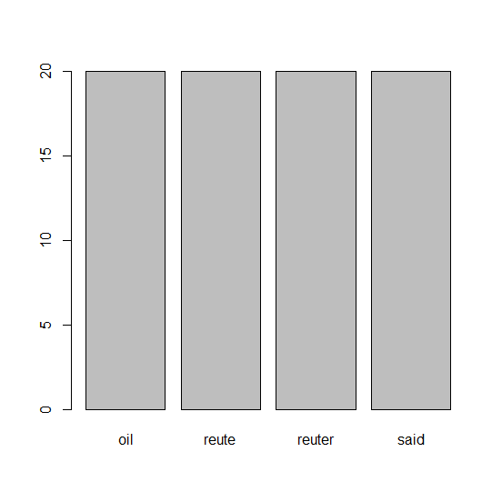

## 제10장 tm 패키지를 이용한 Corpus 실습


### 1. 텍스트 파일을 읽어서 Corpus (복수 개의 파일 묶음) 만들기

```{r}
# 1) 
library(tm)
txt <- system.file("texts", "txt", package="tm") # tm 패키지의 texts/txt 경로 : ./R/win-library/3.5/tm/texts/txt

# 2)
ovid <- Corpus(DirSource(txt), readerControl=list(language="lat"))   # 5개의 text files (ovid_1.txt ~ ovid_5.txt)

# 3)
getReaders()      # a character vector with readers provided by package tm
```

```{}
###
## [1] "readDataframe"           "readDOC"                
## [3] "readPDF"                 "readPlain"              
## [5] "readRCV1"                "readRCV1asPlain"        
## [7] "readReut21578XML"        "readReut21578XMLasPlain"
## [9] "readTagged"              "readXML" 
```


```{r}
# 4)로이터 통신 뉴스 데이터로 21578개의 문서
#   (토픽, 저자, 위치 등에 대한 메타데이터 존재)로 구성
reut21578 <- system.file("texts","crude", package = "tm")

# 5) 
(reuters <- Corpus(DirSource(reut21578), 
            readerControl = list(reader = readReut21578XML)))

(reuters <- Corpus(DirSource(reut21578),
            readerControl = list(reader = readReut21578XMLasPlain)))

# 
inspect(reuters[1:3])   # 읽어들인 3개의 문서 검토

```

결과 :

```
> reut21578 <- system.file("texts","crude", package = "tm")
> 
> # 5) 
> (reuters <- Corpus(DirSource(reut21578), 
+             readerControl = list(reader = readReut21578XML)))
## <<VCorpus>>
## Metadata:  corpus specific: 0, document level (indexed): 0
## Content:  documents: 20
> 
> (reuters <- Corpus(DirSource(reut21578),
+             readerControl = list(reader = readReut21578XMLasPlain)))
## <<VCorpus>>
## Metadata:  corpus specific: 0, document level (indexed): 0
## Content:  documents: 20
> 
> # 
> inspect(reuters[1:3])   # 읽어들인 3개의 문서 검토
## <<VCorpus>>
## Metadata:  corpus specific: 0, document level (indexed): 0
## Content:  documents: 3
## 
## [[1]]
## <<PlainTextDocument>>
## Metadata:  16
## Content:  chars: 527
## 
## [[2]]
## <<PlainTextDocument>>
## Metadata:  16
## Content:  chars: 2634
## 
## [[3]]
## <<PlainTextDocument>>
## Metadata:  16
## Content:  chars: 330
```


### 2. 벡터 소스(docs)로 부터 읽어 들이기 : 예..

```{r}
# 6) 
docs <- c("This is a text","This another one.", "My name is Eric")
Corpus(VectorSource(docs))

# 7)
docsCorpus <- Corpus(VectorSource(docs))
writeCorpus(docsCorpus)

# docsCorpus의 내용 보기
inspect(docsCorpus[1:3])

docsCorpus[[1]]$content
docsCorpus[[2]]$content
docsCorpus[[3]]$content
```

결과 :

```
> docs <- c("This is a text","This another one.", "My name is Eric")
> Corpus(VectorSource(docs))
## <<SimpleCorpus>>
## Metadata:  corpus specific: 1, document level (indexed): 0
## Content:  documents: 3
> 
> # 7)
> docsCorpus <- Corpus(VectorSource(docs))
> writeCorpus(docsCorpus)
> 
> # docsCorpus의 내용 보기
> inspect(docsCorpus[1:3])
## <<SimpleCorpus>>
## Metadata:  corpus specific: 1, document level (indexed): 0
## Content:  documents: 3
## 
## [1] This is a text    This another one. My name is Eric  
> 
> docsCorpus[[1]]$content
## [1] "This is a text"
> docsCorpus[[2]]$content
## [1] "This another one."
> docsCorpus[[3]]$content
## [1] "My name is Eric"
```


### 3. xml 문서를 tm_map() 이용해서 텍스로 전환하기

```{r}
# 읽어들일 문서의 directory path 정보
reut21578 <- system.file("texts","crude", package = "tm")

# XML 리더(readReut21578XML)를 통해 문서 읽음
(reuters <- Corpus(DirSource(reut21578), readerControl = list(reader = readReut21578XML)))

# 8) XML문서를 text(PlainTextDocument)로 전환
reuters <- tm_map(reuters, PlainTextDocument)

# ** 숫자 제거 (removeNumbers)
reuters <- tm_map(reuters, removeNumbers)

# 9) 중간의 공백 (stripWhitespace) 제거 
reuters <- tm_map(reuters, stripWhitespace)

# 10) 글자들을 모두 소문자로 변경(content_transformer(tolower))하여 
#     사전의 내용과 비교할 수 있도록 표준화
reuters <- tm_map(reuters, content_transformer(tolower))

# 11-1) 영어의 stopwords 제거 (띄어쓰기와 시제 등의 내용 제거)
reuters <- tm_map(reuters, removeWords, stopwords("english"))

# ** 구두점 제거 
reuters = tm_map(reuters, removePunctuation, preserve_intra_word_dashes = TRUE)

# 11-2) 형태소 분석 : 표준형으로 다 바꿔줌(과거형이나 복수형을 표준형으로 바꿔줌)

library(SnowballC)
tm_map(reuters, stemDocument)
```

결과 :

```{r}
> # XML 리더(readReut21578XML)를 통해 문서 읽음
> (reuters <- Corpus(DirSource(reut21578), readerControl = list(reader = readReut21578XML)))
<<VCorpus>>
Metadata:  corpus specific: 0, document level (indexed): 0
Content:  documents: 20
```

```{r}
> # 11-2) 형태소 분석 : 표준형으로 다 바꿔줌(과거형이나 복수형을 표준형으로 바꿔줌)
> tm_map(reuters, stemDocument)
<<VCorpus>>
Metadata:  corpus specific: 0, document level (indexed): 0
Content:  documents: 20
> 
```


### 4. 변형 및 결과 보기

```{r}
# 12) 문서 번호와 단어 간의 사용여부 또는 빈도수를 이용하여 matrix를 만드는 작업
dtm <- DocumentTermMatrix(reuters, control=list(weighting=weightTf))
inspect(dtm[1:5,1:5])

# 13) 10회 이상의 빈출어 찾아 내기
findFreqTerms(dtm, 10)

# 14) opec와 상관계수가 0.8 이상이 단어 찾기
findAssocs(dtm, "opec", 0.6)

# 15) 희소한 단어들 제거하기
dtm2 <- removeSparseTerms(dtm, 0.2)
dtm2     
```

결과 :

```
> # 12) 문서 번호와 단어 간의 사용여부 또는 빈도수를 이용하여 matrix를 만드는 작업
> dtm <- DocumentTermMatrix(reuters, control=list(weighting=weightTf))
> inspect(dtm[1:5,1:5])
## <<DocumentTermMatrix (documents: 5, terms: 5)>>
## Non-/sparse entries: 1/24
## Sparsity           : 96%
## Maximal term length: 10
## Weighting          : term frequency (tf)
## Sample             :
## Error in `[.simple_triplet_matrix`(x, docs, terms) : 
##   Repeated indices currently not allowed.
> 
> # 13) 10회 이상의 빈출어 찾아 내기
> findFreqTerms(dtm, 10)
##  [1] "barrel"     "barrels"    "bpd"        "crude"      "dlrs"      
##  [6] "feb"        "government" "group"      "industry"   "kuwait"    
## [11] "last"       "mar"        "march"      "market"     "meeting"   
## [16] "minister"   "mln"        "new"        "official"   "oil"       
## [21] "one"        "opec"       "output"     "pct"        "petroleum" 
## [26] "price"      "prices"     "production" "reute"      "reuter"    
## [31] "said"       "saudi"      "sheikh"     "will"       "world"     
> 
> # 14) opec와 상관계수가 0.8 이상이 단어 찾기
> findAssocs(dtm, "opec", 0.6)
## $opec
##          analysts            buyers           meeting               oil 
##              0.86              0.84              0.84              0.84 
##             named         emergency              said         agreement 
##              0.83              0.81              0.78              0.77 
##           clearly            demand     differentials              late 
##              0.76              0.76              0.76              0.76 
##           reports            trying            winter           address 
##              0.76              0.76              0.76              0.75 
##         addressed         advantage          although          analysis 
##              0.75              0.75              0.75              0.75 
##           analyst        analystsby          anything        associates 
##              0.75              0.75              0.75              0.75 
##     bcopec-maymee             bijan          brothers         cambridge 
##              0.75              0.75              0.75              0.75 
##            center              cera     characterized          cheating 
##              0.75              0.75              0.75              0.75 
##            closer         condition           control          critical 
##              0.75              0.75              0.75              0.75 
##     crudeusaopecy           cutting         dafflisio            daniel 
##              0.75              0.75              0.75              0.75 
##             david            deemed           dillard          director 
##              0.75              0.75              0.75              0.75 
##           earlier              easy            editor             eight 
##              0.75              0.75              0.75              0.75 
##       environment            excess          excesses           expects 
##              0.75              0.75              0.75              0.75 
##             faces              firm           harvard           however 
##              0.75              0.75              0.75              0.75 
##       immediately        initiative             issue              june 
##              0.75              0.75              0.75              0.75 
##              keep             learn            lesson               ltd 
##              0.75              0.75              0.75              0.75 
##           manager           mideast           mizrahi            mlotok 
##              0.75              0.75              0.75              0.75 
## moussavar-rahmani          movement              need          optimism 
##              0.75              0.75              0.75              0.75 
##        optimistic      organization              paul       pessimistic 
##              0.75              0.75              0.75              0.75 
##         principal           problem          problems        production 
##              0.75              0.75              0.75              0.75 
##          prompted           quarter            quotas         readdress 
##              0.75              0.75              0.75              0.75 
##            regain          regional         reiterate           reuters 
##              0.75              0.75              0.75              0.75 
##            rising           salomon         scheduled            seeing 
##              0.75              0.75              0.75              0.75 
##           session          slackens             slide              soon 
##              0.75              0.75              0.75              0.75 
##              sort             spoke           spriggs            supply 
##              0.75              0.75              0.75              0.75 
##             teach               ted         telephone           thought 
##              0.75              0.75              0.75              0.75 
##          together              told               try         uncertain 
##              0.75              0.75              0.75              0.75 
##       universitys          unlikely             wants            wishes 
##              0.75              0.75              0.75              0.75 
##            yergin            prices           ability           markets 
##              0.75              0.74              0.72              0.71 
##             opecs               set               bpd             never 
##              0.71              0.71              0.69              0.69 
##           current              meet              must              sell 
##              0.68              0.68              0.68              0.68 
##              come             fixed         interview               may 
##              0.67              0.67              0.67              0.67 
##              next               now          december 
##              0.62              0.61              0.60 
## 
> 
> # 15) 희소한 단어들 제거하기
> dtm2 <- removeSparseTerms(dtm, 0.2)
> dtm2
## <<DocumentTermMatrix (documents: 20, terms: 4)>>
## Non-/sparse entries: 80/0
## Sparsity           : 0%
## Maximal term length: 6
## Weighting          : term frequency (tf)
```


###  V. 워드 클라우드

```{r}
library(wordcloud)

# 16) 단어의 빈도를 계산하고, 빈도의 내림차순으로 정렬
freq <- colSums(as.matrix(dtm2))
freq2 <- apply(as.matrix(dtm2), 2, function(x) sum(x>0))

barplot(freq2)

# 17) 텍스트 크기나 색깔 등 효과를 주고, 워드 클라우드 만들기
wordcloud(names(freq2), freq2, colors=rainbow(20))
```

결과 1 : `barplot()`



결과 2 : `wordcloud()`


------

 [](source/ch_10_corpus_using_TM_Package.R) [](pdf/ch_10_corpus_using_TM_Package.pdf) 

------

[](ch_10_Using_Naver_Open_API.html)    [](index.html)    [](ch_11_Using_Web_Scrapping.html)

