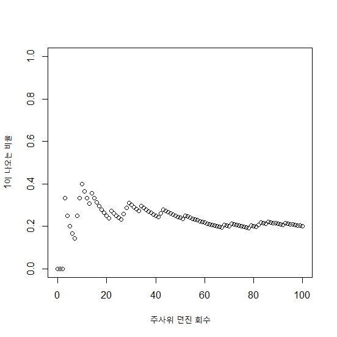

## 제11장 주사위 백 번 던지기


```{r}
####################
# 주사위 백 번 던지기
####################

iteration <- 100

plot(0, 0, 
     xlab="주사위 던진 회수", 
     ylab="1이 나오는 비율", 
     xlim=c(0, iteration), 
     ylim=c(0, 1)) 
abline(a=0.166666, b=0, col="red") 

sum <- 0
for(x in 1:iteration) {
    dice <- sample(1:6, 1, replace=T)
    if (dice == 1)
        sum = sum + 1 
    prob <- sum / x

    points(x, prob)
}
```

결과 :



**[ [R Source](source/ch_11_throwing_dice.R) ]**

