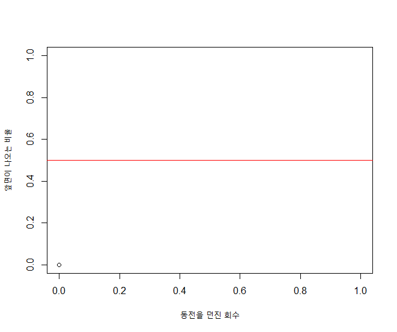
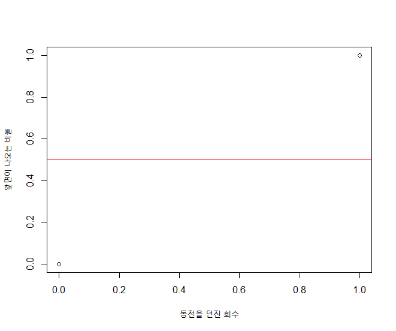
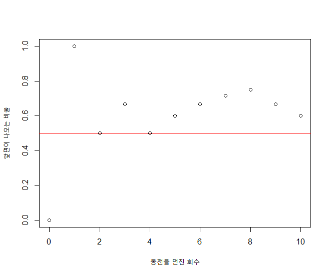

## 제13장 동전 던지기


### 동전 한번 던지기에 대한 시행

```{r}
iteration <- 1

plot(0, 0, xlab="동전을 던진 회수", ylab="앞면이 나오는 비율", xlim=c(0, iteration), ylim=c(0, 1)) 
abline(a=0.5, b=0, col="red")
```

결과 : 



```{r}
sum <- 0

for (x in 1:iteration) {
    coin <- sample(c("앞면", "뒷면"), 1, replace=T)
    if (coin == "앞면")
        sum = sum + 1 
    prob <- sum / x
    points(x, prob)
}
```

결과 : 

```


### 동전 던지기 10번 하는 경우

```{r}
iteration <- 10           # 동전 던지기 횟수를 수정하면 그 만큼 동전 던지기를 하게 됨. (10 -> 5,000)

plot(0, 0, xlab="동전을 던진 회수", ylab="앞면이 나오는 비율", xlim=c(0, iteration), ylim=c(0, 1)) 
abline(a=0.5, b=0, col="red")

sum <- 0
for (x in 1:iteration) {
    coin <- sample(c("앞면", "뒷면"), 1, replace=T)
    if (coin == "앞면")
        sum = sum + 1 
    prob <- sum / x
    points(x, prob)
}
```

결과 :



**[ [R Source](source/ch_13_flipping_coins.R) ]**


------

 [](source/ch_13_flipping_coins.R) [](pdf/ch_13_flipping_coins.pdf) 

