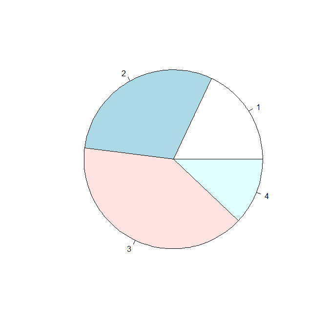
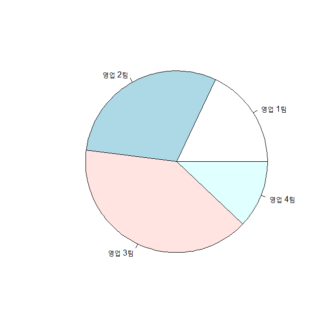
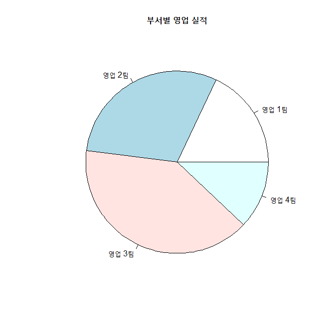
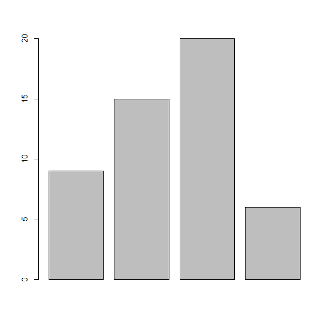
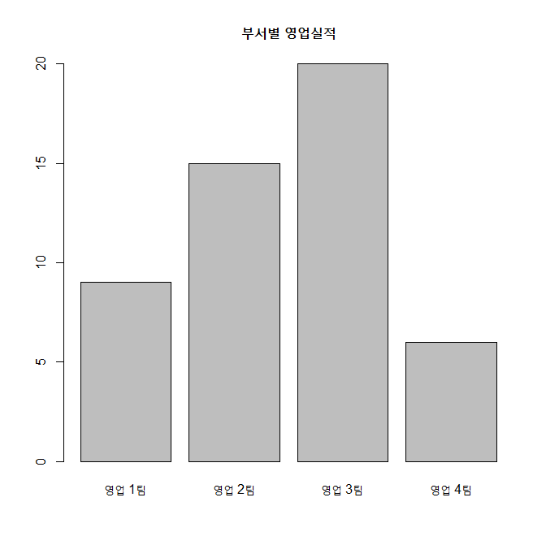
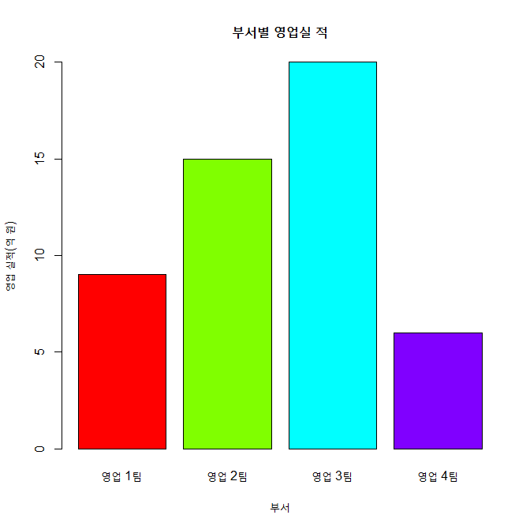
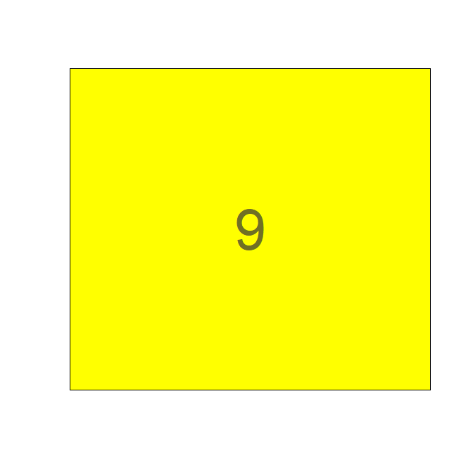
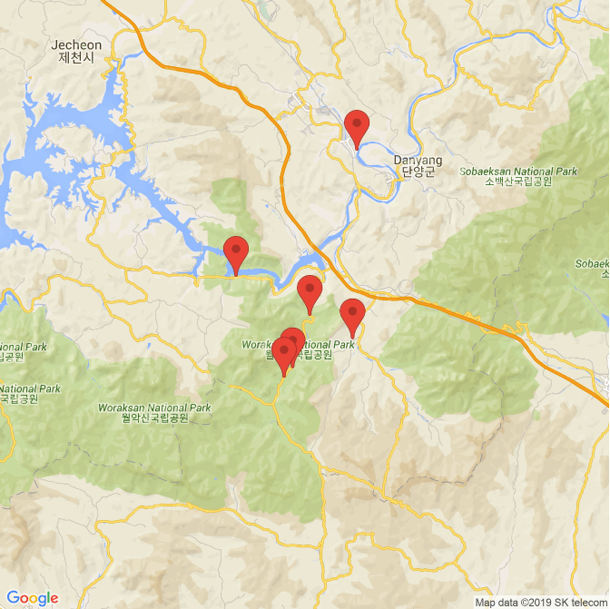
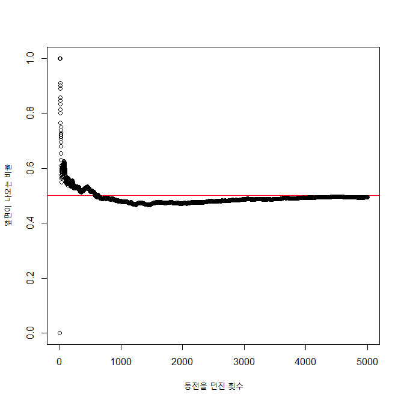

## 제4장 무조건 해 보기


### 1. 차트로 영업실적 비교하기

#### 1-1. 파이 차트

##### 1) 단순 파이 차트

```{r}
x <- c(9, 15, 20, 6)
pie(x)                   # 벡터 데이터의 파이차트 그리기
                         # 차트의 조각들에 데이터의 색인번호가 출력됨.
```

**결과 :** 



##### 2) 파이차트의 데이터라벨 달기

```{r}
label <- c("영업 1팀", "영업 2팀", "영업 3팀", "영업 4팀")
                         # 데이터 요소들의 이름 지정하기
pie(x, 
    labels = label)      # 데이터 요소들의 이름을 차트에 출력하기
```

**결과 :**



##### 3) 파이차트의 전체 제목 달기

```{r}
pie(x, 
    labels = label,
    main="부서별 영업 실적")   # 차트의 제목 출력
```

**결과 :**


##### (최종)

```{r}
pie(x,                         # 벡터 데이터
    labels=label,              # 벡터 데이터의 names
    main="부서별 영업 실적")   # 차트의 제목
```

**결과 :**



#### 1-2. 바 차트

##### 1) 단순 바 차트 그리기

```{r}
height <- c(9, 15, 20, 6)
name <- c("영업 1팀", "영업 2팀", "영업 3팀", "영업 4팀")
barplot(height)                    # 벡터 데이터를 바차트로 출력
```

**결과 :**



##### 2) 바차트의 x축에 제목 달기

```{r}
barplot(height,                    # 벡터 데이터
        names.arg = name)          # 벡터 데이터의 names
```

**결과 :**


##### 3) 바차트에 제목 달기

```{r}
barplot(height,                      # 벡터 데이터
        names.arg = name,            # 벡터 데이터의 names
        main = "부서별 영업실적")    # 차트 제목
```

**결과 :**



##### 4) 바차트의 바에 색깔칠하기

```{r}
barplot(height,                       # 벡터 데이터
        names.arg = name,             # 벡터 데이터의 names
        main = "부서별 영업실적",     # 차트 제목
        col = rainbow(length(height)))
```

**결과 :**

##### 

##### 5) 바차트의 X축에 제목달기

```{r}
barplot(height,                        # 벡터 데이터
        names.arg = name,              # 벡터 데이터의 names
        main = "부서별 영업실적",      # 차트 제목
        col = rainbow(length(height)), # 바의 색깔 지정
        xlab = "부서")
```

**결과 :**

##### 

##### 6) 바차트의 y축에 제목달기

```{r}
barplot(height,                        # 벡터 데이터
        names.arg = name,              # 벡터 데이터의 names
        main = "부서별 영업실 적",     # 차트 제목
        col = rainbow(length(height)), # 바의 색깔 지정
        xlab = "부서",                 # x축 제목  
        ylab = "영업 실적(억 원)")     # y축 제목
```

**결과 :**

##### 

##### 7) 최종

```{r}
barplot(height,                        # 벡터 데이터
        names.arg = name,              # 벡터 데이터의 names
        main = "부서별 영업실 적",     # 차트 제목
        col = rainbow(length(height)), # 바의 색깔 지정
        xlab = "부서",                 # x축 제목  
        ylab = "영업 실적(억 원)")     # y축 제목
```

**결과 :**

##### 

##### 

### 2. 애니메이션으로 카운트 다운

#### 2-1. 문자 출력: 카운트 다운

```{r}
install.packages("animation")      # 'animation' package 설치
library(animation)                 # 'animation' package 사용

ani.options(interval = 1)          # 시간 간격 = 1초

plot.new()                         # 새로운 그래픽 프레임 출력

for (i in 10:0) {                  # 10 ~ 1 까지 1씩 감소하면서 반복

  rect(0, 0, 1, 1, col="yellow")   # 그래픽 프레임 내에서 그래픽 출력 영역을 최대로 설정하여, 노란색으로 출력

  text(0.5, 0.5, i,             # i 값은 (0.5, 0.5) 위치에 출력
       cex=5,                   # 출력되는 글자의 크기
       col=rgb(.2,.2,.2,.7))    # 색깔 지정

  ani.pause()                   # 1초간 애니메이션 대기
}
```

**결과 :**

##### 

### 3. 단양팔경을 구글 맵 위에

#### 3-1. 단양팔경 위치 출력

```{r}
install.packages("ggplot2")
install.packages("RgoogleMaps")
install.packages("ggmap")
library(ggplot2)
library(RgoogleMaps)
library(ggmap)

names <- c("1.도담삼봉/석문", "2.구담/옥순봉", "3.사인암", "4.하선암", "5.중선암", "6.상선암")
addr <- c("충청북도 단양군 매포읍 삼봉로 644-33",
          "충청북도 단양군 단성면 월악로 3827",
          "충청북도 단양군 대강면 사인암2길 42",
          "충청북도 단양군 단성면 선암계곡로 1337",
          "충청북도 단양군 단성면 선암계곡로 868-2",
          "충청북도 단양군 단성면 선암계곡로 790")
addr
```

**결과 :**

```{}
## [1] "충청북도 단양군 매포읍 삼봉로 644-33"    "충청북도 단양군 단성면 월악로 3827"     
## [3] "충청북도 단양군 대강면 사인암2길 42"     "충청북도 단양군 단성면 선암계곡로 1337" 
## [5] "충청북도 단양군 단성면 선암계곡로 868-2" "충청북도 단양군
```

##### 

#### 3-2. 구글지도위에 표시하기

```{r}
register_google(key="Google_API_Key")     # Google API Key 사용

gc <- geocode(enc2utf8(addr))             # 주소지에 대한 geocode 확보
gc

df <- data.frame(name=names, lon=gclon, lat=gclat) # 데이터 프레임 생성
df

cen <- c(mean(dflon), mean(dflat))                 # 중앙지점의 좌표 계산
cen

map <- get_googlemap(center=cen, maptype="roadmap",zoom=11, marker=gc)  # 지도 정보 가져오기

ggmap(map, fullpage = TRUE)        # 구글 지도에 표시
```

**결과 :**

```{}
> gc
## # A tibble: 6 x 2
##     lon   lat
##   <dbl> <dbl>
## 1  128.  37.0
## 2  128.  36.9
## 3  128.  36.9
## 4  128.  36.9
## 5  128.  36.9
## 6  128.  36.9


> df
##              name      lon      lat
## 1 1.도담삼봉/석문 128.3433 37.00300
## 2   2.구담/옥순봉 128.2560 36.93046
## 3        3.사인암 128.3404 36.89439
## 4        4.하선암 128.3094 36.90788
## 5        5.중선암 128.2969 36.87783
## 6        6.상선암 128.2907 36.872

> cen
## [1] 128.3061  36.9143
```





### 4. 워드 클라우드로 연설문 키워드 분석

**키워드**와 **빈도수**에 대한 워드 클라우드 출력

```{r}
install.packages("wordcloud")
install.packages("RColorBrewer")
library(wordcloud)
library(RColorBrewer)

pal2 <- brewer.pal(8,"Dark2")     # 팔레트 생성 : pal2

x <- c("국민", "신한국사회", "민족")   # 키워드 목록
y <- c(5, 4, 3)                        # 키워드의 빈도(Count)

wordcloud(x, y, colors=pal2)           # 키워드의 빈도수에 따라 Dark2 색으로 wordcloud 출력
```

**결과 :**


### 5. 동전 던지기 시뮬레이션

동전을 5,000번 던질 때 횟수에 따라 앞면이 나오는 확률의 변화

```{r}
iteration <- 5000
plot(0, 0, xlab="동전을 던진 횟수", ylab="앞면이 나오는 비율", xlim=c(0, iteration), ylim=c(0, 1))

abline(a=0.5, b=0, col="red")

sum <- 0

for(x in 1:iteration) {
    y <- sample(c("앞면", "뒷면"), 1, replace=T)
    if ( y == "앞면")
        sum = sum + 1
    prob <- sum / x
    points(x, prob)
}
```

**결과 :**




------

[](https://misdb.github.io/R/R-for-BigData-Analysis/source/ch_4_Just_Do_It.R) [](https://misdb.github.io/R/R-for-BigData-Analysis/pdf/ch_4_Just_Do_It.pdf)

------

[](ch_3_Exercise.html)    [](index.html)    [](ch_4_Excel_Address_Google_Map.html)

