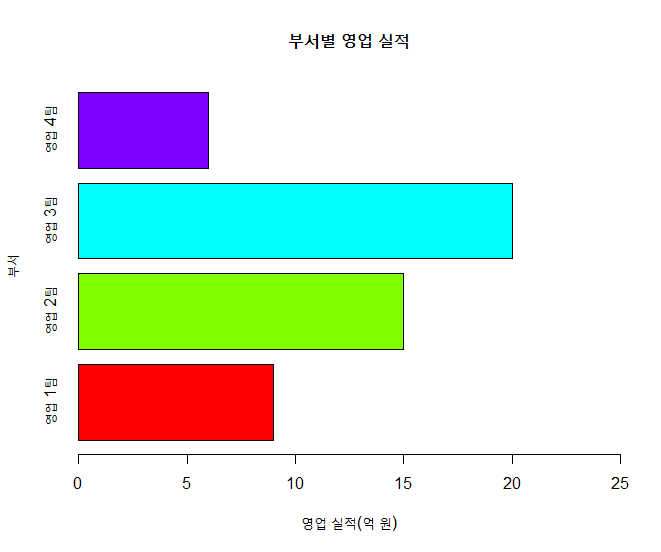

## 제5장 수평 바차트의 데이터라벨 달기 


```{r}
height <- c(9, 15, 20, 6)
name <- c("영업 1팀", "영업 2팀", "영업 3팀", "영업 4팀")

bp <- barplot(height, 
              names.arg=name, 
              main="부서별 영업 실적",
              xlim=c(0,25),         # x축의 상한값 조절
              col=rainbow(length(height)),
              xlab="영업 실적(억 원)", 
              ylab="부서", 
              horiz=TRUE, 
              width=50
             )
```

결과 :




```{r}
text(x=height,               # x 축이 영업실적.  이에 대하여 라벨을 달 것임.
     y=bp,                                              
     labels=round(height,0),                **# height 값의 데이터 라벨 지정**
     pos=4                                             **# pos=4** 
     )
#===== 수평 바차트의 데이터라벨 달기 끝
```

결과 : 


------

 [](source/ch_5_130_Labelling_Horizontal_Bar_Chart.R) [](pdf/ch_5_130_Labelling_Horizontal_Bar_Chart.pdf)

------

[](ch_05_Chart.html)    [](index.html)    [](ch_5_130_Labelling_Stacked_Bar_Chart.html)

