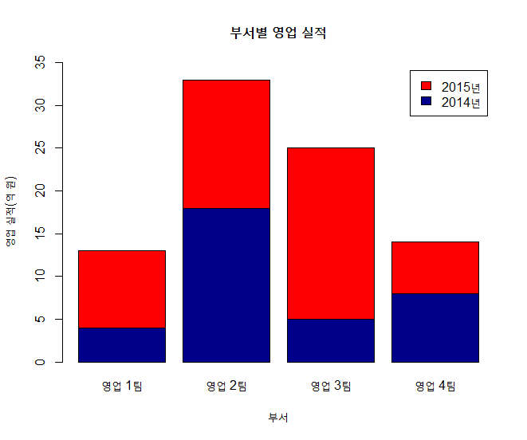
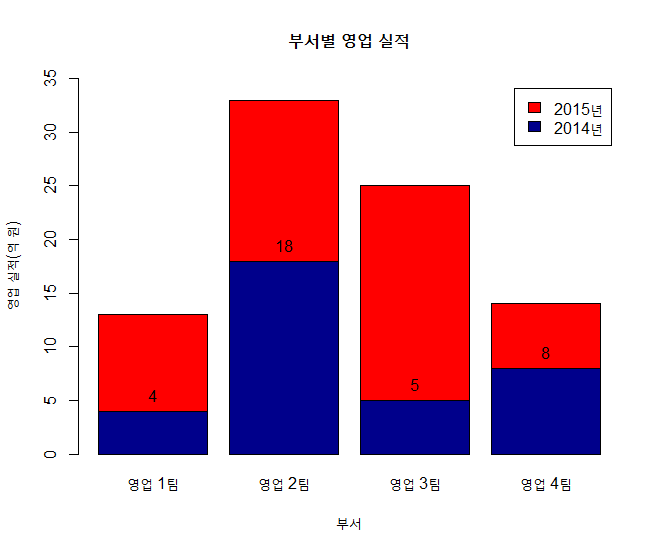

## 제5장 스택형 바차트에 라벨달기


```{r}
height1 <- c(4, 18, 5, 8)
height2 <- c(9, 15, 20, 6)

height <- rbind(height1, height2)
height
```

결과 :

```
##         [,1] [,2] [,3] [,4]
## height1    4   18    5    8
## height2    9   15   20    6
```


```{r}
name <- c("영업 1팀", "영업 2팀", "영업 3팀", "영업 4팀")
legend_lbl <- c("2014년", "2015년")


bp <- barplot(height,
		main = "부서별 영업 실적",
		names.arg = name,
		xlab = "부서", 
		ylab = "영업 실적(억 원)",
		col = c("darkblue","red"),
		legend.text = legend_lbl,
		ylim = c(0, 35))
```

결과 :



```{r}
text(x=bp, y=height1, labels=round(height1,0), pos=3)            # 2014년 데이터에 라벨달기
```

결과 :



```{r}
text(x=bp, y=height1 + height2, labels=round(height2,0), pos=3)  # 2015년 데이터에 라벨달기
```

결과 :


**[ [R Source](source/ch_5_130_Labelling_Stacked_Bar_Chart.R) ]**


------

  

