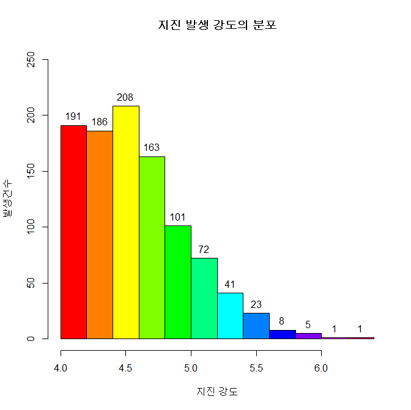

## 제5장 히스토그램에 데이터라벨 달기 (1)


```{r}
# p. 139-140

#====== hist() -> plot()으로 전환해서 라벨달기

head(quakes)
mag <- quakes$mag
hp <- hist(mag)	 

plot(hp,, main="지진 발생 강도의 분포", col=rainbow(length(height)), xlab="지진 강도", ylab="발생건수", ylim=c(0,250))

(height <- hp$counts)

text(x=hp$mids, y=height, labels=height, pos=3)
#======= 라벨달기 끝
```

결과 : 



**[ [R Source](source/ch_5_139_Labelling_Histogram_01.R) ]**


------

 [](source/ch_5_131_Labelling_Grouped_Bar_Chart.R) [](pdf/ch_5_131_Labelling_Grouped_Bar_Chart.prf)

------

[](ch_5__130_Labelling_Grouped_Bar_Chart.html)    [](index.html)    [](ch_5_141_Labelling_Histogram_02.html)

