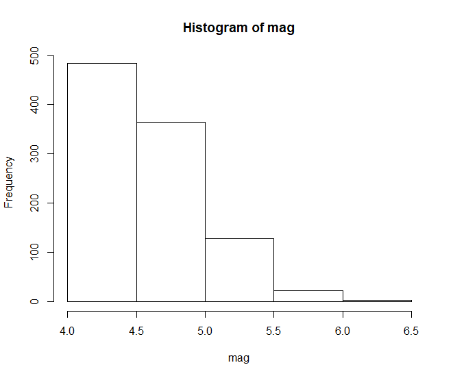
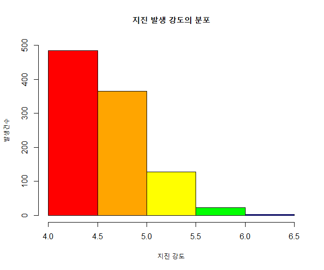
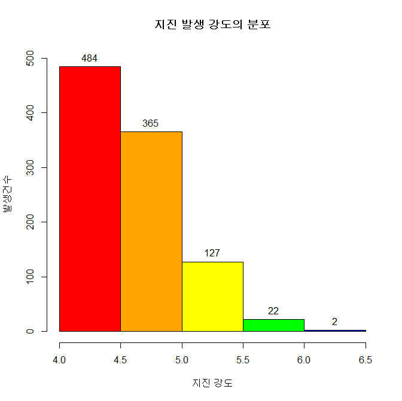

## 제5장 히스토그램에 데이터라벨 달기 (2)


```{r}
# ch_5_141_Labelling_Histogram_02
#====== hist() -> plot()으로 전환해서 라벨달기

head(quakes)
mag <- quakes$mag

# 계급 구간과 색 
colors <- c("red", "orange", "yellow", "green", "blue", "navy", "violet")

hp <- hist(mag, breaks=seq(4, 6.5, by=0.5))	 
```

결과 :



```{r}
hp                            # 변수 hp 의 값들을  꼭 확인해 보기 바람.
```

결과 :

```{}
## $breaks
## [1] 4.0 4.5 5.0 5.5 6.0 6.5
## 
## $counts
## [1] 484 365 127  22   2
## 
## $density
## [1] 0.968 0.730 0.254 0.044 0.004
## 
## $mids
## [1] 4.25 4.75 5.25 5.75 6.25
## 
## $xname
## [1] "mag"
## 
## $equidist
## [1] TRUE
## 
## attr(,"class")
## [1] "histogram"
```


```{r}
plot(hp,, 
     main="지진 발생 강도의 분포", 
     xlab="지진 강도", 
     ylab="발생건수",
     col=colors, ylim=c(0,500))
```


결과 :



```{r}
(height <- hp$counts)

text(x=hp$mids, y=height, labels=height, pos=3)
#======= 라벨달기 끝
```

결과 : 




------

 [](source/ch_5_141_Labelling_Histogram_02.R) [](pdf/ch_5_141_Labelling_Histogram_02.pdf)

------

[](ch_5_139_Labelling_Histogram_01.html)    [](index.html)    [](ch_5_142_Labelling_PDF_Histogram.html)

