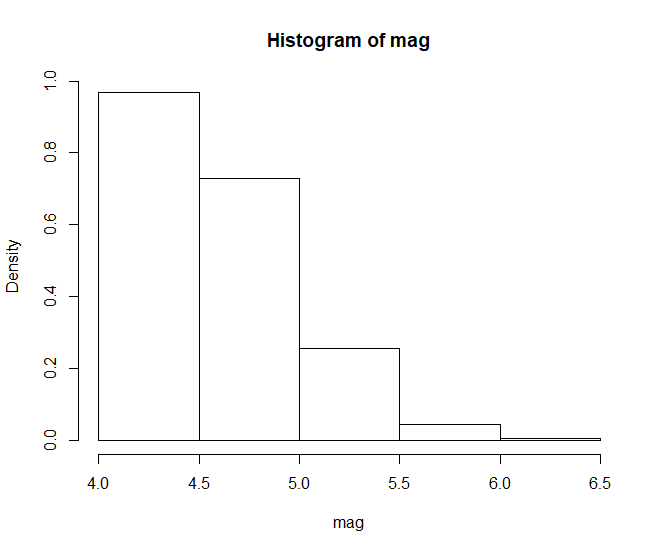
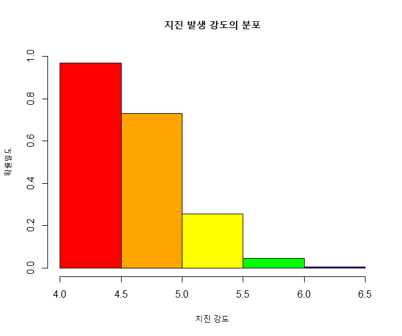
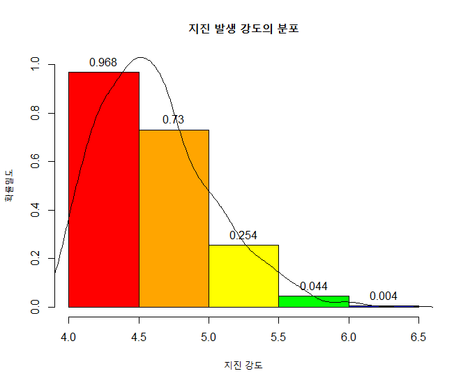

## 제5장 확률밀도 히스토그램에 데이터라벨 달기


```{r}
#===== 라벨달기

head(quakes)
mag <- quakes$mag

hp <- hist(mag, breaks=seq(4, 6.5, by=0.5), freq=FALSE)
```

결과  :



```{r}
hp                      # 변수 hp 의 값들을  꼭 확인해 보기 바람.
```

결과 :

```
## $breaks
## [1] 4.0 4.5 5.0 5.5 6.0 6.5
## 
## $counts
## [1] 484 365 127  22   2
## 
## $density
## [1] 0.968 0.730 0.254 0.044 0.004
## 
## $mids
## [1] 4.25 4.75 5.25 5.75 6.25
## 
## $xname
## [1] "mag"
## 
## $equidist
## [1] TRUE
## 
## attr(,"class")
## [1] "histogram"
```


```{r}
plot(hp,, 
	freq=FALSE,
	main="지진 발생 강도의 분포", 
	xlab="지진 강도", 
	ylab="확률밀도",
	col=colors, 
	ylim=c(0,1))
```

결과 :



```{r}
(height <- hp$density)
text(x=hp$mids, y=height, labels=height, pos=3)

#======= 라벨달기 끝
```

결과 :


```{r}
lines(density(mag))
```

결과 :



**[ [R Source](source/ch_5_142_Labelling_PDF_Histogram.R) ]**


------

 [](source/ch_5_142_Labelling_PDF_Histogram.R) [](pdf/ch_5_142_Labelling_PDF_Histogram.pdf)

