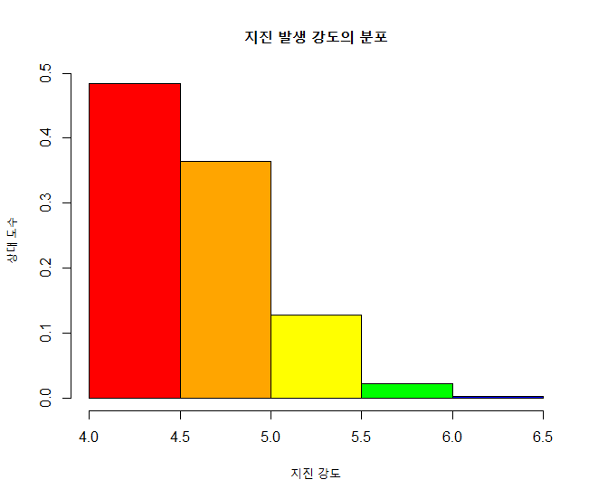

## 제5장 상대도수표 라벨 달기


```{r}
head(quakes)
mag <- quakes$mag

colors <- c("red", "orange", "yellow", "green", "blue", "navy", "violet")
h <- hist(mag, 
          breaks=seq(4, 6.5, by=0.5))
h                                           # 변수 hp 의 값들을  꼭 확인해 보기 바람.

plot(h,,
	freq=FALSE, 
	main="지진 발생 강도의 분포", 
	xlab="지진 강도", 
	ylab="상대 도수",
	col=colors)
```

결과 :



```{r}
#=== 라벨달기

h$density <- h$counts / sum(h$counts)    # 상대빈도 계산

text(x=h$mids, y=h$density, labels=h$density, pos=3)

#=== 라벨달기 끝
```

결과 :


**[ [R Source](source/ch_5_143_Labelling_Relative_Frequency_Chart.R) ]**


------

  