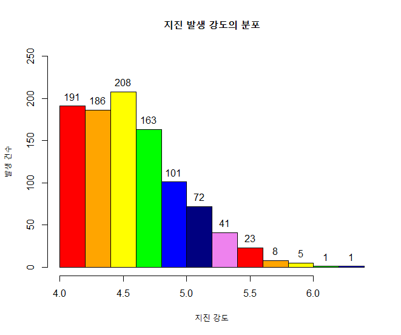

## 제5장 히스토그램에 데이터라벨 달기 (3)

##### 

```{r}
head(quakes)
mag <- quakes$mag

h <- hist(mag, breaks="Sturges")


```

결과 :


```{r}
plot(h,,
	main="지진 발생 강도의 분포", 
	xlab="지진 강도", 
	ylab="발생 건수",
	col=colors, 
	ylim=c(0,250))
```

결과 :


```{r}
#=== 라벨달기
(height <- h$counts)
text(x=h$mids, y=height, labels=round(height,0), pos=3)
#=== 라벨달기 끝
```

결과 :



**[ [R Source](source/ch_5_144_Labelling_the_Class.R) ]**


------

 [](source/ch_5_144_Labelling_the_Class.R) [](pdf/ch_5_144_Labelling_the_Class.pdf)

