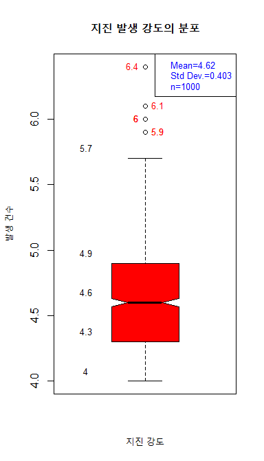
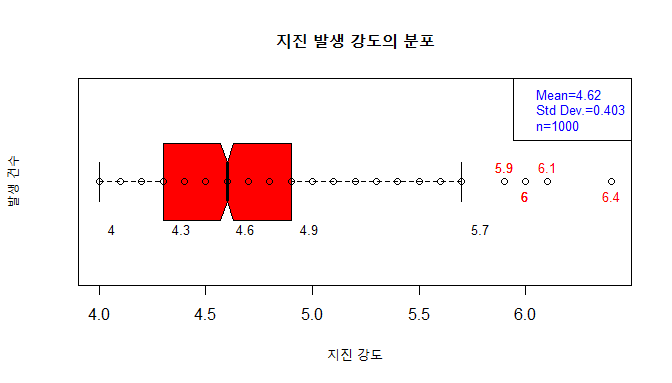

## 제5장 박스플롯 데이터라벨 달기

```{r}
#----- p. 146 박스 플롯에 데이터 라벨달기**

# I. Box plot

mag <- quakes$mag

# change the plot window size : (7 x 7) => (4 X 7)
win.graph(4,7)

# 1. Box Plot
boxstats <- boxplot(mag, 
                    main="지진 발생 강도의 분포",
                    xlab="지진 강도",
                    ylab="발생 건수",
                    col="red",
                    notch=TRUE)

# 2. Display the points => points()
len <- length(mag)           # the number of data
points(mag, rep(1,len))      # position of points : (x, y=1) 

# 3. Display fivenumbers => boxstats$stats
#    ⇒ text(x, y, labels) 
text(0.65, boxstats$stats, labels=boxstats$stats, pos=3, cex=0.8)   # cex=0.8 : size of tex
                                                # pos = 1, 2, 3, 4

# 4. display legend (Mean, Std Dev., n) ⇒ legend()
# paste0()
legend("topright", 
        paste0(c("Mean", "Std Dev.", "n"), "=", 
	    round(c(mean(mag), sd(mag), length(mag)), 3)), 
	    text.col = 4,     # color of legend text 
	    cex=0.8)          # size of legend text

# 5. Display Outliers
text( rep(1, NROW(boxstats$out)),
             boxstats$out,
             labels = boxstats$out,
             pos = c(4,2,2,4,4,2,2),
             cex = 0.8,
             col = "red"
)

#---- 데이터 라벨 달기 끝
```

결과 : 




```{r}
#----- p. 146 박스 플롯을 수평으로 하고, 데이터 라벨 달기

# II. horizontal box plot

mag <- quakes$mag

# change the plot window size : (7 x 7) => (7 X 4)
win.graph(7,4)

# 1. Horizontal Box Plot
boxstats <- boxplot(mag, 
                    main="지진 발생 강도의 분포",
                    xlab="지진 강도",
                    ylab="발생 건수",
                    col="red",
                    notch=TRUE,
                    horizontal=T)

# 2. Display the points => points()
len <- length(mag)           # the number of data
points(mag, rep(1,len))      # position of points : (x, y=1) 

# 3. Fivenumbers => boxstats$stats
text(boxstats$stats, 0.75, labels=boxstats$stats, pos=4, cex=0.8)   # cex=0.8 : size of tex
                                              # pos = 1, 2, 3, 4

# 4. display legend (Mean, Std Dev., n) ⇒ legend()
# paste0()
legend("topright", 
        paste0(c("Mean", "Std Dev.", "n"), "=", 
	    round(c(mean(mag), sd(mag), length(mag)), 3)), 
	    text.col = 4,     # color of legend text 
	    cex=0.8)          # size of legend text

# 5. Displaying outliers
text( boxstats$out, rep(1, NROW(boxstats$out)),
                    labels = boxstats$out,
                    pos = c(3,1,1,3,3,1,1), 
                    cex=0.8, 
                    col="red"
)
#---- 데이터 라벨 달기 끝
```

결과 : 




------

 [](source/ch_5_146_Labelling_Boxplot.R) [](pdf/ch_5_146_Labelling_Boxplot.pdf)

------

[](ch_5_144_Labelling_the_Class.html)    [](index.html)    [](ch_5_165_Labelling_Moving_Chart.html)

