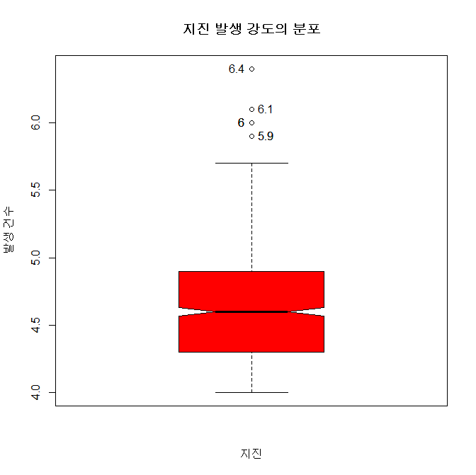

## 제5장 박스플롯 데이터라벨 달기

```{r}
#----- p. 146 박스 플롯에 데이터 라벨달기**

mag ＜- quakes$mag

boxstats <- boxplot(mag, 
                    main="지진 발생 강도의 분포", 
                    xlab="지진", 
                    ylab="발생 건수",
                    col="red",
                    notch=TRUE            # 박스의 허리를 들어가게
                    )

text( rep(1, NROW(boxstats$out)),       # x축으로 전체 박스 플롯
      boxstats$out,                     # y축의 값을 기준으로 outlier를 출력할 데이터
      labels=boxstats$out,              # y축의 값을 기준으로 outlier를 출력할 데이터의 라벨
      pos=c(4,2,2,4,4,2,2)              # boxstats$out 의 데이터 갯수가 7개 이며, 2=왼쪽에, 4=오른쪽에 라벨 출력

)

#---- 데이터 라벨 달기 끝
```

결과 : 




```{r}
#----- p. 146 박스 플롯을 수평으로 하고, 데이터 라벨 달기

mag ＜- quakes$mag
boxstats <- boxplot(mag, 
                    main="지진 발생 강도의 분포", 
                    xlab="발생 건수",                                  # x축의 라벨 변경
                    ylab="지진",                                          # y 축의 라벨 변경
                    col="red",
                    horizontal=TRUE,      # 박스 플롯을 수평으로
                    notch=TRUE               # 박스의 허리를 들어가게
                    )

text( boxstats$out,                                    # x 축 변경
      rep(1, NROW(boxstats$out)),             # y 축 변경
      labels=boxstats$out, 
      pos=c(3,1,1,3,3,1,1)                           # 1=아랫쪽, 3=윗쪽에 라벨 출력 
)

#---- 데이터 라벨 달기 끝
```

결과 : 


**[ [R Source](source/ch_5_146_Labelling_Boxplot.R) ]**


------

 [](source/ch_5_146_Labelling_Boxplot.R) [](pdf/ch_5_146_Labelling_Boxplot.pdf)

------

[](ch_5_144_Labelling_the_Class.html)    [](index.html)    [](ch_5_165_Labelling_Moving_Chart.html)

