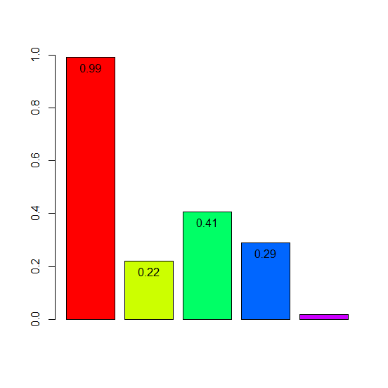

## 제5장 움직이는 차트에 데이터라벨 달기


```{r}
# 1초 간격으로 그래프 그리기

library(animation)
ani.options(interval = 1)

while(TRUE) {
    y <- runif(5, 0, 1)
    bp <- barplot(y, ylim = c(0, 1), col=rainbow(5))
    
    text(x=bp, y=y, 
         labels=round(y,2),       # 라벨 y
         pos=1)   
    
    ani.pause()
}
```



**주의 :** 위의  바플롯이 계속 갱신이 됨..


**[ [R Source](source/ch_5_165_Labelling_Moving_Chart.R) ]**


------

 [](source/ch_5_165_Labelling_Moving_Chart.R) [](pdf/ch_5_165_Labelling_Moving_Chart.pdf)

------

[](ch_5_146_Labelling_Boxplot.html)    [](index.html)    [](ch_5_Examples_of_Chart_3D.html)

