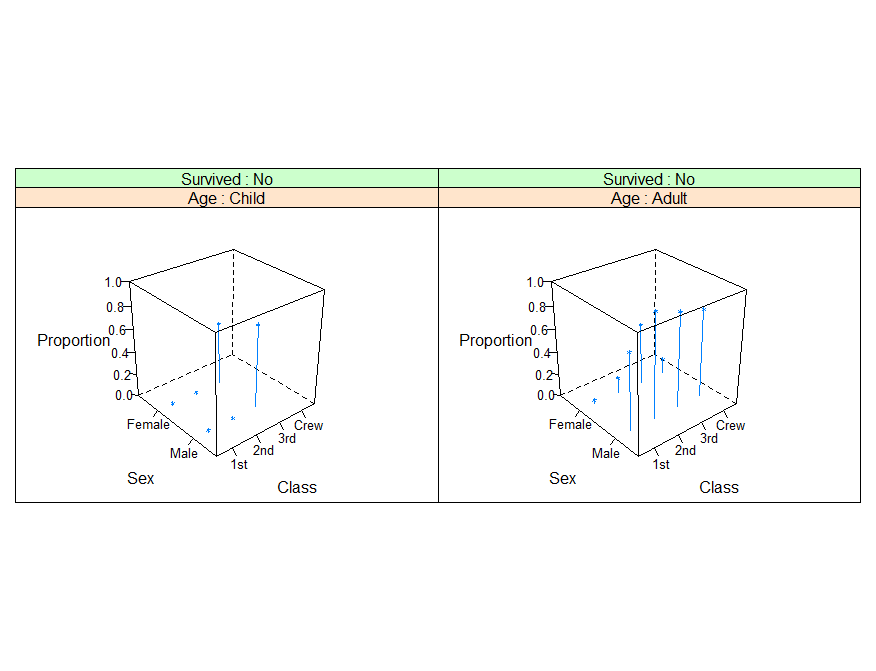

## **제5장 차트그리기 설명 및 예제**


예제 1 : http://www.datamarket.kr/xe/index.php?mid=board_AGDR50&document_srl=201&listStyle=viewer


예제 2 :  https://m.blog.naver.com/PostView.nhn?blogId=hsj2864&logNo=220604182306&proxyReferer=https%3A%2F%2Fwww.google.co.kr%2F


예제 3 : http://allaboutmoon.tistory.com/entry/R%EC%9D%84-%ED%99%9C%EC%9A%A9%ED%95%9C-%EA%B7%B8%EB%9E%98%ED%94%84-%EC%9E%91%EC%84%B1%ED%95%98%EA%B8%B0


### 예제 4 : 3D Barplot 

#### (latticeExtra 패키지 활용 : 설명서 파일 첨부)


1. ##### 라이브러리 사용하기

```{r}
install.packages(latticeExtra)
library(latticeExtra)
```


2. ##### 데이터 변수 d 생성하기

```r
d <- read.table(text='x  y  z
                     t1   5   high
                     t1   2   low
                     t1   4   med
                     t2   8   high
                     t2   1   low
                     t2   3   med
                     t3  50   high
                     t3  12   med
                     t3  35   low', 
                 header=TRUE)
d
```

결과 :

```
##    x  y    z
## 1 t1  5 high
## 2 t1  2  low
## 3 t1  4  med
## 4 t2  8 high
## 5 t2  1  low
## 6 t2  3  med
## 7 t3 50 high
## 8 t3 12  med
## 9 t3 35  low
```


3. ##### 차트 그리기

```{r}
cloud(y ~ x + z, 
      d, 
      panel.3d.cloud = panel.3dbars, 
      col.facet='grey',       
      xbase=0.4, 
      ybase=0.4, 
      scales=list(arrows=FALSE, col=1),       
      par.settings = list(axis.line = list(col = "transparent")))
```

결과 : 


### 예제 5.

```{r}
cloud(prop.table(Titanic, margin = 1:3),
      type = c("p", "h"), 
      strip = strip.custom(strip.names = TRUE),
      scales = list(arrows = FALSE, distance = 2), 
      panel.aspect = 0.7,
      zlab = "Proportion")[, 1]
```

참고자료 : [https://stat.ethz.ch/R-manual/R-devel/library/lattice/html/cloud.html](https://stat.ethz.ch/R-manual/R-devel/library/lattice/html/cloud.html)

****


### 예제 6 : (lattice 패키지 설명서 p. 40 참조)


```{r}
# volcano 
# 87 x 61 matrix

wireframe(volcano, 
          shade = TRUE,
          aspect = c(61/87, 0.4),
          light.source = c(10,0,10)
         )
```

결과 : ****

### 예제 7 :  plot3D 패키지 활용 (패키지 설명서 파일 참조) & 참고사이트[매우 재미있음]

```{r}
# 설명서 3쪽의 예제 :  화산

install.packages("plot3D")
library(plot3D)

image2D(Hypsometry, 
        xlab = "longitude", 
        ylab = "latitude",
        contour = list(levels = 0, col = "black", lwd = 2),
        shade = 0.1, 
        main = "Hypsometry data set", 
        clab = "m")

rect(-50, 10, -20, 40, lwd = 3)

ii <- which(Hypsometry$x > -50 & Hypsometry$x < -20)
jj <- which(Hypsometry$y > 10 & Hypsometry$y < 40)

zlim <- c(-10000, 0)
```

결과 : **[ [R Source](source/ch_5_Examples_of_Chart_3D.R) ]**


------

 [](source/ch_5_Examples_of_Chart_3D.R) [](pdf/ch_5_Examples_of_Chart_3D.pdf)

------

[](ch_5_165_Labelling_Moving_Chart.html)    [](index.html)    [](ch_5_solution_exercise.html)

