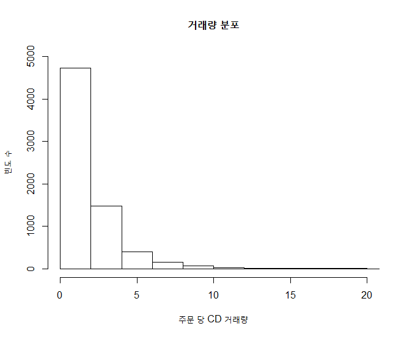
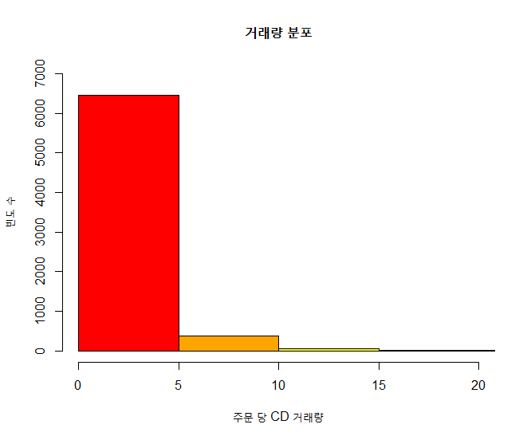
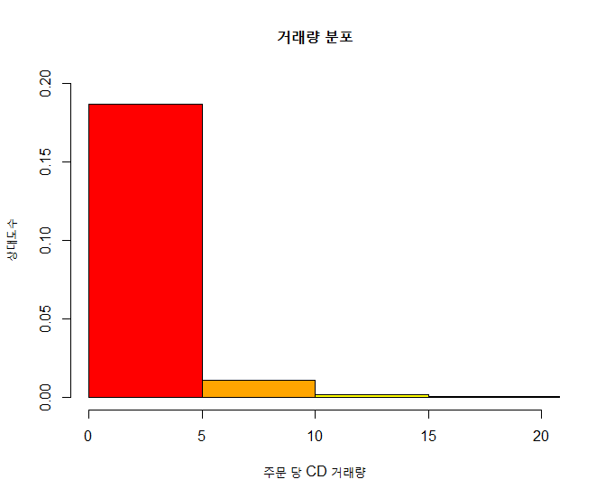
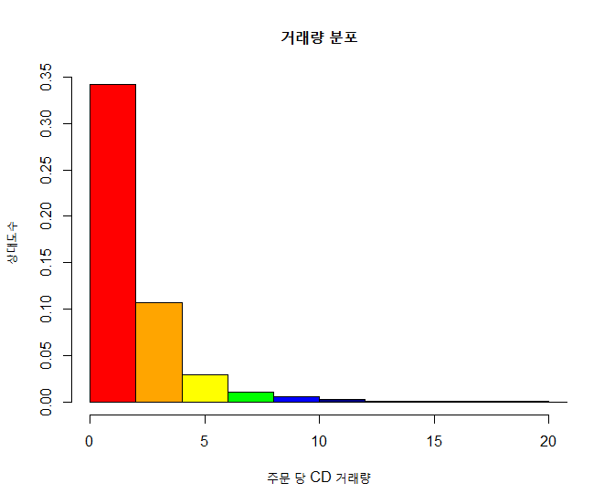

## 제5장 실습문제 풀이


```{r}
# CDNow 데이터 소스 위치
url <- "https://raw.githubusercontent.com/cran/BTYD/master/data/cdnowElog.csv"

# 데이터 읽기
data <- read.csv(url, header=T)

# 헤더 부분 출력
head(data)
```

결과 :

```
##   masterid sampleid     date cds sales
## 1        4        1 19970101   2 29.33
## 2        4        1 19970118   2 29.73
## 3        4        1 19970802   1 14.96
## 4        4        1 19971212   2 26.48
## 5       21        2 19970101   3 63.34
## 6       21        2 19970113   1 11.77
```


```{r}
# 거래량
quantity <- data$cds

# 거래량 이원 분류표(거래량 대 빈도수)
table(quantity)
```

결과 :

```
## quantity
##    1    2    3    4    5    6    7    8    9   10   11   12   13   14   15 
## 3084 1647  998  482  249  155   98   54   40   33   16   15   13    3    6 
##   16   17   18   19   22   23   24   25   26   37   40 
##    5    3    6    3    2    1    2    1    1    1    1 
```


```{r}
# 거래량에 대한 빈도수를 히스토그램으로 출력 : 1) 기본 출력 [빈도]
hist(quantity, 
	main="거래량 분포", 
	xlab="주문 당 CD 거래량", 
	ylab="빈도 수",  
	xlim=c(0,20), 
	ylim=c(0,5000))

```

결과 :




```{r}
# 거래량에 대한 빈도수를 히스토그램으로 출력  : 2) 칼라 지정 [빈도]
colors <- c("red", "orange", "yellow", "green", "blue", "navy", "violet")
hist(quantity, 
	main="거래량 분포", 
	xlab="주문 당 CD 거래량", 
	ylab="빈도 수",
	col=colors, 
	breaks=seq(0, 40, by=5), 
	xlim=c(0,20), 
	ylim=c(0,7000))
```

결과 :




```{r}
# 거래량에 대한 빈도수를 히스토그램으로 출력  : 3) 상대도수 (%)
hist(quantity, 
	main="거래량 분포", 
	xlab="주문 당 CD 거래량", 
	ylab="상대도수",
	col=colors, 
	breaks=seq(0, 40, by=5), 
	freq=FALSE, 
	xlim=c(0,20), 
	ylim = c(0, 0.2))
```

결과 :





```{r}
# 거래량에 대한 빈도수를 히스토그램으로 출력  : 4) Sturges 공식에 의한 계급 계산, 상대도수 (%)
hist(quantity, 
	main="거래량 분포", 
	xlab="주문 당 CD 거래량", 
	ylab="상대도수",
	col=colors, 
	breaks="Sturges", 
	freq=FALSE, 
	xlim=c(0,20))
```

결과 :



**[ [R Source](source/ch_5_solution_exercise.R) ]**


------

 [](source/ch_5_solution_exercise.R) [](pdf/ch_5_solution_exercise.pdf)

------

[](ch_5_Examples_of_Chart_3D.html)    [](index.html)    [](ch_06_Animation.html)

