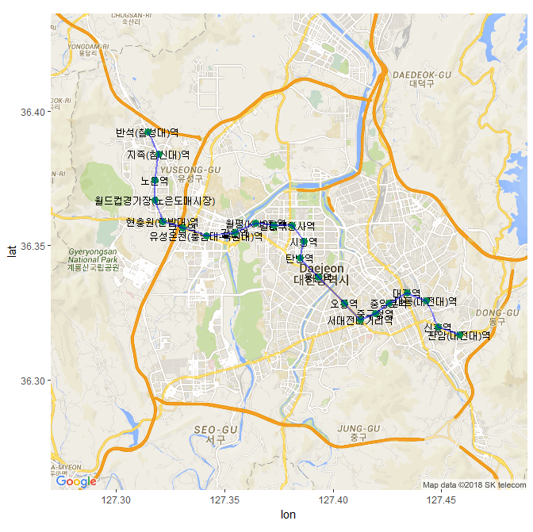

## 제7장 대전 지하철 노선도 (1) : 역의 위도 경도 정보를 확보한 후 그리기

데이터세트 : [djsubway.csv](data/djsubway.csv)

```{r}
install.packages("ggplot2")
install.packages("RgoogleMaps")
install.packages("ggmap")
library(ggplot2)
library(RgoogleMaps)
library(ggmap)

# 지하철역 정보파일(csv)을 불러온다. 
# 단. csv 파일은 엑셀파일 작성 후 저장 시, 
# [CSV(쉼표로 분리)(*.csv)] 형식으로 저장이 되어 있어야 함
# djsubway.csv : 출발역부터 종착역까지 순서대로 입력이 되어 있어야 함. => geom_path() 함수의 이용을 위해

df <- read.csv(file.choose()) 
df

# 전체역의 중심 좌표 계산
cen <- c(mean(df$lon),mean(df$lat))
cen

# 역의 위도 경도 정보만 따로 data frame 변수 gc에 저장. get_googlemap() 의  maker=gc  옵션에 사용가능.
# 그러나 여기서는 marker=gc 옵션을 사용하지 않겠음.

# gc <- data.frame(df$lon, df$lat)  
# gc

map <- get_googlemap(center=cen, maptype="roadmap", zoom=12)
gmap <- ggmap(map)

# geom_text() : 역이름 출력
# geom_point() : 역에 점찍기
# geom_path() : 역과 역사이에 선잇기

gmap + 
	geom_text(data=df, 
              aes(x=lon, y=lat), 
              size=3, 
              label=df$station_list) + 
	geom_point(data = df, 
               aes(df$lon, df$lat), 
               size = 3, 
               colour='#018b4d') +
	geom_path(data = df, 
              aes(x = df$lon, y = df$lat), 
              color = "blue", 
              alpha = .5, 
              lwd = 1)
```

결과 :




------

 [](source/ch_7_Subway_Geocode_Daejeon.R)  [](pdf/ch_7_Subway_Geocode_Daejeon.pdf)

------

[](ch_07_Google_Map.html)    [](index.html)    [](ch_7_Subway_Stations_Daejeon.html)

