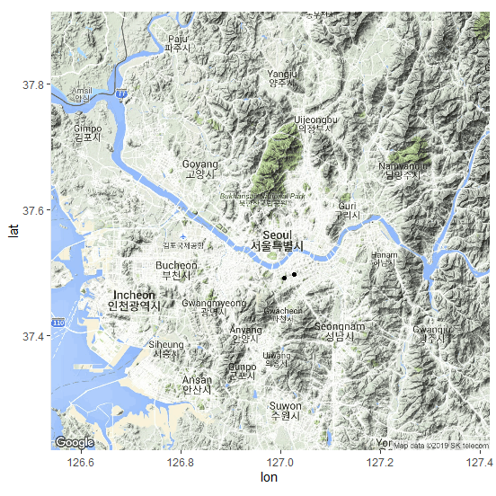
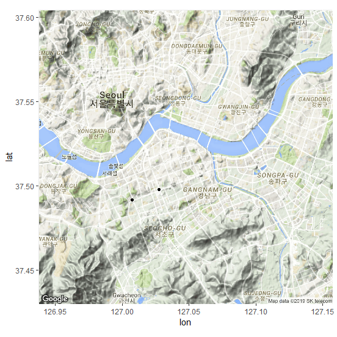
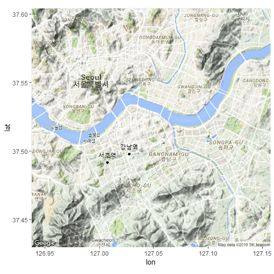
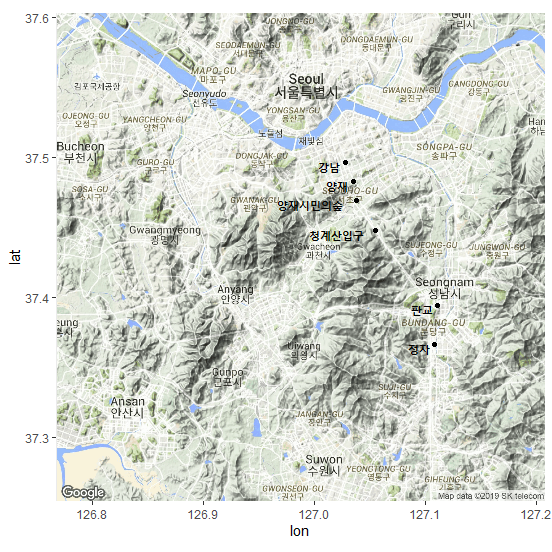
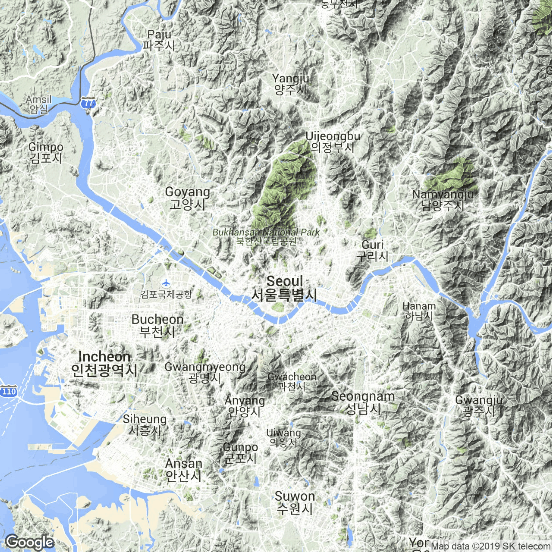
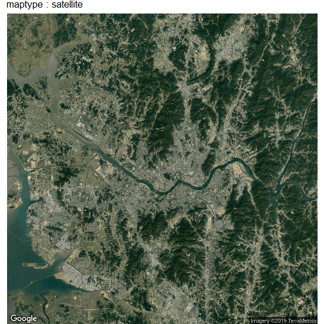

## 제7장 [보충자료] ggmap, ggplot2 패키지를 이용한 지도 출력 및 경로 표현하기 간단예제


```{r}
# R에서 ggmap, ggplot2 패키지를 이용한 지도 출력 및 경로 표현하기 간단예제
# https://lovetoken.github.io/r/data_visualization/2016/10/18/ggmap.html
#++++++++++++++++++++++++++++++++++++++++++++++++++++++++++++++++++++++++++++

install.packages("ggmap")
install.packages("ggplot2")

library(ggmap)
library(ggplot2)

register_google(key="Google API Key")

# 대한민국
geocode('Korea', source='google')
```

**결과 :**

```
## Source : https://maps.googleapis.com/maps/api/geocode/json?address=Korea&key=xxx
## # A tibble: 1 x 2
##     lon   lat
##   <dbl> <dbl>
## 1  128.  37.7
```


```{r}
# 서울 
getmap <- get_googlemap("seoul")
(p1 <- ggmap(getmap))   # 그림 1.
```

**결과 :**


```{r}
# p1 <- get_googlemap("seoul") %>% ggmap
locationInfo <- data.frame(
   Name = c("서초역", "강남역"), 
   lon = c(127.007675, 127.027544),
   lat = c(37.491843, 37.497968) 
)

p1 + geom_point(data = locationInfo, aes(x = lon, y = lat))   # 그림 2.
```

**결과 :**




```{r}
# 지도 확대하기
getmap <- get_googlemap("gangnamgu", zoom = 12)

p2 <- ggmap(getmap)
p2 + geom_point(data = locationInfo, 
                aes(x = lon, y = lat))    # 그림 3.
```

**결과 :**




```{r}
# 두 점에 지역명 표시하기
p2 + 
	geom_point(data = locationInfo, 
               aes(x = lon, y = lat)) +
	geom_text(data = locationInfo, 
              aes(label = Name), 
              size = 3, 
              vjust = -1)   # 그림 4.
```

**결과 :**




```{r}
# 신분당선 전철 경로 그리기
locationInfo <- data.frame(
    Name = c("강남", "양재", "양재시민의숲", "청계산입구", "판교", "정자"), 
    lon = c(127.028046, 127.035140, 127.038451, 127.054769, 127.111172, 127.108367), 
    lat = c(37.497001, 37.483368, 37.469655, 37.448196, 37.394786, 37.366777)
)

locationInfo

getmap <- get_googlemap("gwacheon", zoom = 11)
p3 <- ggmap(getmap)

p3 <- p3 + 
	geom_point(data = locationInfo, aes(x = lon, y = lat)) +
	geom_text(data = locationInfo, 
              aes(label = Name), 
              size = 4, 
              hjust = 1.2, 
              fontface = "bold")
p3
```

**결과 :**




```{r}
p3 + 
	geom_path(data = locationInfo, 
              aes(x = lon, y = lat), 
              color = "blue", 
              alpha = .5, 
              lwd = 1)       # 그림 5. 신 분당선 경로 표시
```

**결과 :**


```{r}
## extent=device
# option의 설정
# 1) extent = "device"      
getmap <- get_googlemap("seoul")
(p4 <- ggmap(getmap, extent = "device"))      # 그림 6.
```

**결과 :**




```{r}
# 2) get_googlemap(maptype = "satellite") : 4 종류 : "terrain", "satellite", "roadmap", "hybrid"
getmap <- get_googlemap("seoul", maptype = "satellite")
(p5 <- ggmap(getmap, extent = "device"))      # 그림 7.
```

**결과 :**


```{r}
# 3) 제목 달기
p5 + ggtitle("maptype : satellite")           # 그림 8.
```

**결과 :**




**[ [R Source](source/ch_7_using_ggmap_00.R) ]**

