## 제7장 ggmap 패키지 실습 (01)


데이터 세트

-  [population201506.csv](data/population201506.csv)
-  [university.csv](data/university.csv)


```{r}
# ********************************************
# -- ggmap 패키지
# ********************************************

# -- 지도 관련 패키지 설치

library(ggplot2)
library(ggmap)

register_google(key="Google API Key")                           # 구글 API 인증

# -- get_googlemap() 함수
#    지도위치정보 가져오기
gc <- geocode("seoul, korea", source="google")                   # geolocation API 이용
gc

center = as.numeric(gc)
center                                                          # 위도,경도

# -- 지도 정보 생성하기
map <- get_googlemap(center = center, 
		language="ko-KR", 
		color = "bw",                            # bw :  black-and-white - 흰색 바탕에 검은색 글자
		scale = 2 )                              # scale :  1, 2, or 4 (scale = 2 : 1280x1280 pixels)

# -- 지도 이미지 그리기
ggmap(map, extent = 'device')                                   # extent : 지도가 그려질 크기를 지정하는 옵션
```

**결과 :**

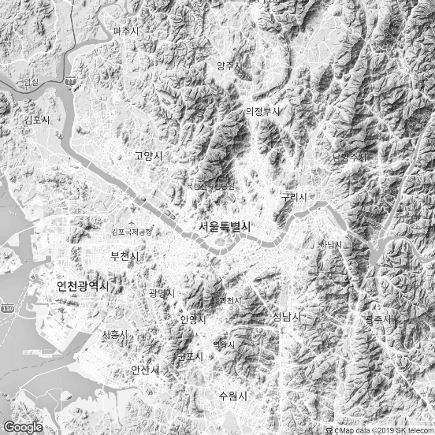


```{r}
# -- markers 데이터프레임 생성 -> round 적용
df <- round(data.frame( x = jitter(rep(-95.36, 25), amount = .3),
                       y = jitter(rep(29.76, 25), amount = .3) ), digits = 2)

# -- 지도 위에 markers 적용
map <- get_googlemap('houston', markers = df, scale = 2)
ggmap(map, extent = 'device')
```

**결과 :**

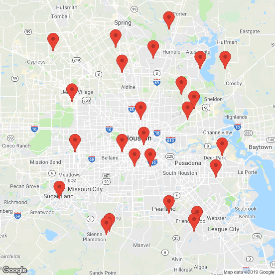


```{r}
# --------------------------------------------
# -- get_map() 함수
# --------------------------------------------
map <- get_map(location ="seoul", zoom=14, maptype='roadmap', scale=2)

# -- get_map("중심지역", 확대비율, 지도유형) : ggmap에서 제공하는 함수
ggmap(map, size=c(600,600), extent='device')
```

**결과 :**

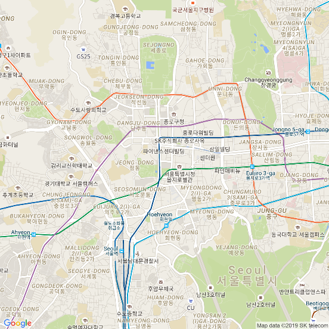


```{r}
map <- get_map(location ="seoul", zoom=14, maptype='watercolor', scale=2)
ggmap(map, size=c(600,600), extent='device')
```

**결과 :**

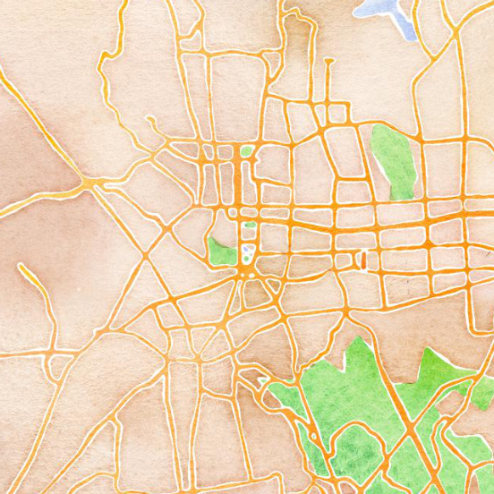


```{r}
# -- zoom 차이
map <- get_map(location ="seoul", zoom=14, scale=2)
ggmap(map, size=c(600,600), extent='device')
```

**결과 :**

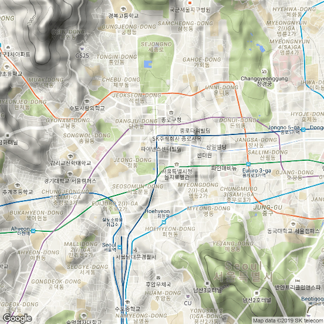


```{r}
map <- get_map(location ="seoul", zoom=8, scale=2)
ggmap(map, size=c(600,600), extent='device')
```

**결과 :**

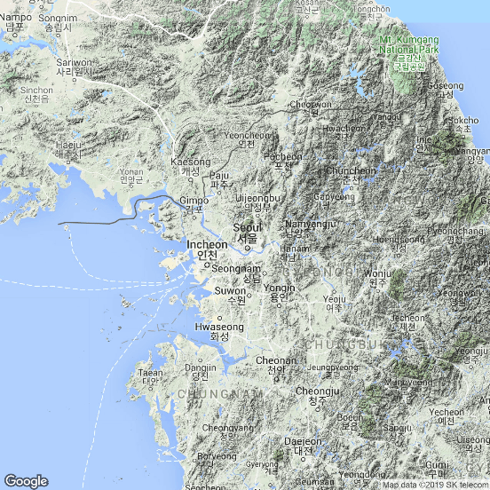


```{r}
# --------------------------------------------
# 3. 레이어 적용
# --------------------------------------------

# 실습 데이터-서울지역 4년제 대학교 위치 표시
university <- read.csv(file.choose(),header=T)
university                                                      # 학교명","LAT","LON"

# -- 레이어1 : 정적 지도 생성
kor <- get_map("seoul", zoom=11, maptype = "watercolor")         # roadmap
​                                                                # maptype : roadmap, satellite, terrain, hybrid
# -- 레이어2 : 지도위에 포인트
ggmap(kor) + 
	geom_point(data=university, 
               aes(x=LON, y=LAT, color=factor(학교명)),
               size=3)
```

**결과 :**

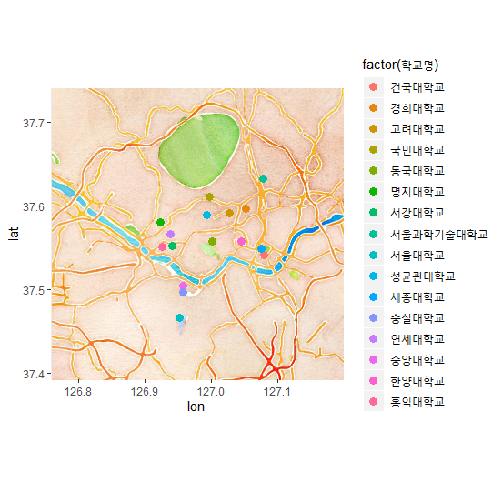


```{r}
kor.map <- ggmap(kor)+geom_point(data=university, aes(x=LON, y=LAT,color=factor(학교명)),size=3)

# -- 레이어3 : 지도위에 텍스트 추가
kor.map + 
	geom_text(data = university, 
              aes(x = LON+0.01, y=LAT+0.01, label=학교명),
              size=5)
                      # LAT+0.01 : 텍스트 위치(포인트의 0.01 위쪽)
                      # geom_text : 텍스트 추가
```

**결과 :**

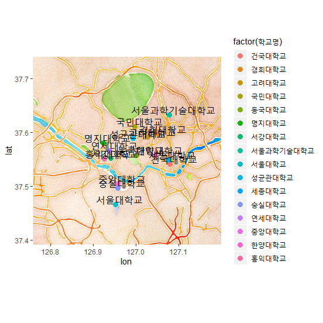

```{r}
# -- 지도 저장
#    넓이, 폭 적용 파일 저장
ggsave("C:/temp/university1.png", width=10.24, height=7.68)

# -- 밀도 적용 파일 저장
ggsave("C:/temp/university2.png", dpi=1000) # 9.21 x 7.68 in image

setwd("C:/Temp")
list.files(pattern = "*.png")
```

**결과 :**

```
## [1] "university1.png" "university2.png"
```


```{r}
# --------------------------------------------
# ggmap 패키지 관련 <공간시각화 실습>
# --------------------------------------------
# -- 2015년도 06월 기준 대한민국 인구수
pop <- read.csv(file.choose(),header=T)
pop

region <- pop$지역명  
lon <- pop$LON                                                   # 위도
lat <- pop$LAT                                                   # 경도
house <- pop$세대수

# -- 위도,경도,세대수 이용 데이터프레임 생성
df <- data.frame(region, lon,lat,house)
df

# -- 지도정보 생성
#    map1 <- get_map("daegu", zoom=7 ,  maptype='watercolor')
map1 <- get_map("daegu", zoom=7 ,  maptype='roadmap')

# -- 레이어1: 지도 플로팅
map2 <- ggmap(map1)
map2
```

**결과 :**

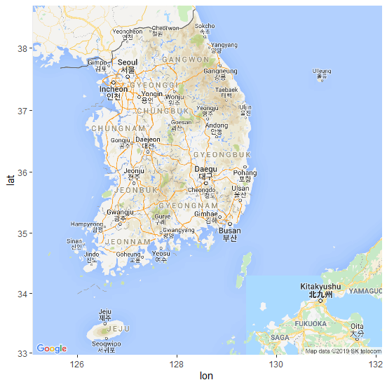


```{r}
# -- 레이어2 : 포인트 추가
map2 + 
	geom_point(aes(x=lon, y=lat, colour=house, size=house),
               data=df)
```

**결과 :**

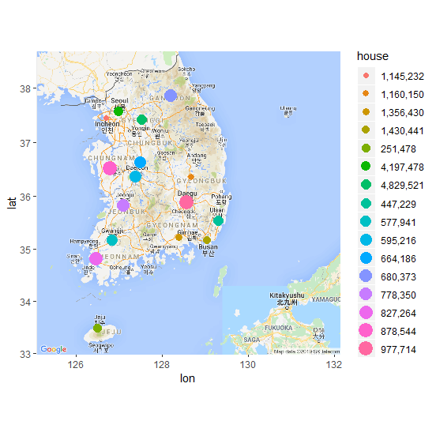

```{r}
map3 <- map2 + 
		geom_point(aes(x=lon,y=lat,colour=house,size=house),
                   data=df)

# -- 레이어3 : 텍스트 추가
map3 + 
		geom_text(data=df, 
                  aes(x=lon+0.01, y=lat+0.18,label=region),
                  size=3)
```

**결과 :**

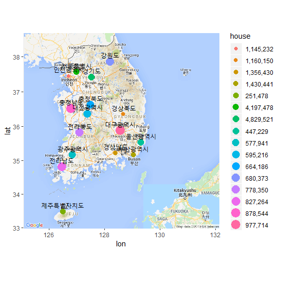

```{r}
# -- 크기, 넓이, 폭 적용 파일 저장
ggsave("C:/Temp/population201506.png",scale=1,width=10.24,height=7.68)

list.files(pattern = "*.png")
```

**결과 :**

```
## [1] "population201506.png" "university1.png"      "university2.png" 
```


```{r}
# ********************************************
# -- 다양한 지도 유형
# ********************************************

# -- maptype='terrain'
map1 <- get_map("daegu", zoom=7 ,  maptype='terrain')
map2 <- ggmap(map1)
map3 <- map2 + 
			geom_point(aes(x=lon, y=lat, colour=house, size=house),
                       data=df)
map3 + 
		geom_text(data=df, 
                  aes(x=lon+0.01, y=lat+0.18,label=region),
                  size=3)
```

**결과 :**

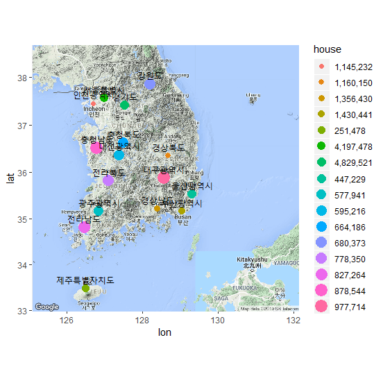

```{r}
# -- maptype='satellite'
map1 <- get_map("daegu", zoom=7 ,  maptype='satellite')
map2 <- ggmap(map1)
map3 <- map2 + 
		geom_point(aes(x=lon, y=lat, colour=house,  size=house),
                   data=df)
map3 + 
		geom_text(data=df, 
                  aes(x=lon+0.01,y=lat+0.18,colour=region,label=region),
                  size=3)
```

**결과 :**

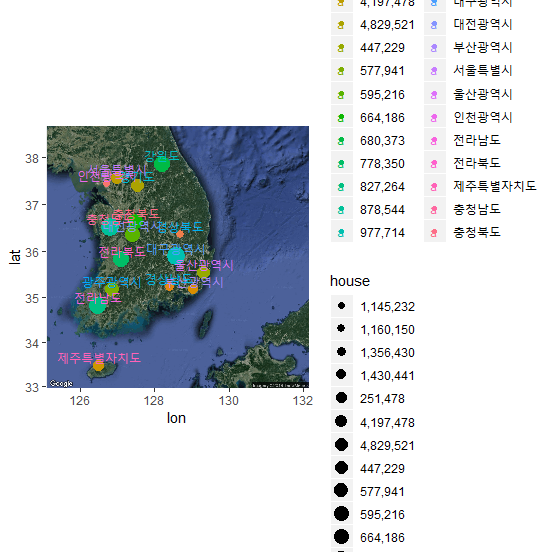

```{r}
# -- maptype='roadmap'
map1 <- get_map("daegu", zoom=7 ,  maptype='roadmap')
map2 <- ggmap(map1)
map3 <- map2 + 
			geom_point(aes(x=lon, y=lat, colour=house, size=house),
                       data=df)
map3 + 
		geom_text(data=df, 
                  aes(x=lon+0.01, y=lat+0.18,label=region),
                  size=3)
```

**결과 :**


```{r}
# -- maptype='hybrid'
map1 <- get_map("jeonju", zoom=7,  maptype='hybrid')
map2 <- ggmap(map1)
map3 <- map2 + 
		geom_point(aes(x=lon, y=lat, colour=house, size=house),
                   data=df)
map3 + 
		geom_text(data=df, 
                  aes(x=lon+0.01, y=lat+0.18,label=region),
                  size=3)     
```

**결과 :**

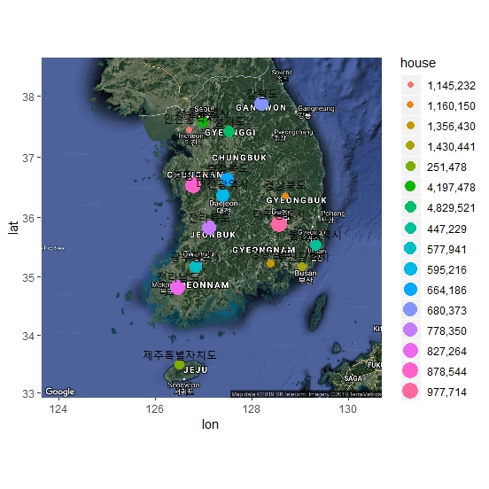

```{r}
map3 + geom_density2d() 
```

**결과 :**


  

------

 [](source/ch_7_using_ggmap_01.R)  [](pdf/ch_7_using_ggmap_01.pdf) 

------

[](ch_7_using_ggmap_00.html)    [](index.html)    [](ch_7_using_ggmap_02.html)

