## 제7장 ggmap 패키지 실습 (02)


[TOC]

### R을 이용해서 구글 지도 활용하기

 

R를 GIS에 활용할 수 있게 해주는 가장 손쉬운 패키지가 ggmap이다.

ggmap 패키지는 R에서 시각화 대표 주자로 꼽히는[ ggplot2](http://ggplot2.org/) 패키지를 활용한다.

ggplot2는 정말 인기가 많고 기능도 뛰어난 시각화 도구이다.

[이 패키지를 설명한 책](http://www.cookbook-r.com/Graphs/)이 따로 있을 정도니까

처음 배울 때 시간과 노력이 필요한 '러닝 커브'를 무시할 수는 없습니다.

 

```{r}
# 패키지를 설치하는 함수 : install.packages()
# 패키지를 불러오는 함수 : library()

install.packages("ggplot2")
install.packages("ggmap")

library(ggmap) # ggplot2 패키지도 함께 불러온다.
library(ggplot2)

register_google(key = "Google API Key")    # 구글 API 인증

# 1. 한국 지도 그리기.
ggmap(get_map(location='south korea', zoom=7))
ggmap(get_googlemap(location='South Korea', zoom=7))
```

**결과 :**

 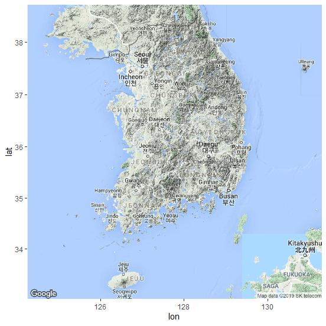

**<의미>**

- ggmap() 함수 : ggplot 기능을 활용해 지도를 그리라는 뜻


- get_map(location='south korea', zoom=7) : get_map은 지도 정보를 가져오는 함수
  - location = 'south korea' : 위치(location) 지도 정보를
  - zoom = 7 : 지도의  배율(zoom) , (zoom은 3부터 21까지 지정가능, 숫자가 작을수록 넓은 지역)


get_map() 함수의 도움말을 보고 싶으면, R Console에서 **?get_map()**을 입력한다.

http://127.0.0.1:26863/library/ggmap/html/get_map.html


####  (연습) zoom의 값을 3과 21로 해서 각각 지도를 그려본다.

```{r}
ggmap(get_map(location='South Korea', zoom=3))
```

**결과 :**

 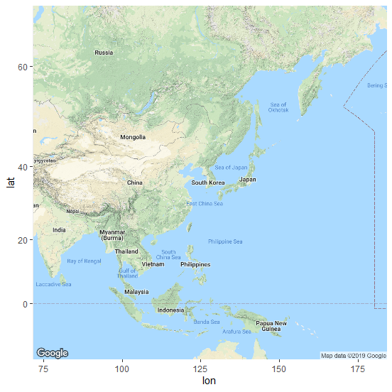

```{r}
ggmap(get_map(location='South Korea', zoom=21))
```

**결과 :**

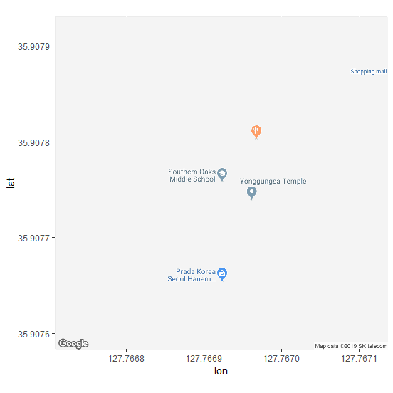

- **위도(latitude)**는 적도를 중심으로 얼마나 남/북쪽에 있는지를, 그리고 **경도(longitudinal)**는 영국의 그리니치 천문대를 기준으로 동/서쪽으로 어디에 있는지를 나타난다.

 

```{r}
myLocation <- c(lon=128.25, lat=35.95)
ggmap(get_map(location=myLocation, zoom=7))
```

**결과 :**

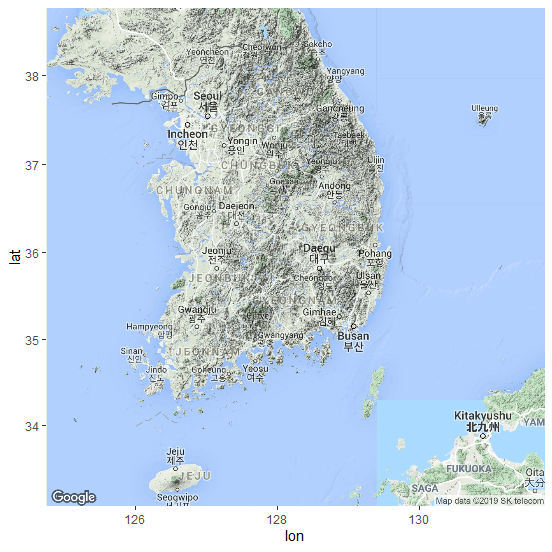

`get_map()` 함수는 `google` (지형·terrain) 지도를 가져오는 게 기본.

> source 속성 : c("google", "osm", "stamen", "cloudmade")
>
> - 스타멘(stamen) 디자인에서 만든 지도하고 (오픈 소스 지도 서비스),
>
> - 오픈스트리트맵(osm·Open Street Map)도
>
> - cloudmade 등을 가져올 수 있다.

 

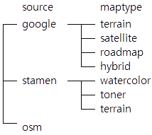

 

```{r}
map <- get_map(location='South Korea', zoom=7, source='google', maptype='terrain')
ggmap(map)
```

**결과 :**


```{r}
map <- get_map(location='South Korea', zoom=7, source='stamen', maptype='watercolor')
ggmap(map)
```

**결과 :**

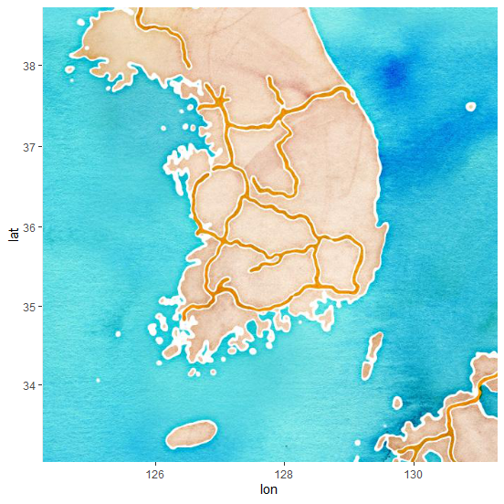

- 여기서 source와 maptype을 조합하면 지도를 총 8가지 디자인으로 그릴 수 있다.

- 그리고, 이 디자인 8개 모두 color='bw'를 추가해 흑백으로 바꿔 그릴 수 있다.

- 디자인이 총 16개 들어 있는 셈이다.

  

```{r}
map <- get_map(location='South Korea', zoom=7, source='osm')
ggmap(map)
```

**결과 :**

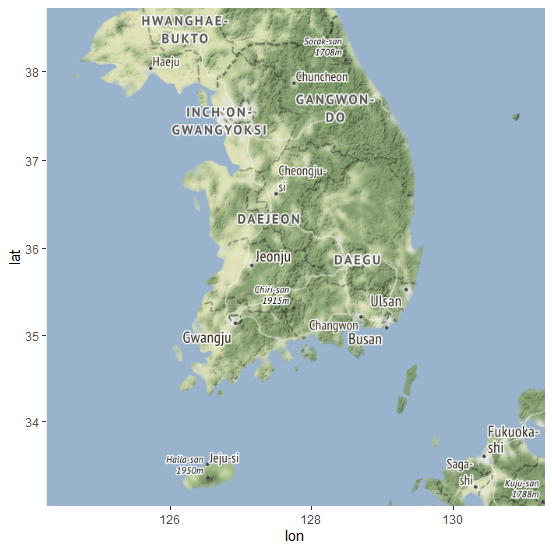


## Wifi 지도 그리기


#### (1) 바탕지도 그리기

 ```{r}
# 구글에서 흑백 도로(roadmap) 지도정보를 받아와서, map이라는 변수에 넣으라는 명령어
map <- get_map(location='South Korea', zoom=7, maptype='roadmap', color='bw')
ggmap(map)
 ```

**결과 :**

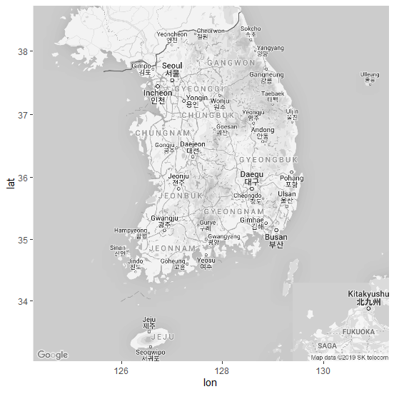

#### (2) 지도 위에 점 찍기

```{r}
# [데이터] 공공 와이파이(WiFi) 위치 표시 (WiFi.csv 파일)
# * '한국통신사업자연합회(KTOA)'에서
# 공공 와이파이 위치 정도를 담은 마이크로소프트(MS) 엑셀 파일(.xls)을 공개
wifi <- read.csv(file.choose(), header=T, as.is=T)
wifi <- subset(wifi, wifi$서비스제공사명 == c("KT", "SKT", "LGU+"))

str(wifi)
```

- `wifi <- subset(wifi, wifi$서비스제공사명 == c("KT", "SKT", "LGU+")`

  => 서비스제공사를 KT, SKT, LGU+ 3개 사로 제한해 본다.

**결과 :**

```
## 'data.frame':   5454 obs. of  18 variables:
##  $ 설치장소명      : chr  "의령군노인복지관" "신반시장" "의령군청소년수련관" "소망의집" ...
##  $ 설치장소상세    : chr  "1층" "신반시장" "1층" "1층" ...
##  $ 설치시도명      : chr  "경상남도" "경상남도" "경상남도" "경상남도" ...
##  $ 설치시군구명    : chr  "의령군" "의령군" "의령군" "의령군" ...
##  $ 설치시설구분    : chr  "서민·복지시설" "기타" "교육시설" "서민·복지시설" ...
##  $ 서비스제공사명  : chr  "SKT" "LGU+" "SKT" "SKT" ...
##  $ 와이파이SSID    : chr  "Public WiFi Free" "Public WiFi Free" "Public WiFi Free" "Public WiFi Free" ...
##  $ 설치년월        : chr  "2014-12" "2014-01" "2014-12" "2014-12" ...
##  $ 소재지도로명주소: chr  "경상남도 의령군 의령읍 의병로 8길 16" "경상남도 의령군 부림면 신번로9길" "경상남도 의령군 부림면 신번로 11길 26" "경상남도 의령군 가례면 가례로 667-7" ...
##  $ 소재지지번주소  : chr  "경상남도 의령군 의령읍 서동리 534" "경상남도 의령군 부림면 신반리 562" "경상남도 의령군 부림면 신반리 1071" "경상남도 의령군 가례면 개승리 143-1" ...
##  $ 관리기관명      : chr  "의령군" "의령군" "의령군" "의령군" ...
##  $ 관리기관전화번호: chr  "055-570-2780" "055-570-2780" "055-570-2780" "055-570-2780" ...
##  $ 위도            : num  35.3 35.5 35.5 35.4 36 ...
##  $ 경도            : num  128 128 128 128 128 ...
##  $ 데이터기준일자  : chr  "2018-08-06" "2018-08-06" "2018-08-06" "2018-08-06" ...
##  $ 제공기관코드    : chr  "5390000" "5390000" "5390000" "5390000" ...
##  $ 제공기관명      : chr  "경상남도 의령군" "경상남도 의령군" "경상남도 의령군" "경상남도 의령군" ...
##  $ X               : logi  NA NA NA NA NA NA ...
```

- wifi : `서비스제공사명`, `위도`, `경도` 등의 세 컬럼의 데이터


```{r}
ggmap(map) +
	geom_point( data = wifi,
				aes(x = 경도, y = 위도, color = 서비스제공사명 )
)
```

**코드 설명 :**

`geom_point()`로 레이어(점 그래프)를 한 장 더 그리는 것.

**인수 :** 

- **data = wifi** : 사용될 데이터로 wifi 지정.
- **aes** : aesthetic(美的인)에서 따온 말. aes 어떤 자료를 어떻게 쓰면 된다고 알려주는 기능.
  - (위치) `x = 경도` : 지도의 x 축 
  - (위치) `y = 위도` : 지도의 y 축
  - `color =서비스제공사명` => 서비스제공사별로 색 (KT, SKT, LGU+ 등 3사)

**결과 :**

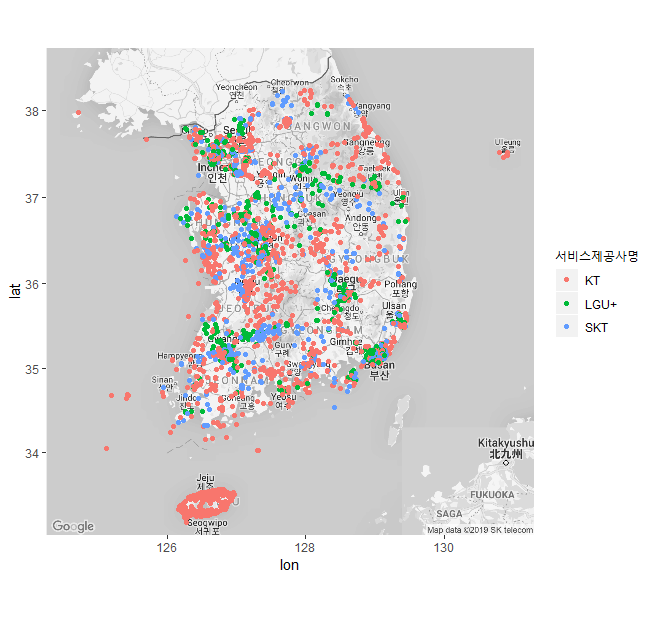

`ggplot2` 패키지는 `ggplot()` 함수를 바탕으로 여러 레이어(layer)를 겹치는 방식으로 작동.

원래 `ggplot()`이 들어가야 할 자리에 `ggmap()`이 대신 들어간 것.

===> 이 명령어는 일단 맨 밑에 지도를 한 장 깔고, 그 위에 점 그래프를 그린다.


#### (3) 2차원 밀도(2D Density) 보여주기

 ```{r}
# stat_density_2d() 함수를 활용
ggmap(map) +                                # 기본 지도
stat_density_2d(data = wifi, 
                aes(x = 경도, y = 위도))      # 2D Density 겹치기
 ```

`stat_density_2d()` 함수

**인수 :**

- `data =` : 사용될 데이터
- `aes()` : aes 요소
  - `x =` : x 축의 값. 경도(longitudinal)
  - `y =` : y 축의 값. 위도(latitude)
  - `fill =` : 색깔로 채우라는 뜻. `..level..`은 레벨(level)이 높을수록, 그러니까 앞서 예를 든 것처럼 기압이 높거나 고도가 높을수록 더 진한 색깔을 칠하라는 뜻
  - `alpha = `  : 투명도. `..level..` 역시 같은 원리로 레벨이 높으면 불투명하게(색이 더 잘 드러나게) 칠하고 낮을 때는 투명하게(희미하게) 칠하라는 의미
- `geom='polygon'` : `polygon`은 다각형이라는 뜻. 기본값은 선으로 도형(polygon)으로 그리라는 명령.
- `size = 2` : 선의 굵기
- `bins = 30` : 선의 간격 

**주의 :** 이러한 옵션들에 대한 자세한 사항은 [**ggplot2**의 치트 시트 참조**](http://ggplot2.tidyverse.org/reference/geom_density_2d.html) 하기 바람.

**결과 :**


- 날씨 예보에서 기압선을 그리는 모양
- 높이가 같은 점을 이은 등고선처럼 보이기도 하함.

- 그냥 점을 찍었을 때보다 서울과 광역시 중심으로 공공 와이파이가 많다는 게 확인됨.


#### (4) 2차원 밀도(2D Density) 모양 바꾸기

```{}
ggmap(map) + 
stat_density_2d(data = wifi, 
                aes(x = 경도, y = 위도, fill=..level.., alpha=..level..),
                geom='polygon',
                size=2, 
                bins=30)
```

결과 :

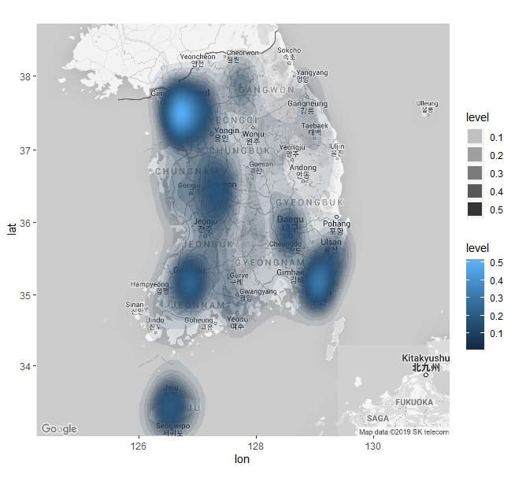

ggplot()은 레이어를 겹치는 방식이기 때문에 그래프를 변수에 넣어두면 편리하다.

```{r}
p2d <- ggmap(map) + 
       stat_density_2d(data=wifi, 
                       aes(x=lon, y=lat, fill=..level.., alpha=..level..),
                       geom='polygon', 
                       size=7, 
                       bins=28)
p2d      # 또는 print(p2d)
```

  **결과 :**

 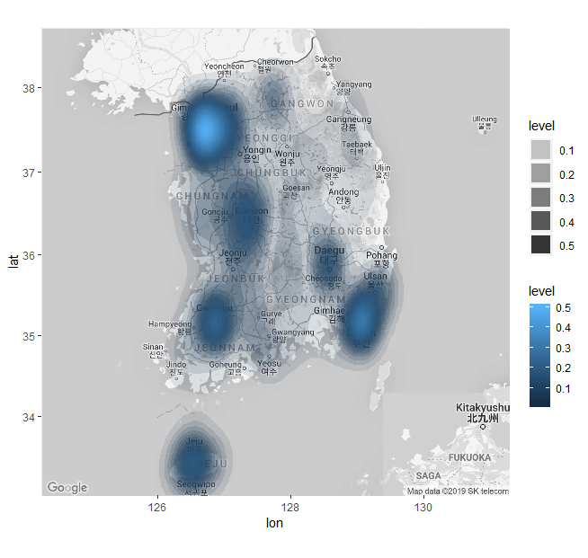

#### (5) 2차원 밀도(2D Density)의 색깔 바꾸기

```{r}
# 밀도를 나타내는 색깔을 바꿔 보기
# 범위에 따라 단계적으로 색깔이 변하게 하는 함수 : scale_fill_gradient()
p_grad <- p2d + scale_fill_gradient(low='yellow', high='red')
p_grad 
```

`scale_fill_gradient( )` 함수 

**인수 :** 

- `low='yellow'` : 낮은 값은 노란색(yellow)
- `high='red'` : 높은 값은 빨간색(red)

**결과 :**


#### (6) 2차원 밀도(2D Density) 투명도 조절

```{r}
# ------
# 투명도 조절
p_alpha <- p2d +
scale_fill_gradient(low='yellow', high='red', guide=F) +
scale_alpha(range=c(0.02, 0.8), guide=F)
p_alpha
```

`scale_alpha( )` 함수 이용

**인수 :**

- `range=c(0.02, 0.8)` : 투명도의 범위(range). 레벨에 따라 2%에서 80%까지 투명도를 알아서 조절하라는 뜻
- `guide=F` : F는 FALSE, 그러니까 **범례**를 표시하지 말라는 명령어

 **결과 :**


## 국내 항공 노선 그리기


#### (1) 데이터 세트

- **[airport.csv](data/airport.csv) :** 한국에 있는 공항 위치(경도, 위도)
- **[route.csv](data/route.csv) :** 공항을 연결하는 국내선 비행노선


```{r}
airport <- read.csv(file.choose(), header=T, as.is=T) # airport.csv 파일 불러오기
route <- read.csv(file.choose(), header=T, as.is=T) # route.csv 파일 불러오기

head(airport) # airport, iata, lon, lat 등의 4개 열로 구성
head(route) # id, airport, lon, lat 등의 4개 열로 구성

# IATA : 국제항공운송협회(The International Air Transport Association) 약자
# 이 협회는 전 세계 공항에 코드를 부여하고 있는데 그 정보가 airport$iata
```

**결과 :**

```
> head(airport) # airport, iata, lon, lat 등의 4개 열로 구성
##   airport iata     lon     lat
## 1    강릉  KAG 128.944 37.7536
## 2    광주  KWJ 126.809 35.1264
## 3    군산  KUV 126.616 35.9038
## 4    김포  GMP 126.791 37.5583
## 5    대구  TAE 128.659 35.8941
## 6    목포  MPK 126.380 34.7589
> head(route) # id, airport, lon, lat 등의 4개 열로 구성
##   id airport     lon     lat
## 1  1     CJJ 127.499 36.7166
## 2  7     CJJ 127.499 36.7166
## 3 45     CJJ 127.499 36.7166
## 4 77     CJJ 127.499 36.7166
## 5  2     CJJ 127.499 36.7166
## 6  8     CJJ 127.499 36.7166
```


#### (2) 공항에 점찍기

```{r}
# 변수 map은 ‘South Korea’ 지도
# ggmap(map) : 한국지도
g_airport <- ggmap(map) + 
             geom_point(data=airport, 
                        aes(x=lon, y=lat))
g_airport
```

`geom_point()` 함수 이용

**결과 :**


#### (3) 그리고 두 공항 간의 노선을 선으로 그리기 : geom_line()

 ```{r}
#-------
# geocode() 함수
# ggmap 패키지에는 geocode라는 함수가 들어 있다.
# 이 함수는 특정 장소 위도, 경도값을 찾아주는 기능을 한다.
# 인천공항과 김포공항의 위도, 경도 알아 보기
geocode(c('incheon airport', 'gimpo airport'))
 ```

**결과 :**

```
## # A tibble: 2 x 2
##     lon   lat
##   <dbl> <dbl>
## 1  126.  37.5
## 2  127.  37.6
```


```{r}
p_point <- ggmap(map) + 
           geom_point(data=airport, aes(x=lon, y=lat))
p_line <- p_point + 
          geom_line(data=route, aes(x=lon, y=lat, group=id))
p_line
```

`geom_line( )` 함수 이용

**인수 : **

- data = : 사용할 데이터 지정

- aes( ) : 

  - `x =` : x 축의 변수 지정 (경도, `lon`)

  - `y =` : y 축의 변수 지정 (위도, `lat`)

  - `group =` : 점과 점을 잇는 선의 기준. `id`

    : id 순서대로 자료를 뽑아 보면 1번 id는 '제주공항'과 '청주공항'을 이어주는 노선

**결과 :**


**[ [R Source](source/ch_7_using_ggmap_02.R) ]**