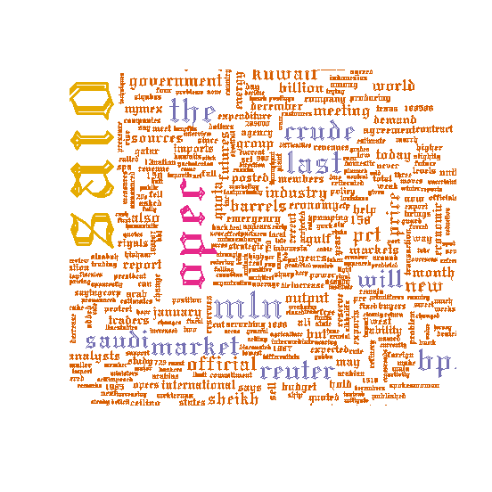

## 제8장 (연습) 워드클라우드


[TOC]

#### 예제 1

```{r}
library(wordcloud)

wordcloud(c(letters, LETTERS, 0:9), seq(1, 1000, len = 62))
```

결과 :


#### 예제 2 

```{r}
## crude 데이터 세트를 이용한 워드 클라우드 ##
library(tm)
data(crude)

crude <- tm_map(crude, removePunctuation)
crude <- tm_map(crude, function(x)removeWords(x,stopwords()))

##### 			from corpus 		#####
wordcloud(crude)	
```

결과 :


#### 예제 3

```{r}
##### 		from frequency counts 	      #####
tdm <- TermDocumentMatrix(crude)
m <- as.matrix(tdm)
v <- sort(rowSums(m),decreasing=TRUE)
d <- data.frame(word = names(v),freq=v)

wordcloud(d$word,d$freq)
```

결과 :


#### 예제 4

```{r}
# A bigger cloud with a minimum frequency of 2
wordcloud(d$word,d$freq,c(8,.3),2)
```

결과 : 


#### 예제 5

```{r}
# Now lets try it with frequent words plotted first
wordcloud(d$word,d$freq,c(8,.5),2,,FALSE,.1)
```

결과 : 


#### 예제 6

```{r}
#####                   color 추가               ######

pal <- brewer.pal(9,"BuGn")
pal <- pal[-(1:4)]
wordcloud(d$word,d$freq,c(8,.3),2,,FALSE,,.15,pal)
```

결과 :


#### 예제 7

```{r}
pal <- brewer.pal(6,"Dark2")
pal <- pal[-(1)]
wordcloud(d$word,d$freq,c(8,.3),2,,TRUE,,.15,pal)
```

결과 :


#### 예제 8

```{r}
# random colors
wordcloud(d$word,d$freq,c(8,.3),2,,TRUE,TRUE,.15,pal)
```

결과 :


#### 예제 9

```{r}
##### 			with font 			#####
wordcloud(d$word,d$freq,c(8,.3),2,,TRUE,,.15,pal,
          vfont=c("gothic english","plain"))
```

결과 :



#### 예제 10

```{r}
wordcloud(d$word,d$freq,c(8,.3),2,100,TRUE,,.15,pal,vfont=c("script","plain"))
```

결과 :


#### 예제 11

```{r}
wordcloud(d$word,d$freq,c(8,.3),2,100,TRUE,,.15,pal,vfont=c("serif","plain"))
```

결과 :


**[ [R Source](source/ch_8_Example_of_Wordcloud.R) ]**


------

  


\