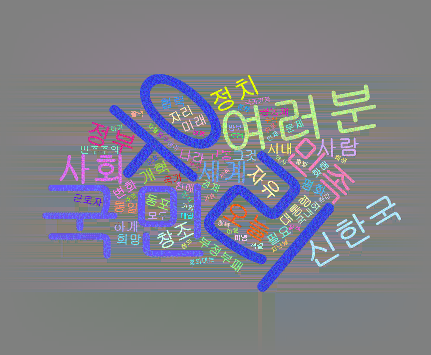
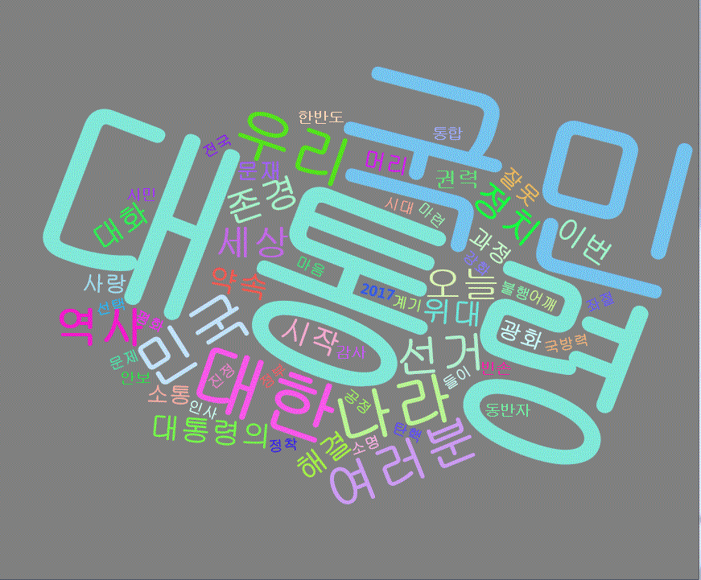

## 제8장 워드클라우드 : wordcloud2()

```{r}
# ch_8_wordcloud2

# wordcloud2() 를 이용한 워드 클라우드
# http://magician-of-c.tistory.com/m/22?category=249901

library(KoNLP)
useSejongDic()

# R에서 제공하는 wordcloud 패키지가 있지만 wordcloud를 사용해서 만든 워드클라우드보다 
# wordcloud2를 이용해서 만든 wordcloud가 개인적으로는 좀더 가독성이 있다고 생각하기 때문에 
# wordcloud2를 설치하기로 하였다. 

# wordcloud2는 devtools를 통해서 설치해야하므로 
# 우선적으로 devtools 패키지를 다운 받은 후 wordcloud2 패키지를 다운받고 호출한다.

install.packages("devtools")
devtools::install_github("lchiffon/wordcloud2")
library(wordcloud2)

doc <- readLines(file.choose())       # 텍스트 파일을 읽어 온다.

# SimplePos09() 함수는 문서에 존재하는 단어들을 카이스트에서 제작한 태그를 붙여서 
# 어떠한 품사인지 확인할 수 있게 해주는 함수이다.

word <- SimplePos09(doc)

# SimplePos09() 를 사용하게 되면 단어는 크게 S, F, N, P, M, I, J, E, X 
# 총 9가지 형태로 분석된다. 

# 만약 문장을 조금더 세부적으로 분석하고 싶다면 SimplePos22() 함수를 사용하면 되고, 
# 만약 이보다 더 세부적으로 분석하고 싶다면 MorphAnalyzer() 함수를 사용하면 된다.

# SimplePos22()를 사용하면 단어는 29가지 형태로 분석되고, 
# MorphAnalyzer()를 사용하면 그림의 맨 오른쪽의 형태들로 분석된다.

# 형태가 분석된 각 문장에서의 단어들 중에서 N(체언), P(용언), M(수식언)의 형태만 저장하기

library(stringr)

extracted <- str_match(word, '([가-？]+)/[NPM]')
extracted

# str_match() 함수는 단어가 어떠한 형태를 만족하는지 검사해주는 함수이다. 
# 이 함수는 stringr 패키지 안에 속해있는 함수이므로 
# stringr 패키지를 호출해 준뒤 함수를 사용한다.
# 위에서의 명령어를 풀이하면 한글로된 단어들 중 
# 뒤의 태그가 N 또는 P 또는 M인 단어들을 찾으라는 뜻이다.

# 태그가 달린 불필요한 데이터와 비어있는 데이터 없애기

keyword <- extracted[,2]
nouns <- keyword[!is.na(keyword)]

# 첫번째 명령어는 (5)번에서 얻은 extracted라는 데이터에서 
# 1번열의 태그가 붙어있는 단어 데이터를 빼고 2열의 단어 데이터들만 따로 저장해주는 명령어이다.
# 두번째 명령어는 바로 위에서 따로 저장한 단어 데이터들중 
# 비어있는 데이터가 있으면 없애는 명령어이다.

# 사전에 단어 추가 및 추출된 명사의 삭제
mergeUserDic(data.frame(c("정치"), c("ncn")))

nouns <- sapply(doc, extractNoun, USE.NAMES=F)
nouns <- unlist(nouns)


nouns <- gsub("그러나", "", nouns)
nouns <- gsub("그리고", "", nouns)
nouns <- gsub("이것", "", nouns)
nouns <- gsub("이제", "", nouns)


# 단어들 중에 1글자의 단어는 제외하기
nouns <- Filter(function(x){nchar(x)>1}, nouns)

# 위의 unlist 명령어는 저장되어 있는 단어들의 리스트 구조를 해재시키는 명령어이다.

# 다음 명령어는 함수 기능을 사용하여 단어의 글자수를 확인하여
# 1개 초과 즉 2개의 단어부터 다시 저장을 하는 명령어이다.

# 단어들을 테이블의 형태로 바꾸어 저장하면서 중복된 단어를 합쳐서 개수를 확인하기
wordcount <- table(nouns)

# table() 함수는 데이터를 테이블의 형태로 바꾸어줌과 동시에 같은 값을 가진 데이터들을 
# 하나로 합치고 개수를 파악해주는 함수이다.

# 단어들 중 1번만 사용된 단어는 제외하고 나머지 단어만 저장하기
wordorder <- order(wordcount, decreasing = T)

for (i in 1:length(wordorder)){
	if(wordcount[wordorder[i]]==1){
		break
	}
}

freqwords <- wordcount[wordorder[1:i-1]]
wordorder

# order() 함수는 데이터를 나열해주는 함수이다. 
# 안의 decreasing이 참으로 되어있으므로 값이 큰 수부터 나열을 해준다.

# wordorder에 저장된 값은 단어 데이터가 아닌 index 데이터이다. 
# 즉 wordorder의 제일 처음 값인 6은 wordcount에서 6번째의 값이 가장 개수가 크다는 의미이다.

# 아래의 조건문에서 wordorder의 값을 집어넣은 wordcount 값이 1인 경우부터는 
# 데이터를 제외하기 위해서 값이 1이 시작되는 i 값을 구한뒤 
# wordcount[wordorder[1:i-1]]을 사용하여 첫번째 원소부터 i-1번째 원소까지만 
# 따로 저장을 해준다.
freqwords

# word Cloud 만들기
wc <- wordcloud2(data=freqwords, size = 1.5, color = "random-light", backgroundColor = "grey", rotateRatio = 0.75)
wc

# wordcloud2() 함수는 우리의 최종적인 결과물인 워드 클라우드를 만들어주는 함수이다.
# wordcloud2() 함수는 기본적으로 data 값만 넣어주면 
# 나머지 다른 값들은 기본적으로 디폴트값이 세팅되어 있다.
# 하지만 원하는 디자인, 글자색, 폰트, 배경색 등 따로 원하는 값을 설정해 주면
# 가독성 좋은 워드 클라우드가 생성될 것이다.
# 만약 자동적으로 R Studio의 우측 하단에 있는 Viewer 에서 아래와 같은 그림이 보이지 않는다면 
# console 항에 wc를 입력한 후 엔터를 치면 보일것이다.
```


**# 웹 브라우저가 열리면서 워드클라우드가 출력된다**.

\# 1>  **[speech.txt](data/speech.txt)**의 결과




\# 2>  [**moon.txt**](data/moon.txt)의 결과




------

 [](source/ch_8_wordcloud2.R)  [](pdf/ch_8_wordcloud2.pdf) 

------

[](ch_8_Example_of_Wordcloud.html)    [](index.html)    [](ch_8_solution.html)

