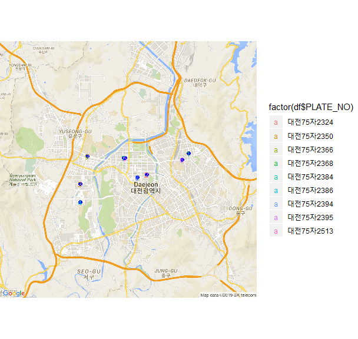

## 제9장 대전시 버스노선 및 버스위치 구글지도에 표시하기

[TOC]

##### 단계 1 : 버스노선 정보 검색하기

```{r}
# data.go.kr 에서   
# 1) 대전광역시 노선정보조회 서비스와 
# 2) 버스위치정보 조회 서비스 활용신청을 한다.

#===============================================
# 대전광역시 노선별 기본정보 조회 
#===============================================
install.packages("XML")
install.packages("ggmap")

library(XML)
library(ggmap)

#===============================================
# 노선번호로 노선ID 찾기 모듈 필요 (작업 중)  (예, 706번 노선번호의 노선ID 찾기)
#===============================================

busRtNm <- "706"                          # 원하는 버스번호
API_key <- "각자의 API Key 입력"            # data.go.kr   마이페이지/인증키발급현황

url <- paste("http://openapitraffic.daejeon.go.kr/api/rest/busRouteInfo/getRouteInfoAll?serviceKey=", API_key, "&reqPage=1", sep="")
xmefile <- xmlParse(url)
xmlRoot(xmefile)
```

**코드 설명 :**

1) url <- `paste()` : 

- API url : http://openapitraffic.daejeon.go.kr/api/rest/busRouteInfo/getRouteInfoAll => 버스노선정보 검색 url. 
- ? : API의 인수 연결
- serviceKey = : (API의 첫번째 인수) 공공데이터 API Key
- & : 추가적인 인수의 연결
- reqPage=1 : (API의 두번쨰 인수) 버스노선정보 이용자매뉴얼 참고
- sep="" : 위의 `paste()` 인수들을 공란없이 모든 붙임.

2) xmefile <- xmlParse(url) : `url`에 해당하는 사이트에서 정보를 가져와(`xmlParse()`), 변수 `xmefile`에 저장하기. 

3) xmlRoot(xmefile) :`xmefile`의 내용출력하기(`xmlRoot()`)

결과 :

```
## <ServiceResult>
##   <comMsgHeader/>
##   <msgHeader>
##     <currentPage>1</currentPage>
##     <headerCd>0</headerCd>
##     <headerMsg>정상적으로 처리되었습니다.</headerMsg>
##     <itemCnt>120</itemCnt>
##     <itemPageCnt>2</itemPageCnt>
##   </msgHeader>
##   <msgBody>
##     <itemList>
##       <ALLO_INTERVAL>30</ALLO_INTERVAL>
##       <ALLO_INTERVAL_SAT>30</ALLO_INTERVAL_SAT>
##       <ALLO_INTERVAL_SUN>30</ALLO_INTERVAL_SUN>
##       <BUSSTOP_CNT>104</BUSSTOP_CNT>
##       <END_NODE_ID>8002737</END_NODE_ID>
##       <END_STOP_ID>42750</END_STOP_ID>
##       <ORIGIN_END>2230</ORIGIN_END>
##       <ORIGIN_END_SAT>2230</ORIGIN_END_SAT>
##       <ORIGIN_END_SUN>2230</ORIGIN_END_SUN>
##       <ORIGIN_START>0600</ORIGIN_START>
##       <ORIGIN_START_SAT>0600</ORIGIN_START_SAT>
##       <ORIGIN_START_SUN>0630</ORIGIN_START_SUN>
##       <ROUTE_CD>30300001</ROUTE_CD>
##       <ROUTE_NO>1</ROUTE_NO>
##       <ROUTE_TP>5  </ROUTE_TP>
##       <RUN_DIST_HALF>23.907</RUN_DIST_HALF>
##       <RUN_TM>70    </RUN_TM>
##       <START_NODE_ID>8002736</START_NODE_ID>
##       <START_STOP_ID>42740</START_STOP_ID>
##       <TURN_END>2220</TURN_END>
##       <TURN_END_SAT>2220</TURN_END_SAT>
##       <TURN_END_SUN>2205</TURN_END_SUN>
##       <TURN_NODE_ID>8007228</TURN_NODE_ID>
##       <TURN_START>0600</TURN_START>
##       <TURN_START_SAT>0600</TURN_START_SAT>
##       <TURN_START_SUN>0630</TURN_START_SUN>
##       <TURN_STOP_ID>82370</TURN_STOP_ID>
##     </itemList>
## <ServiceResult>
## <comMsgHeader/>
##   <msgHeader>
##     <currentPage>1</currentPage>
##     <headerCd>0</headerCd>
##     <headerMsg>정상적으로 처리되었습니다.</headerMsg>
##     <itemCnt>120</itemCnt>
##     <itemPageCnt>2</itemPageCnt>
##   </msgHeader>
##   <msgBody>
##     <itemList>
##       <ALLO_INTERVAL>30</ALLO_INTERVAL>
##       <ALLO_INTERVAL_SAT>30</ALLO_INTERVAL_SAT>
##       <ALLO_INTERVAL_SUN>30</ALLO_INTERVAL_SUN>
##       <BUSSTOP_CNT>104</BUSSTOP_CNT>
##       <END_NODE_ID>8002737</END_NODE_ID>
##       <END_STOP_ID>42750</END_STOP_ID>
##       <ORIGIN_END>2230</ORIGIN_END>
##       <ORIGIN_END_SAT>2230</ORIGIN_END_SAT>
##       <ORIGIN_END_SUN>2230</ORIGIN_END_SUN>
##       <ORIGIN_START>0600</ORIGIN_START>
##       <ORIGIN_START_SAT>0600</ORIGIN_START_SAT>
##       <ORIGIN_START_SUN>0630</ORIGIN_START_SUN>
##       <ROUTE_CD>30300001</ROUTE_CD>
##       <ROUTE_NO>1</ROUTE_NO>
##       <ROUTE_TP>5  </ROUTE_TP>
##       <RUN_DIST_HALF>23.907</RUN_DIST_HALF>
##       <RUN_TM>70    </RUN_TM>
##       <START_NODE_ID>8002736</START_NODE_ID>
##       <START_STOP_ID>42740</START_STOP_ID>
##       <TURN_END>2220</TURN_END>
##       <TURN_END_SAT>2220</TURN_END_SAT>
##       <TURN_END_SUN>2205</TURN_END_SUN>
##       <TURN_NODE_ID>8007228</TURN_NODE_ID>
##       <TURN_START>0600</TURN_START>
##       <TURN_START_SAT>0600</TURN_START_SAT>
##       <TURN_START_SUN>0630</TURN_START_SUN>
##       <TURN_STOP_ID>82370</TURN_STOP_ID>
##     </itemList>
##     ...
```


##### 단계 2 : 노선번호에 대한 ''노선 ID' 확인

###### 1) 버스노선 정보(`xmefile`)를 데이터 프레임 타입의 `df`변수로 변환

```{r}
df <- xmlToDataFrame(getNodeSet(xmefile, "//itemList"))
head(df)
```

결과 :

```
##   ALLO_INTERVAL ALLO_INTERVAL_SAT ALLO_INTERVAL_SUN BUSSTOP_CNT END_NODE_ID
## 1            30                30                30         104     8002737
## 2             8                 8                 9          62     8001782
## 3            35                35                40         106     8005970
## 4            25                25                40          80     8001783
## 5           130               130               130          51     9002077
## 6            70                70                70         117     8003105
## ...
```

###### 2) df 중에서 `busRtNm` (706번)에 대한 정보만 `df_busRoute` 에 찾아 저장.

```{r}
df_busRoute <- subset(df, ROUTE_NO==busRtNm)   # 노선번호로 검색
df_busRoute
```

결과 :

```
##    ALLO_INTERVAL ALLO_INTERVAL_SAT ALLO_INTERVAL_SUN BUSSTOP_CNT END_NODE_ID
## 61            13                13                15          76     8002465
##    END_STOP_ID ORIGIN_END ORIGIN_END_SAT ORIGIN_END_SUN ORIGIN_START
## 61       50730       2235           2235           2235         0545
##    ORIGIN_START_SAT ORIGIN_START_SUN ROUTE_CD ROUTE_NO ROUTE_TP RUN_DIST_HALF
## 61             0545             0545 30300090      706      2         18.8855
##    RUN_TM START_NODE_ID START_STOP_ID TURN_END TURN_END_SAT TURN_END_SUN
## 61 72           9001455         50710     2230         2230         2230
##    TURN_NODE_ID TURN_START TURN_START_SAT TURN_START_SUN TURN_STOP_ID
## 61      8001641       0550           0550           0550        33230
```

주의 : 위의 출력화면에 `ROUTE_NO`가 노선번호 값으로 `706`임을 알 수 있다.  그리고 `ROUTE_CD`가 이 버스노선의 `ID`이며 그 값은 `30300090`이다.

###### 3) 버스노선의 ID에 해당하는 `ROUTE_CD` 값 확인

```{r}
df_busRoute$ROUTE_CD 
```

결과 :

```
## [1] "30300090"
```


##### 단계 3 : 해당 노선ID의 버스 '실시간 위치정보' 확인

###### 1) 앞에서 검색된 706번 버스의 `df_busRoute$ROUTE_CD`로 실시간 위치정보 검색

```{r}
url <- paste("http://openapitraffic.daejeon.go.kr/api/rest/busposinfo/getBusPosByRtid?busRouteId = ", 
             df_busRoute$ROUTE_CD, 
             "&serviceKey = ", 
             API_key, 
             sep = "")
xmefile <- xmlParse(url)
xmlRoot(xmefile)
```

**코드 설명 :** `paste()` 함수 안의 인수 들

- **실시간 위치정보** : http://openapitraffic.daejeon.go.kr/api/rest/busposinfo/getBusPosByRtid
- **?** : `?`다음에 검색할 인수 나열
- **busRouteId = df_busRoute$ROUTE_CD** : `busRouteId =`에 검색할 버스노선 ID(`df_busRoute$ROUTE_CD`) 입력
- **serviceKey = API_key** : `serviceKey = `인수에 구글 `API_key` 값을 입력
- **sep = ""** : 위의 인수들은 공란(`""`)없이 붙임. 

결과 :

```{r}
## <ServiceResult>
##   <comMsgHeader/>
##   <msgHeader>
##     <currentPage>1</currentPage>
##     <headerCd>0</headerCd>
##     <headerMsg>정상적으로 처리되었습니다.</headerMsg>
##     <itemCnt>120</itemCnt>
##     <itemPageCnt>2</itemPageCnt>
##   </msgHeader>
##   <msgBody>
##     <itemList>
##       <ALLO_INTERVAL>30</ALLO_INTERVAL>
##       <ALLO_INTERVAL_SAT>30</ALLO_INTERVAL_SAT>
##       <ALLO_INTERVAL_SUN>30</ALLO_INTERVAL_SUN>
##       <BUSSTOP_CNT>104</BUSSTOP_CNT>
##       <END_NODE_ID>8002737</END_NODE_ID>
##       <END_STOP_ID>42750</END_STOP_ID>
##       <ORIGIN_END>2230</ORIGIN_END>
##       <ORIGIN_END_SAT>2230</ORIGIN_END_SAT>
##       <ORIGIN_END_SUN>2230</ORIGIN_END_SUN>
##       <ORIGIN_START>0600</ORIGIN_START>
##       <ORIGIN_START_SAT>0600</ORIGIN_START_SAT>
##       <ORIGIN_START_SUN>0630</ORIGIN_START_SUN>
##       <ROUTE_CD>30300001</ROUTE_CD>
##       <ROUTE_NO>1</ROUTE_NO>
##       <ROUTE_TP>5  </ROUTE_TP>
##       <RUN_DIST_HALF>23.907</RUN_DIST_HALF>
##       <RUN_TM>70    </RUN_TM>
##       <START_NODE_ID>8002736</START_NODE_ID>
##       <START_STOP_ID>42740</START_STOP_ID>
##       <TURN_END>2220</TURN_END>
##       <TURN_END_SAT>2220</TURN_END_SAT>
##       <TURN_END_SUN>2205</TURN_END_SUN>
##       <TURN_NODE_ID>8007228</TURN_NODE_ID>
##       <TURN_START>0600</TURN_START>
##       <TURN_START_SAT>0600</TURN_START_SAT>
##       <TURN_START_SUN>0630</TURN_START_SUN>
##       <TURN_STOP_ID>82370</TURN_STOP_ID>
##     </itemList>
##  ...
```

###### 2) 현재의 버스 위치 정보를 데이터 프레임 변수 `df`에 저장

```{r}
df <- xmlToDataFrame(getNodeSet(xmefile, "//itemList"))
df
```

결과 :

```
##         ARR_TIME BUS_NODE_ID BUS_STOP_ID DIR EVT_CD  GPS_LATI   GPS_LONG
## 1 20191003193907     8002609       51440   0      1 36.363202 127.430957
## 2 20191003193945     8001109       31190   0      1  36.34864 127.395107
## 3 20191003194005     8003099       45880   0      1 36.341903 127.338475
## 4 20191003193723     8001641       33230   0      1 36.329428 127.338512
## 5 20191003193851     8001919       32940   0      1 36.359822 127.376665
## 6 20191003193755     8002906       51370   1      1 36.358776 127.425681
## 7 20191003193745     8001652       32930   1      1 36.359793 127.375596
## 8 20191003193818     8002953       31140   1      1 36.346657  127.38749
## 9 20191003193928     8002720       42620   1      1 36.360999 127.344397
## ...
```

###### 3) 검색된 정보 중 경도(`GPS_LONG`)와 위도(`GPS_LATI`)의 값을 각각 수치형의 `gpsX`와 `gpsY` 벡터 변수에 저장하고, 이 두 개의 벡터로 버스의 현재 위치 정보를 담고 있는 데이터 프레임 변수 `gc `생성.

```{r}
gpsX <- as.numeric(as.character(df$GPS_LONG))     # 경도 코드 (x축)
gpsY <- as.numeric(as.character(df$GPS_LATI))     # 위도 코드 (y축)

gc <- data.frame(lon=gpsX, lat=gpsY)
gc
```

결과 :

```
##        lon      lat
## 1 127.4310 36.36320
## 2 127.3951 36.34864
## 3 127.3385 36.34190
## 4 127.3385 36.32943
## 5 127.3767 36.35982
## 6 127.4257 36.35878
## 7 127.3756 36.35979
## 8 127.3875 36.34666
## 9 127.3444 36.36100
```


##### 단계 4 : 구글 지도에 버스의 현재위치를 표시하기

###### 1) 버스 위치의 중심점 찾기

```{r} 
#================ 지도 상의 중짐지점
cen <- c(mean(gc$lon), mean(gc$lat))
cen
```

결과 :

```
## [1] 127.37921  36.35214
```

###### 2) 구글 지도에 현재 위치 표시하기 (마커로 표시)

```{r}
#================ 현재 위치 마커 표시 : 
register_google(key="Google API Key")            # 구글 API 인증

map <- get_googlemap(center=cen, maptype="roadmap",zoom=12, marker=gc)
ggmap(map, extent="device")
```

결과 :


**주의 :** 현재 위치는 실시간 검색 결과임.

###### 3) 버스 위치를 점으로 표시하기

```{r}
#================  **현재 위치 점 찍기**
map <- get_googlemap(center=cen, maptype="roadmap",zoom=12)
gmap <- ggmap(map) 

gmap + 
geom_point(data = gc,              # 현재 위치 점찍기 
           aes(x=lon, y=lat), 
           size = 2, 
           colour='blue')            
```

결과 :


**주의 :** 현재 위치는 실시간 검색 결과임.

###### 4) 현재 위치의 버스차량 번호도 같이 표시하기

```{r}
#================ 차량번호 표시하기
map <- get_googlemap(center=cen, maptype="roadmap",zoom=12)
gmap <- ggmap(map, extent="device", legend="right")

gmap + 
geom_point(data=gc, 			 # 현재 위치 점찍기
		aes(x=lon, y=lat), 
		size = 2, 
		colour='blue') + 
geom_text(data=gc, 
		aes(x=lon,y=lat, colour=factor(df$PLATE_NO)), 
		size=3, 
		label=seq_along(df$PLATE_NO))                # 차량번호 출력
```

결과 :



**[ [R Source](source/ch_9_Bus_Location.R) ]**


------

  