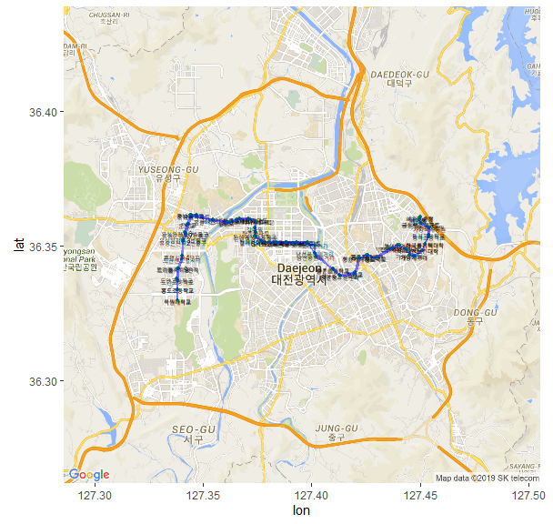

## 제9장 (연습) 대전광역시 노선별 경유 정류소 출력 (예, 106번 노선)


#### 단계 1 : 노선 기본정보 조회

##### 1) 전체 노선정보 조회

```{r}
#===============================================
# (1) 대전광역시 노선별 기본정보 조회 
#===============================================

install.packages("XML")
install.packages("ggmap")

library(XML)
library(ggmap)

#===============================================
# 노선버스정보 조회 (노선버스 전체)
#===============================================

busRtNm <- "106"              # 노선번호
API_key <- "Google API Key"   # https://console.cloud.google.com/

url <- paste("http://openapitraffic.daejeon.go.kr/api/rest/busRouteInfo/getRouteInfoAll?serviceKey=", API_key, "&reqPage=1", sep="")
xmefile <- xmlParse(url)
xmlRoot(xmefile)
```

**코드 설명 :**

(1) url <- `paste()` : 

- API url : http://openapitraffic.daejeon.go.kr/api/rest/busRouteInfo/getRouteInfoAll => 버스노선정보 검색 url. 
- ? : API의 인수 연결
- serviceKey = : (API의 첫번째 인수) 공공데이터 API Key
- & : 추가적인 인수의 연결
- reqPage=1 : (API의 두번쨰 인수) 버스노선정보 이용자매뉴얼 참고
- sep="" : 위의 `paste()` 인수들을 공란없이 모든 붙임.

(2) xmefile <- xmlParse(url) : `url`에 해당하는 사이트에서 정보를 가져와(`xmlParse()`), 변수 `xmefile`에 저장하기. 

(3) xmlRoot(xmefile) :`xmefile`의 내용출력하기(`xmlRoot()`)

**결과 :** 전체 노선정보가 조회됨.

```
<ServiceResult>
  <comMsgHeader/>
  <msgHeader>
    <currentPage>1</currentPage>
    <headerCd>0</headerCd>
    <headerMsg>정상적으로 처리되었습니다.</headerMsg>
    <itemCnt>120</itemCnt>
    <itemPageCnt>2</itemPageCnt>
  </msgHeader>
  <msgBody>
    <itemList>
      <ALLO_INTERVAL>30</ALLO_INTERVAL>
      <ALLO_INTERVAL_SAT>30</ALLO_INTERVAL_SAT>
      <ALLO_INTERVAL_SUN>30</ALLO_INTERVAL_SUN>
      <BUSSTOP_CNT>104</BUSSTOP_CNT>
      <END_NODE_ID>8002737</END_NODE_ID>
      <END_STOP_ID>42750</END_STOP_ID>
      <ORIGIN_END>2230</ORIGIN_END>
      <ORIGIN_END_SAT>2230</ORIGIN_END_SAT>
      <ORIGIN_END_SUN>2230</ORIGIN_END_SUN>
      <ORIGIN_START>0600</ORIGIN_START>
      <ORIGIN_START_SAT>0600</ORIGIN_START_SAT>
      <ORIGIN_START_SUN>0630</ORIGIN_START_SUN>
      <ROUTE_CD>30300001</ROUTE_CD>
      <ROUTE_NO>1</ROUTE_NO>
      <ROUTE_TP>5  </ROUTE_TP>
      <RUN_DIST_HALF>23.907</RUN_DIST_HALF>
      <RUN_TM>70    </RUN_TM>
      <START_NODE_ID>8002736</START_NODE_ID>
```


##### 2) `xmefile`변수를 데이터 프레임 타입의 `df` 변수로 변환

```{r}
df <- xmlToDataFrame(getNodeSet(xmefile, "//itemList"))
head(df)
```

결과 :

```
##   ALLO_INTERVAL ALLO_INTERVAL_SAT ALLO_INTERVAL_SUN BUSSTOP_CNT END_NODE_ID
## 1            30                30                30         104     8002737
## 2             8                 8                 9          62     8001782
## 3            35                35                40         106     8005970
## 4            25                25                40          80     8001783
## 5           130               130               130          51     9002077
## 6            70                70                70         117     8003105
## ...
```


##### 3) 노선번호 106번에 해당하는 정보 검색하여 df_busRoute에 저장하고 확인함.

```{r}
df_busRoute <- subset(df, ROUTE_NO==busRtNm)   # 노선번호로 검색
df_busRoute
```

코드 설명 : `df_busRoute <- subset(df, ROUTE_NO==busRtNm) `

subset(df, ROUTE_NO == busRtNm)

- subset() : 부분집합 찾아 내기
  - df : 사용할 데이터 프레임
  - ROUTE_NO == busRtNm : 검색 조건

결과 :

```
##    ALLO_INTERVAL ALLO_INTERVAL_SAT ALLO_INTERVAL_SUN BUSSTOP_CNT END_NODE_ID
## 14            10                11                12          83     9001641
##    END_STOP_ID ORIGIN_END ORIGIN_END_SAT ORIGIN_END_SUN ORIGIN_START
## 14       33230       2230           2230           2230         0545
##    ORIGIN_START_SAT ORIGIN_START_SUN ROUTE_CD ROUTE_NO ROUTE_TP RUN_DIST_HALF
## 14             0545             0545 30300041      106      2          20.133
##    RUN_TM START_NODE_ID START_STOP_ID TURN_END TURN_END_SAT TURN_END_SUN
## 14 82           8001641         33230     2235         2235         2235
##    TURN_NODE_ID TURN_START TURN_START_SAT TURN_START_SUN TURN_STOP_ID
## 14      9001803       0545           0545           0545        51590
```


4) 노선 ID 확인하기

```{r}
(df_busRoute$ROUTE_CD)                         # 노선 ID 확인
```

결과 :

```
## [1] "30300041"
```


#### 단계 2 : 노선별 정류소 목록 조회하기

##### 1) 노선별 정류소 정보를 담고 있는 API에 접속하여 `xmefile`로 가져오기.

```{r}
url <- paste("http://openapitraffic.daejeon.go.kr/api/rest/busRouteInfo/getStaionByRoute?busRouteId=",
			df_busRoute$ROUTE_CD, 
			"&serviceKey=", 
			API_key, 
			sep="")
xmefile <- xmlParse(url)
xmlRoot(xmefile)
```

코드 설명 :**

(1) url <- `paste()` : 

- API url : http://openapitraffic.daejeon.go.kr/api/rest/busRouteInfo/getStaionByRoute => 노선별 정류소 목록조회 url. 
- ? : API의 인수 연결
- busRouteId = : 버스노선 정보 ID (`df_busRoute$ROUTE_CD`)
- & : 추가적인 인수의 연결
- serviceKey = : (API의 첫번째 인수) 공공데이터 `API Key`
- sep="" : 위의 `paste()` 인수들을 공란없이 모든 붙임.

(2) xmefile <- xmlParse(url) : `url`에 해당하는 사이트에서 정보를 가져와(`xmlParse()`), 변수 `xmefile`에 저장하기. 

(3) xmlRoot(xmefile) :`xmefile`의 내용출력하기(`xmlRoot()`)

**결과 :** 

```
## <ServiceResult>
##   <comMsgHeader/>
##   <msgHeader>
##     <currentPage>1</currentPage>
##     <headerCd>0</headerCd>
##     <headerMsg>정상적으로 처리되었습니다.</headerMsg>
##     <itemCnt>83</itemCnt>
##     <itemPageCnt>1</itemPageCnt>
##   </msgHeader>
##   <msgBody>
##     <itemList>
##       <BUSSTOP_ENG_NM>Mokwon University Front Gate</BUSSTOP_ENG_NM>
##       <BUSSTOP_NM>목원대학교</BUSSTOP_NM>
##       <BUSSTOP_SEQ>1</BUSSTOP_SEQ>
##       <BUSSTOP_TP>1</BUSSTOP_TP>
##       <BUS_NODE_ID>8001641</BUS_NODE_ID>
##       <BUS_STOP_ID>33230</BUS_STOP_ID>
##       <GPS_LATI>36.329678</GPS_LATI>
##       <GPS_LONG>127.33825</GPS_LONG>
##       <ROAD_NM>도안동로</ROAD_NM>
##       <ROAD_NM_ADDR> </ROAD_NM_ADDR>
##       <ROUTE_CD>30300041</ROUTE_CD>
##       <TOTAL_DIST>75</TOTAL_DIST>
##     </itemList>
## ...
```

###### 2) 버스노선별 정류소 정보(`xmefile`)를 데이터 프레임 타입의 `df`변수로 변환

```{r}
df <- xmlToDataFrame(getNodeSet(xmefile, "//itemList"))
head(df)
```

결과 :

```{}
##                         BUSSTOP_ENG_NM        BUSSTOP_NM BUSSTOP_SEQ
## 1         Mokwon University Front Gate        목원대학교           1
## 2            Heungdo Elementary School      흥도초등학교           2
## 3                    Humansia Apts. 10      도안고등학교           3
## 4                  Treefullcity Apts.9   트리풀시티9단지           4
## 5                     Humansia Apts. 6    도안센트럴시티           5
## 6                  Yuseong Spa Station 유성온천역2번출구           6
## 7           Yuseong Spa Station Exit 7 유성온천역7번출구           7
## 8                         Hongin Hotel            온천교           8
## 9         Chungnam National University        충남대학교           9
## 10            Homeplus(Yuseong Branch)    홈플러스유성점          10
## ...
```

##### 3) `df`의 구조 확인하기

```{r}
str(df)
```

결과 :

```
## 'data.frame':   83 obs. of  12 variables:
##  $ BUSSTOP_ENG_NM: Factor w/ 55 levels "---","Ai Building",..: 42 27 31 50 33 53 55 30 7 28 ...
##  $ BUSSTOP_NM    : Factor w/ 55 levels "SK브로드밴드",..: 22 55 15 45 16 34 37 31 43 50 ...
##  $ BUSSTOP_SEQ   : Factor w/ 83 levels "1","10","11",..: 1 12 23 34 45 56 67 78 83 2 ...
##  $ BUSSTOP_TP    : Factor w/ 4 levels " ","1","2","3": 2 1 1 1 1 1 1 1 1 1 ...
##  $ BUS_NODE_ID   : Factor w/ 83 levels "8001032","8001033",..: 28 81 71 68 70 79 40 65 48 62 ...
##  $ BUS_STOP_ID   : Factor w/ 81 levels "11490","11520",..: 53 62 70 73 68 71 57 59 64 60 ...
##  $ GPS_LATI      : Factor w/ 80 levels "36.329678","36.32971",..: 1 3 5 12 15 47 55 62 79 69 ...
##  $ GPS_LONG      : Factor w/ 81 levels "127.338036","127.3381",..: 5 6 6 7 9 10 13 15 17 19 ...
##  $ ROAD_NM       : Factor w/ 12 levels " ","갈마역로",..: 5 1 1 1 1 1 1 1 1 1 ...
##  $ ROAD_NM_ADDR  : Factor w/ 1 level " ": 1 1 1 1 1 1 1 1 1 1 ...
##  $ ROUTE_CD      : Factor w/ 1 level "30300041": 1 1 1 1 1 1 1 1 1 1 ...
##  $ TOTAL_DIST    : Factor w/ 83 levels "10047","10559",..: 76 69 79 9 20 39 44 56 65 70 ...
```

- BUSSTOP_NM : 정류소 이름
- GPS_LATI : 정류소의 위도 (구글 지도의 y축)
- GPS_LONG : 정류소의 경도 (구글 지도의 x축)

##### 4) 정류소의 GPS 정보를 데이터 프레임 변수 `gc`에 저장하기

```{r}
gpsX <- as.numeric(as.character(df$GPS_LONG))
gpsY <- as.numeric(as.character(df$GPS_LATI))

name <- df$BUSSTOP_NM

gc <- data.frame(lon=gpsX, lat=gpsY)
str(gc)
```

결과 :

```
## 'data.frame':   83 obs. of  2 variables:
##  $ lon: num  127 127 127 127 127 ...
##  $ lat: num  36.3 36.3 36.3 36.3 36.3 ...
```


##### 단계 3 : 구글지도에 정류소 표시하기

```{r}
cen <- c(mean(gc$lon), mean(gc$lat))             # 중앙 위치.

register_google(key="Google API Key")            # 구글 API 인증

map <- get_googlemap(center=cen, maptype="roadmap",zoom=12)
gmap <- ggmap(map)

gmap + 
	geom_text(data = gc, 
			aes(x=lon, y=lat), 
			size=2, 
			label=name) +                               # 정류장 이름 출력
	geom_point(data = gc, 
			aes(x=lon, y=lat), 
			size = 1, 
			colour='#018b4d') +                    # 정류장 점 찍기
	geom_path(data = gc, 
			aes(x =lon, y =lat), 
			color = "blue", 
			alpha = .5, 
			lwd = 1)            # 노선을 선으로 잇기

```

결과 :



**[ [R Source](source/ch_9_Bus_Route_of_Daejeon_106.R) ]**


------

 [](source/ch_9_Bus_Route_of_Daejeon_106.R) [](pdf/ch_9_Bus_Route_of_Daejeon_106.pdf) 

 