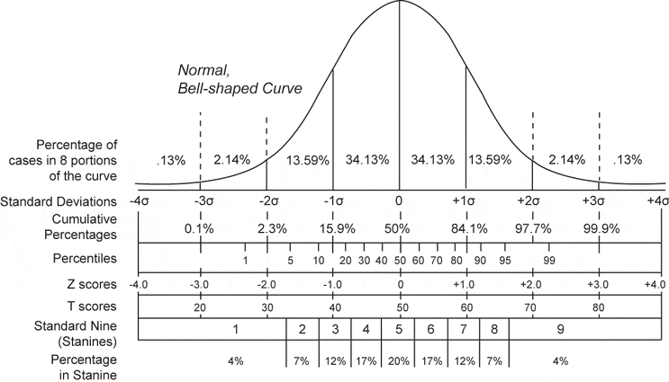

# Data Cleansing    {#data_cleansing}

## Data Cleansing    {#data_cleansing_summary}


### 변수 요약

```{r library}
library(tidyverse)
```

- 각 변수들의 분포에 대한 간결한 요약정보에 익숙해야 한다. 그 이유는 다음과 같다:
   - 표본의 특성 파악
   - 의심이 가는 값들의 확인

`base` 패키지의 `summary()` 함수는 
- *수치 변수*에 대한 **요약 통계량**, *factor 변수*에 대한 **빈도** 등을 제공한다. 
- *문자 벡터*들은 요약되지 않은채 남겨진다.


### 데이터 세트

```{r}
d <- read_csv("data3/patient_pt1_dm.csv"); d
```

### 데이터 세트의 통계적 요약 정보
```{r}
summary(d)
```


### `Hmisc` 패키지의 `describe()` 함수   {#data_cleansing_describe}

- `Hmisc` 패키지의 `describe()` 함수는 데이터 프레임에 있는 모든 변수에 대한 다른 요약 통계량을 제공한다. 
- 제공되는 정보는 변수의 **데이터 형(data type)**과 **유일 값(distinct values)**의 수에 따라 다르다. 

- 중요 특징:
   - 20개 보다 적은 수의 유일값을 갖는 변수들의 도수분포표
   - 연속 변수에 대한 보다 자세한 백분위수(quantiles)
   - 이진 변수에 대한 갯수와 비율
   - 모든 변수의 결측치(`NA`) 갯수

 - `describe()`함수의 결과는 변수들이  타당한 값과 분포를 갖는지를 빠르게 결정하는데 사용될 수 있다.


#### `Hmisc` 패키지 설치

```{r}
# install.packages("Hmisc")
library(Hmisc)
```

#### `describe()` 함수

데이터 세트에 대한 상세한 요약 정보를 보여 준다. 
```{r}
describe(d)
```

### 의심스러운 값

여기에 우리가 정확하다고 확신할 수 없는 몇 몇 변수의 값들이 있다:

```{r}
describe(d[,c("age", "sex", "test1")])
```
- `age` : `360`
- `sex` : `12.2`
- `test1` : `-99`


### `describe()`함수의 결과의 시각화

- `describe()`함수의 결과들은 `plot()`함수로 다음과 같이 시각화할 수 있다:
   - **명목 변수**의 도수에 대한 점 그림(dot plot)
   - **연속 변수**의 분포에 대한 스파이크 히스토그램(spike histograms)

- 이러한 그림들은 변수의 *분포에 대한 검토*와 *의심이 가는 데이터를 발견*하는데 이용된다.

   - **점 그림**에서 명목 변수에 대한 *의심이 가는 데이터*의 라벨(아래의 그림에서 `sex`, `familyhx` 와 `smokinghx` 변수들)들을 찾아보자.

   - **히스토그램**에서는 각 히스토그램은 자체 척도를 가지고 있으며, 묶음 형태(bunched-up)의 히스토그램은 종종 극단치가 존재함을 알려준다(`age`, `test1`, `test2`, `co2` 와  `lungcapacity` 등의 변수들).


```{r}
win.graph(12,8)
par(mfrow=c(2,1))
plot(describe(d))
```


### 의심스러운 값을 결측치로 바꾸기

- 예제 데이터 세트의 요약정보의  결과와 `describe()` 함수 결과의 그래프는 여러 개의 의심스러운 값들이 있음을 알려주고 있다:

    - `age`변수는  데이터 입력 에러로 보이는 357.89001 값이 있다.
    - `sex` 변수는 데이터 입력 에러로 보이는 “12.2”값이 있다.
    - `test1`, `test2`, `lungcapacity`, `smokinghx`, 그리고 `familyhx` 변수 등은 결측치 코드인  `-99`를 가지고 있다.
    - `co2` 와  `lungcapacity`변수는 또 다른 결측치 코드인 `-98` 값을 가지고 있다.
    - `wbc` 변수는 수치 변수인 것 같은데, R이 문자로 읽어들이게 하는 “`not assessed`” 값을 가지고 있다.

- 우리는 의심스러운 값들에 대하여 그 대체 값들을 알 수 없기때문에 R에서 결측치를 나타내는 `NA`로 변경할 것이다.

**주의** : 자주 데이터 세트들은 결측치의 유형에 따라 결측치 값들을 구분하고 있다. 예를 들어, -`99`는 “결측치“, `-98`은 “답변 거부“” 등으로 처리하는 것을 들 수 있다. 분석의 목적을 위해서는 이 두 경우 모두 `NA`로 처리하면 된다. 그렇지만 결측치 값들을 구분하고자 하는 경우에는 `memisc` 패키지의 `as.itemI)` 함수를 참고하기 바란다.

- 데이터 입력 에러에 대하여 `NA` 값으로 대체하기 위해 **논리적 서브세팅(logical subsetting)**을 이용할 수 있다:

```{r}
# change all impossible age values to NA 
# assume all adults in this dataset
d$age[d$age<18 | d$age>120] <- NA

# remember to use quotes for character variables
d$sex[d$sex == "12.2"] <- NA
```

이제 모든 `-99`, `-98` 그리고 `not assessed` 값들을 모두 `NA`로 바꿔보자.

```{r}
d[d==-99] <- NA
d[d==-98] <- NA
d[d=="not assessed"] <- NA
d
```


예를 들어, 다음의 구문은 `df` 데이터 세트에 있는 모든`a` 값을 `b`값으로 바꾸는 것을 보여준다: 

```{r}
df <- data.frame(a=c("a", "c", "f"), b=c("d", "a", "c"))
df[df=="a"] <- "b"
df
```


### `NA`가 없는 완전한 데이터   {#data_cleansing_Complete_cases}

`complete.cases(x)` 함수는 `x`의 행 각각에 누락된 데이터가 없는(NA가 존재하지 않는 데이터, **complete cases**)지를 확인해주는 논리값(TRUE/FALSE) 벡터를 반환한다. 해당 행 전체에 누락된 데이터가 없다면 `TRUE`값을 반환하고, 누락된 데이터가 존재한다면 `FALSE`를 반환해준다.

이 논리 벡터의 합은 complete cases의 갯수를 나타낸다.


#### 결측치가 없는 데이터
```{r}
complete.cases(d)
```

#### 결측치가 아닌 데이터의 갯수
```{r}
sum(complete.cases(d))
```

#### 결측치가 없는 데이터 세트 생성
```{r}
d_comp <- d[complete.cases(d),]
```

### 데이터 정제 후의  `describe()`함수 결과 그림   {#data_cleansing_after_cleansing}

`describe()` 함수 결과의 그림은 이제 더 나아 보인다. 점 그림에 의심이 가는 데이터 라벨이 없고 또 히스토그램은 아주 잘 분산되어 있다.

색은 그런 변수들의 결측치 수를 보여준다.

#### `$Categorical`

범주형 변수(factor)에 대한 시각화

```{r}
plot(describe(d), which="categorical")

```


#### `$Continuous`

수치형 변수(numeric)에 대한 시각화
```{r}
plot(describe(d_comp), which="continuous")
```


## 결측치(Missing Values) 처리   {#data_cleansing_missing_value}

### 결측값이 포함되어 있는지 확인하는 방법: `is.na()`


#### 데이터 세트 1

```{r}
x <- c(1, 2, 3, 4, NA, 6, 7, 8, 9, NA) 
```

#### `is.na()` 함수 사용

```{r}
is.na(x)
```
- 벡터 `x`의 각 요소에 대해 `NA` 여부를 확인. 논리형 벡터 반환.


#### 데이터 세트 2

```{r}
library(MASS)
str(Cars93)
```
- `MASS` 패키지에 있는 `Cars93` 데이터 세트
- 27개의 컬럼과 93개의 행으로 구성되어 있다.

`is.na()` 함수는 데이터 구조의 **각 요소별로 NA 여부를 확인**한다.

위의 벡터처럼 구성요소 갯수가 몇 개 안될 경우 `is.na()` 한 후에 `TRUE`, `FALSE` 논리형 값을 눈으로 보고 확인할 수 있다. 

#### `is.na()` 함수 사용

하지만 **`Cars93`** 데이터 세트처럼 변수(열) 갯수도 많고, 관측치(행) 갯수도 많은 경우 (대부분의 실무에서 쓰는 데이터 세트는 이처럼 변수도 많고 관측치도 많다.)

`is.na()` 함수만 가지고서는 아무래도 결측치 현황을 파악하는데 무리가 있다.

```{r}
head(is.na(Cars93))
```

### 결측치 갯수: `sum(is.na())`

#### 벡터의 경우

```{r}
sum(is.na(x))
```


#### 데이터 프레임의 경우 : `Cars93` 데이터 프레임.

```{r}
sum(is.na(Cars93))
```

#### `Cars93` 의 각 변수(컬럼)별로 결측값 개수 

총 27개의 변수 중에서 `Manufacturer`, `Price`, `Rear.seat.room`, `Luggage.room` 등의 4개만 예시로 살펴본다.
```{r}
sum(is.na(Cars93$Manufacturer)) 
sum(is.na(Cars93$Price))
sum(is.na(Cars93$Rear.seat.room))
sum(is.na(Cars93$Luggage.room))
```
- 각 컬럼 별로 `NA` 요소 갯수가 반환된다.


`sum(is.na())` 함수를 이용하면 변수가 많거나 관측값이 많은 경우도 결측값 현황을 금방 파악할 수 있다. 

R은 `TRUE` 를 '`1`'로, `FALSE` 를 '`0`'으로 인식하기 때문에 `sum(is.na())`를 하게 되면 `TRUE` 값을 '`1`'로 인식해서 합계를 구한다.

#### `colSums()` 함수 사용

**`colSums()` 함수**를 사용하면 데이터 프레임 내 다수 변수들에 대해서 한번에 각 개별 변수별 결측값의 개수 합계를 구할 수 있다. 

바로 위에서 개별 함수별로 일일이 `sum(is.na(Cars93$Manufacturer))`...이런 식으로 변수의 개수만큼 쓰는 것을 `colSums()` 함수로는 한줄이면 해결할 수 있으니 훨씬 편하다.

```{r}
colSums(is.na(Cars93)) 
```
- `colSums(is.na(Cars93))` : 함수로 간단하게 각 컬럼별 요소에 있는 NA의 갯수를 계산하였다.

### 결측치를 통계 분석시 제외시키기 : `na.rm = TRUE`

다음과 같은 함수는 데이터 세트에 NA가 포함되어 있으면 그 결과도 NA가 된다. 

```{r}
sum(x)
mean(x)
```
- 벡터 `x`에 결측치(`NA`)가 포함되어 있으면 그 결과는 `NA`로 반환됨.

이런 경우에 `na.rm = TRUE`를 함수의 인수로 사용한다.
```{r}
sum(x, na.rm = TRUE)
mean(x, na.rm = TRUE)
```
- 데이터 세트에서 `NA`를 제외하고 그 결과를 반환한다.


**결측값이 들어있는 벡터**에 대해서 `sum()`, `mean()`, `sd()`, `min()`, `max()`, `range()` 등의 통계 함수를 적용하면 `NA`만 나오게 된다. 

결측값을 제외하고 통계 함수 계산을 하는 옵션은 **`na.rm = TRUE`** 가 된다.

**NA를 고려하지 않은 통계 처리의 경우**
```{r}
sum(Cars93$Luggage.room)
mean(Cars93$Luggage.room)
```
- 모두 NA 결과


**NA를 제외한 통계처리의 경우**
```{r}
sum(Cars93$Luggage.room, na.rm = TRUE)
mean(Cars93$Luggage.room, na.rm = TRUE)
```
- NA를 제외한 통계 처리 결과


위 예제는 결측값이 포함된 데이터 프레임의 특정 변수에 대해 indexing을 해서 통계 함수를 적용해본 경우이다. 

역시 `na.rm = TRUE` 옵션을 설정해 주어야 통계 계산이 제대로 됨을 알 수 있다. 

`na.rm = FALSE` 가 디폴트이므로 `na.rm = TRUE`를 설정하지 않는 경우 결측값이 포함되어 있으면 `NA`가 결과로 나타나게 된다.

### 결측치가 있는 행 제거: `na.omit()`

`na.rm = TRUE` 옵션은 원래의 데이터 세트는 그대로 둔 채, 통계량 계산할 때만 `NA`를 포함하지 않게 된다. 

따라서 다수의 통계 함수 혹은 다수의 변수에 통계 함수를 사용해야 하는 경우 매번 `na.rm = TRUE` 옵션을 설정해주는게 번거로울 수 있다. 

따라서 차라리 원래 데이터 세트에서 결측값을 제거하면 된다.

결측값이 들어있는 행을 제거해 주는 함수가 `na.omit()` 함수이다.

좀 더 예리하게 특정 행과 열을 지정해서 그곳에 결측값이 있는 경우만 메스로 정밀 수술하는 함수가 `complete.cases()` 함수이다.

#### `na.omit()` 함수의 사용 예

```{r}
Cars93_1 <- na.omit(Cars93) 
str(Cars93_1)
```
- `Cars93_1 <- na.omit(Cars93)` : `NA`를 가진 행을 제외한 새로운 데이터 세트 Cars93_1을 생성한다.
- `str(Cars93_1)` : 원래의 데이터 세트 `Cars93`에 있던 `93`개의 행이 `82`개로 줄어 들었다. 즉, 11개의 행을 삭제했다.

위의 예처럼 결측값이 들어있는 행을 통째로 삭제할 때는 만약의 사태를 대비해서 **원본 `Cars93`은 그대로 유지하고, 행을 삭제한 데이터 셋을 별도의 이름 `Cars93_1`로 저장해서 분석을 진행**하는 것을 추천한다.

#### 특정 열에 결측값 존재 시 행 제거하기 : `complete.cases()` 함수


```{r}
sum(is.na(Cars93))
```
- Cars93 데이터 세트에 있는 `NA` 요소의 갯수를 출력한다.

##### `Cars93` 데이터 프레임의 `Rear.seat.room` 컬럼의 결측치 행을 데이터 세트에서 제거하기

Cars93[ , "Rear.seat.room"] 또는 Cars93$Rear.seat.room 변수를 이용할 수 있다.

```{r}
Cars93_2 <- Cars93[ complete.cases(Cars93[ , c("Rear.seat.room")]), ]
sum(is.na(Cars93_2)) 
```


위의 구문은 다음과 같은 논리로 문제를 해결한다.
   1. `x <- Cars93$Rear.seat.room` : 해당 컬럼을 변수 `x`로 대체
   2. `y <- complete.cases(x)` : x 벡터의 요소에 대해 NA 존재 여부 확인 -> logical 벡터가 나온다. 
   3. `Cars93_2 <- Cars93[y, ]` : `y`가 `TRUE` 행만을 Cars93_2로 추출한다. 
   
```{r}
   x <- Cars93$Rear.seat.room; head(x)
   y <- complete.cases(x); sum(!y)
   z <- is.na(x); sum(z)
   Cars93_2 <- Cars93[y, ]; str(Cars93_2); sum(is.na(Cars93_2)) 
```
- `compleste.cases(x)` : 요소가 `NA`가 아니면 `TRUE`, `NA`면 `FALSE` 반환. - 따라서, `NA`인 요소의 갯수를 구하기 위해 `sum(!y)`를 사용. : `x` 컬럼의 `NA` 갯수는 `2`개.
-  `is.na(x)` : `complete.cases()` 함수와 비교하기 위함. `is.na()` 함수는 요소가 `NA`이면 `TRUE`, `NA`가 아니면 `FALSE` 반환.
- 따라서 `sum(z)`로 `NA`인 요소의 갯수를 구한다. : `x` 컬럼의 `NA` 갯수는 `2`개.
- `Cars93[y, ]` : `Cars93` 데이터 세트 중에서 벡터 `y`가 `TRUE`인 행인 모든 열(`[y, ]`)을 추출한다.
- `sum(is.na(Cars93_2))` : Cars93_2  데이터 세트에 NA 요소가 아직도 9개 남아 있음을 확인할 수 있다.


##### `Cars93` 데이터 프레임의 `23~24`번째 칼럼 내 결측값이 있는 행 전체 삭제

이의 해결은 다음과 같은 논리 절차과정을 거치게 된다.

1. Cars93의 23, 24번쨰 컬럼은 다음과 같이 표현된다. : `Cars93[ , 23:24]`
2. 이를 `x` 변수에 대입한다.   : `x <- Cars93[, 23:24]`
3. 이 x 변수에 대해 결측치가 없는 행을 확인하고 이를 `y` 변수에 대입한다. : `y <- complete_cases(x)`
4. Cars93에서 결측치가 없는 행들을 Cars93_3에 대입한다. : `Cars93_3 <- 
Cars93[y, ]`
5. Cars93_3의 결측치 요소 갯수를 확인한다. : `sum(is.na(Cars93_3))`

이 절차를 스크립트로 작성하면 다음과 같다.
```{r}
x <- Cars93[, 23:24]
y <- complete.cases(x)
Cars93_3 <- Cars93[y, ]
sum(is.na(Cars93_3))
```
- `Cars93_3` 데이터 세트에는 `NA` 요소가 하나도 없다.

이러한 논리를 한 줄에 표현한 것이 다음의 스크립트이다.

```{r}
Cars93_3 <- Cars93[ complete.cases(Cars93[ , c(23:24)]), ]
sum(is.na(Cars93_3))  
```

행의 갯수 즉, 관측치의 갯수를 확인해 보자.
```{r}
dim(Cars93_3)
str(Cars93_3)
```
-  관측값이 82개로서 전체 93개 중에서 11개가 줄어들었음을 알 수 있다.


### 결측치를 다른 값으로 대체


#### 기본 형식

결측치를 다른 값으로 대체하는 기본적인 형식은 다음과 같다.

```
dataset$var[is.na(dataset$var)] <- new_value
```
이 구문의 논리적 흐름은 다음과 같다.
    1. `dataset$var` : `dataset` 데이터 세트의 `var` 컬럼 (`x`)
    2. `is.na(x)` : `x`에  NA가 있는가 (`y`)
    3. `dataset$var[y] <- new_value` : `dataset`의 `var` 컬럼 중 `y`가 `TRUE`인 경우 `new_valu`e를 대입.


#### 결측치 대체 예

`Cars93` 데이터 세트에서 `Luggage.room` 컬럼에 있는 결측치를 모두 `0`으로 변경해 본다. 

##### 결측치 요소 확인

`Cars93$Luggage.room` 변수에 대해 결측치 요소 확인
```{r}
Cars93$Luggage.room
sum(is.na(Cars93$Luggage.room))
```


##### 결측치를 `0`으로 대체하기

원래의 데이터 세트 Cars93을 Cars93_4로 복사한 다음, Cars93_4$Luggage.room의 결측치를 0으로 대체한다. 

이 구문의 논리적 흐름은 다음과 같다.
    1. `Cars93_4 <- Cars93` : `Cars93`을 `Cars93_4`에 복사한다.
    2. `Cars93_4$Luggage.room` : `Cars93_4` 데이터 세트의 `var` 컬럼 (`x`)
    3. `is.na(x)` : `x`에  NA가 있는가 (`y`)
    4. `Cars93_4$var[y] <- 0` : `Cars93_4`의 `Luggage.room` 컬럼 중 `y`가 `TRUE`인 경우 `new_value`0`를 대입.

이를 스크립트로 표현하면 다음과 같다.
```{r}
Cars93_4 <- Cars93
x <- Cars93_4$Luggage.room; x   # 수정 전 Luggage.room 컬럼
y <- is.na(Cars93_4$Luggage.room)
Cars93_4$Luggage.room[y] <- 0
Cars93_4$Luggage.room           # 수정 후 Luggage.room 컬럼
```
- NA값들이 모두 0으로 대체되었음을 알 수 있다.

위의 스크립트를 간단하게 표현하면 다음과 같다. 여기서는 Cars93을 Cars93_5로 복사하여 처리한다.
```{r}
# Luggage.room 변수 내 결측값을 '0'으로 대체
Cars93_5 <- Cars93
Cars93_5$Luggage.room     # 수정 전 Luggage.room 컬럼
Cars93_5$Luggage.room[is.na(Cars93_5$Luggage.room)] <- 0
Cars93_5$Luggage.room     # 수정 후 Luggage.room 컬럼
```


`Cars93_5$Luggage.room[is.na(Cars93_5$Luggage.room)] <- 0` 과 같은 스크립트에 익숙해질 필요가 있는 것이다.


##### 결측치를 컬럼의 `평균값`으로 대체하기

`sum(is.na(Cars93$Luggage.room))` 함수를 사용해 `Cars93`의 `Luggage.room` 변수에 보면 11개의 결측값이 있음을 알 수 있다.

`Luggage.room` 변수 내 결측값을 **indexing 기법**을 활용해서 '`0`'로 대체하는 방법을 살펴보았다.

물론 '`0`'이 아니라 다른 값으로도 대체가 가능하다. 


아래의 예제에서는 결측값을 미포함(``na.rm = TRUE`)했을 때의 `Luggage.room`의 평균값으로 결측값을 대체하여 보자,

```{r}
Cars93_6 <- Cars93
Cars93_6$Luggage.room          # 수정 전 Luggage.room 
Cars93_6$Luggage.room[is.na(Cars93_6$Luggage.room)] <- mean(Cars93_6$Luggage.room, na.rm = TRUE)
sum(is.na(Cars93_6$Luggage.room))
round(Cars93_6$Luggage.room)   # 수정 후 Luggage.room 
```
- `0` 값 대신에 `Luggage.room` 컬럼의 평균인 `mean(Cars93_6$Luggage.room, na.rm = TRUE)`로 대체하고 있음을 알 수 있다.


##### 일괄 대체

데이터프레임의 모든 행의 결측값을 특정 값(가령, '`0`')으로 일괄 대체 : `dataset[is.na(dataset)] <- 0`

```{r}
Cars93_7 <- Cars93
# counting the number of missing values in Cars93 dataset
sum(is.na(Cars93_7)) # 13
 
# converting the missing value in Cars93 dataframe to '0'
Cars93_7[is.na(Cars93_7)] <- 0
 
# counting the number of missing values in Cars93 dataset
sum(is.na(Cars93_7)) # 0
```


##### 데이터프레임의 각 변수의 결측값을 각 변수 별 평균값으로 일괄 대체


위의 3)번에서 결측값을 그 열의 평균으로 대체하는 방법을 알아보았다.

만약 결측값을 포함한 열이 매우 많다면 일일이 변수이름을 지정해가면서 나열해서 입력하는 것은 번거로운 일이다. 

이럴 때 `sapply()` 함수를 사용하면 일괄로 결측값을 포함한 변수에 대해서는 해당 변수의 평균으로 대체하라고 프로그래밍할 수 있다.

`sapply()`를 적용하면 matrix를 반환하므로 dataframe으로 만들기 위해서 앞에 `data.frame()` 을 추가로 붙여주었다.


```
sapply(dataset, function(x) ifelse(is.na(x), mean(x, na.rm=TRUE), x))
```

이러한 문제의 해결을 위한 스크립트는 다음과 같다.
```{r}
# converting the missing value in Cars93 dataframe to each column's mean value
Cars93_8 <- Cars93[1:20,c("Rear.seat.room", "Luggage.room")]
colSums(is.na(Cars93_8))
head(Cars93_8)

sapply(Cars93_8, function(x) mean(x, na.rm=T))

Cars93_8 <- data.frame(sapply(Cars93_8, 
                              function(x) ifelse(is.na(x), 
                                                 mean(x, na.rm = TRUE),
                                                 x)
                              )
                       )
head(Cars93_8)
```


##### 그룹별 평균값으로 결측값 대체하기

`base` 패키지를 사용할 수도 있다. 

그런데 여기서는 `dplyr` 패키지의 `group_by()` 와 `ifelse()` 조건문을 사용한 `mutate()` 함수로 그룹 별 평균값으로 결측값 채우는 방법에 대하여 알아보자.


###### 데이터 세트 생성
```{r}
# make a sample DataFrame
grp <- c(rep('a', 5), rep('b', 5))
val <- c(1, 2, 3, NaN, 6, 2, 4, NaN, 10, 8)
df <- data.frame(grp, val)
df
```


###### 그룹별 평균 구하기
결측값을 제외하고, 그룹 'a'와 그룹 'b' 별 평균을 계산해보자. 

```{r}
# mean value by group 'a' and 'b'
library(dplyr)
df %>% group_by(grp) %>% summarise(grp_mean = mean(val, na.rm = TRUE))
```


그룹 '`a`'의 평균은 3, 그룹 '`b`'의 평균은 6이다. 


###### 결측치를 그룹별 평균으로 대체하기
그러면 4번째 행에 있는 그룹 '`a`'의 '`val`' 칼럼 결측값을 그룹 '`a`'의 평균 3으로 대체(replace) 또는 채워넣기(fill in)를 하면 다음과 같다. 
그리고 8번째 행에 있는 그룹 '`b`'의 '`val`' 칼럼 결측값을 그룹 '`b`'의 평균 6으로 대체하면 다음과 같다.

```{r}
df %>% 
   group_by(grp) %>% 
   mutate(val = ifelse(is.na(val), mean(val, na.rm=TRUE), val))
```

--------------------

위에서 `NA`(Not Available)에 대해서 소개를 했는데요, 참고로 벡터에서 `NaN` (Not a Number), 무한값 `Inf` (Infinity), 유한값 `finite` 확인하는 방법도 마저 소개하겠습니다.

유의할 것은, `is.na()`에서 `NA` 뿐만 아니라 `NaN` 도 `TRUE` 를 반환합니다.

```{r}
my_data <- c(-1, 0, 10, NA, NaN, Inf)
my_data
 
is.finite(my_data)
is.na(my_data)
is.nan(my_data)
is.infinite(my_data)
```


### Reference {-}

- https://rfriend.tistory.com/34 [R, Python 분석과 프로그래밍의 친구 (by R Friend)]


## 이상치(Outlier) 처리 {#outlier}    {#data_cleansing_outlier}

### 표준값 Z를 이용한 이상치 확인 및 처리

- `outliers` 패키지를 이용해서 Z값(Z-score) 이상값을 결측치로 대체하는 방법이 있다.
- Z-값은 통계학에서 매우 기본이 되는 값으로,z = (x-μ)/σ로 구해지는 값이다. 
- 이를 통해 서로 단위나 크기가 다른 값을 모두 표준화시킬 수 있다. 따라서 **표준점수**, **표준값**이라고도 합니다. 



    - 표준점수 0.0(=편차치 50) 이상은 전체의 50％이다.
    - **표준점수의 절대값**이 1.0(=편차치 60) 이상은 전체의 31.74％이다.
    - **표준점수의 절대값**이  2.0(=편차치 70) 이상은 전체의 4.56％이다.
    - **표준점수의 절대값**이  3.0(=편차치 80) 이상은 전체의 0.28％이다.
    - **표준점수의 절대값**이  4.0(=편차치 90) 이상은 전체의 0.006％이다.
    - **표준점수의 절대값**이  5.0(=편차치 100) 이상은 전체의 0.00004％이다. 

Z의 절대값이 `3.0` 이상의 값을 갖는 것은 전체 관측치의 0.28% 정도로 매우 드물기 때문에 이 정도 범위에서 벗어나는 값은 **이상치**라는 의심을 지닐 수 있다. 

물론 더 엄격한 기준을 제시할 수 있는데, 미 국립표준 기술 연구소 (NIST, National Institute of Standards and Technology)의 경우 `4.0`을 제시하고 있으며 연구자에 따라서는 `3.5`를 사용할 수 있다.


#### `outliers` 패키지 설치

```{r}
# install.packages("outliers")
library(outliers)
```

#### 정규분포 데이터 세트 생성

평균 100, 표준편차 3의 정규분포를 하는 샘플 300개를 `rnorm()` 함수를 이용하여 데이터 세트 `x1`을 생성한다.

```{r}
set.seed(1234)
x1 <- rnorm(300, 100, 3)   # 평균 100, 표준편차 3인, 표본 300개 생성
```

이렇게 생성된 샘플의 분포도를 그려본다.
```{r}
plot(x1)
```

#### 이상치의 존재유무 확인

정규분포를 따르더라도 확률적으로 Z의 절대값이 3을 넘을 수 있다. 즉, Z값이 3보다 크거나 Z값이 -3보다 작을 수 있다.

다만 이 코드에서는 쉽게 확인할 수 없으므로 **`outliers`** 패키지의 **`scores()`** 함수를 이용해서 찾아본다. (도움말은 `? scores()` 참조)

Z값을 나타내는 `Z`라는 새로운 데이터를 생성하고, 이 Z 값의 분포도를 plot() 함수를 이용하여 그리고, Z의 절대값이 3이 되는 수평선을 그려본다.
```{r}
Z <- scores(x1, type="z")
plot(Z, col = ifelse(abs(Z)>3, "red", "blue"))
abline(h = 3, col="blue")
abline(h =-3, col="blue")
```
- `scores(x1, type="z")` : 데이타 x1에 대한 표준값(z)을 반환
- `plot(Z, col = ifelse(abs(Z)>3, "red", "blue"))` : Z의 절대값이 3보다 크면 점의 색깔을 빨간색으로, 그렇지 않으면 파란색으로 표시한다.
- `abline(h = 3, col="blue")` : Z 값이 3인 수평선을 그린다.
- 이 분포도에서 2개의 outlier가 존재함을 확인할 수 있다.


이 Z의 절대값 중 3을 넘는 값의 존재함을 확인하였으나 이상치의 정확한 색인 번호는 `which()` 함수를 이용하여 확인할 수 있다.
```{r}
which(Z %in% Z[abs(Z) > 3])
```
- `%in%` : 벡터 내 특정 값 포함 여부 확인 연산자. 색인 번호 반환.
- 178번과 237본 두 개의 데이터가 이상치.


#### 이상치를 결측치로 대체

두 개의 이상치가 존재함을 확인하였으므로, 이제 이 이상치를 결측치 **`NA`**로 변경한다.
```{r}
x1[which(Z %in% Z[abs(Z) > 3])] <- NA
x1[c(178, 237)]
```
- 178번째 값과 237번째 값이 `NA`로 변경되어 있음.

또 다른 방법은 `replace()` 함수를 이용하여 이상치(`Z>3`) 조건을 만족하는 x1의 값을 결측치 `NA`로 변경할 수 있다.
```{r}
x1 <- replace(x1, abs(Z) > 3, NA)
x1[178]
```

이렇게 표준에서 크게 벗어난 값을 보다 논리적으로 해결할 수 있게 되었다. 

#### 이상치 제거 시의 주의점

원래 데이터에 너무 많은 이상치가 존재하는 경우에는 이상치 제거에 신중해야 한다.


### 수정된 표준값을 이용한 이상치 확인 및 처리

표준값을 이용하는 방법은 가장 일반적이고 간단한 접근이다

그러나, 관측값(즉 표본)의 숫자가 적은 경우 정상적인 데이터가 이상치로 처리되는 경우가 있을 수 있다.

극단적인 예를 든다면, 20명의 소득을 조사했는데, 그 가운데 특별히 빌 게이츠가 끼어 있는 경우이다. 이 경우 **소득의 평균값**이 수백만 달러로 올라가게 되고, 그러면 5만 달러, 10만 달러의 연봉을 받는 사람까지 이상치로 처리될 수 있는 것이다.


이렇게 평균을 내면 본래 이상치가 아닌 것도 이상치로 만들 수 있다.

이를 회피하는 가장 좋은 방법은 평균 대신 **중앙값(median)**을 이용하는 것이다. 

집단에서 중간 위치에 있는 값(**중앙값**)을 기준으로 잡으면, 평균의 함정에서 벗어날 수 있다. 

#### 데이터 세트의 생성

이번에는 평균이 100이고 표준편차가 3으로 정규분포하는 샘플을 3,000개 생성한다.

```{r}
set.seed(1234)
x2 <- rnorm(3000,100,3)
```

#### 수정된 표준값 계산

표준값의 계산에 있어서 평균값이 아닌 중앙값을 사용하는 방법에 대하여 알아본다.

`outliers` 패키지의  `score()` 함수에서 `type=` 인수로 `mad`를 지정하고 변수명은 Zm으로 한다. 

여기서 `mad`는 **median absolute deviation(MAD)**로 **중앙값의 절대 편차값**을 의미한다.

이렇게 구해진 값은 **수정된 표준값(modified Z score)**라고 한다.

```{r}
Zm <- scores(x2, type="mad")
```
- `scores(x2, type="mad")` : 데이터 x2에 대한 수정된 표준값 반환

plot() 함수를 이용하여 수정된 표준값의 분포도를 그려본다.
```{r}
plot(Zm, col = ifelse(abs(Zm)>3, "red", "blue"))
abline(h = 3, col="blue")
abline(h =-3, col="blue")
```

- 8개의 이상치가 있음을 확인할 수 있다.


#### 이상치의 위치 확인

이제 **수정된 표준값의 절대값**이 3보다 큰 값들의 색인번호를 `which()` 함수를 이용하여 이상치의 위치를 확인한다.

```{r}
which(abs(Zm) >3)
```
- 총 8개의 이상치가 있다.


#### 이상치를 결측치로 대체하기

샘플 데이터 x2의 이상치를  which() 함수를 이용하여 결측치로 대체한다

```{r}
x2[which(abs(Zm) >3)] <- NA
x2[which(abs(Zm) >3)]
```

#### 데이터 프레임으로 데이터 확인하기

샘플 데이터 `x2`와 수정된 표준값 `Zm`을 데이터 프레임 `df`로 만들어 본다.
```{r}
df <- data.frame(x2, Zm)
head(df)
```


`subset()` 함수를 이용해 수정된 표준값 `Zm`의 절대값이 3이상인 값들을 구해 이상치 값들의 집합인 데이터 프레임 `df1`을 만들어 보자.

```{r}
df1 <- subset(df, abs(Zm) > 3)
df1
```
- 8개의 이상치 데이터와 수정된 표준값을 확인할 수 있다.

### 사분위수를 이용한 이상치 확인 및 처리

**사분 범위(IQR: Interquartile range)**에서 크게 벗어난 값을 이상치로 설정하는 방법에 대해서 살펴본다.


#### 사분 범위를 이용한 이상치 계산식

사분 범위에서의 이상치는 다음과 같이 계산된다.

```
`Q3 + 1.5 * IQR`과 `Q1 - 1.5 * IQR`
여기서, Q1 : 1 사분위수
        Q3 : 3 사분위수
        IQR : 사분 범위
```

#### 사분범위 방법과 표준값 방법의 비교

사실 정규 분포를 따르더라도 **표본 수가 많아지면**, (Q3 + 1.5 * IQR)와 (Q1 - 1.5 * IQR)를 벗어나는 값도 같이 많아지기 때문에 그만큼 이상치로 보는 숫자가 점점 많아진다는 점도 고려해야 한다. 

사분범위를 이용한 방법과 앞서 Z값 3을 기준으로 삼는 방법 간의 차이점을 우선 비교해 보면 다음의 그림과 같다.


(출처 : [위키피디어](https://upload.wikimedia.org/wikipedia/commons/1/1a/Boxplot_vs_PDF.svg))

- IQR은  4사 분위수(Q3, 75번째 백분위수)에서 2사분위수(Q1, 25번째 백분위수)을 뺀 값이다. 즉, IQR = Q3 - Q1이다. 
- Q1은 표준값 -.6745 그리고 Q3는 표준값 .6745에 해당된다.
- `Q1 - 1.5 * IQR`은 표준값 -2.698, 그리고 `Q3 + 1.5 * IQR`은 표준값 2.698에 해당된다.

#### 데이터 세트의 생성

여기서도 편의상 평균 100, 표준편차 3을 갖는 샘플 3천개인 데이터 세트 x3를 생성한다.
```{r}
set.seed(1234)
x3 <- rnorm(3000, 100, 3)
```

이 샘플 데이터의 분포도를 그려보자.
```{r}
plot(x3)
```

#### 사분범위를 이용한 이상치의 상한과 하한 계산

데이터 세트 x3에 대한 사분범위를 이용한 이상치의 계산은 다음과 같은 `outlier()` 함수를 생성하여 계산한다.
```{r}
outlier <- function(x) {
         low_Outlier <- quantile(x)[2] - 1.5 * IQR(x)
         up_Outlier <- quantile(x)[4] + 1.5 * IQR(x)
         return(c(low_Outlier, up_Outlier))
}

outlier(x3)
```

#### 이상치 존재 유무 확인하기

데이터 세트의 사분범위 이상치의 하한과 상한을 `outlier()` 함수로 계산하였으므로, 이제 이 범위를 벗어나는 데이터를 찾아본다.

```{r}
lim <- outlier(x3)   
which(x3 > lim[2] | x3 < lim[1]) 
```
- `lim <- outlier(x3)` : `x3`의 사분범위 이상치의 범위값을 `lim` 변수에 대입한다. lim[1]이 하한, lim[2]가 상한
- which(x3 > lim[2] | x3 < lim[1] ) : 하한보다 작거나, 상한보다 큰 값의 위치를 확인
- 총 27개의 이상치가 확인됨

#### 이상치를 결측치로 대체하기

이상치에 대해 which() 함수를 이용하여 결측치로 대체한다.
```{r}
x3[which(x3 > lim[2] | x3 < lim[1])]  <- NA
sum(is.na(x3))
```

- `sum(is.na(x3))` : 전체 데이터 중 `NA` 값의 갯수.


27개의 결측값은 앞서 예제에서보다 훨씬 많다. 

대략적으로 전체의 1%가 조금 안되는 값이 이상치로 분류되어 제거된 것이다.

사실 모든 값들이 정규 분포를 따르고 제거할 필요가 없는 값이라는 점을 생각하면 좀 과도하게 제거된 것일 수도 있다. 

하지만 표본의 100개 이하로 좀 작다면 무리 없이 적용할 수 있을 것이다.
