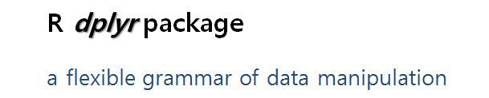

# Data Preprocessing    {#preprocessing}

## 들어가는 말

**데이터 프레임(dataframe)을 위한 데이터 전처리, 조작(data pre-processing, data manipulation)을 쉽고! 빠르게! 할 수 있도록 해주는** **dplyr 패키지**에 대해서 알아보겠습니다.

R help에 검색해보면 dplyr 패키지를 아래와 같이 소개하고 있다.

> `dplyr`은 **유연한 데이터 조작의 문법**을 제공합니다. 이것은 `plyr`의 차기작으로서, **데이터 프레임**을 집중적으로 다루는 툴이다
>
> `dplyr` provides a flexible grammar of data manipulation. It's the next iteration of `plyr`, focused on tools for working with data frames (hence the *d* in the name)

 데이터 조작을 위한 문법으로 체계화를 해서 한번 배워놓으면 쉽다는 점과 더불어, **C언어로 만들어서 매우 빠르다**는 점도 `dplyr` 패키지의 크나큰 장점 중의 하나이다.



그래프/시각화를 문법으로 승화시켜서 체계를 잡아놓은 "**`ggplot2`**" 패키지 ( "ggplot is an implementation of the grammer of Graphics in R")가 있다. 이 `ggplot2`를 만든 그 유명한 **Hadley Wickham** 이 `dplyr` 패키지도 만들었다. 

아래에 소개한 것처럼, https://www.r-bloggers.com/ 에 소개되어 있는 Hadley 의 인터뷰를 보면, 기존 통계학에서는 데이터 전처리(Data munging and manipulation)를 "내 일이 아니야"라고 무시했었다고 한다. 그런데 Hadley Wickham이 보기에는 '모델링'과 '시각화'로 부터 통찰을 끄집에 내는데 있어서 **데이터 조작, 전처리**가 매우 중요하고 또 어려운 영역이라고 보았고, Hadley가 직접 나서서 이를 도와줄 수 있는 R packages를 만들었다는 것이다.

> ### "Hadley Wickham on why he created all those R packages"
>
> July 27, 2015 By David Smith
>
> 
>
> “There are definitely some academic statisticians who just don’t understand why what I do is statistics, but basically I think they are all wrong . What I do is fundamentally statistics. The fact that data science exists as a field is a colossal failure of statistics.
>
> **To me, that is what statistics is all about. It is gaining insight from data using modelling and visualization.** **Data munging** **and manipulation is hard and statistics has just said that’s not our domain**.”

\* source : https://www.r-bloggers.com/hadley-wickham-on-why-he-created-all-those-r-packages/

Hadley Wickham의 Github repository 주소는 https://github.com/hadley?tab=repositories 이다. 

여기 가보면 엄청나게 많은 R 패키지들에 입이 쩍 벌어진다. 

만약에 노벨상에 R community에 기여한 공로를 치하하는 상으로 '노벨 R 상'이 있다면 Hadley Wickham이 그 첫번째 수상자가 된다고 해도 전혀 이상할게 없을 정도로 정말 R의 확산에 지대한 공헌을 한 것이다.

`ggplot2`가 **시각화/그래프**에 관한한 우리를 실망시키지 않았듯이, `dplyr` 또한 **데이터 전처리**에 관한한 coverage의 방대함과 문법의 명료함이 우리를 매료시킬 것이라고 생각하며, 하나씩 예를 들어 설명 알아보기로 한다.

아래의 설명은 `browseVignettes(package = "dplyr")` 치면 팝업으로 나오는 "[Introduction to dplyr](https://cran.r-project.org/web/packages/dplyr/vignettes/dplyr.html)" HTML 페이지를 참조하였습니다.


### 데이터 전처리란?

데이터 전처리란 작업할 `raw data`를 구성하는 관측치와 변수들을 제거, 수정 혹은 추가하여 최종적으로 분석에 사용할 `Data Set`을 만드는 과정을 말한다. 

예를 몇 가지 들자면 다음과 같다.

- `성별(sex)`을 `0`, `1`로 기입해 놓은 경우 보기 좋게 `male`, `female` 로 `변경`.
- 가구 회사에서 의자와 책상을 만들기 위해서 신장과 체중만 있으면 되는 경우, 그 외에 불필요한 변수들(주거지, 최종 학력 등)을 `제거`하는 것.
- 학생들의 교육 성취도 조사를 하려는데 1년치 자료만 있는 경우 과거 기록도 `추가`하는 경우

### 왜 `dplyr` 패키지 인가?

`dplyr` 패키지의 가장 큰 장점은 `%>%`(파이프, Pipe) 연산자라고 할 수 있다. 
전처리 외에도 파이프 연산자는 가독성을 높여 준다. 

수학적으로 말하자면 합성함수 `o`(circle)와 유사한 기능을 한다. 

다만 둘의 차이점은 합성함수는 `(f o g)(x) == f(g(x))` 처럼 뒤에서부터 앞의 순서로 계산하지만, `dplyr` 의 파이프 연산자는 왼쪽에서 오른쪽 순서로 진행된다.

> `DataFrame`   `%>%` `function1()` `%>%` `function2()`


## `dplyr` 패키지에 있는 함수들

예제로 사용할 데이터는 `MASS` 패키지에 들어있는 `Cars93` **데이터프레임**입니다. 

원래는 93개의 자동차 관측치에 27개의 변수를 가지고 있는데, 예시들기 편하도록 앞에서부터 변수 8개만 선택해서 사용하겠다. (`Cars93_1 dataframe`) 

### 패키지 설치

```{r}
library(dplyr)
library(MASS)
```

### 예제 데이터 확인

```{r}
head(MASS::Cars93)
```
- 관측치 53,940개, 변수 10개로 이루어진 데이터임을 알 수 있다. 


이 외에도 데이터를 확인하는 다양한 함수들은 다음과 같은 것들이 있다.

```{r}
# Cars93 요약정보 확인
summary(Cars93)
DT::datatable(Cars93)
str(Cars93)
dplyr::glimpse(Cars93)

# subset Cars93 
Cars93_1 <- Cars93[, 1:8] 
str(Cars93_1)
```

`Cars93_1` 데이터 프레임에 대하여 `str(Cars93_1)`으로 **데이터 구조**를 확인해 본다.

컬럼(변수) 갯수, 컬럼(변수) 명, 관찰치 개수, 관찰치 미리보기 등을 확인해 보면 다음과 같다.

- 데이터 구조 : `'data.frame' :`
- 컬럼(변수) 갯수 : `8 variables`
- 컬럼(변수) 명 :  `$ Manufacturer`, `$ Model`, `$ Type`, `$ Min.Price`, `Price`, `Max.Price`, `MPG.City`,`MPG.highway` 등 8개 컬럼(변수)의 이름
- 관찰치 개수 : `93 obs.`
- 관찰치 미리보기 : 각 컬럼별 관찰치의 데이터 타입과 실제 데이터를 보여준다.
  - `$ Manufacturer: Factor w/ 32 levels "Acura","Audi",..: 1 1 2 2 3 4 4 4 4 5 ...`
  - ` $ Model       : Factor w/ 93 levels "100","190E","240",..: 49 56 9 1 6 24 54 74 73 35 ...`
  - `$ Type        : Factor w/ 6 levels "Compact","Large",..: 4 3 1 3 3 3 2 2 3 2 ...`
  - ` $ Min.Price   : num  12.9 29.2 25.9 30.8 23.7 14.2 19.9 22.6 26.3 33 ...`
  - ` $ Price       : num  15.9 33.9 29.1 37.7 30 15.7 20.8 23.7 26.3 34.7 ...`
  - ` $ Max.Price   : num  18.8 38.7 32.3 44.6 36.2 17.3 21.7 24.9 26.3 36.3 ...`
  - ` $ MPG.city    : int  25 18 20 19 22 22 19 16 19 16 ...
    ` 
  - ` $ MPG.highway : int  31 25 26 26 30 31 28 25 27 25 ...`


**실제 데이터(관찰치)**의 내용은 `View(Cars93_1)`로 확인할 수 있다.

```{r}
View(Cars93_1)
```
- **8개**의 **컬럼(변수)** 
- **93개**의 **행(관찰치)**


### `dplyr` 패키지의 주요 함수 목록

단일 테이블을 대상으로 하는 `dplyr` 패키지의 함수들(Single table verbs)을 표로 정리해보면 아래와 같습니다. 

| dplyr verbs                   | description                                                  | similar {package} function |
| ----------------------------- | ------------------------------------------------------------ | -------------------------- |
| **filter()**                  | **Filter rows with condition**                               | {base} subset              |
| **slice()**                   | **Filter rows with position**                                | {base} subset              |
| **arrange()**                 | **Re-order or arrange rows**                                 | {base} order               |
| **select()**                  | **Select columns**                                           | {base} subset              |
| **select(df, starts_with())** | **Select columns that start with a prefix**                  |                            |
| **select(df, ends_with())**   | **Select columns that end with a prefix**                    |                            |
| **select(df, contains())**    | **Select columns that contain a character string**           |                            |
| **select(df, matchs())**      | **Select columns that match a regular expression**           |                            |
| **select(df, one_of())**      | **Select columns that are from a group of names**            |                            |
| **select(df, num_range())**   | **Select columns from num_range a to n with a prefix**       |                            |
| **rename()**                  | **Rename** **column name**                                   | {reshape} rename           |
| distinct()                    | Extract distinct(unique) rows                                | {base} unique              |
| sample_n()                    | Random sample rows for a fixed number                        | {base} sample              |
| sample_frac()                 | Random sample rows for a fixed fraction                      | {base} sample              |
| mutate()                      | Create(add) new columns.  mutate() allows you to refer to columns that you’ve just created. | {base} transform           |
| transmute()                   | Create(add) new columns. transmute() only keeps the new columns. | {base} transform           |
| summarise()                   | Summarise values                                             | {base} summary             |


## 데이터 프레임의 컬럼 선택: `select()`

### `select()` 함수의 기본 형식

 >**`select(dataframe, VAR1, VAR2, ...)`** 
 >
 >- dataframe : 데이터 세트
 >- VAR1, VAR2 : 선택하고자 하는 컬럼 이름 기입


`Cars93_1` 데이터 세트로부터 제조사명(`Manufacturer`), 최대가격(`Max.Price`), 고속도로연비(`MPG.highway`) 3개 변수(칼럼)를 선택해 보자.

```{r}
# select() : Select columns by name 
# select(Cars93_1, Manufacturer, Max.Price, MPG.highway)
```

```{r}
# 또는
# Cars93_1 %>%
#         select(Manufacturer, Max.Price, MPG.highway)
```
- 위의 스크립트를 실행하면 다음과 같은 **에러메시지**가 나온다. 
```
Error in select(Cars93_1, Manufacturer, Max.Price, MPG.highway) : 
  사용되지 않은 인자 (Manufacturer, Max.Price, MPG.highway)
```
- 이는 `dplyr` 패키지의 `select()` 함수와 `MASS` 패키지의 `select()` 함수가 충돌하기 때문이다.


이러한 **패키지 간의 충돌을 방지하기 위한 해결 방법**은 다음과 같다.

- (방법 1) `dplyr::select()` : `select()` 함수에 명시적으로 `dplyr`패키지 명을 지정하는 방법

```{r}
  a1 <- dplyr::select(Cars93_1, Manufacturer, Max.Price, MPG.highway)
  head(a1)
```

- (방법 2) `select <- dplyr::select` : `select()` 함수가 `dplyr` 패키지의 `select()` 함수임을 명시적으로 지정

```{r}
  select <- dplyr::select 
  a2 <- select(Cars93_1, Manufacturer, Max.Price, MPG.highway)
  head(a2)
```

```{r}
  # 또는
  a3 <- Cars93_1 %>% 
    select(Manufacturer, Max.Price, MPG.highway)
  head(a3)
```

- (방법 3) `MASS` 패키지를 먼저 로딩하고, 나중에 `dplyr`  패키지를 로딩하기

```{r}
  library(MASS) 
  library(dplyr)                                              # dplyr loading after MASS
  a4 <- select(Cars93, Manufacturer, Max.Price, MPG.highway)
  head(a4)
```

이제 정상적으로 3개의 컬럼이 선택되어 출력이 된다. 


### a번째 부터 n번째의 연속적 컬럼 선택

>  **`select(dataframe, VAR_a:VAR_n, ...)`**
>
> - dataframe : 데이터 세트
>
> - VAR_a:VAR_n : a번째부터 n번째 변수

서로 인접한 연속된 변수들을 선택하고자 할 때는 예시처럼 **'`:`'**를 사용한다.

`Cars93_1` 데이터 세트에서 1번째에 위치한 제조사(`Manufacturer`) ~ 5번째에 위치한 가격(`Price`)까지 연속적으로 5개의 변수들을 선택해 보자. (**컬럼의 이름**으로)

```{r}
a5 <- select(Cars93_1, Manufacturer:Price)
head(a5)
```

```{r}
# 또는
a6 <- Cars93_1 %>%
         select(Manufacturer:Price)
head(a6)
```
- 위의 결과로 `Manufacturer`, `Model`, `Type`,  `Min.Price`, 그리고 `Price` 등의 5개의 컬럼이 선택된다.


아래와 같이 **연속적인 컬럼의 위치**를 알고 있으면 (가령 a부터 n번째 위치) **'`a:n`'**처럼 숫자를 직접 입력해주면 바로 위의 결과와 동일한 결과를 얻을 수 있다. 

```{r}
a7 <- select(Cars93_1, 1:5)
head(a7)
```

```{r}
# 또는
a8 <- Cars93_1 %>%
         select(1:5)
head(a8)
```

참고로, `dplyr` 패키지의 `select()` 함수는 `base`패키지에 내장되어 있는 `subset(dataframe, select=...)` 함수와 기능이 같다. 아래의 `subset()` 함수의 결과와 비교해 보면, 그 결과가 위와 같다. 

```{r}
a9 <- subset(Cars93_1, select = c(Manufacturer:Price))
head(a9)
```

```{r}
# 또는
a10 <- Cars93_1 %>%
         subset(select = c(Manufacturer:Price))
head(a10)
```

```{r}
a11 <- subset(Cars93_1, select = c(1:5))
head(a11)
```

```{r}
# 또는
a12 <- Cars93_1 %>%
         subset(select = c(1:5))
head(a12)
```


### `a`번째 부터 `n`번째의 연속적 컬럼을 제외한 선택

>  **select(dataframe, -(VAR_a:VAR_n, ...))**
>
> - dataframe : 데이터 세트
>
> - VAR_a:VAR_n : a번째부터 n번째 변수

컬럼 이름  앞에 **'`-`'(minus) 부호**를 사용하면, 그 컬럼은 제외하고 선택하게 된다.

```{r}
# select(dataframe, -var1, -var2, ...) : to drop variables
a13 <- select(Cars93_1, -(Manufacturer:Price)); head(a13)
```

```{r}
# 또는
a14 <- select(Cars93_1, -(1:5)); head(a14)
```

```{r}
# 또는
a15 <- Cars93_1 %>%
         select(-(Manufacturer:Price))
head(a15)
```

```{r}
# 또는
a16 <- Cars93_1 %>%
         select(-(1:5))
head(a16)         
```


### 컬럼 이름의 '앞 부분'을 지정하여 선택

>  **select(dataframe, starts_with("xx_name"))**
>
> - dataframe : 데이터 세트
> - starts_with("xx_name") :컬럼 이름이 "`xx_name`"으로 시작하는 모든 컬럼 선택

 `select()` 함수의 인수로 `starts_with()` 를 사용하여 "`xx_name`"으로 시작하는 모든 컬럼을 선택할 수 있다.

 `Cars93_1` 데이터 프레임에서 "`MPG`"로 시작하는 모든 변수를 선택해 보자.

```{r}
# select(dataframe, starts_with("xx_name"))
#  : select all variables, starting with a "xx_name" prefix
a17 <- select(Cars93_1, starts_with("MPG"))
head(a17)
```

```{r}
# 또는
a18 <- Cars93_1 %>%
         select(starts_with("MPG"))
head(a18)
```
- "`MPG`"로 시작하는 컬럼으로 "`MPG.city`"(도시 연비), "`MPG.highway`"(고속도로 연비) 두 개의 컬럼이 출력된다.

 

### 컬럼 이름의 '끝 부분'을 지정하여 선택

>  **select(dataframe, ends_with("xx_name"))**
>
> - dataframe : 데이터 세트
> - ends_with("xx_name") :컬럼 이름이 "`xx_name`"으로 끝나는 모든 컬럼 선택

`starts_with`가`()` 있으면 `ends_with()`도 있다. "`xx_name`"으로 끝나는 모든 컬럼을 선택하고 싶다면 `select()` 함수 안에 인수로 `ends_with()` 를 추가해주면 된다.

`Cars93_1` 데이터 프레임에서 "`Price`"로 끝나는 모든 변수를 선택해 보자 

```{r}
# select(dataframe, ends_with("xx_name")) 
#   : select all variables, ending with a "xx_name" prefix 
a19 <- select(Cars93_1, ends_with("Price"))
head(a19)
```

```{r}
# 또는
a20 <- Cars93_1 %>%
         select(ends_with("Price"))
head(a20)
```
- "`Price`"로 끝나는 컬럼이 "`Min.Price`", "`Price`", "`Max.Price`" 등 3개가 있음을 알 수 있다.


### 컬럼 이름의 일부를 포함하는 컬럼 선택

> **select(dataframe, contains("xx_name"))**
>
> - dataframe : 데이터 세트
> - contains("xx_name") : 컬럼 이름이 "xx_name"을 포함하는 모든 컬럼 선택

`select()` 함수에 `contains()` 인수를 사용하면 특정 문자열을 포함하는 모든 컬럼을 선택할 수 있다. 

이때 "`xx_name`"은 대소문자를 구분하지 않는다.

`Cars93_1` 데이터 프레임에 있는 컬럼들 중에서 "`P`"를 포함하는 모든 컬럼을 선택해 보자.

```{r}
# select(dataframe, contains("xx_string")) 
#   : select all variables which contains a "xx_string" literal string 
a21 <- select(Cars93_1, contains("P"))
head(a21)
```

```{r}
# 또는
a22 <- Cars93_1 %>%
         select(contains("P"))
head(a22)
```
- "`P`"를 포함하는 컬럼으로 "`Type`"(소문자 '`p`' 포함, 대소문자 구분 안함), "`Min.Price`", "`Price`", "`Max.Price`", "`MPG.city`", "`MPG.highway`" 등 총 6개의 컬럼이 있다.

 

### 정규 표현식과 일치하는 문자열을 포함하는 컬럼 선택

> **select(dataframe, matches(".xx_string."))**
>
> - dataframe : 데이터 세트
>
> - matches("**.xx_string.**") : 정규 표현식과 일치하는 문자열이 포함된 모든 컬럼 선택

여기서도 대소문자는 구분하지 않는다. **정규 표현식(regular expressions)**에 대해서는 추후에 학습하기로 한다.

Cars93_1의 데이터 프레임에 있는 컬럼 중 그 이름의 중간에 "P"를 포함하는(정규표현식 - "**`.P.`**") 모든 컬럼을 선택해 보자.

```{r}
# select(dataframe, matches(".xx_string.")) 
#   : Select columns that match a regular expression 
a23 <- select(Cars93_1, matches(".P.")); head(a23)
a24 <- select(Cars93_1, matches("P")); head(a24)           # exactly the same with contains("P")
```

```{r}
# 또는
a25 <- Cars93_1 %>%
         select(matches(".P."))
head(a25)

a26 <- Cars93_1 %>%
         select(matches("P"))
head(a26)
```
- 위에 `match()` 옵션 안에  첫 예제는 ("`.P.`")를,  두번 째 예제는 점이 없이 ("`P`")를 사용했다. 

- 앞 뒤로 **'`.`'(dot)** 을 붙이면 시작과 끝 말고 컬럼명의 중간에 특정 문자열이 포함된 컬럼을 선택하라는 뜻이다.

- `matches(".P.")` 로 한 경우에는 "`P`"로 시작하는 "`Price`" 컬럼이 선택되지 않지만, 그냥 `matches("P")`로 한 경우는 "`P`"로 시작하는 "`Price`" 컬럼도 포함되어 있음을 알 수 있다.

- 참고로, '`.`'(dot) 이 없이 `matches()`를 쓰면 `contains()` 와 동일한 결과를 반환합니다.

  

### 원하는 컬럼 명의 그룹에 포함된 컬럼 선택

>  **select(dataframe, one_of(vars))**
>
> - dataframe : 데이터 세트
> - one_of(vars) : 컬럼 이름의 그룹(**vars**)에 포함된 모든 컬럼 선택

`Cars93_1`의 데이터 프레임 중에서 "`Manufacturer`", "`MAX.Price`", "`MPG.highway`"  등 3개의 컬럼 이름을 포함하는 컬럼 그룹이 있다고 할 때, `Cars93_1` 데이터 프레임에서 이 컬럼 그룹에 있는 컬럼이 있다면(<- 즉, 있을 수도 있지만 없을 수도 있다는 뜻임!) 모두 선택해 보자.

```{r}
# select(dataframe, one_of(vars)) 
#   : Select columns that are from a group of names 
vars <- c("Manufacturer", "MAX.Price", "MPG.highway") 
a27 <- select(Cars93_1, one_of(vars))
head(a27)
```

```{r}
# 또는
vars <- c("Manufacturer", "MAX.Price", "MPG.highway") 
a28 <- Cars93_1 %>%
         select(one_of(vars))
head(a28)
```

- 위의 결과로  "`MAX.Price`"라는 컬럼에 대해서는 "`Unknown variables`"라고 해서 Warning mesage가 뜬다.

- `Cars93_1`에 보면 "`Max.Price`"라는 컬럼은 있어도 "`MAX.Price`"라는 컬럼이 없다.이처럼 변수 그룹 `vars` 에 나열된 이름 중에서 데이터 프레임에 포함된 컬럼에 대해서는 선택되지만. 해당 컬럼이 없다면 Warning message를 보여준다.

반면에 그냥 `select()` 함수로 위의 컬럼 그룹을 선택해보면, 아래처럼 "Error: Can't subset columns that don't exist. x Column `MAX.Price` doesn't exist." error 메시지만 표시가 된다.

```{r}
# select(Cars93_1, Manufacturer, MAX.Price, MPG.highway)
```


### 컬럼 이름의 접두사와 숫자 범위를 조합하여 컬럼 선택

> **`select(dataframe, num_range("V", a:n))`** 
>
> - `dataframe` : 데이터 세트
> - `num_range("V", a:n) `: 접두사("`V`")와 숫자 범위("`a:n`")를 조합하여 `Va` 컬럼 부터 `Vn` 컬럼까지 선택

 변수 이름이 동일하게 특정 접두사로 시작하는 데이터 프레임의 경우 이 기능을 유용하게 사용할 수 있다.

 "`V1`", "`V2`", "`V3`", "`V4`" 등의 4개 변수를 가진 `df` 데이터 프레임에서 "`V2`", "`V3`" 변수를 선택해 보자. 단, 이때 접두사 "`V`"와 숫자 범위 `2:3` 을 조합해서 쓰는 `num_range()` 옵션을 사용하면 다음과 같다.

```{r}
# select(df, num_range("V", a:n)) 
#   : Select columns from num_range a to n with a prefix 
V1 <- c(rep(1, 10)) 
V2 <- c(rep(1:2, 5)) 
V3 <- c(rep(1:5, 2)) 
V4 <- c(rep(1:10)) 
df <- data.frame(V1, V2, V3, V4) 
df
a29 <- select(df, num_range("V", 2:3))
head(a29)
```

```{r}
# 또는
a30 <- df %>%
   select(num_range("V", 2:3))
head(a30)
```

## `filter()` 함수를 이용한 행의 선택

### `filter()` 함수의 기본 형식

>  **filter(dataframe, filter condition 1, filter condition 2, ...)**
>
>  - dataframe : 데이터 세트
>
>  - filter condition : &(**AND**) 조건으로 행의 부분집합 선택. 조건을 컴마(‘`,`’)로 구분

 

### 단일 조건에 의한 행의 선택

`Cars93_1` 데이터 프레임에 차종(`Type`)별로 보면 `Compact 차종`이 총 16개 있음을 알 수 있습니다. 

```{r}
# number of cars by `Type` 
table(Cars93_1$Type)

# filter() : select a subset of rows in a data frame
filter(Cars93_1, Type == c("Compact"))
```


### 복수 조건을 AND(`,`)로 결합한 행의 선택

행을 선택하는 조건이 여러 개이면 동시에 만족해야 하는 경우는 AND 연산에 의한 조건 결합으로 행을 선택한다. 예를 들어, 차종(`Type`)이 "`Compact`"이면서(`Type == c(“Compact”)`) , 최대가격(`Max.Price`)이 20 백$ 이하이고 (`Max.Price <-20`), 고속도로 연비(`MPG.highway`) 가 30 이상 (`MPG.highway > 30`)인 관측치를 선택해 보자. 이 경우는 3개의 행 선택 조건이 모두 AND로 결합되는 것이다. 이때에는 이들 세 개의 조건식을 컴마(`,`)로 구분해 주면 된다.

따라서 위의 문제를 `dplyr`의 `filter()` 함수를 사용하여 나타내면 다음과 같다. 참고로, `subset()` 함수의 `subset()`과 동일한 기능을 한다.

```{r}
# filter() : select a subset of rows in a data frame
filter(Cars93_1, Type == c("Compact"), Max.Price <= 20, MPG.highway >= 30)
```

```{r}
# 또는
Cars93_1 %>%
    filter(Type == c("Compact"), Max.Price <= 20, MPG.highway >= 30)
```
- 세 개의 조건을 동시에 만족하는 관측치의 갯수는 6개임을 알 수 있다.


### 복수 조건을 OR(`|`)로 결합한 행의 선택

> **filter(dataframe, filter condition 1 | filter condition 2 | ...)**
>
> - `dataframe` : 데이터 세트
> - `filter condition 1` : 선택 조건 1
> - `| `: OR 조건 연산자

 **OR(또는) 조건**으로 부분집합을 선별하려면 **`|`**를 사용한다.  (`subset()` 함수와 동일)

 

`Cars93_1` 데이터 세트의 차종(`Type`)이 "Compact"이거나(`|`: OR), 최대가격(`Max.Price`)이 20 백$ 이하이거나(`|`, OR) 고속도로 연비(`MPG.highway`) 가 30 이상인 관측치 (행)을 선택해 보자. 즉, 3개의 검색 조건 중 하나라도 만족하면 그 행은 선택이 된다. 이때 이들 조건들을 OR 연산자인 `|`를 사용하여 결합하다. 

위의 문제는 `dplyr`의 `filter()` 함수를 사용하면 다음과 같이 된다.

```{r}
# filter(dataframe, condition1 | condition2) : or 
filter(Cars93_1, Type == c("Compact") | Max.Price <= 20 | MPG.highway >= 30)
```

```{r}
# 또는
Cars93_1 %>%
    filter(Type == c("Compact") | Max.Price <= 20 | MPG.highway >= 30)
```
- 위의 3가지 조건을 OR로 만족시키는 관측치의 갯수는 58개 임을 알 수 있다.


### 행의 위치를 지정해서 행의 데이터 부분집합 선택

> **`slice(dataframe, from, to)`** 
>
> - `dataframe`: 데이터 세트
>
> - `from` : 시작 위치
> - `to` : 마지막 위치

 `filter()`가 조건에 의한 행의 선택이었다면, 위치(position)를 사용한 행의 선택을 위해서는 **`slice()`** 함수를 사용한다.

 `Cars93_1` 데이터 세트의 6번째에서 10번째 행(row)의 데이터를 선택해 보자.

```{r}
# slice() : select rows by position 
slice(Cars93_1, 6:10)
```

```{r}
# 또는
Cars93_1 %>%
  slice(6:10)
```
- 6번쨰 행부터 10번쨰 행까지를 선택하게 된다.


## `arrange()` 함수를 이용한 행의 정렬

### `arrange()` 함수의 기본 형식

>  `arrange(dataframe, order criterion 1, order criterion 2, ...)`
>
> - `dataframe` : 데이터 세트
> - `order criterion` : 정렬 기준이 되는 컬럼 명(디폴트로 **오름차순**). **내림차순**의 경우 `desc(컬럼명)`


데이터 프레임을 정렬할 때 **`arrange()`** 함수를 쓰면 매우 편리하다. 

`Cars93_1` 데이터 프레임의 행들을 최고가격(`Max.Price`) 컬럼 기준으로 **오름 차순**으로 정렬해 보자.

```{r}
# arrange() : reorder rows of data frame in ascending order
b1 <- arrange(Cars93_1, Max.Price)
head(b1)
```

```{r}
# 또는
b2 <- Cars93_1 %>%
   arrange(Max.Price)
head(b2)
```


이제는 `Cars93_1` 데이터 프레임의 행들을 최고가격(`Max.Price`) 컬럼 기준으로 **내림 차순**으로 정렬해 보자.

```{r}
# arrange() : reorder rows of data frame in descending order
b3 <- arrange(Cars93_1, desc(Max.Price))
head(b3)
```

```{r}
# 또는
b4 <- Cars93_1 %>%
   arrange(desc(Max.Price))
head(b4)
```

### 복수 개의 정렬 기준으로 행을 정렬하기

여러개의 기준에 의해서 정렬을 하고 싶으면 기준이 되는 컬럼을 정렬하고자 하는 순서대로 나열하면 됩니다.

기본 정렬 옵셥은 **오름차순(ascending)**이며, 만약 **내림차순(descending)** 으로 정렬을 하고 싶다면 `desc()`를 입력해주면 됩니다.

`Cars93_1` 데이터 프레임의 고속도로 연비(`MPG.highway`) 가 높은 순서(오름차순)대로 정렬을 하되, 만약 고속도로 연비가 동일하다면 최고가격(`Max.Price`)가 낮은 순서대로(내림차순) 정렬을 해보자.

```{r}
# arrange() : reorder rows of data frame 
b5 <- arrange(Cars93_1, desc(MPG.highway), Max.Price)
head(b5)
```

```{r}
# 또는
b6 <- Cars93_1 %>%
  arrange(desc(MPG.highway), Max.Price)
head(b6)
```
- 위의 스크립트에 대한 결과(의 일부)는 다음과 같다.
- 첫 번째 정렬 조건인 `MPG.Highway`의 **내림차순**으로 행들이 정렬되어 있음을 알 수 있다. 그런데 `MPG.highway`의 값이 같은 경우네는 두 번쨰 정렬 조건인 `Max.Price`의 **오름차순**으로 행들이 정렬되어 있다.


참고로, `arrange()` 함수 말고도 아래처럼 `order()` 함수를 사용해서 indexing 하는 방법도 있지만, 아무래도 `arrange()` 함수가 더 깔끔하고 해석하기에 좋다.

```{r}
# order() 함수의 이용
b7 <- Cars93[order(-Cars93_1$MPG.highway, Cars93_1$Max.Price), ]
head(b7)
```


## `rename()` 함수를 이용한 데이터 프레임의 컬럼 이름 변경    {#preprocessing_rename}

### `rename()` 함수의 기본 형식

> **`rename(dataframe, new_var1 = old_var1, new_var2 = old_var2, ...)`**
>
> - `dataframe` : 데이터 세트
> - `new_var1 = old_var1,` : 새로운 컬럼 명(new_var1) =  이전의 컬럼명(old_var1)

- 새로운 변수 이름을 앞에, 이전 변수이름을 뒤에 위치시킨다.

- 큰 따옴표를 안 쓰며, 그냥 컬럼 이름만 써 준다.

- 이름을 변경하고자 하는 변수가 여러 개 일 경우 '`,`' (comma)로 구분한다.

  

`Cars93_1` 데이터 프레임의 8개의 컬럼명 앞에 '`New_'` 라는 접두사(prefix)를 붙여 바꿔보자.

```{r}
# rename() : rename column name 
names(Cars93_1) 

# rename(dataframe, new_var1 = old_var1, new_var2 = old_var2, ...)
Cars93_2 <- rename(Cars93_1, 
                   New_Model = Model, 
                   New_Type = Type, 
                   New_MPG.city = MPG.city, 
                   New_MPG.highway = MPG.highway)
names(Cars93_2)
```

```{r}
# 또는
Cars93_2 <-  Cars93_1 %>%
                 rename(New_Model = Model, 
                        New_Type = Type, 
                        New_MPG.city = MPG.city, 
                        New_MPG.highway = MPG.highway)
names(Cars93_2)
```
- 위의 결과로 `Cars93_2` 데이터 프레임이 생성되고, `New_Model`, `New_Type`, `New_MPG.city`, `New_MPG.hightway` 등의 4개의 컬럼만 이름이 변경되고, 나머지는 이전의 컬럼 명 그대로 사용하다.

이전에 `plyr` 패키지의 `rename()` 함수나 `reshaple` 패키지의 `rename()` 함수를 사용해 보았다면 약간 혼란이 생길 수 있다. 큰 따옴표("var_name")를 써야 하는건지 말아야 하는건지, 새로운 변수 이름(new_var)과 이전 변수 이름(old_var)의 위치가 앞인지 뒤인지, 변수가 여러개인 경우 c() 로 묶어주어야 하는지 아닌지가 패키지별로 조금씩 다르기 때문이다. (참고 링크=> http://rfriend.tistory.com/41 ) 

데이터 전처리는 `dplyr` 패키지로 단일화해 나가는 것이 혼동을 줄일 수 있는 좋은 전략일 것이다.


## `distinct()` 함수를 이용한 유일한 값 추출

### `distinct()` 함수의 기본 형식

>  **`distinct(dataframe, var1, var2, ...)`**
>
> - `dataframe` : 데이터 세트
> - `var1, var2, ...` : 중복이 없는 유일한 값(unique, distinct value)을 추출하고자 하는 기준이 되는 컬럼(변수)


`base` 패키지의 `unique()` 함수와 같은 기능을 수행하지만, `dplyr` 패키지의 `distinct()` 가 C 언어로 작성이 되어 있기 때문에 속도는 훨씬 빠르다.


### 단일 기준에 의한 유일 값 추출

`Cars93_1` 데이터 프레임에서 '차종(`Type`)'과 '생산국-미국여부(`Origin`)' 변수를 기준으로 중복없는 유일한 값을 추출해 보자.

```{r}
# to use Cars93 dataframe 
names(Cars93)

# distinct(dataframe, var1) :  find unique values of var1 in a table
distinct(Cars93, Type)
distinct(Cars93, Origin)
```
  
```{r}
#  또는
Cars93   %>%  distinct(Type)
Cars93   %>%  distinct(Origin)
```
- `distinct()` 함수의 결과는 데이터 프레임으로 출력이 된다.


### 복수 기준에 의한 유일 값 추출

`Cars93_1` 데이터 프레임에서 '차종(`Type`)'과  '생산국-미국여부(`Origin`)' 변수를 동시에 고려하여 중복없는 유일한 값을 추출해 보자.

```{r}
# distinct(dataframe, var1, var2) :  find unique values in a table
distinct(Cars93, Type, Origin)
distinct(Cars93, Origin, Type)
```

```{r}
#  또는
Cars93   %>%  distinct(Type, Origin)
Cars93   %>%  distinct(Origin, Type)
```

참고로, `base` 패키지의 `unique()` 함수로는 `unique(Cars93[, c("Origin", "Type")])` 이렇게 입력하면 된다.

```{r}
# unique() 함수의 사용
unique(Cars93[, c("Origin")])
unique(Cars93[, c("Type")])
unique(Cars93[, c("Origin", "Type")])
unique(Cars93[, c("Type", "Origin")])
```
- `unique()` 함수의 결과는 기준 컬럼이 하나일 때는 factor 형으로, 기준 컬럼이 여러 개일 때는 데이터 프레임 형태로 출력이 된다. 


#### [☞  unique(), duplicate(), distinct()의 비교](https://rfriend.tistory.com/165)   {-}


## 무작위 표본 추출

### 정해진 갯수 만큼의 표본 무작위 추출

> **sample_n(dataframe, n)**
>
> - dataframe : 데이터 세트
> - **n** : 무작위 추출할 표본의 갯수

 

`Cars93` 데이터 프레임애소 1~5번째 변수에 대해 10개의 관측치를 무작위로 추출해 보자.

```{r}
# sample_n() : randomly sample rows for a fixed number 
sample_n(Cars93[, 1:5], 10)
# random sampling one more time
sample_n(Cars93[, 1:5], 10)
```

```{r}
# 또는
Cars93[, 1:5] %>% sample_n(10)
Cars93[, 1:5] %>% sample_n(10)
```
- 전체 관측치 중에 10개의 관측치를 무작위로 표본을 추출해 준다.
- `sample_n()` 함수를 실행할 때 마다 추출된 표본은 달라짐을 알 수 있다.


### 정해진 비율로 표본 무작위 추출

> **sample_frac(dataframe, p)**
>
> - dataframe : 데이터 세트
> - p : 무작위 추출하고자하는 비율 (예, **0.1** -> 10%)

 

`Cars93` 데이터 프레임에서 1~5번째 변수에 대해 10%의 관측치를 무작위로 추출해 보자.

```{r}
# sample_frac() : randomly sample rows for a fixed fraction 
nrow(Cars93)
nrow(Cars93)*0.1

sample_frac(Cars93[ , 1:5], 0.1)
```

```{r}
# 또는
Cars93[, 1:5] %>% sample_frac(0.1)
```
- `Cars93` 데이터 프레임은 관측치가 93개 이며, 10%는 9.3개에 해당
-  `sample_frac(Cars93, 0.1)`은 총 9개의 무작위 샘플을 추출

 

### 정해진 갯수 만큼의 표본 복원 추출

> `smaple_n(dataframe, n, replace = TRUE)`
>
> - `dataframe` : 데이터 세트
> - `n` : 추출하고자 하는 표본 갯수
> - `replace = TRUE` : 복원 추출

 

앞의 두 경우는 한번 추출한 표본은 다시 추출하지 않는 '**비복원 추출(sampling with replacement)**'이었다(눈을 감고 주머니에서 한번 뽑았으면, *뽑힌 공은 다시 주머니에 넣지 않고 옆에 따로 빼어놓고*, 다시 눈을 감고 주머니에서 공을 뽑음).

`dplyr` 패키지의 `sample_n()`, `sample_frac()` 함수의  디폴트는 ***비복원추출***이며, 만약 '**복원추출(sampling with replacement, bootstrap sampling)**'을 하고 싶다면 **'`replace = TRUE`'** 옵션을 설정해주면 된다(눈을 감고 주머니에서 공을 뽑고, *뽑힌 공을 다시 주머니에 넣은 후에*, 눈을 감고 다시 주머니에서 공을 뽑음).

 

`Cars93` 데이터 프레임에서 1~5번까지 변수에 대해 20개의 관측치를 무작위로 복원 추출해보자.

```{r}
# sample_n(dataframe, n, replace = TRUE) : random sampling with replacement 
# a bootstrap sample of 20 records
sample_n(Cars93[, 1:5], 20, replace = TRUE)     
```
- 무작위 복원 추출을 하면 동일한 표본이 중복으로 추출될 수 있다.

  

### 집단별 층화 표본 추출

> **`dataframe     %>%    group_by(factor_var)   %>%     sample_n(size)`**
>
> - `dataframe` : 데이터 세트
> - `factor_var` : 그룹으로 지정할 변수
> - `size` : 표본의 갯수

 
분석을 하다 보면 집단, 그룹별로 동일한 수의 표본을 무작위 추출해서 분석해야 하는 경우가 있다. 특히 분석 주제 혹은 분석에 큰 영향을 미치는 요인 변수에 대한 집단 분포(distribution)가 한쪽 그룹으로 심하게 **편향된 모집단**(biased, unbalanced population)의 경우 **층화 무작위 표본 추출**(stratified random sampling)이 필요합니다.

 

***[예제] Cars93 데이터 프레임에서 '제조국가_미국여부(Origin)'의 'USA', 'non-USA' 요인 속성별로 각 10개씩의 표본을 무작위 비복원 추출하시오.\***

```{r}
# dataframe %>% 
#             group_by(factor_var) %>%  
#             sample_n(size) : random sampling by group 
Cars93[ , c("Manufacturer", "Model", "Origin")] %>% 
      group_by(Origin) %>% 
      sample_n(10)
```

위의 '`%>%`' (단축키 : `shift + ctrl + M`)의 chaining 에 대해서는 다음번 포스팅에서 별도로 소개하겠으니 지금 궁금하시더라도 조금만 참아주세요. ^^;


## `mutate()` 함수를 이용한 새로운 컬럼 생성

### `mutate()` 함수의 기본 형식

함수 `mutate()`는 컬럼을 추가할 때 사용한다. 비슷한 기능을 하는 함수로 `base` 패키지의 `transform()`이 있지만, 함수 `mutate()`는 함수에서 새로 만든 열을 같은 함수 안에서 바로 사용할 수 있는 장점이 있다. 단, 새로 생성된 칼럼은 별도의 변수로 지정하거나 기존의 데이터에 덮어씌우지 않는 한 저장되지 않는다.

> **`mutate(dataframe,  new_var = expression_of_old_var, ..., .keep, .before, .after)`**
>
> - `dataframe` : 데이터 세트
> - `new_var = expression_of_old_var` : 새로운 컬럼(new_var)을 생성하는 식
> - `…` : 여러 개 반복 가능
> - `.keep` : ("all", "used", "unused", "none")
> - `.before`
> - `.after` : 기존 변수 + 신규 변수 모두 keep**


### 새로운 컬럼 생성 예

`x`, `y`의 2개의 컬럼에 각각의 값을`1`과 `2`로 하는 데이터 `df` 에 대해 `x+y`를 값으로 하는 새로운 컬럼 `z`를 생성해 보자.

```{r}
# z = x + y 컬럼 생성
df <- tibble(x = 1, y = 2)
df
mutate(df, z=x+y)
```

```{r}
# 또는
df %>% mutate(z = x + y)
```

`Cars93` 데이터프레임에서 최소가격(`Min.Price`)과 최대가격(`Max.Price`)의 범위(`Price_range`)를 구해보자.

```{r}
# mutate(dataframe, new_var = operation of old vars, ...) : Create(add) new columns 
Cars93_1 <- Cars93[c(1:10),                             # subset for better printing  : (10 X 3)
                   c("Model", "Min.Price", "Max.Price")]      
Cars93_1 <- mutate(Cars93_1, 
                   Price_range = Max.Price - Min.Price) 
Cars93_1
```

```{r}
# 또는
Cars93_1   %>%   mutate(Price_range = Max.Price - Min.Price) 
Cars93_1
```

`Cars93` 데이터프레임에서 최소가격(`Min.Price`)과 최대가격(`Max.Price`)의 범위(`Price_range`)와  최소가격 대비 최대가격의 비율(`Price_ration = Max.Price/Min.Price`) 을 나타내는 새로운 컬럼을 생성해 보자.

```{r}
# mutate(dataframe, new_var = operation of old vars, ...) : Create(add) new columns 
Cars93_1 <- mutate(Cars93_1, 
                   Price_range = Max.Price - Min.Price, 
                   Price_ratio = Max.Price / Min.Price) 
Cars93_1
```

### 새로운 만든 컬럼(변수)를 이용하여 또 다른 컬럼 생성하기

`mutate()` 함수는 하나의 함수 명령문 안에서 새로 만든 변수를 바로 이용하여, 또 다른 변수의 input 변수로 사용할 수 있다.


예를 들어, 앞의 예에서 생성한 `Price_range` 변수의 값이 `5`이상이면 `1`, 아니면 `0`을 값으로 하는 `Price_range_cd` 컬럼을 생성고 그 결과를 Cars93_2 테이블에 저장해 보자. ( `Price_range_cd = ifelse(Price_range >= 5, 1, 0)`)

```{r}
# comparison with {dplyr} mutate() and {base} transform() 
Cars93_2 <- mutate(Cars93_1, 
                   Price_range = Max.Price - Min.Price, 
                   Price_range_cd = ifelse(Price_range >= 5, 1, 0))
Cars93_2
```

```{r}
# 또는
Cars93_2 <- Cars93_1 %>% 
                mutate( Price_range = Max.Price - Min.Price, 
                        Price_range_cd = ifelse(Price_range >= 5, 1, 0))
Cars93_2
```

 `base` 패키지의 `transform()` 함수도 하나의 명령문 안에 새로 만든 변수를 다른 신규 변수의 input 변수로 사용할 수 있다. 

```{r}
# {base} transform()
Cars93_3 <- transform(Cars93_1, 
                      Price_range = Max.Price - Min.Price, 
                      Price_range_cd = ifelse(Price_range >= 5, 1, 0))
Cars93_3
```

### 컬럼의 값을 새로운 값으로 변경하기

`Cars93_1`에 있는 `Min.Price`의 값을 `1.2`배를 하고, `Max.Price`값들은 `1.3`배로 변경해 보자.  그리고, 최소가격(`Min.Price`)과 최대가격(`Max.Price`)의 범위(`Price_range`)와  최소가격 대비 최대가격의 비율(`Price_ration = Max.Price/Min.Price`) 도 변경해 보자. 그 결과는 `Cars93_4`에 저장한다.)

```{r}
Cars93_4 <- mutate(Cars93_1, 
                   Min.Price = Min.Price * 1.2,
                   Max.Price = Max.Price * 1.3,
                   Price_range = Max.Price - Min.Price,
                   Price_ratio = Max.Price / Min.Price)
Cars93_4
```

- 현재의 컬럼의 값을 새로운 값으로도 쉽게 변경할 수 있음을 알 수 있다.

### `.keep` 인수의 사용 예

`mutate()` 함수의 인수로 `.keep=` 인수를 사용할 수 있다. 디폴트 값은 “`all`”이다. 다음의 예를 실행해 보면 쉽게 이해할 수 있다. `.keep` 이 가질 수 있는 옵션은 `all`(default), `used`, `unused`, `none` 등이 있다.

```{r}
# Experimental: You can override with `.keep`
df <- tibble(x = 1, y = 2, a = "a", b = "b")
df %>% mutate(z = x + y, .keep = "all") # the default
df %>% mutate(z = x + y, .keep = "used")
df %>% mutate(z = x + y, .keep = "unused")
df %>% mutate(z = x + y, .keep = "none") # same as transmute()
```
- `.keep = all` :  `df`의 컬럼 변수 전체(`x`, `y`, `a`, `b`)와 새로 생성된 변수(`z`) **모두**를 보여준다. **(default)**
- `.keep = used` : `df`의 컬럼 변수 중 새 변수를 만드는데 **사용된 변수**(`x`와 `y`)와 **새 변수**(`z`)를 보여준다.
- `.keep = unused` : `df`의 컬럼 변수 중 새 변수를 만드는데 **사용되지 않은 변수**(a와 b)와 **새 변수**(`z`)를 보여준다.

- `.keep = none` : **새 변수(`z`) 만**을 보여준다.

### `.after`와 `.before` 인수의 사용 예

`mutate()` 함수의 `.after`와 `.before` 인수를 이용하여 새로 생성된 변수의 위치를 지정할 수 있다.

 ```{r}
# Experimental: you can override with `.before` or `.after`
df <- tibble(x = 1, y = 2)
df %>% mutate(z = x + y)

df %>% mutate(z = x + y, .before = 1)     # z를 1번째 컬럼의 왼 쪽에 표시

df %>% mutate(z = x + y, .after = x)      # z를 x 컬럼 오른 쪽에 표지
 ```


### `transmute()` 함수를 이용한 새로운 컬럼 생성

`mutate()` 함수가 **기존 변수와 신규 변수를 모두 관리**하는 것과 달리, `transmute()` 함수는 **신규 변수만 저장**을 하고 기존 변수들은 모두 없앤다.


#### transmute() 함수의 기본 형식

> **`transmute(dataframe, 새로운 변수 = 기존 변수 조합한 수식, ...)`**
>
> - `dataframe` : 데이터 세트
> - `transmute()`의 인수와 같음…


`Cars93_1`의 데이터 세트에서 최소가격(`Min.Price`)과 최대가격(``Max.Price`)의 차이를 나타내는 범위(`Price_range`) 변수와  최소가격 대비 최대가격의 비율(`Price_ration = Max.Price/Min.Price`) 의 새로운 변수를 생성한 후에, 이들 2개의 신규변수만 Cars93_5에 저장해 보자.

```{r}
# transmute() : Create(add) new columns 
Cars93_1 <- Cars93[c(1:10), c("Model", "Min.Price", "Max.Price")]      # subset for better printing 
Cars93_1

Cars93_5 <- transmute(Cars93_1, 
                      Price_range = Max.Price - Min.Price, 
                      Price_Min_Max_ratio = Max.Price / Min.Price) 
Cars93_5
```


이는 `mutate()` 함수에서 `.keep` 인수의 값을 `“none”`으로 한 결과와 같음을 알 수 있다.

```{r}
# mutate( , .keep = "none") == transmute() : Create(add) new columns 
Cars93_1 <- Cars93[c(1:10), c("Model", "Min.Price", "Max.Price")]      # subset for better printing 
Cars93_1

Cars93_6 <- mutate(Cars93_1, 
                      Price_range = Max.Price - Min.Price, 
                      Price_Min_Max_ratio = Max.Price / Min.Price,
                   .keep = "none") 
Cars93_6
```

## `summarise()`함수를 이용한 요약 통계량 계산    {#preprocessing_summarise}

### `summarise()` 함수의 기본 형식

> **`summarise(dataframe, …, .groups = NULL)`**
>
> **`summarize(dataframe, …, .groups = NULL)`**
>
> - `datafreame` : 데이터 세트
> - `…` : 한 개의 값만을 출력하는 함수(sum, mean, sd, var, …), n개의 값을 출력하는 함수(IQR, …), 하나의 식을 이용해 복수 개의 컬럼을 더하는 데이터 프레임 등
> - `.groups` : "drop_last", "drop", "keep", "rowwise" 등의 옵션

 

`summarise()` 함수이 제공하는 수치형 데이터에 대한 요약 통계량 옵션의 예를 들면 다음과 같다.

> - **mean(x, na.rm = TRUE)** : 평균.  결측값(`NA`)을 제외하려면 `na.rm = TRUE` 추가
> - **median(x, na.rm = TRUE)** : 중앙값. 결측값(`NA`)을 제외하려면 `na.rm = TRUE` 추가
> - **sd(x, na.rm = TRUE)** : 표준편차. 결측값(`NA`)을 제외하려면 `na.rm = TRUE` 추가 
> - **min(x, na.rm = TRUE)** : 최소값.  결측값(`NA`)을 제외하려면 `na.rm = TRUE` 추가
> - **max(x, na.rm = TRUE)** : 최대값. 결측값(`NA`)을 제외하려면 `na.rm = TRUE` 추가
> - **IQR(x, na.rm = TRUE)** : 3사분위수 - 1사분위수 (Inter Quartile Range = Q3 - Q1). 결측값(`NA`)을 제외하려면 `na.rm = TRUE` 추가
> - **sum(x, na.rm = TRUE)** : 합. 결측값(`NA`)을 제외하려면 `na.rm = TRUE` 추가


### `summarise()` 함수를 이용한 요약 통계 계산

`Cars93` 데이터 프레임에서 가격(`Price`)의 a) 평균, b) 중앙값, c) 표준편차, d) 최소값, e) 최대값, f) 사분위 범위(IQR), g) 합계를 구해보자. (단, 결측값은 포함하지 않고 계산함 = `na.rm = TRUE`)

 ```{r}
# summarise() : Summarise numeric values
# mean(), median(), sd(), min(), max(), IQR(), sum()
# IQR : IQR(Inter quartile Range) = Upper Quartile(Q3) - Lower Quartile(Q1)
summarise(Cars93, 
          Price_mean = mean(Price, na.rm = T),                 # mean of Price
          Price_median = median(Price, na.rm = T),             # median of Price
          Price_sd = sd(Price, na.rm = T),                     # standard deviation of Price
          Price_min = min(Price, na.rm = T),                   # min of Price
          Price_max = max(Price, na.rm = T),                   # max of Price
          Price_IQR = IQR(Price), na.rm = T,                   # IQR of Price
          Price_sum = sum(Price, na.rm = T))                   # sum of Price
 ```

### `summarise()`를 이용한 관측치의 갯수 및 색인 찾기

`summarise()`를 이용한 관측치의 갯수 및 색인을 찾기 위한 함수의 예는 다음과 같다.

> - **n()** : 관측치 겟수 계산,  `x` 변수 입력하지 않음
>
> - **n_distinct(x)** : 중복없는 유일한 관측치 갯수 계산, 기준이 되는 `x`변수 입력함
>
> - **first(x)** : 기준이 되는 `x`변수의 첫번째 관측치
>
> - **last(x)** : 기준이 되는 `x`변수의 마지막 관측치
>
> - **nth(x, n)** : 기준이 되는 `x`변수의 `n`번째 관측치

 

`Cars93_1` 데이터 프레임에서 a) 총 관측치의 갯수, b) 제조사(Manufacturer)의 갯수(유일한 값), c) 첫번째 관측치의 제조사 이름, d) 마지막 관측치의 제조사 이름, e) 5번째 관측치의 제조사 이름을 확인해 보자.

```{r}
# summarise() : n(), n_distinct(), first(), last(), nth() 
Cars93_1 <- Cars93[c(1:10), c("Manufacturer", "Model", "Type")]       # subset for better print 
Cars93_1

summarise(Cars93_1, 
          tot_cnt = n(), 									# counting the number of all observations 
          Manufacturer_dist_cnt = n_distinct(Manufacturer), # distinct number of var 
          First_obs = first(Manufacturer), 					# first observation 
          Last_obs = last(Manufacturer), 					# last observation 
          Nth_5th_obs = nth(Manufacturer, 5)) 				# n'th observation
```

### `summarise()` 함수를 이용한 그룹별 요약 통계량 계산

 `summarise()` 함수를 이용하여 그룹별로 통계량을 계산(Grouped operations)하려면 **``group_by()`` 함수**를 이용한다.

 

`Cars93` 데이터 프레임에서 '차종(`Type`)' 별로 a) 전체 관측치 갯수, b) (중복 없는) 제조사 업체 수, c) 가격(Price)의 평균과 d) 가격의 표준편차를 구해 보자 (단, 결측값은 포함하지 않고 계산함).

```{r}
# summarise by group 
grouped <- group_by(Cars93, Type) 
summarise(grouped, 
          n_conut = n(),                                  # counting the number of cars 
          Manufacturer_cnt = n_distinct(Manufacturer),    # distinct number of Manufacturer 
          Price_mean = mean(Price, na.rm = TRUE),         # mean of Price 
          Price_sd = sd(Price, na.rm = TRUE)              # standard deviation of Price 
          )
```

```{r}
# 또는
Cars93 %>% group_by(Type) %>% 
summarise(n_conut = n(),                                    # counting the number of cars 
            Manufacturer_cnt = n_distinct(Manufacturer),    # distinct number of Manufacturer 
            Price_mean = mean(Price, na.rm = TRUE),         # mean of Price 
            Price_sd = sd(Price, na.rm = TRUE)              # standard deviation of Price 
)
```

### 복수 개의 변수에 동일한 `summarise()` 함수 적용하기

 `summarise_each()` 함수를 이용하면 복수 개의 변수에 동일한 `summarise()` 함수를 적용할 수 있다.


`Cars93` 데이터 프레임의 가격(`Price`) 변수와 고속도로연비(`MPG.highway`) 등의 두개의 변수에 대해 a) 평균(mean), b) 중앙값(median), c) 표준편차(standard deviation) 등의 3개의 함수를 동시에 적용하여 계산해 보자.

```{r}
# summarize_each() : applies the same summary function(s) to multiple variables 
summarise_each(Cars93, funs(mean, median, sd), Price, MPG.highway)
```
- `summarise_each()` 함수는 `dplyr 0.7.0`이후로 사용하지 않고 있으며, 그 대신 `across()` 함수를 이용하고 있다.


`summarise_each()` 함수 대신에 **`summarise()` 함수 안에 `across()` 함수**를 이용하면 다음과 같다.

```{r}
# across() 함수의 이용
summarise(Cars93, across(c(Price, MPG.highway), list(mean=mean, median=median, sd=sd), na.rm= TRUE))

Cars93 %>% 
  summarise(across(c(Price, MPG.highway), list(mean=mean, median=median, sd=sd), na.rm= TRUE))
```


### Reference {-}

- Introduction to dplyr (http://127.0.0.1:21980/library/dplyr/doc/introduction.html)
- dplyr functions for single dataset (http://stat545.com/block010_dplyr-end-single-table.html)
- dplyr tutorial (http://genomicsclass.github.io/book/pages/dplyr_tutorial.html)
- R, Python 분석과 프로그래밍의 친구 [https://rfriend.tistory.com/234?category=601862]
