# Relational Data    {#relational_data_top}


## 결합(Append)

```{r warning=FALSE}
library(tidyverse)
```


### 데이터 프레임의 결합(append)

종종 데이터 세트들은 여러 개의 파일로 분리되어 있는데, 이는 아마도 데이터들이 여러 원천에서 또는 여러 연구자들이 수집하기 때문일 것이다.

파일들이 같은 변수들을 공유하고 있다면(희망사항이긴 하지만), 데이터 세트들을 결합하거나 행들을 함께 묶을 수 있다.


- 위의 그림에서 보듯이 **결합(append)**은 여러 개의 파일들이 컬럼 변수들을 같이 공유할 때 이 **파일들의 행(rows)**을 묶어 준다.

위의 그림에서 위의 표는 `tb1`, 아래의 표는 `tb2` 등으로 하여, `rbind()`로 결합을 한 `tb3`는 다음과 같다. 
```{r}
# two tibbles
tb1 <- tibble(ID = c("101", "102"),
              Age = c(27, 45),
              Pre = c(56.3, 52.4),
              Post = c(74.5, 55.5))
tb2 <- tibble(ID = c("201", "202"),
              Age = c(35, 47),
              Pre = c(35.7, 25.4),
              Post = c(25.6, 23.6))

# append using rbind()
tb3 <- rbind(tb1, tb2)
tb3

# append using bind_rows()
tb4 <- bind_rows(tb1, tb2)
tb4
```

- 여기서 `tb1`과 `tb2`의 컬럼 구조는 동일하다.


### 결합의 두 가지 방법 : `rbind()` 함수와 `bind_rows()`함수

이러한 결합은 `base` 패키지의 `rbind()` 함수나 `dplyr` 패키지의 `bind_rows()` 함수로 수행할 수 있다. 

이 두 함수의 차이점은 대응되지 않는 컬럼이 있는 데이터 세트들을 결합할 때 처리방법이 다르다는 것이다.

- `rbind()` 함수는 에러가 발생한다.
- `bind_rows()` 함수는  데이터 세트를 결합하되 대응되지 않는 컬럼에 대해서는 결측값인 `NA`로 채우게 된다.


```{r error=TRUE}
# two tibbles
tb1 <- tibble(ID = c("101", "102"),
              Age = c(27, 45),
              Pre = c(56.3, 52.4),
              Post = c(74.5, 55.5))
tb2 <- tibble(ID = c("201", "202"),
              Age = c(35, 47),
              Pre = c(35.7, 25.4))

# append using rbind()
tb5 <- rbind(tb1, tb2)
tb5

# append using bind_rows()
tb6 <- bind_rows(tb1, tb2)
tb6
```
- `tb1`과 `tb2`의 컬럼 구조가 서로 다른 경우
- `rbind()`를 이욯한 결합은 error가 발생
- `bind_rows()`를 이용한 결합의 경우에는 대응되지 않는 컬럼의 값은 `NA`로 채워진다ㅏ.


이 두 함수들은 두 개의 데이터 세트에 있는 **동일한 컬럼이 서로 다른 데이터 타입일 때** 이를 처리하는 방법에도 차이가 있다. (예를 들어, 하나는 문자형이고 다른 하나는 숫자형인 경우)

- `rbind()` 함수는 강제적으로 형을 변환하여 결합한다.(강제 형 변환의 순서 : 논리형 > 정수형 > 더블형(실수형) > 문자형)
- `bind_rows()` 함수는 에러를 발생시킨다.


```{r error=TRUE}
# two tibbles
tb1 <- tibble(ID = c("101", "102"),
              Age = c("27", "45"),
              Pre = c(56.3, 52.4),
              Post = c(74.5, 55.5))
tb2 <- tibble(ID = c("201", "202"),
              Age = c(35, 47),
              Pre = c(35.7, 25.4),
              Post = c(25.6, 23.6))

# append using rbind()
tb7 <- rbind(tb1, tb2)
tb7

# append using bind_rows()
tb8 <- bind_rows(tb1, tb2)
tb8
```

- `tb1`과 `tb2`의 컬럼이 대응은 되지만 데이터 형이 다른 경우
    - `rbind()`의 경우, `tb7`의 `Age` 컬럼이 문자형으로 변환됨
    - `bind_rows()`의 경우, error 발생.
- `tb1`과 `tb2`의 컬럼이 대응이 되지 않는 경우는 모두 error 발생.


### 데이터 세트 결합의 예(대응되지 않는 컬럼이 있는 경우)

데이터 세트의 결합을 위해 2개의 데이터 세트 `d1`과 `d2`를 만들어 보자.

먼저 `patient_pt1_dm.csv` 파일을 불러와 `d`에 저장하고,  `mutate()` 함수를 이용하여 `agecat` 변수와 `highpain` 변수(컬럼) 2개를 추가하여 `d1`을 만든다.

`d2`는 `patient_pt1_dm.csv` 파일을 불러와 저장한다. 

이들 두 개의 데이터 세트들은 `d1`이 `mutate()` 함수에 의해 생성된 2 개의 컬럼 이외에는 다 같은 컬럼들을 가지고 있다.

```{r}
# new data set that contains the same variables as d, except is missing 2 of them
d <- read_csv("data6/patient_pt1_dm.csv")
d1 <- mutate(d,
            agecat = cut(age, breaks=c(30,40,50,60,70,120)),
            highpain = pain > mean(pain))

d2 <- read_csv("data6/patient_pt2_dm.csv")
```


d1과 d2의 행과 열의 갯수 확인

```{r}
# rows and columns of d2 and d1
dim(d1)
dim(d2)
```

이제 두 `rbind()` 함수와 `bind_rows()` 함수를 이용하여 두 데이터 세트를 결합해 보자.

- `rbind()` 함수를 이용하여 결합하면 에러가 날 것이다.
- `bind_rows()` 함수는 첫 번째 데이터 세트에만 두 번째 데이터 세트의 관측치에 해당하는 부분을 `NA`로 입력할 것이다.


가장 좋은 방법은 두 번쨰 데이터 세트인 `d2`에 대해서도 같은 변수들을 추가한 다음 결합함수를 이용하는 것이다.

그러나, `bind_rows()` 함수가 어떻게 작동하는가는 보여주기 위해, 우리는 현재의 상태로 데이터 세트들을 결합한다.

원천 데이터 세트를 식별해 주는 변수를 생성하기 위해 `bind_rows()` 함수의 인수로 `.id =` 를 사용한다.


#### bind_rows() 함수의 이용 예

데이터 세트 `d1`과 `d2`를 `bind_rows()` 함수로 결합하여 `d3`를 만들어 보자.

```{r}
# a new variable called source is added to the beginning of the dataset
d3 <- bind_rows(d1, d2, .id="source")
dim(d3)

# these are the rows where the datasets meet
# hospital is found in both datasets, agecat and highpain are not
select(d3, source, hospital, agecat, highpain)[118:123,]
```

- `bind_rows()` 함수 내의 `.id = “source”`에 의해 `d3`에 `source` 컬럼이 추가되고, 그 값은 `d1`에서 결합된 행인 경우(118 ~ 120  행)는 `1`, `d2`에서 결합된 행이면(121~123 행) `2`의 값을 갖는다.

- `d2`에서 결합된 행의 경우 `agecat` 컬럼과 `highpain` 컬럼의 값이 `NA`로 채워져 있음을 알 수 있다.

  

#### rbind() 함수의 이용 예

```{r}
# this will work because we restrict d1 to only variables common to both
drbind <- rbind(d1[,1:24], d2)
drbind
```

- `rbind()` 함수를 이용하였으나 에러가 발생하지 않았다. 그 이유는 `d1`의 컬럼을 `d2`의 컬럼과 같게 만들기 위해 `d1[, 1:24]`로 제한했기 때문이다.


```{r error=TRUE}
# But this will not work
drbind1 <- rbind(d1, d2)
drbind1
```

- `d1`의 컬럼과 `d2`의 컬럼이 일치하지 않기 때문에 `rbind()` 함수는 에러를 발생시키고 작업을 중단함을 알 수 있다.


## 데이터 세트의 병합(Merge)

**결합(append)**은 관측치의 **행**들을 묶어주는데 반해, **병합(merge)** 또는 **조인(join)**은 **컬럼**들을 묶어 준다. 

**병합될 데이터 세트들은 특정 키 변수(컬럼)럼)가 대응되어 있어야 한다**. 

예를 들어, 아래의 그림에서 두 개의 데이터 세트들은 `docid` 컬럼으로 대응되고 있다. 

그러면 이 컬럼을 중심으로 두 개의 데이터 세트를 병합할 수 있다. 

그 결과로 생성된 데이터 세트는 두 데이터 세트들의 컬럼을 모두 병합하고 대응하는 변수들을 공유하는 관측치들을 병합한다. 


`dplyr`패키지의  **“`join()`” 함수**가 이러한 병합을 수행하며, 데이터 세트들 사이에 같은 이름을 갖는 변수(디폴트로는 `id` 변수)를 이용한다. 공통의 변수를 지정하기 위해서는 `by=` 인수를 사용한다.

이러한 조인은 데이터 세트 `x`와 `y`로 부터의 모든 컬럼을 갖는 테이블을 리턴하지만, 대응되지 않는 행들을 처리하는데에는 여러 가지 방법이 있다:

- `inner_join(x, y)`: `y`에 대응하는 값이 있다면 `x`의 행(즉 대응하는 행만)을 리턴한다. 
- `left_join(x, y)`: `x`의 모든 행은 리턴하지만 `y`와 대응하지 않는 행에 대해서는 NA를 리턴한다. `y`에 있는 대응하지 않는 행들은 리턴하지 않는다.
- `full_join(x, y)`: `x`와 `y`에 있는 모든 행들을 리턴한다. 그러나 양측에 대응하지 않는 행들은 새 컬럼의 값이 모두 `NA`가 된다.

이러한 조인들은 `base` 패키지의 `merge()` 함수로도 가능하지만, `join()` 함수보다 그 처리 속도가 매우 느리다.


### join 함수를 이용한 병합 예

병합의 예를 들기 위해 의사들에 관한 정보를 담고 있는 데이터 세트를 불러오기로 한다. 이 데이터 세트는 의사들의 근무기간, 학력 그리고  소송 횟수 등에 관한 정보를 담고 있다.

```{r}
d_doc <- read_csv("data6/doctor_dm.csv")
```


#### 예제 데이터 세트

병합이 어떻게 작동하는가를 이해하기 위해 데이터 세트로 작게 만들어서 작업을 하기로 한다.

지금 불러온 `d_doc` 데이터 세트의 일부와 앞에서 생성한 `d3` 데이터 세트의 일부를 병합해 보기로 한다. 

먼저 `d_doc`의 경우는 `docid` 가 `1-21`과 `2-178`인 데이터를 서브세트로 선택한다. 

그리고 `d3`의 경우는 `d_doc`과 대응이 되는 `docid`가 `2-178`인 행과 대응이 되지 않는 `docid`가 `3-407`인 행을 서브세트로 다음과 같이 선택한다. 

```{r}
# select one non-matching and one matching doctor from each to demo joins
#   just a few variables from d3
d3.1 <- select(filter(d3, docid == "1-21" | docid == "2-178"),
               docid, sex, age, test1, test2)
d3.1
d_doc.1 <- filter(d_doc, docid == "3-407" | docid == "2-178")
d_doc.1
```

이 결과를 그림으로 편집해 보면 다음과 같다.


병합된 공통의 변수의 id인  `docid`가 두 데이터 세트의 컬럼에 있다. 따라서 병합 변수를 새로이 지정할 필요는 없다.


#### 병합의 예

`inner_join()`, `left_join()` 그리고 `full_join()` 함수를 이용하는 경우 각각의 결과가 다르게 나타나는 것을 잘 주목해 보자.

##### `inner_join()`

```{r}
# only matching rows returned
#   2-178 from d_doc.1 matched twice to 2-178 in d3.1
inner_join(d3.1, d_doc.1)
```


##### `left_join()`

```{r}
# all rows from d3.1 returned
left_join(d3.1, d_doc.1)
```

##### `full_join()`

```{r}
# all rows from both returned
full_join(d3.1, d_doc.1)
```


- 일반적으로 병합된 데이터 세트의 **행의 갯수**는 inner_join() <= left_join() <= full_join() 순이 된다.


이 밖에도 `right_join()`, `semi_join()`그리고 `anti_join()` 등의 함수가 있다.


## Relational Data

### 들어가기

데이터 분석에서 데이터 테이블이 단 하나만 관련된 경우는 거의 없다. 일반적으로 데이터 테이블이 많이 있고, 관심 있는 질문에 대답하기 위해 이들을 결합해야 한다. 여러 데이터 테이블을 총칭하여 **관계형 데이터** 라고 한다. 이렇게 부르는 이유는 중요한 것이 개별 데이터셋이 아니라 이들의 **관계(relationship)**이기 때문이다.

**관계**라는 것은 **항상 두 개의 테이블 사이에서 정의**된다. 이 간단한 개념으로부터 다른 모든 관계가 구성된다. 테이블 3개 이상 사이의 관계는 항상 각 쌍 사이의 관계들을 이용하여 나타낼 수 있다. 때로는 쌍을 이루는 두 요소가 같은 테이블이 될 수도 있다! 예를 들어 사람에 대한 데이터 테이블을 가지고 있고, 각 사람이 부모에 대한 참조 정보를 가지고 있다면 이런 경우가 생긴다.

관계형 데이터로 작업하려면 **두 개의 테이블에 작동하는 동사**가 필요하다. 관계형 데이터에 동작하도록 설계된 세 가지 동사 계열이 있다.

- **변환 조인(Mutating Join)** : 다른 데이터프레임에 있는 해당 관측값에서 가져와 **새로운 변수로 생성하여 추가**
- **필터링 조인** : 다른 테이블의 관측값와 일치하는지에 따라 **관측값을 걸러냄**
- **집합 연산** : 관측값을 **집합 원소**로 취급

관계형 데이터가 있는 가장 일반적인 장소는 **관계형 데이터베이스 관리 시스템(RDBMS)**이다. 이 용어는 거의 모든 현대의 데이터베이스를 포괄한다. 여러분이 이전에 데이터베이스를 사용했다면 SQL을 사용했을 것이 거의 확실하다. 그렇다면 **`dplyr`** 에서의 표현이 조금 다르긴 하지만, 이 장에 나오는 개념이 익숙할 것이다. 일반적으로 **`dplyr`** 은 SQL보다 약간 사용하기 쉽다. **dplyr** 은 데이터 분석에 특화되었기 때문이다. 즉, 일반적인 데이터 분석 작업을 하기는 더 쉽게 만들었지만, 대신 데이터 분석에서 일반적으로 필요하지 않은 작업을 수행하기는 더 어렵게 되었다.

### 준비하기

우리는 **dplyr** 의 2-테이블 동사를 사용하여 `nycflights13` 패키지에 있는 관계형 데이터를 탐색할 것이다.

```{r}
library(nycflights13)
```

### `nycflights13` 패키지 내의 데이터 세트

관계형 데이터에 대해 배우기 위해 **`nycflights13`** 패키지를 사용할 것이다. **`nycflights13`** 패키지에는 `flights` 테이블과 관련된 4개의 티블(tibble)이 있다.

- `airlines` 를 사용하면 **해당 약어 코드로 전체 항공사명**을 찾아볼 수 있다.

  ```{r}
  airlines
  ```
  
- `airports` 에는 **각 공항에 대한 정보**가 `faa` **공항 코드**로 식별되어 있다.

  ```{r}
  airports
  ```
  
- `planes` 에는 **각 여객기에 대한 정보**가 `tailnum` 으로 **식별**되어 있다.

  ```{r}
  planes
  ```
  
- `weather` 에는 각 **NYC 공항의 매 시각 날씨 정보**가 있다.

  ```{r}
  weather
  ```


그림을 사용하여 **테이블 간의 관계**를 볼 수 있다.


이 다이어그램은 꽤 복잡해 보이지만, 실전에서 보게 될 것과 비교하면 간단한 것이다! 이와 같은 다이어그램을 이해하는 데 핵심은 **각 관계가 항상 한 쌍의 테이블과 관련되어 있음**을 기억하는 것이다. 여러분은 모든 것을 이해할 필요는 없다. 관심 있는 테이블 사이의 연쇄적인 관계를 이해하면 된다.

`nycflights13` 에서

- `flights` 는 단 하나의 변수인 `tailnum` 을 통해 `planes` 에 연결된다.
- `flights` 는 `carrier` 변수를 통해 `airlines` 에 연결된다.
- `flights` 는 `origin` (출발지) 및 `dest` (목적지) 변수를 통해 두 가지 방법으로 `airports` 에 연결된다.
- `flgiths` 는 `origin` (위치), `year, month, day, hour` (시간)를 통해 `weather` 에 연결된다.
- `flights` : 항공편, `planes` : 여객기, `airlines` : 항공사, `airports` : 공항,  `weather` : 날씨

### 연습문제

1. 각 여객기가 출발지에서 목적지까지 날아가는 경로를 대략 그려보고 싶다고 상상해보라. 어떤 변수가 필요한가? 어떤 테이블을 결합해야 하는가?
2. 우리는 앞에서 `weather` 와 `airports` 사이의 관계를 그리는 것을 잊어버렸다. 어떻게 관계되며, 다이어그램을 이용하여 어떻게 그려야 하는가?
3. `weather`는 출발지 (NYC) 공항에 대한 정보만 포함한다. 미국의 모든 공항에 대한 날씨 기록이 포함되어 있다면 `flights` 와 어떤 관계가 추가되는가?
4. 우리는 일 년 중 어떤 날이 ‘특별하다’는 것을 알고 있으며, 이 날에는 평소보다 적은 수의 사람들이 항공여행을 한다는 것을 알고 있다. 이 데이터를 데이터프레임으로 어떻게 표현하겠는가? 이 테이블의 기본키는 무엇이겠는가? 기존 테이블에 어떻게 연결되는가?

### 키(Key)

**각 테이블 쌍을 연결하는 데 사용되는 변수**를 **키**라고 한다. **키**는 *관측값을 고유하게 식별하는 변수* (또는 변수 집합)이다. 간단한 경우 *단일 변수만으로 관측값을 식별*할 수 있다. 예를 들어, 각 여객기(``planes`)는 `tailnum` 으로 고유하게 식별된다. 어떤 경우에는 여러 변수가 필요할 수 있다. 예를 들어 `weather` 의 관측값을 식별하려면 `year, month, day, hour, origin` 의 다섯  개의 변수가 필요하다. (위의 그림에서 5개의 데이터 세트에 대해 각각의 속성을 표시하고 있으며, 그 중 진한 색깔의 속성이 키이다.)

키에는 **두 가지 유형의 키**가 있다.

- **기본키(주키, primary key)** 는 자신의 테이블에서 관측값을 고유하게 식별한다. 예를 들어, `planes$tailnum` 은 `planes` 테이블의 각 여객기를 고유하게 식별하므로 *기본키*이다.
- **외래키(외부키, foreigh key)** 는 **다른 테이블의 관측값을 고유하게 식별**한다. 예를 들어, `flight$tailnum` 은 `flights` 테이블에서 각 항공편(`flights`)을 고유한 여객기(`planes`)와 매칭시키기 때문에 *외래키*이다. (`flights` 테이블의 `tailnum` 컬럼은 상대 테이블인 `planes` 테이블의 **기본키**이다.)

한 변수가 동시에 **기본키**이며 **외래키**일 수 있다(이런 경우의 키를 **교차참조키**라 한다). 예를 들어, 출발지(`origin`) 컬럼은 `weather` 테이블의 **기본키의 일부**이며, `flights` 테이블의 **외래키**이기도 하다.


**테이블에서 기본키를 확인한 후에는 실제로 기본키가 각 관측값을 고유하게 식별하는지 확인하는 것이 좋다**. 이를 수행하는 한 가지 방법은 *기본키를 `count()` 하고 `n` 이 1보다 큰 항목을 찾는 것*이다.

```{r}
planes %>% 
  count(tailnum) %>% 
  filter(n > 1)
```

- `planes` 테이블의 경우 `tailnum`이 기본키로서 *각 관측값을 고유하게(unique, 유일하게) 식별*하고 있다. 


```{r}
weather %>% 
  count(year, month, day, hour, origin) %>% 
  filter(n > 1)
```

- 반면에 `weather` 테이블의 경우, `year`, `month`, `day`, `hour`, `orgin` 등의 5개의 변수를 동시에 고려한 경우(이를 **합성키**라고 함) 중복값이 3개 나옴을 알 수 있다. 즉, 이 5개의 변수를 합성하여 기본키로 사용할 수 없음을 의미한다.


때로 테이블에 **명시적인 기본키가 없는 경우**가 있다. 모든 행은 관측값이지만 어떤 변수를 조합해도 각 행을 신뢰성있게 구분하지 못하는 경우이다. 예를 들어, *`flight` 테이블의 기본키는 무엇인가?* 여러분은 `date` 에 `flight` 혹은 `tailnum` 을 더한 것으로 생각하겠지만 이들 중 어느 것도 고유하지 않다.

```{r}
flights %>% 
  count(year, month, day, flight) %>% 
  filter(n > 1)
```

- `flights` 테이블의 경우, `year`, `month`, `day`, `flight` 등의 4개의 변수를 동시에 고려한 경우에도 많은 중복값들이 나옴을 알 수 있다. 즉, 이 4개의 변수를 합성하여 기본키로 사용할 수 없음을 의미한다.

  

```{r}
flights %>% 
  count(year, month, day, tailnum) %>% 
  filter(n > 1)
```

- 이 데이터로 작업을 시작할 때 나는 각 항공편 번호(`flight` )가 하루에 한 번만 사용된다고 순진하게 추측했다. 그런 경우라면 특정 항공편(`flight`)의 문제에 대해 훨씬 쉽게 의사 소통할 수 있었을 것이었다. 불행히도 그것은 사실이 아니다! 

  

**테이블에 기본키가 없으면 `mutate()` 와 `row_number()` 를 이용하여 기본키를 추가해 보라.** 이렇게 하면 필터링을 수행하고 난 후 원래 데이터와 다시 점검할 때 관측값을 쉽게 일치시킬 수 있다. 이를 **대체키(surrogate key)** 라고 한다.


*기본키*와 이와 대응되는 다른 테이블의 *외래키*는 ***관계(relationship)*** 를 형성한다. 

- *관계는 대개 **일대다 관계(one-to-many)***이다. 예를 들어, **각 항공편에는 여객기가 하나 있지만, 각 여객기에는 여러 항공편이 있다**. 
- 다른 데이터에서는 가끔 ***일대일 관계***를 보게 된다. 이것을 일대다 관계의 특별한 경우라고 생각할 수 있다. 
- 다대일(many-to-one) 관계와 일대다 관계를 사용하여 ***다대다(many-to-many) 관계***를 모델링할 수 있다. 예를 들어 이 데이터에는 항공사(`airline` )와 공항(`airport` ) 간 다대다 관계가 있다. 즉, 각 항공사는 많은 공항으로 운항하고, 각 공항에는 많은 항공사가 있다.

### 연습문제

1. `flights` 에 대체키를 추가하라.

2. 다음 데이터 세트의 (기본)키를 식별하라.

   1. `Lahman::Batting`
   2. `babynames::babynames`
   3. `nasaweather::atmos`
   4. `fueleconomy::vehicles`
   5. `ggplot2::diamonds`

   (이를 위해 패키지를 설치하고 설명서를 읽어야 할 수도 있다.)

3. `Lahman` 패키지의 `Batting, Master, Salaries` 테이블 간의 연결을 나타내는 다이어그램을 그려라. `Master, Managers, AwardsManagers` 사이의 관계를 보여주는 또 다른 다이어그램을 그려라.

   `Batting, Pitching, Fielding` 테이블 간의 관계를 어떻게 규정하겠는가?

## 변환 조인(Mutating Join)

한 쌍의 테이블을 결합하기 위해 살펴 볼 첫 번째 도구는 **변환 조인(Mutating Join)** 이다. 변환조인을 사용하면 *두 테이블의 변수를 결합*할 수 있다. **먼저 관측값을 키로 매칭시킨 다음, 한 테이블에서 다른 테이블로 변수들을 복사**한다.

`mutate()` 와 마찬가지로 조인 함수는 오른쪽에 변수를 추가하므로 이미 많은 변수가 있는 경우 새 변수가 출력되지 않는다. 이 예제에서는 어떤 일이 일어나는지 더 쉽게 보기 위해 더 좁은 데이터셋을 작성한다.

```{r}
flights2 <- flights %>% 
  select(year:day, hour, origin, dest, tailnum, carrier)
flights2
```

(RStudio에서는 `View()` 를 사용하여 이 문제를 피할 수도 있음을 기억하라.)


`flight2` 데이터에 **항공사 전체 이름을 추가**하려고 한다고 가정하자. `left_join()` 으로 `airlines` 와 `flights2` 데이터프레임을 결합할 수 있다.

```{r}
flights2 %>%
  select(-origin, -dest) %>% 
  left_join(airlines, by = "carrier")
```


`flights2` 은 `airlines` 와 결합하여, **새로운 변수 `name` 이 추가**되었다. 이것이 내가 이 유형의 조인을 변환 조인이라고 부르는 이유이다. 이 경우 `mutate()` 와 R 의 `base` 서브세팅 작업을 사용하여 같은 위치에 도달할 수 있다.

```{r}
flights2 %>%
  select(-origin, -dest) %>% 
  mutate(name = airlines$name[match(carrier, airlines$carrier)])
```

- 그러나 이 방법은 여러 변수를 매치시켜야 할 경우 일반화하기 어렵고, 또 전체적인 의도를 파악하기 위해서는 코드를 자세히 읽어야 한다는 단점이 있다.

다음 절에서는 변환 조인의 작동 방식에 대해 자세히 설명한다. 우선 **조인을 어떻게 시각적으로 표현하는지**부터 배운다. 그런 다음 이를 사용하여 4개의 뮤테이팅 조인 함수, 즉 하나의 **내부 조인(inner join)**과 3개의 **외부 조인(outer join)**을 설명한다. 실제 데이터로 작업할 때 키가 항상 관측값을 고유하게 식별하지는 않기 때문에 다음으로는 고유한 매치가 없을 때 발생하는 상황에 대해 이야기하겠다. 마지막으로 조인이 정해졌을 때 **어떤 변수가 이 조인의 키**인지 **`dplyr`** 에 알려주는 방법을 배운다.


### 조인 이해하기

조인이 어떻게 작동하는지 배우기 위해 시각적 표현을 사용한다.


#### 예제 데이터의 생성


```{r}
x <- tribble(
  ~key, ~val_x,
     1, "x1",
     2, "x2",
     3, "x3"
)
x

y <- tribble(
  ~key, ~val_y,
     1, "y1",
     2, "y2",
     4, "y3"
)
y
```


색상이 있는 열은 **’키’ 변수(컬럼)**를 나타내며, 테이블 사이의 행을 일치(대응, matching)시키는 데 사용된다. 회색 열은 함께 따라가는 **’값’ 열(컬럼)**을 나타낸다. 이 예제에서는 단일 키 변수와 단일 값 변수가 있지만, 다중 키와 다중 값으로 자연스럽게 일반화된다.

**조인은 테이블 `x` 의 각 행을, 테이블 `y` 의 행과 대조하면서 (0개, 1 개 또는 여러 행에) 연결하는 방법이다.** 다음 다이어그램은 각각의 매칭 후보를 한 쌍의 선의 교차점으로 보여준다. (다음의 그림은 `x`와 `y`의 모든 연결 가능성을 보여 준다.  ***Cartesian Product***)


(주의 깊게 살펴보면 `x` 의 키 열과 값 열의 순서가 바뀌었음을 알 수 있다. 이는 **조인이 *키를 기반으로 매칭*하며 *값은 단지 따라간다*는 것을 강조하기 위한 것**이다.)

실제 조인에서는 **매치 항목이 점으로 표시**된다. **도트 수** = **매치 수** = **출력의 행** 수이다.


### 내부 조인 (inner join)

가장 간단한 조인 유형은 **내부 조인** 이다. 내부 조인은 **테이블 `x`의 `키`**와 **테이블 `y`의 `키`**가 **같을 때 두 관측값을 매칭**한다.


(정확하게 말하면 **같음 연산자**(equality operator)를 사용하여, 키가 매치되기 때문에 **내부** **동등 조인(equijoin)** 이다. *대부분의 조인은 **동등 조인**이므로 우리는 일반적으로 이러한 상세한 내용을 생략*한다.)

**내부 조인(inner join)의 출력**은 키, `x` 값 및 `y` 값을 포함하는 **새로운 데이터프레임**이다. `by` 를 사용하여 **어떤 변수가 키**인지를 지정한다.

```{r}
x %>% 
  inner_join(y, by = "key")
```


- **내부 조인의 가장 중요한 특성**은 *매칭되지 않는 행은 결과에 포함되지 않는다*는 점이다. 
- 즉, **내부 조인은 관측값을 잃어버리기 쉽기 때문에 일반적으로 분석에 사용하기에 적합하지 않다**.


### 외부 조인 (outer join)

**내부 조인**에서는 **두 테이블 모두에 나타나는 관측값**이 보존된다. **외부 조인(outer join)**에서는 **적어도 하나의 테이블에 있는 관측값은 보존**된다. 

외부 조인에는 *세 가지 유형*이 있다.

- **왼쪽 조인(left join)** 은 `x` 의 모든 관측값을 보존한다.
- **오른쪽 조인(right join)** 은 `y` 의 모든 관측값을 보존한다.
- **전체 조인(full join)** 은 `x` 와 `y` 의 모든 관측값을 보존한다.


이러한 조인은 각 테이블에 **’가상’ 관측값**을 추가하여 작동한다. 이 관측값에는 항상 매칭되는 키 (다른 키가 매칭되지 않는 경우)와 **`NA` 로 채워진 값**이 있다.


그래픽으로 보면 다음과 같다.


```{r}
# left_join()
x %>% 
  left_join(y, by = "key")

# right_join()
x %>% 
  right_join(y, by = "key")

# full_join()
x %>% 
  full_join(y, by = "key")
```

**가장 일반적으로 사용되는 조인은 왼쪽 조인**이다. 매칭되지 않는 경우에도 원본 관측값을 보존하므로 다른 테이블에서 추가 데이터를 조회할 때마다 이 작업을 사용한다. **왼쪽 조인이, 작업 시 기본 조인**이 되어야 한다. 다른 조인을 선호해야 하는 명백한 이유가 없다면 왼쪽 조인을 사용하라.


서로 다른 유형의 조인을 묘사하는 또 다른 방법은 **벤 다이어그램**을 사용하는 것이다.


그러나 이 표현법은 완벽하지 않다. 조인 유형들이 각각 어떤 테이블의 관측값을 보존하는지 알려주긴 하지만, 커다란 제약사항이 있다. 벤 다이어그램은 키가 고유하게 관측값을 식별하지 못할 때 어떤 일이 발생하는지를 표현할 수 없다.


### 중복키

지금까지 모든 테이블은 키가 고유하다고 가정했다. 하지만 항상 그런 것은 아니다. 이 절에서는 키가 고유하지 않은 경우 어떻게 되는지 설명한다. 두 가지 경우가 있다.

1. **하나의 테이블에 중복값을 갖는 키**가 있다. 중복키는 추가적인 정보를 넣을 때 유용한데 일반적으로 **일대다 관계**가 있기 때문이다.

   

   **출력**에서 약간 다른 위치에 키 열을 놓은 것을 확인하라. 이것은 **키**가 **`y` 의 기본키**이고 **`x` 의 외래키**임을 보여준다.

   ```{r}
   x <- tribble(
     ~key, ~val_x,
        1, "x1",
        2, "x2",
        2, "x3",
        1, "x4"
   )
   y <- tribble(
     ~key, ~val_y,
        1, "y1",
        2, "y2"
   )
   
   left_join(x, y, by = "key")
   ```


2. **두 테이블 모두 중복 키**가 있다. 키가 어느 테이블에서도 고유하게 관측값을 식별하지 않기 때문에 이것은 ***일반적으로 에러***이다. **중복 키를 결합하면 가능한 모든 조합인 *데카르트곱(Cartesian product)***을 얻을 수 있다.


```{r}
x <- tribble(
  ~key, ~val_x,
     1, "x1",
     2, "x2",
     2, "x3",
     3, "x4"
)
y <- tribble(
  ~key, ~val_y,
     1, "y1",
     2, "y2",
     2, "y3",
     3, "y4"
)
left_join(x, y, by = "key")
```


### 키열 정의하기

지금까지 테이블 쌍은 항상 **하나의 변수에 의해 조인**되었으며 그 변수는 **두 테이블에서 같은 이름**을 가졌었다. 그 제약은 `by = "key"` 로 코드화되었다. **`by` 에 다른 값을 사용하여 다른 방법으로 테이블을 연결**할 수 있다.


- 기본값 `by = NULL` 을 사용하면 **두 테이블에 있는 모든 변수를 사용**하며 이는 **자연 조인(natural join)**이라 부른다. 예를 들어 **`flights` 및 `weather` 테이블은 공통 변수**인 `year, month, day, hour, origin` 으로 매치된다.

  ```{r}
  flights2 %>% 
    left_join(weather)
  ```
  
 
  
- 문자형 벡터 `by = "x"` . 이것은 자연 결합과 같지만 **일부 공통 변수만 사용**한다. 예를 들어 `flights` 와 `planes` 에는 `year` 변수가 있지만 서로 다른 의미이므로 `tailnum` 으로만 조인하고 싶다.

  ```{r}
  flights2 %>% 
    left_join(planes, by = "tailnum")
  ```
  
  **`year` 변수** (두 입력 데이터프레임 모두에 나타나지만 같지 않도록 제한시킴)는 접미사가 붙어서 출력에서 헷갈리지 않게 된 것을 확인하라.
  

  
- 이름있는 문자 벡터, `by = c("a" = "b")` . 테이블 `x` 의 변수 `a` 와 테이블 `y` 의 변수 `b` 를 매칭시킨다. `x` 의 변수가 출력에 사용된다.

  예를 들어, 지도를 그리려면 `flights` 데이터를 각 공항의 위치(`lat` 과 `lon` , 위도와 경도)가 포함된 `airports` 데이터와 결합해야 한다. 각 항공편에는 출발 공항(`origin`)과 도착 공항(`dest`)이 있으므로 어떤 것에 조인할지 지정해야 한다.

  ```{r}
  flights2 %>% 
    left_join(airports, c("dest" = "faa"))
  ```
 
  
  
  ```{r}
  flights2 %>% 
    left_join(airports, c("origin" = "faa"))
  ```


### 연습문제

1. 목적지별 평균 연착시간을 계산한 다음, `airports` 데이터프레임에 조인하여 연착의 공간 분포를 표시하라. 다음을 이용하여 미국 지도를 쉽게 그릴 수 있다.

   ```{r}
   airports %>%
     semi_join(flights, c("faa" = "dest")) %>%
     ggplot(aes(lon, lat)) +
       borders("state") +
       geom_point() +
       coord_quickmap()
   ```

   (`semi_join()` 이 무엇인지 몰라도 걱정하지 마라. 다음에 배울 것이다.) 점의 크기 또는 색깔로 각 공항의 평균 연착 시간을 표시할 수 있다.

   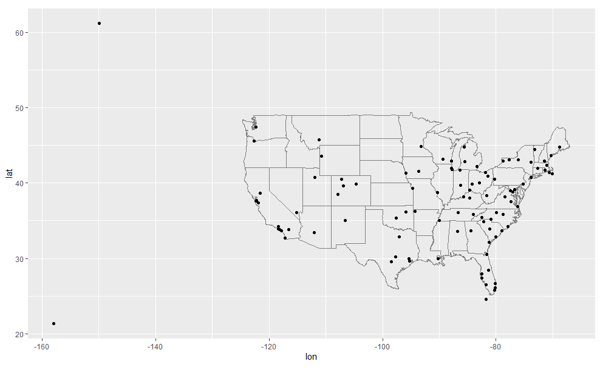

2. `flights` 에 출발지와 목적지의 위치 (즉, `lat` 과 `lon` )를 추가하라.

3. 여객기의 나이와 연착 시간 사이에 관계가 있는가?

4. 어떤 기상 조건이 연착 가능성을 더 높이는가?

5. 2013년 6 월 13 일에 무슨 일이 일어났는가? 연착의 공간 패턴을 표시한 다음 구글을 사용하여 날씨와 상호참조하라.


### 기타 구현

- `base::merge()` 는 네 가지 유형의 변환 조인을 모두 수행할 수 있다.

| dplyr              | merge                                     |
| ------------------ | ----------------------------------------- |
| `inner_join(x, y)` | `merge(x, y)`                             |
| `left_join(x, y)`  | `merge(x, y, all.x = TRUE)`               |
| `right_join(x, y)` | `merge(x, y, all.y = TRUE)`,              |
| `full_join(x, y)`  | `merge(x, y, all.x = TRUE, all.y = TRUE)` |


- 특정 **`dplyr`** 동사의 장점은 코드의 의도를 좀 더 명확하게 전달한다는 것이다. 즉, 조인 간의 차이는 실제로 중요하지만 `merge()` 인수에 숨어 있다. **`dplyr`** 의 조인은 **상당히 빠르며 행 순서를 어지럽히지 않는다.**


- **`dplyr` 의 규칙**은 SQL에 기반을 두므로 서로 옮겨쓰는 것은 복잡하지 않다.

| dplyr                        | SQL                                            |
| ---------------------------- | ---------------------------------------------- |
| `inner_join(x, y, by = "z")` | `SELECT * FROM x INNER JOIN y USING (z)`       |
| `left_join(x, y, by = "z")`  | `SELECT * FROM x LEFT OUTER JOIN y USING (z)`  |
| `right_join(x, y, by = "z")` | `SELECT * FROM x RIGHT OUTER JOIN y USING (z)` |
| `full_join(x, y, by = "z")`  | `SELECT * FROM x FULL OUTER JOIN y USING (z)`  |

’`INNER`’및 ’`OUTER`’는 선택적이며 종종 생략된다.	

- `inner_join(x, y, by = c("a" = "b"))` 과 같이 테이블 간에 다른 변수를 결합하는 것은, SQL에서 약간 다른 문법을 사용한다. `SELECT * FROM x INNER JOIN y ON x.a = y.b` . 이 구문에서 알 수 있듯이, SQL은 **`dplyr`** 보다 폭넓은 조인 유형을 지원하는데 등식이 아닌 다른 제약 조건을 사용하여 테이블을 연결할 수도 있다. (비동등 조인(non-**equisjoins**)라고도 함)


## 필터링 조인

**필터링 조인(Filtering join)**은 변환 조인과 같은 방식으로 관측값을 매칭하지만 **변수가 아닌 관측값에 영향**을 준다. 두 가지 유형이 있다.

- `semi_join(x, y)` 는 `y` 와 매치되는 `x` 의 모든 관측값을 **보존한다** .
- `anti_join(x, y)` 는 `y` 와 매치되는 `x` 의 모든 관측값을 **삭제한다** .


**세미 조인(Semi-joins)**은 *필터링된 요약 테이블을 다시 원래 행과 매치시키는 데 유용*하다. 예를 들어 가장 인기 있는 상위 10개 도착지(`dest`)를 구했다고 가정해보자.

```{r}
top_dest <- flights %>%
  count(dest, sort = TRUE) %>%
  head(10)
top_dest
```


이제 그 목적지 중 한 곳(`dest %in% top_dest$dest`)으로 운행한 항공편(`flihts`)을 찾고 싶다면 직접 필터를 만들 수 있다.

```{r}
flights %>% 
  filter(dest %in% top_dest$dest)
```

그러나 이러한 접근 방식을 여러 변수로 확장하는 것은 어렵다. 예를 들어 평균 연착시간(average `arr_delay`)이 가장 길었던 날 10일을 골라냈다고 상상해보라. `year, month, day` 를 사용하여 다시 항공편(`flights`)과 일치시키는 필터 구문을 어떻게 작성할 수 있는가?

한편 변환 조인과 같이 두 테이블을 연결하는 세미 조인을 사용할 수 있지만, 새 열을 추가하는 대신 `y` 에서 일치하는 `x` 의 행만 보존한다.

```{r}
flights %>% 
  semi_join(top_dest)
```


**세미 조인(semi-join)**은 그래픽으로 다음과 같이 표현된다.


```{r}
x <- tribble(
  ~key, ~val_x,
  1, "x1",
  2, "x2",
  3, "x3"
)

y <- tribble(
  ~key, ~val_y,
  1, "y1",
  2, "y2",
  4, "y3"
)

x %>%  semi_join(y, by="key")
```

- 매칭되었는지 여부만이 중요하다. 즉, 어떤 관측값이 매칭되는지는 중요하지 않다. 이는 필터링 조인은 뮤테이팅 조인처럼 **행을 복제하지는 않는다**는 것을 의미한다.


```{r}
x <- tribble(
  ~key, ~val_x,
  1, "x1",
  2, "x2",
  2, "x3",
  3, "x4"
)
y <- tribble(
  ~key, ~val_y,
  1, "y1",
  2, "y2",
  2, "y3",
  3, "y4"
)
x %>% semi_join(y, by="key")
```


세미 조인의 반대는 **안티 조인(Anti-join)**이다. 안티 조인은 **매칭되지 않는 행을 보존**한다.


```{r}
x <- tribble(
  ~key, ~val_x,
  1, "x1",
  2, "x2",
  3, "x3"
)
x

y <- tribble(
  ~key, ~val_y,
  1, "y1",
  2, "y2",
  4, "y3"
)
y

x %>%  anti_join(y, by="key")
```


**안티 조인(Anti-join)**은 ***조인 불일치를 진단하는 데 유용***하다. 예를 들어 `flights`과 `planes` 를 연결하는 경우, `planes` 에 매치되지 않는 `flights` 이 많다는 것을 알고 싶을 수 있다.

```{r}
flights %>%
  anti_join(planes, by = "tailnum") %>%
  count(tailnum, sort = TRUE)
```


### 연습문제

1. 항공편에 `tailnum` 이 없는 것은 무엇을 의미하는가? `planes` 에 매치되는 관측값이 없는 `tailnum` 관측값의 공통점은 무엇인가? (힌트: 한 변수가 문제의 약 90%를 설명한다.)
2. `flights` 를 필터링하여 최소 100 편의 운행을 한 여객기의 항공편만 표시하라.
3. `fueleconomy::vehicles` 와 `fueleconomy::common` 을 결합하여 가장 많은 차량 모델의 레코드만 찾아라.
4. 최악의 연착 시간을 가진 (1년 중) 48시간을 찾아라. 날씨 데이터와 교차 참조하라. 어떤 패턴을 볼 수 있는가?
5. `anti_join(flights, airports, by = c("dest" = "faa"))` 을 보고 무엇을 알 수 있는가? `anti_join(airports, flights, by = c("faa" = "dest"))` 은 어떤가?
6. 각 항공기는 단일 항공사에 의해 운항되므로 항공기와 항공사 간에 암묵적인 관계가 있을 것으로 예상할 수 있다. 이전 절에서 배운 도구를 사용하여 이 가설을 확인하거나 기각하라.

## 조인 문제

*이 장에서 작업하고 있는 데이터는 문제가 거의 발생하지 않도록 미리 정제되었다*. 여러분의 데이터는 그리 깨끗하지 않을 것이므로 조인을 원활하게 하기 위해서 주어진 **데이터에 수행해야 하는 몇 가지 작업**이 있다.

1. 우선 각 **테이블**에서 ***기본키를 구성하는 변수들을 식별***하라. 경험적이 아니라 데이터 이해를 바탕으로, *고유한 식별자가 되는 변수의 조합*을 찾아야 한다. 변수가 의미하는 바를 고려하지 않고 찾는다면 우연히도 현재의 데이터에서는 고유한 조합이지만 일반적으로는 그렇지 않을 수 있다.

   예를 들어, 고도(`alt`)와 경도(`lat`)는 각 공항(`airports`)을 고유하게 식별하지만 좋은 식별자는 아니다!

   ```
   airports %>% count(alt, lon) %>% filter(n > 1)
   #> # A tibble: 0 x 3
   #> # ... with 3 variables: alt <int>, lon <dbl>, n <int>
   ```

2. **기본 키의 변수들에 결측값이 없는지 확인**하라. 값이 결측된 경우에는 관측값을 식별할 수 없다! (기본키는 기본적으로 **NOT NULL**, 즉, 결측치가 존재하면 안된다)

3. **외래 키가 다른 테이블의 기본 키와 매칭되는지 확인**하라. 가장 좋은 방법은 **`anti_join()` 을 사용**하는 것이다. 데이터 입력 에러로 인해 키가 매칭되지 않는 경우는 흔하다. 이를 고치는 것은 큰 작업일 때가 많다.

   **키가 결측된 경우 매칭되지 않는 행을 삭제할 것인지를 신중하게 고려**하면서 내부 조인과 외부 조인을 신중히 고려해야 한다.

조인이 원활하게 진행되었는지 확인하기 위해 조인 전후의 행 수만 살피는 것은 충분하지 않다. 두 테이블 모두에 중복 키가 있는 내부 조인의 경우, 불행히도, 삭제된 행 수가 복제된 행 수와 정확히 같을 수 있다!


## 집합 연산

2 테이블 동사의 마지막 유형은 **집합 연산**이다. 일반적으로 이 필터는 가장 드물게 사용하지만, 복잡한 필터를 단순한 필터들로 분해하려는 경우에 가끔 유용하다. 이 모든 연산은 **행 전체에 동작**하는데 **모든 변수의 값을 비교**한다. 이 집합 연산은 **`x` 와 `y` 입력이 같은 변수를 가지는 것을 간주**하며 **관측값을 집합으로 취급**한다.


- `intersect(x, y) `: `x, y` 모두에 있는 관측값만 반환
- `union(x, y)` : `x` 와 `y` 의 고유한 관측값을 반환. (중복값은 제외)
- `setdiff(x, y)` : `x` 에 있지만, `y` 에 없는 관측값을 반환

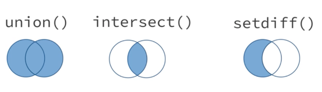


아래의 간단한 데이터에 대해서,

```{r}
df1 <- tribble(
  ~x, ~y,
   1,  1,
   2,  1
)
df2 <- tribble(
  ~x, ~y,
   1,  1,
   1,  2
)
```


네 가지 연산은 다음과 같다.

```{r}
intersect(df1, df2)

# 열이 4개가 아니라 3개임을 주목
union(df1, df2)

setdiff(df1, df2)

setdiff(df2, df1)
```


- `union_all(x, y, ...)` :  `x`와 `y` 에 있는 모든 행들을 결합. (결합된 데이터 세트의 중복 행을 제거하지 않음.)
- `setequal(x, y, ...)` : `x`와 `y`의 행이 같은 지 비교.

```{r}
union_all(df1, df2)

setequal(df1, df2)
```


### Reference  {-}

- http://www.datasciencemadesimple.com/union-union_all-function-r-using-dplyr-union-data-frames/


## Join Exercises {#join_exercises}

이번 장에서는 `dplyr` 패키지를 이용한 데이터의 병합과 관련하여 사용할 수 있는 다음의 함수들에 대하여 살펴보기로 한다:

- [inner_join()](https://statisticsglobe.com/r-dplyr-join-inner-left-right-full-semi-anti/#inner_join)
- [left_join()](https://statisticsglobe.com/r-dplyr-join-inner-left-right-full-semi-anti/#left_join)
- [right_join()](https://statisticsglobe.com/r-dplyr-join-inner-left-right-full-semi-anti/#right_join)
- [full_join()](https://statisticsglobe.com/r-dplyr-join-inner-left-right-full-semi-anti/#full_join)
- [semi_join()](https://statisticsglobe.com/r-dplyr-join-inner-left-right-full-semi-anti/#semi_join)
- [anti_join()](https://statisticsglobe.com/r-dplyr-join-inner-left-right-full-semi-anti/#anti_join)
- **nest_join()**

먼저 이 함수들의 기본 개념과 (간단한 예를 들어) 차이점들에 대하여 살펴볼 것이다. 


그런 다음 좀 더 복잡한 예제들을 살펴보기로 한다:

- [복수 데이터 프레임의 조인](https://statisticsglobe.com/r-dplyr-join-inner-left-right-full-semi-anti/#multiple_data)
- [복수 개 컬럼에 의한 조인](https://statisticsglobe.com/r-dplyr-join-inner-left-right-full-semi-anti/#multiple_columns)
- [데이터 조인과 ID 삭제](https://statisticsglobe.com/r-dplyr-join-inner-left-right-full-semi-anti/#delete_id)


### 예제 데이터의 생성

먼저 예제에 사용될 예제 데이터 프레임들을 생성해 보기로 한다.

```{r}
data1 <- data.frame(ID = 1:2,                      # Create first example data frame                    
              X1 = c("a1", "a2"),                    
              stringsAsFactors = FALSE) 
data1
data2 <- data.frame(ID = 2:3,                      # Create second example data frame
              X2 = c("b1", "b2"),                    
              stringsAsFactors = FALSE)
data2
```


다음의 그림은 지금 생성한 두 개의 데이터 프레임과 `dplyr` 패키지의 다양한 조인 함수를 이용하여 이들 데이터 프레임을 병합하는 방법을 보여주고 있다.

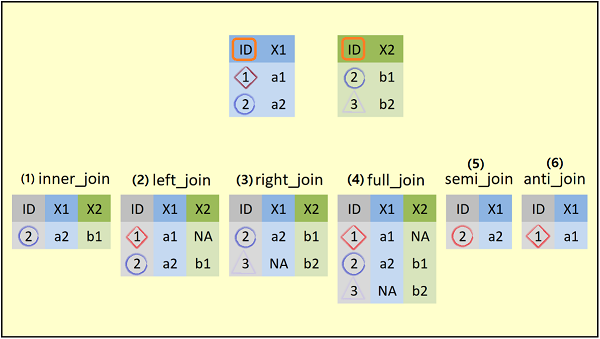

- 그림의 제일 위에 **예제 데이터 프레임의 구조**를 보여주고 있다. 각 데이터 프레임은 두 개의 컬럼을 가지고 있다. `data1`은 `ID`와 `X1` 컬럼을, 그리고 `data2`는 `ID`와 `X2` 컬럼을 가지고 있다.  **`ID` 컬럼**은 두 데이터 프레임의 **공통 컬럼**이며, 또한 **공통의 값인 `2`**를 가지고 있다.

- (1)  ~ (6) : 두 데이터 프레임을 조인하는 방법에 따라 **결과로 생성되는 데이터 프레임**을 보여주고 있다. 이들 각각에 대하여 예를 들어 살펴보기로 한다.

  

### 예제 1: `inner_join()`

먼저 dplyr 패키지를 설치하여 불러오기를 해야 한다:

```{r}
install.packages("dplyr")                          # Install dplyr package 
library("dplyr")                                   # Load dplyr package
```


이 예제에서는 예제 데이터 프레임의 **inner_join()** 함수에 대하여 살펴보기로 한다.


#### `inner_join()` 함수의 기본 형식

```
inner_join(
  x,
  y,
  by = NULL,
  copy = FALSE,
  suffix = c(".x", ".y"),
  ...,
  na_matches = c("na", "never")
) 
```


#### `inner_join()` 함수의 예

inner_join 방식으로 데이터 프레임을 병합하기 위해서는, 병합할 두 개의 데이터 프레임의 이름들(`data1`과 `data2`)과 병합에 사용될 공통의 컬럼(여기서는 `ID` 컬럼)을 `inner_join()` 함수의 인수(`by = ”ID”`)로 지정해 주면 된다.

```{r}
inner_join(data1, data2, by = "ID")                # Apply inner_join dplyr function
```

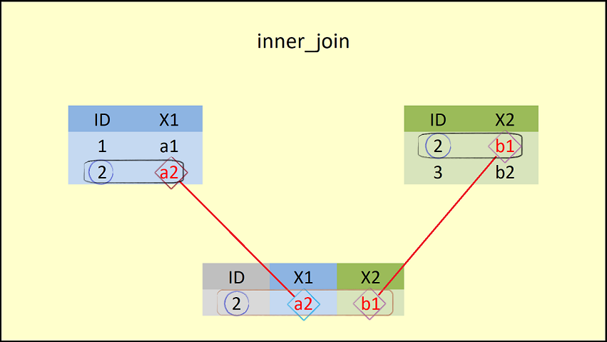

- 이 그림은 inner_join의 결과를 보여준다. 이 그림에서 볼 수 있듯이, `inner_join()` 함수는 두 개의 데이터 프레임의 컬럼들을 병합하지만, 공통의 컬럼인 `ID`에 대해 같은 값을 갖는 행만**(`ID = 2`)**을 병합한다.


### 예제 2: `left_join()`


#### `left_join()` 함수의 기본 형식

```
left_join(
  x,
  y,
  by = NULL,
  copy = FALSE,
  suffix = c(".x", ".y"),
  ...,
  keep = FALSE
)
```


#### `left_join()` 함수의 예

```{r}
left_join(data1, data2, by = "ID")                 # Apply left_join dplyr function
```


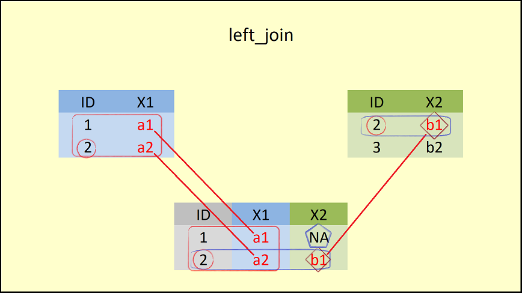

- inner_join과의 차이는 left_join은 `left_join()` 함수에 **첫 번째로 입력된(left)** 데이터 프레임(`data1`)의 **모든 행들**을 포함하고 있다.  
- 이때 결과로 생성되는 데이터 프레임의 `ID = 1`에 해당하는 행의 `X2` 컬럼에는 `NA`로 채워진다.

 

### 예제 3: `right_join()`

`left_join()` 함수의 상대적 함수가 `right_join()` 함수이다.

#### `right_join()` 함수의 기본 형식

 이 함수의 기본 형식은 다음과 같다:

```{}
right_join(
  x,
  y,
  by = NULL,
  copy = FALSE,
  suffix = c(".x", ".y"),
  ...,
  keep = FALSE
)
```


#### `right_join()` 함수의 예

```{r}
right_join(data1, data2, by = "ID")                # Apply right_join dplyr function
```

 

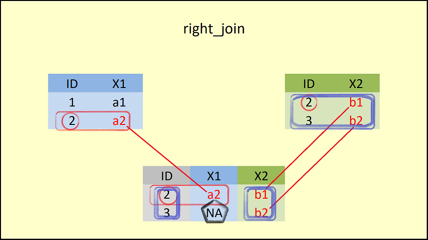

- `right_join()` 함수에 **두 번째로 입력된(right)** 데이터 프레임(`data2`)의 **모든 행들**을 포함하고 있다.  

- 이때 결과로 생성되는 데이터 프레임의 `ID = 3` 에 해당하는 행의 `X1` 컬럼에는 `NA`로 채워진다.

  

### 예제 4: `full_join()`


#### `full_join()` 함수의 기본 형식

`full_join()` 함수는 join() 함수 중에서 가장 많은 데이터를 유지한다.

 이 함수의 기본 형식은 다음과 같다:

```{}
full_join(
  x,
  y,
  by = NULL,
  copy = FALSE,
  suffix = c(".x", ".y"),
  ...,
  keep = FALSE
)
```


#### `full_join()` 함수의 예

```{r}
full_join(data1, data2, by = "ID")                 # Apply full_join dplyr function
```

 

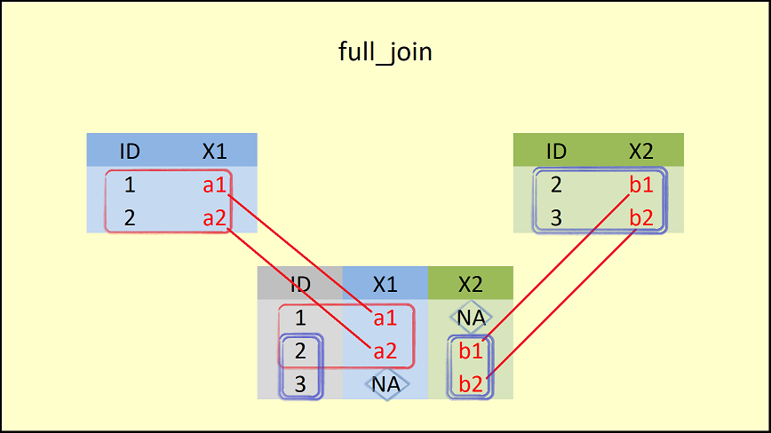

- `full_join()` 함수는 **두 데이터 프레임(`data1과 `data2`)의 모든 행들**을 포함하고 있다.  
- 이때 결과로 생성되는 데이터 프레임의 `ID = 1` 에 해당하는 행의 `X2` 컬럼과 `ID=3`에 해당하는 행의 `X1`컬럼은  `NA`로 채워진다.


### 예제 5: `semi_join()`

앞의 4개의 join 함수들(`inner_join()`, `left_join()`, `right_join()`, 그리고 `full_join()`)은 **변환 조인(mutating joins)**이라고도 불린다. 변환 조인은 두 데이터 소스의 변수(컬럼)들을 결합한다.

다음의 두 개의 join 함수들(``semi_join()``과 `anti_join()`)은 **필터링 조인(filtering joins)**이라고 불린다. 필터링 조인은 왼쪽 데이터(`x`)의 모든 경우를 유지하며, 오른 쪽 데이터(`y`)를 필터로 사용한다.


#### `semi_join()` 함수의 기본 형식

 이 함수의 기본 형식은 다음과 같다:

```{}
semi_join(x, y, by = NULL, copy = FALSE, ..., na_matches = c("na", "never"))
```


#### `semi_join()` 함수의 예

```{r}
semi_join(data1, data2, by = "ID")                 # Apply semi_join dplyr function
```

 

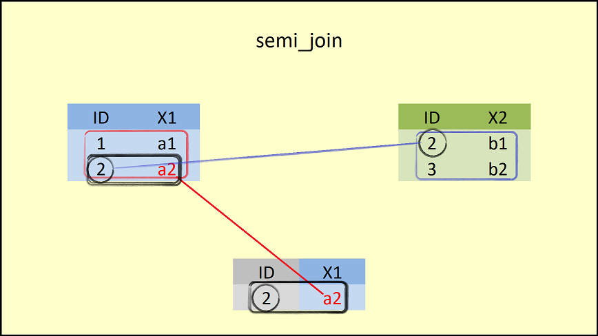

- `semi_join()` 함수는 **왼쪽의 데이터 프레임(`data1`)**에 대하여 **오른 쪽 데이터 프레임(data2)에 있는 공통 컬럼인 ID 값과 비교**하여 **대응이 되는 행**만을 유지한다. 
- 이 때, 결과로 생성되는 데이터 프레임의 구조는 왼쪽 데이터 프레임의 구조와 같다.

 

### 예제 6 : `anti_join()`

#### `anti_join()` 함수의 기본 형식

anti_join() 함수는 앞에서 살펴 본 semi_join() 함수의 결과의 반대이다.

 이 함수의 기본 형식은 다음과 같다:

```{}
semi_join(x, y, by = NULL, copy = FALSE, ..., na_matches = c("na", "never"))
```


#### `anti_join()` 함수의 예

```{r}
anti_join(data1, data2, by = "ID")                 # Apply anti_join dplyr function
```

 

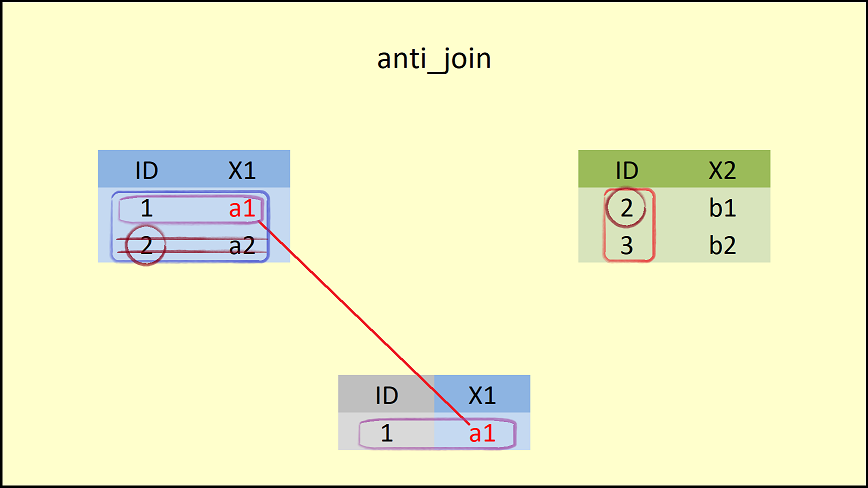

- `anti_join()` 함수는 **왼쪽의 데이터 프레임(`data1`)**에 대하여 **오른 쪽 데이터 프레임(data2)에 있는 공통 컬럼인 ID 값과 비교**하여 ***대응이 되지 않는 행***만을 유지한다. 
- 이 때, 결과로 생성되는 데이터 프레임의 구조는 왼쪽 데이터 프레임의 구조와 같다.

 

지금까지 dplyr 패키지의 6 개 join 함수들의 기본 개념에 대하여 살펴 보았다. 그러나, 실제에 있어서는 지금까지 살펴 본 예제보다는 훨씬 더 복잡하다. 다음에서 좀 더 복잡한 상황에서 join 함수를 어떻게 적용할 수 있는지 살펴보기로 한다.


### 예제 7: 복수 개의 데이터 프레임 조인

좀 더 복잡한 상황을 만들기 위해 세 번째 데이터 프레임 예제 데이터를 생성한다:


#### 예제 데이터의 생성

```{r}
data3 <- data.frame(ID = c(2, 4),                   # Create third example data frame 
              X2 = c("c1", "c2"),                    
              X3 = c("d1", "d2"),                    
              stringsAsFactors = FALSE) 
data3                                               # Print data to RStudio console 
```


- 세 번째 데이터 프레임인 `data3`은 `ID`, `X2`, `X3` 등의 컬럼을 가지고 있다.  이 컬럼들 중 `X2` 컬럼은 `data2`에도 존재하고 있음을 주목하기 바란다.


이번 예제에서는 복수 개의 데이터 프레임들을 하나의 데이터 세트로 병합하는 방법에 대하여 살펴보기로 한다. 여기서는 `full_join()` 함수를 사용하겠지만, 다른 종류의 join 함수들도 같은 방법으로 이용할 수 있다.

```{r}
full_join(data1, data2, by = "ID") %>%              # Full outer join of multiple data frames
full_join(., data3, by = "ID")
```

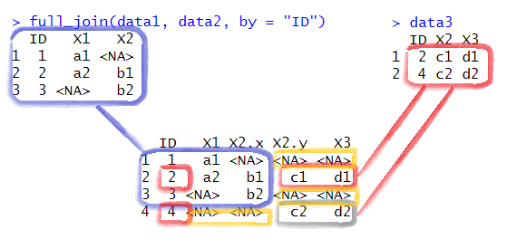

- `full_join(data1, data2, by = "ID")`

  - 먼저 `data1`과 `data2`를 공통 컬럼인 `ID`를 기준으로 해서 **full_join**을 한다. 

    

- 그런 다음, 그 결과로 생성된 객체(`.`)를  `data3`와 역시 공통 컬럼인 `ID`를 기준으로 full_join을 한다. 

  

  - 왼쪽 테이블의 `X2`는 `X2.x`로, 오른쪽 테이블의 `X2`는 `X2.y`로 변환되어 있음을 알 수 있다.
  - 최종으로 생성된 데이터의 첫 3개 행은 왼쪽 테이블, 그리고 네 번째 행은 오른쪽 테이블에 의해 생성되었다. 
  - 다만 `X2.y` 컬럼과 `X3` 컬럼 중 첫 번째와 세 번째 행의 데이터, 그리고 네 번째 행의 `X1`과 `X2.x` 컬럼의 값은 모두 `NA`로 채워져 있음을 알 수 있다.

   

### 예제 8: 복수 컬럼에 의한 조인

**예제 7**에서 본 것처럼, `data2`와 `data3`은 `ID`와 `X2` 컬럼을 같이 가지고 있다.  이 **두 컬럼을 기준으로 두 개의 데이터 프레임을 조인**하고자 한다면, `by =` 옵션에 동시에 그 변수들을 조인 변수로 지정하면 된다. 

```{r}
full_join(data2, data3, by = c("ID", "X2"))         # Join by multiple columns 
```

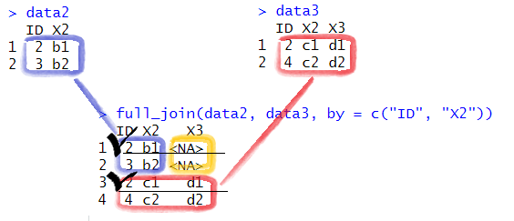

**주의** : 최종적으로 생성된 데이터 세트에서 `ID`가 `2` 인 행의 경우, ‘**1번 행**’은 `data2`에는 `X3`가 없으므로 `NA`가 그리고 ‘**4번 행**’은 `data3`에는 `X3`가 `d1` 이므로 `d1` 값이 복사됨을 알 수 있다.


### 예제 9: 데이터 조인과 ID 삭제

마지막의 예로, 데이터 프레임을 조인하는데 사용된 공통의 컬럼인 ID가 더 이상 필요하지 않을 때가 있다. 이러한 ID 컬럼을 제거하기 위해서는 다음과 같은 코드를 사용하면 된다:

```{r}
inner_join(data1, data2, by = "ID") %>%              # Automatically delete ID  
select(- ID) 
```


### Further Reading {-}

- [The merge Function in R](https://statisticsglobe.com/r-merging-data-frames-by-column-names-merge-function)
- [The cbind R Function](https://statisticsglobe.com/cbind-r-command-example/)
- [rbind & rbind.fill [plyr\] in R](https://statisticsglobe.com/rbind-in-r-example-vector-data-frame-fill-columns/)
- [List of Useful R Functions](https://statisticsglobe.com/r-functions-list/)
- [The R Programming Language](https://statisticsglobe.com/r-programming-language/)
- https://statisticsglobe.com/r-dplyr-join-inner-left-right-full-semi-anti
