# Tidy Data      {#tidy_data}

```{r warning = FALSE}
library(tidyverse)
```


## 타이디 데이터 철학   {#tidy_data_philosophy}

(`tidyverse` 패키지와 함께 불려와 지는) “타이디(tidy)”  데이터 세트를 생성하는`tidyr` 패키지에 있는 도구들에 대하여 살펴보기로 한다.  

타이디 데이터 세트는 다음과 같은 단순한 구조적 규칙을 준수한다:

- 데이터 세트는 변수(컬럼)과 관측치(행)으로 조직화된 값들의 집합이다.
- 변수는 관측치에 대한 동일 속성을 측정해야한다.
- 관측치는 변수로 측정되는 동일한 단위를 나타내야 한다.

타이디 데이터 관습은 데이터를 조직화해야 할 필요가 있을 때마다 “다시 생각하게 만드는 것을” 피하게 해 주는 표준 조직을 제공한다.

좀 더 적극적으로 데이터를 “타이디”하게 만드는 것은 나중에 더 많은 시간을 절약하게 줄 것이다.

### 분석의 단위

데이터 센트의 각 행이 *분석의 단위(unit of anlysis)*를 나타내야 한다. 단위는 대상, 또는 대상 내의 시험 또는 주제의 모든 그룹 등이 될 수 있다.

일부 분석은 개별 단위와 종합된 단위를 설명하는 변수들을 포함할 수 있다. 예를 들어, 학생 수준의 분석은 학교 수준의 변수를 포함할 수 있다. 

**종단적 연구(longitudinal studies)**들은 대상 내에서 그리고 대상 간의 변수들을 포함할 수 있다. 

다차원 분석에 대해서는 분석의 단위가 일반적으로 가장 낮은 수준이다.

### 데이터 세트

`patient_pt1_dm.csv` 파일을 `read_csv()` 함수로 불러와서 티블 변수 `d`에 대입한다. 

```{r}
d <- read_csv("data7/patient_pt1_dm.csv")
```


### `docid` 별 그루핑

데이터 세트 `d`를 `docid` 로 그루핑하여, `by_doc` 데이터 세트를 생성한다.

```{r}
# group_by creates a grouped_df (grouped data frame) class structure
by_doc <- group_by(d, docid)
class(by_doc)
```


### 요약 정보 확인

`summarise()` 함수를 이용하여 `by_doc` 데이터 세트의 요약 정보를 확인하고, 그 결과를 변수 `pat_summ`에 대입한다.

```{r}
# Create summaries of patients by doctor
pat_summ <- summarise(by_doc,
                      n_pat = n(), # number of patients
                      longest_los = max(lengthofstay), # longest length of stay
                      avg_age = mean(age), # average age
                      n_stage_four = sum(cancerstage=="IV") # number of stage IV patients 
                      )
pat_summ
```

### 다중 레벨 데이터 확인

`doc_id`에 의해 `d`와 `pat_sum`을 inner join 해서, 의사별 환자에 대한 다중 레벨의 데이터를 확인한다.

```{r}
# data at multiple levels - patients nested in doctors
d %>% 
  inner_join(pat_summ) %>% 
  select(sex, age, lengthofstay, docid, avg_age, longest_los) %>% 
  head(n=3)
```


## Untidy data   {#tidy_data_untidy}

분석가에 의해 수집되지 않은 데이터의 사용은 생각보다 더 untidy data를 자주 대하게 만든다.

데이터는 다양한 방식으로 엉망이 될 수 있지만, `tidyr` 도구들로 타이디하게 될 수 있는 두 가지 방법에 대하여 살펴보기로 한다:

- 컬럼 제목들은 변수명이 아닌 값이다.
- 복수의 변수들이 하나의 컬럼에 저장되어 있다.

untidy 데이터 세트에 대하여 살펴보고, `tidyr` 패키지의 `pivot_longer()` 함수와 `pivot_wider()` 함수가 어떻게 그것들을 타이디하게 만들어 주는지 살펴보기로 한다.


## 컬럼 제목들이 변수 명이 아니고 값들인 경우

3년간 3개의 학과로 부터 졸업생에 대한 데이터(`dept1.csv`)를 먼저 불러오기로 한다. 

계획된 분석은 수년간 졸업자 수가 얼마나 증가했는지를 알아보는 것이다.

여기서 분석의 단위는 특정 년도(`2015`, `2016`, `2017` 등)에 있어서 특정 학과의 졸업율이다. 

각각의 행은 학과별 해당 년도의 인원을 나타낸다.

### 데이터 세트

```{r}
dept <- read_csv("data7/dept1.csv")
dept
```

- `2015`, `2016`, `2017` 등의 **연도(Year)**는 분석의 ‘**예측 변수(predictor)**’이므로 **컬럼 변수**가 되어야 한다. 
- 각 3개 학과들은 3년간의 데이터를 가지고 있으므로, 매 년도마다 3개의 행을 가지고 있다. 
- 또한, 전체 값들로 구성되는 테이블은 동일한 값들로 해당 년도에 있어서 해당 학과의 졸업자 수를 측정하고 있다. 
- 그러므로, 해당 년도의 **값**들을 **한 컬럼**에 넣을 수 있다.


### 사용할 수 있는 함수의 종류    {#tidy_data_functions}

1. `tidyr` 패키지의 `pivot_longer()`  함수
2. `tidyr` 패키지의 `gather()` 함수
3. `reshape2` 패키지의 `melt()` 함수


### `pivot_longer()`  함수

`pivot_longer()` 함수를 사용하기 위해서는, 재구성할 변수의 집합(‘컬럼의 제목’과 ‘값’)을 선택한다:

- 원래 테이블의 **컬럼의 제목**들은 새로운 테이블의 컬럼 변수가 되고 그 컬럼의 값으로 반복적으로 축적이 된다 (`names_to =`)
- 원래 테이블의 컬럼 변수에 있는 **값들**은 새로운 테이블의 **단일 컬럼 변수의 값**으로 축적이 된다(`values_to =` )


이 과정을 “**long 형태로 재구성(reshaping)**”한다고 말한다.


#### `pivot_longer()` 함수의 구문

> **pivot_longer(**
>      **data,**
>      **cols,**
>      **names_to = "name",**
>      **names_prefix = NULL,**
>      **names_sep = NULL,**
>      **names_pattern = NULL,**
>      **names_ptypes = list(),**
>      **names_transform = list(),**
>      **names_repair = "check_unique",**
>      **values_to = "value",**
>      **values_drop_na = FALSE,**
>      **values_ptypes = list(),**
>      **values_transform = list(),**
>      **...**
> **)**
>
> **주요 인수 :**
>
> - `data` : 피봇할 데이터 프레임
> - `names_to ="name"`: 컬럼 제목을 값으로 유지할 새로운 컬럼 변수 명 (`name`)
> - `values_to = “value”`: 데이터 값들을 저장할 새로운 컬럼 변수 명(`value`)
>

디폴트 값으로 `pivot_longer` 함수는 축적되는 모든 컬럼을 선택할 것이다. 그러나 새로운 `names_to =`에 있는 값들이 변화하지 않는 컬럼들은 축적되지 않아야 한다.


#### `pivot_longer()` 함수의 사용 예

재구성할 데이터 세트는 다음과 같다:

```{r}
dept
```

새롭게 재구성되는 데이터 세트에는 **‘년도(`year`)’**와 **‘졸업율(`grad`)’** 등의 2 개의 컬럼으로 표시하고 싶다. 

- **년도**는 원래 데이터의 컬럼 제목이기 때문에, `names_to = ` 인수에  변수명을 **`year`**로 지정할 것이다.  
- 또한 `2015`, `2016` 그리고 `2017` 컬럼에 있는 졸업율의 **값들**은 또 다른 새로운 변수에 축적이 되어야 하는데 이를 `values_to = ` 인수로 **`grad`** 변수를 지정하여 저장할 것이다.

**학과명(`id`)**은 연도(`year`)와 상관없이 변함이 없으며 따라서 축적할 필요가 없다. 

- 여기서 `c(`\`2015\`, \`2016\`, \`2017\``)`로 압축이 되어야 하는 컬럼에 대해서만 컬럼을 지정하여 재구성을 할 것이며(주의 : 문자로 시작하지 않는 컬럼 명에 대해서는 컬럼 명을 지정할 때 **`** 기호가 필요),
- 이처럼 압축될 필요가 없는 컬럼에 대해서는 ‘`-`  ’기호 다음에 컬럼을 지정한다. 

```{r}
# the new column "year" uses the column headings as values,
#  the new column "graduates" will be the collapsed values
#  we do not want to collapse id
dept_by_year <- dept %>% 
  pivot_longer(names_to="year", values_to="grad", -id)
dept_by_year
```


#### pivot_longer() 함수의 활용 단계

>  **`pivot_longer(names_to="year", values_to="grad", -id)`**

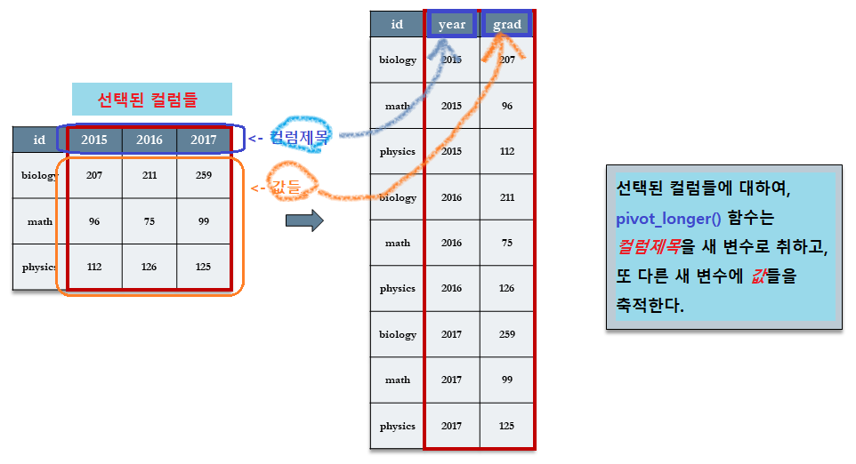


##### 단계별 분석 {-}

##### [Step 1]`names_to="year"`  :  컬럼 제목들을 값으로 하는 `변수(year)` 지정

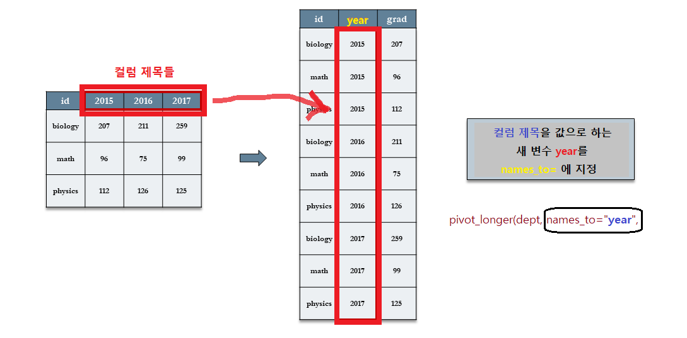


##### [Step 2]`values_to="grad"` : 데이터 값들을 저장할 변수(grad) 지정

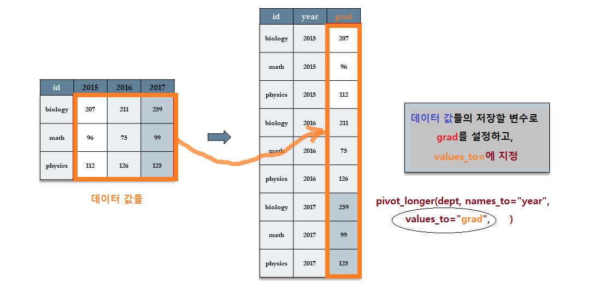


##### [Step 3] `-id` : 선택되지 않는 컬럼 지정. (`- 컬럼명`)

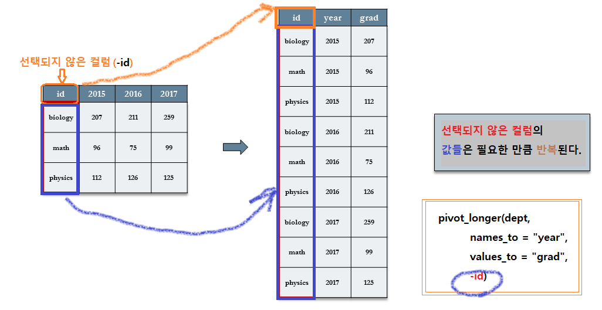


### `gather()` 함수

`gather()` 함수를 사용하기 위해서는, 재구성할 변수의 집합(‘컬럼의 제목’과 ‘값’)을 선택한다:

- 원래 테이블의 **컬럼의 제목**들은 새로운 테이블의 컬럼 변수가 되고 그 컬럼의 값으로 반복적으로 축적이 된다 (`key = "year"`)
- 원래 테이블의 컬럼 변수에 있는 **값들**은 새로운 테이블의 **단일 컬럼 변수의 값**으로 축적이 된다(`value =grad` )


#### `gather()` 함수의 구문

>**gather(**
>     **data,**
>     **key = "key",**
>     **value = "value",**
>     **...,**
>     **na.rm = FALSE,**
>     **convert = FALSE,**
>     **factor_key = FALSE**
>**)**
>**주요 인수**
>
>- `data` : 피봇할 데이터 프레임
>- `key = “key”` :  컬럼 제목을 값으로 유지할 새로운 컬럼 변수 명 (`key`)
>- `value = “value”` : 데이터 값들을 저장할 새로운 컬럼 변수 명(`value`)


- `df %>% gather("key", "value", x, y, z)`는 
- `df %>% pivot_longer(c(x, y, z), names_to = "key", values_to = "value")`와 같다.


#### `gather()` 함수의 사용 예

앞의 예를 그대로 이용하기로 한다. 

원래의 테이블인 `dept`에서 

- \`2015\`, \`2016\`, \`2017\` **세 개의 컬럼**이 새롭게 재구성되는 데이터 세트에서는 **‘년도(`year`)’**로 
- 그리고 이 세 개의 컬럼에 있는 **값들**은 새로운 테이블의  **‘졸업율(`grad`)’ 컬럼의 값**으로 표시하고 싶다. 

이를 위해, 

- 먼저 \`2015\`, \`2016\`, \`2017\` 등의 **세 개의 컬럼**을 선정한다.
- 이 세 개의 **컬럼제목을 값**으로 하는 새로운 테이블의 컬럼 이름을 지정한다. (`key = “year”`)
- 이 세 개의 **컬럼에 저장되어 있는 값들**을 저장할 새로운 테이블의 컬럼 이름을 지정한다. (`value = “grad”`


\`2015\`, \`2016\`, \`2017\` 등이 원래 데이터의 **컬럼 제목**이기 때문에 `key = ` 인수에  변수명을 `year`로 지정할 것이다.  

또한 `2015`, `2016` 그리고 `2017` 컬럼에 있는 졸업율의 **값**들은 또 다른 새로운 변수에 축적이 되어야 하는데 이를 `value = ` 인수로 `grad` 변수를 지정하여 저장할 것이다. 

```{r}
dept %>% 
  gather(`2015`, `2016`, `2017`, key = "year", value = "grad")
```

- **`year`** 변수에 \`2015\`, \`2016\`, \`2017\` 등의 **컬럼 제목**이 **값으로 저장**됨을 알 수 있다.
- **`grad`** 변수에 \`2015\`, \`2016\`, \`2017\` 등의 **컬럼 값들**이 저장되어 있음을 알 수 있다.


#### `gather()` 함수의 활용 단계

>**dept %>%** 
>  **gather(\`2015\`, \`2016\`, \`2017\`, key = "year", value = "grad")**

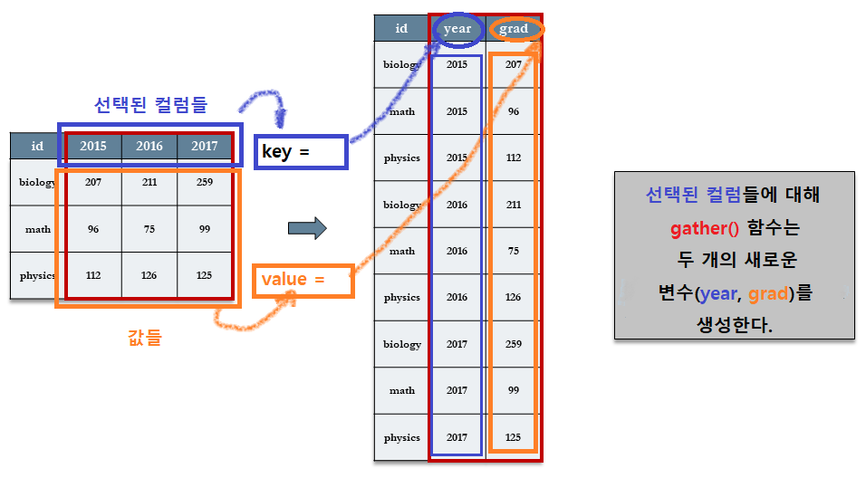

- 선택되지 않은 나머지 컬럼(`id`)은 그대로 새로운 테이블에 반복적으로 저장되어 있음을 알 수 있다.


##### 단계별 분석 {-}


이와 같은 타이디 데이터를 만들려면 해당 열을 새로운 부 변수로 **수집(gather)**해야 한다. 이 작업은 다음의 세 단계로 이루어진다.

##### [Step 1]  gather(\`2015\`, \`2016\`, \`2017\`,   :  컬럼 제목들 선택

2015, 2016, 2017 등 값으로 되어 있는 컬럼 제목 세 개를 선택한다. 이 때, 선택된 컬럼 제목을 (``, 역 따옴표)안에 기입한다. 

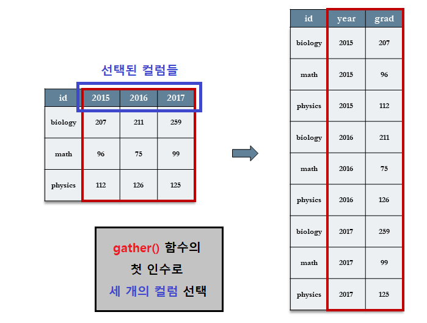


##### [Step 2]  `key = "year"` :  새로운 테이블의 컬럼 명 지정

선택된 세 개의 컬럼이 새로운 테이블에 저장될 컬럼 명을 지정한다. 여기서는 `year`로 정하고 있다.

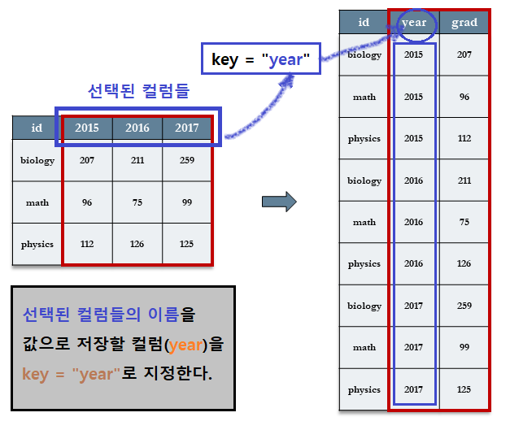


##### [Step 3]  `value = "grad"` :  새로운 테이블의 컬럼 명 지정

선택된 세 개의 컬럼이 새로운 테이블에 저장될 컬럼 명을 지정한다. 여기서는 `year`로 정하고 있다.

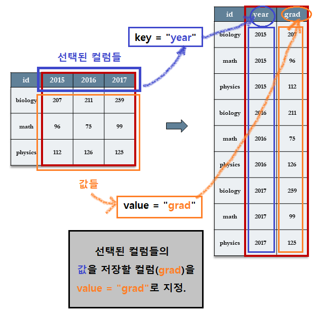


### `melt()` 함수

`melt()` 함수를 사용하기 위해서는, 재구성할 변수의 집합(‘컬럼의 제목’과 ‘값’)을 선택하는 것이 아니고 원래의 테이블에서 사용하고 있는 컬럼 중 새로운 테이블에서도 계속 사용할 컬럼을 지정해 주면 된다.

- id 변수를 지정한다. (`id.vars = “id”`)
- 원래 테이블의 **컬럼의 제목**을 저장할 변수를 지정한다(`variable.name = year`).
- 원래 테이블의 컬럼 변수에 있는 **값들**을 저장한 새로운 테이블의 **컬럼 변수의 이름**을 지정한다(`value.name = "grad"`)


#### `reshape2` 패키지의 설치

`melt()` 함수를 사용하기 위해 `reshape2` 패키지를 설치한다.

```{r message = FALSE}
# install.packages("reshape2")
library(reshape2)
```


#### `melt()` 함수의 구문

>**melt(**
>       **data,**
>       **id.vars,**
>       **measure.vars,**
>       **variable.name = "variable",**
>       **...,**
>       **na.rm = FALSE,**
>       **value.name = "value",**
>       **factorsAsStrings = TRUE**
>**)**
>
>**주요 인수**
>
>- `data` : 재구성할 데이터 프레임
>- `id.vars` : `id` 변수들의 벡터
>- `measure.vars`	: 측정된 변수들의 벡터. 정수(변수의 위치) 또는 문자열(변수명). 빈 칸이면 `id.vars` 가 아닌 변수를 사용.
>- `variable.name = “variable”` : 측정된 변수 명을 저장하는데 사용하는 변수의 이름. 디폴트 값은 “`variable`”
>- `...	`: 추가적 인수들
>- `na.rm`	: NA 값을 데이터 세트에서 제거할 지 여부
>- `value.name ="value"` : 값들을 저장하기 위해 사용될 변수의 이름. 디폴트 값은 “`value`”
>- `factorsAsStrings` : 측정 변수로서 멜트될 때 factor 변수를 문자형으로 변환할 지 여부.


#### `melt()` 함수의 사용 예

```{r}
dept %>% 
     melt(id.vars = "id", variable.name = "year", value.name = "grad")
```

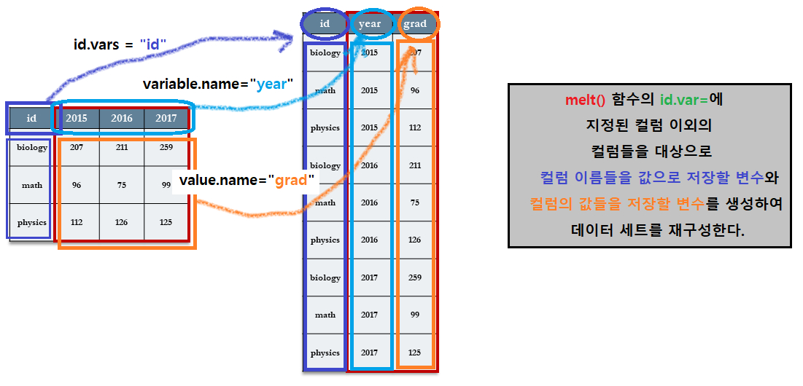


##### 단계별 분석 {-}

##### [Step 1]  `id.vars = “id”`  :  `id` 컬럼을 지정한다.

`dept` 테이블의 `id.vars` 컬럼으로 `id` 컬럼을 지정한다.


##### [Step 2]  variable.name = “year” : `id` 컬럼 이외의 컬럼 이름(variable)을 값으로 저장할 변수 지정

`dept` 테이블의 `id` 컬럼 이외의 `2015`, `2016`, `2017` **컬럼 이름을 값으로 재구성할 컬럼**의 이름을 `year`로 지정한다.

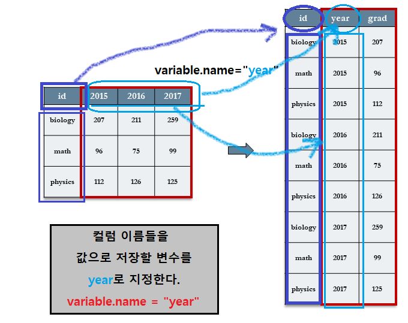


##### [Step 3]  value.name = “grad” : `id` 컬럼 이외의 컬럼 값(value)을 저장할 변수 지정

`dept` 테이블의 `id` 컬럼 이외의 `2015`, `2016`, `2017` 컬럼의 행의 값을 저장할  컬럼의 이름을 `grad`로 지정한다.

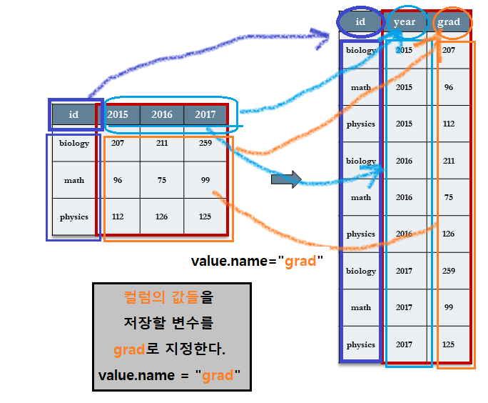


## 하나의 컬럼에 복수 개의 변수들이 있는 경우   {#tidy_data_one_column}

컬럼들은 한 변수를 나타내는 값들을 담고 있어야  하지만, 종종 복수 개의 변수들이 같은 컬럼에 저장되는 데이터 세트를 종종 접할 때가 있다.

나이(`age`), 길이(`length`), 몸무게(`weight`) 등의 관측치를 한 개의 컬럼에 저장한 곤충(`worms`)에 대한 데이터 세트를 살펴보기로 한다.

### 데이터 세트

```{r}
worms <- read_csv("data7/worms.csv")
worms
```

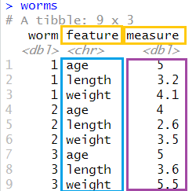

- 곤충에 대한 분석의 단위로 나이(`age`)가 길이(`length`)와 몸무게(`weight`)를 예측할 수 있는지 알고 싶다. 따라서 각 행은 한 마리의 곤충에 대한 데이터이다.
- 여기서는 특성(`feature`) 컬럼에 저장되어 있는 3 종류의 데이터 값(`age`,` length`, `weight`)들을 세 개의 컬럼(`age`,` length`, `weight`)으로 확장하고자 한다.
- 

### 사용할 수 있는 함수의 종류

- `tidyr` 패키지의 `pivot_wider()`  함수
- `tidyr` 패키지의 `spread()` 함수
- `reshape2` 패키지의 `dcast()` 함수


### `pivot_wider()` 함수

이 문제는 컬럼의 제목들이 실제로 변수의 값이 되어야 할 문제를  `pivot_longer()` 함수로 해결하였던 앞의 문제와 반대가 되는 상황이다. 

여기서는 `age`, `length`, 그리고 `weight`  값들을 컬럼 제목으로 변환하고자 한다. 

이러한 반대가 되는 절차에서는 `names_from=`에 컬럼 제목으로 전환될 컬럼 변수(기존 데이터의 `feature` 컬럼)를 지정해주고, `values_from=`에는 새로운 컬럼으로 확장될 값이 저장되어 있는 컬럼(`measure`)을 지정해 준다.  

이 과정을 “**wide 형태로 재구성**”한다고 말한다.


#### `pivot_wider()` 함수의 구문

> **pivot_wider(**
>      **data,**
>      **id_cols = NULL,**
>      **names_from = name,**
>      **names_prefix = "",**
>      **names_sep = "_",**
>      **names_glue = NULL,**
>      **names_sort = FALSE,**
>      **names_repair = "check_unique",**
>      **values_from = value,**
>      **values_fill = NULL,**
>      **values_fn = NULL,**
>      **...**
> **)**
>
> **주요 인수 :**
>
> - `data`  : 데이터 프레임
> - `id_cols` = NULL :
> - `names_from=`: 컬럼 제목으로 확장해야 할 값을 갖고 있는 컬럼 변수 명
> - `values_from=`:  확장된 컬럼의 값들로 채워질 값을 저장하고 있는 컬럼 변수 명


#### `pivot_wider()` 함수의 사용 예

여기에서, 새롭게 만들어지는 테이블의 컬럼 제목의 일부로 `feature` 변수에 저장되어 있는 값들을 사용할 것이다. 

따라서 이 `feature` 변수를 `names_from=`에 지정할 것이다. 

또한, `measure` 컬럼에 있는 값들을 새롭게 만들어진 컬럼의 행으로 채울 것이다. 

따라서 `measure` 변수를 `values_from=`의 값으로 지정할 것이다.

```{r}
by_worm <- worms %>% 
  pivot_wider(names_from=feature, values_from=measure)
by_worm
```

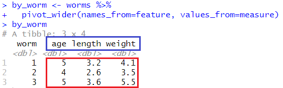

- 원 테이블(`worm`)의 `feature` 컬럼이 새로운 테이블(`by_worm`)의 `age`, `length` 그리고 `weight` 컬럼으로 확장되었다.
- 이 확장된 컬럼들의 값들은 원 테이블의 `measure` 컬럼의 값들로 채워졌음을 알 수 있다.


#### `pivot_wider()` 함수의 활용 단계

>  **`pivot_wider(names_from=feature, values_from=measure)`**

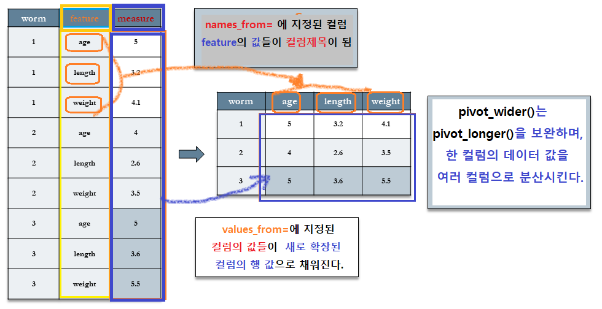


### `spread()` 함수

`spread()` 함수는 `gather()` 함수의 역함수로서 관측변수를 다시 되돌린다. 그리고 나면 데이터 세트를  ‘wide’ 형식으로 펼치게 된다. 

앞의 예에서 사용한 long 형태의 `worms` 데이터 세트를 wide 형태로 펼쳐 보기로 한다.

#### `spread()` 함수의 구문

>**spread(data,** 
>
>              **key,** 
>
>              **value,** 
>
>              **fill = NA,** 
>
>              **convert = FALSE,** 
>
>              **drop = TRUE,** 
>
>              **sep = NULL)**
>
>**주요 인수** 
>
>- `data` : spread 할 데이터 세트
>- `key` : 컬럼 명이나 위치
>- `value` : 값들의 컬럼 명이나 위치

- `df %>% spread(key, value)`는 `df %>% pivot_wider(names_from = key, values_from = value)`와 같다.


#### `spread()` 함수의 사용 예

```{r}
worms %>% 
  spread(key=feature, value=measure)
```

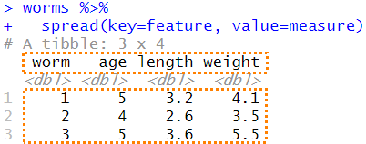


#### `spread()` 함수의 활용 단계

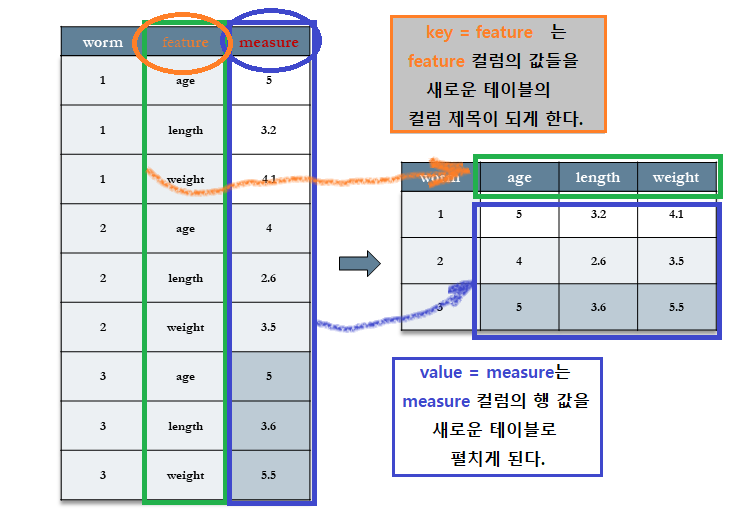


### `dcast()` 함수

`dcast()` 함수는 `melt()` 함수의 역함수로서 관측변수를 다시 되돌린다. 그리고 나면 데이터 세트를  ‘wide’ 형식으로 펼치게 된다. 

앞의 예에서 사용한 long 형태의 `worms` 데이터 세트를 wide 형태로 펼쳐 보기로 한다.

#### `dcast()` 함수의 구문

>**dcast(**
>     **data,**
>     **formula,**
>     **fun.aggregate = NULL,**
>     **...,**
>     **margins = NULL,**
>     **subset = NULL,**
>     **fill = NULL,**
>    **drop = TRUE,**
>    **value.var = guess_value(data)**
>**)**
>
>**주요 인수**
>
>- `data` : melt 되어 있는 데이터 프레임
>- `formula` : 재구성 공식
>- `value.var` : 값을 저장하고 있는 컬럼 명


#### `dcast()` 함수의 사용 예

```{r}
worms %>% 
  dcast(worm ~ feature, value.var="measure")
        
# or
worms %>% 
  dcast(worm ~ ...)
```


#### `dcast()`  함수의 활용 단계


#### `dcast()` 함수를 이용한 aggregation


##### `Chickweight` 데이터 세트

`Chickweight` 데이터 세트를 보면, 578개의 행과 `Weight`, `Time`, `Chick`, `Diet`라는 4개의 열(Column)로 이루어져 있다. 

(`? datasets::ChickWeight`로 자세한 내용을 확인할 수 있다.)

- `Weight` : 각 Chick(병아리)들의 무게
- `Time` : 무게를 잴 때의 병아리 나이(부화한 후의 날 수) 1일~21일
- `Chick` : 1~50번까지의 병아리 번호
- `Diet` : 병아리에게 투여한 모이 종류 1~4가지

```{r}
#Chick weight example
head(ChickWeight)
str(ChickWeight)
```


#### `melt()` 함수의 사용

```{r}
names(ChickWeight) <- tolower(names(ChickWeight))
chick_m <- melt(ChickWeight, id=2:4, na.rm=TRUE)
head(chick_m)
tail(chick_m)
```


#### `dcast()` 함수의 사용

```{r}
dcast(chick_m, time ~ variable, mean) # average effect of time
dcast(chick_m, diet ~ variable, mean) # average effect of diet
acast(chick_m, diet ~ time, mean) # average effect of diet & time
dcast(chick_m, diet ~ time, mean)
```


## 하나의 셀에 저장된 여러 변수 또는 여러 셀에 흩어져 있는 한 변수   {#tidy_data_one_cell}

데이터 세트를 untidy하게 만드는 두 개의 다른 이슈로는 1) 동일한 셀에 여러 개 변수가 저장되어 있는 경우와, 2) 한 변수가 여러 셀에 흩어져 저장되어 있는 경우이다. 

`tidyr` 패키지에 내장되어 있는 `table5` 데이터는 이 두 문제를 동시에 보여주고 있다.


### 데이터 세트

```{r}
table5
```

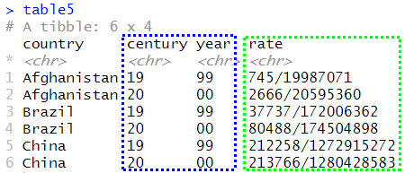

-  `rate` 변수는 실제 `cases`를`populations`으로 나눈 식으로 표시되어, 두 개의 변수를 담고 있다. 
- 또한  `century`와 `year` 라는 두 개의 컬럼으로 분리되어 있는 부분은 사실 `year` 변수로 통합될 수 있다.


### Data Wrangling with dplyr and tidyr {-}

[Data Wrangling with dplyr and tidyr](https://rstudio.com/wp-content/uploads/2015/02/data-wrangling-cheatsheet.pdf)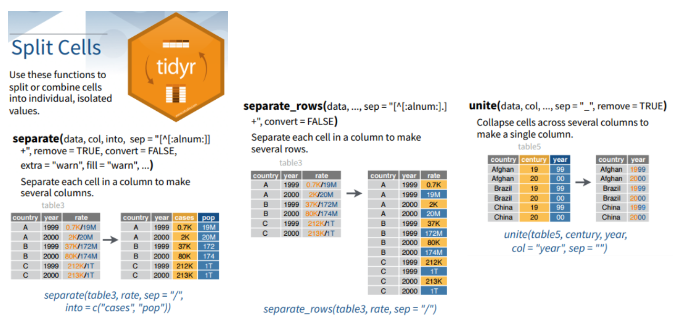


## `separate()` 함수와 `unite()` 함수

컬럼의 분리와 결합을 위한 `separate()` 함수와 `unite()` 함수는 서로 보완적인다.

### `separate()` 함수

`separate()` : 여러 개의 컬럼으로 분리하기 위해 한 컬럼에 있는 각 셀을 분리한다.

> **separate(data, col, into, sep=, remove = TRUE)**

- `data` : 데이터 프레임
- `col`: 분리할 컬럼 명
- `into`: 새로운 문자형 변수 컬럼 명
- `sep=` : 컬럼 사이의 분리 문자
- `remove=` : 데이터 프레임에서 원 컬럼의 제거 여부, 디폴트 값은 `TRUE`


### `unite()` 함수
`unite()`:  한 개의 컬럼으로 결합하기 위해 여러 컬럼에 있는 셀의 값들을 묶어 준다.


> **unite(data, col, ... , sep = "\_", remove = TRUE)**

- `col`: 결합 컬럼이 될 새로운 컬럼의 이름
- `...` : 결합될 컬럼의 목록
- `sep =` : 분리자, 디폴트 값은 "\_"


### `separate()` 함수와 `unite()` 함수의 예

```{r}
table5 %>% 
  separate(col=rate, into=c("cases", "population"), sep="/") %>% 
  unite(col="year", century, year, sep="")
```

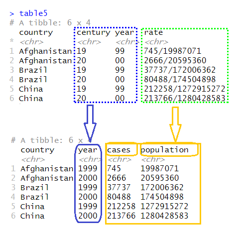

- `table5`에 있던 `century`와 `year` 컬럼이 새로운 테이블의 `year` 컬럼으로 합쳐졌다.
- `table5`에 있던 `rate` 컬럼이 `cases` 컬럼과 `population` 컬럼으로 분리되었다.


## `tidyverse` 참조표   {#tidy_data_reference_table}

RStudio의 도움말(Help) 메뉴에  `tidyverse` 패키지가 제공하는 다양한 도구의 활용 방법 및 구문법을 요약해 놓은 “Cheatsheets”에 대한 서브 메뉴가 있다.  [ `dplyr`과 `tidyr`의 참조표](https://rstudio.com/wp-content/uploads/2015/02/data-wrangling-cheatsheet.pdf) 와  별도의  [`ggplot2`의 참조표](https://rstudio.com/wp-content/uploads/2015/03/ggplot2-cheatsheet.pdf)를 발견할 수 있다.

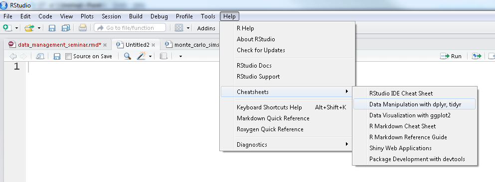


## References  {-}

- [tidyr 패키지 사용법](https://gomguard.tistory.com/229) :

- [cheat_sheet : data import](https://github.com/rstudio/cheatsheets/raw/master/data-import.pdf)
- [cheat_sheet : data wrangling](https://rstudio.com/wp-content/uploads/2015/02/data-wrangling-cheatsheet.pdf)
- [5 tidy data 개념과 dplyr+tidyr로 데이터 다루기](https://mrchypark.github.io/data_camp_dabrp/tidyr.html)
- [tidyr 연습문제](https://nittaku.tistory.com/359)
- [An Introduction to reshape2](https://seananderson.ca/2013/10/19/reshape/)
- [tidyr 연습문제](https://partrita.github.io/posts/tidy-data/) - 예제가 좋음 (Python의 Pandas로 처리함)
