# Strings    {#strings}

## 들어가기  {#strings_intro}

이 장에서는 R에서의 문자열 조작(string manipulation)을 소개한다. 문자열이 동작하는 방식과 문자열을 직접 생성하는 법의 기초를 배우겠지만, 이 장의 초점은 정규표현식(regular expressions), 줄여서 regexps 이다. 문자열은 일반적으로 비정형 및 반정형 데이터를 포함하는데, 정규표현식은 문자열의 패턴을 간결하게 기술하는 언어라는 점에서 유용하다. 정규표현식을 처음 보면 고양이가 키보드를 밟고 간 것처럼 보이겠지만, 이해도가 높아질수록 의미가 눈에 들어올 것이다.

### 준비하기

이 장에서는 문자열 조작을 할 수 있는 **`stringr`** 패키지에 초점을 맞출 것이다. 보통은 항상 텍스트 데이터를 다루어야 하는 것은 아니기 때문에, `stringr` 은 핵심 `tidyverse`에 포함되어 있지 않다. 따라서 명시적으로 로드해야 한다.

```{r warning = FALSE}
library(tidyverse)
library(stringr)
```

## 문자열 기초 {#strings_basic}

작은따옴표나 큰따옴표로 문자열을 생성할 수 있다. 다른 언어와는 달리 두 동작에 차이가 없다. 여러 개의 `"` 를 포함하는 문자열을 생성하려는 것이 아니라면 항상 `"` 를 사용할 것을 추천한다.

```{r}
string1 <- "문자열입니다"
string2 <- '문자열 내에 "인용문"이 포함된 경우, 나는 작은 따옴표를 사용한다'
```

따옴표 닫는 것을 잊어 버린 경우, 연속문자(continuation character)인 `+` 가 나타난다.

```
> "닫는 따옴표가 없는 문자열이다
+    
+    
+ 도와줘요 갇혔어요
```

이 같은 일이 발생했다면 이스케이프키를 누르고 다시 시도하라!

작은따옴표 문자나 큰따옴표 문자를 문자열에 포함하려면 ‘벗어나기 (escape)’ 위해 `\` (이스케이프 키)를 사용할 수 있다.

```{r}
double_quote <- "\"" # or '"'
double_quote
single_quote <- '\'' # or "'"
single_quote
```

같은 원리로 역슬래시 문자를 포함하려면 `"\\"` 과 같이 두 번 입력해야 한다.

문자열의 출력 표시는 문자열 자체와 같지 않다는 것에 주의하라. 출력에선 이스케이프가 보이기 때문이다. 문자열의 원시 형태를 보려면 `writeLines()` 를 사용하라.

```{r}
x <- c("\"", "\\")
x

writeLines(x)
```


이 외의 특수 문자들도 매우 많다. 줄바꿈, `"\n"` , 탭, `"\t"` 은 가장 일반적인 것들이다. `?'"'` , 혹은 `?"'"` 로 볼 수 있는 도움말을 통해 전체 목록을 볼 수 있다. 또한 `"\u00b5"` 과 같은 문자열을 간혹 볼 수도 있는데, 이는 비영어 문자를 모든 플랫폼에서 동작하도록 작성한 것이다.

```{r}
x <- "\u00b5"
x
```


복수의 문자열은 종종 `c()` 로 만들 수 있는 문자형 벡터에 저장된다.

```{r}
c("one", "two", "three")
```


### 문자열 길이

베이스 R에는 문자열에 동작하는 함수가 많이 있지만 일관성이 없고, 또 따라서 기억해내기 어렵기 때문에 여기에서는 사용하지 않을 것이다. 대신 우리는 **`stringr`** 의 함수를 사용할 것이다. 이 함수들의 이름은 좀 더 직관적이며 모두 `str_` 로 시작한다. 예를 들어 `str_length()` 는 문자열의 문자 개수를 알려준다.

```{r}
str_length(c("a", "R for data science", NA))
```


공통된 `str_` 접두사는 RStudio 이용자에게 특히 유용하다. `str_` 을 타이핑하면 자동완성을 불러와서 모든 **stringr** 함수를 볼 수 있기 때문이다.


### 문자열 결합

문자열을 두 개 이상 결합하기 위해서는 `str_c()` 를 사용하라.

```{r}
str_c("x", "y")
str_c("x", "y", "z")
```


구분 방식을 컨트롤하기 위해 `sep =` 인수를 사용하라.

```{r}
str_c("x", "y", sep = ", ")
#> [1] "x, y"
```

대부분의 R 함수들에서 그렇듯 결측값은 설정된 것이 이후로 계속 파급된다(contagious). 결측값을 `"NA"` 로 출력되길 원하면 `str_replace_na()` 를 사용하라.

```{r}
x <- c("abc", NA)
str_c("|-", x, "-|")
str_c("|-", str_replace_na(x), "-|")
```

앞의 코드에서 본 것처럼 `str_c()` 는 벡터화되고 짧은 벡터가 긴 벡터와 길이가 같도록 자동으로 재사용한다.

```{r}
str_c("prefix-", c("a", "b", "c"), "-suffix")
```


길이가 0인 객체는 조용히 삭제된다. 이 특성은 `if` 와 함께 쓰면 특히 유용하다.

```{r}
name <- "Hadley"
time_of_day <- "morning"
birthday <- FALSE

str_c(
  "Good ", time_of_day, " ", name,
  if (birthday) " and HAPPY BIRTHDAY",
  "."
)
```


문자열 벡터를 하나의 문자열로 합치려면 `collapse` 를 사용하라.

```{r}
str_c(c("x", "y", "z"), collapse = ", ")
```


### 문자열 서브셋하기

문자열의 일부는 `str_sub()` 를 사용하여 추출할 수 있다. 이 함수는 문자열과 더불어 부분문자열의 위치를 지정하는 `start` 와 `end` 인수를 취한다.

```{r}
x <- c("Apple", "Banana", "Pear")
str_sub(x, 1, 3)

# 음수는 끝에서부터 반대 방향으로 센다
str_sub(x, -3, -1)
```


`str_sub()` 는 문자열이 너무 짧은 경우에도 오류가 발생하지 않고 가능한 만큼 반환한다는 것을 주목하라.

```{r}
str_sub("a", 1, 5)
```


`str_sub()` 의 할당 형식을 사용하여 문자열을 수정할 수도 있다.

```{r}
str_sub(x, 1, 1) <- str_to_lower(str_sub(x, 1, 1))
x
```


### 로케일

앞서 `str_to_lower()` 를 사용하여 텍스트를 소문자로 변경했다. `str_to_upper()` 또는 `str_to_title()` 을 사용할 수도 있다. 그러나 각각의 언어는 대소문자 규칙이 다르므로 대소문자 변경은 생각보다 더 복잡하다. 로케일을 지정하여, 어떤 규칙 집합을 사용할지 정할 수 있다.

```{r}
# 터키어는 i가 점이 있는 것과 없는 것 두 개이다
# 또한 대문자도 다르다

str_to_upper(c("i", "ı"))
str_to_upper(c("i", "ı"), locale = "tr")
```


로케일은 두 글자 또는 세 글자 줄임말인 ISO 639 언어 코드로 지정된다. 설정하고자 하는 언어의 ISO639 코드를 모르는 경우, [위키피디아](https://en.wikipedia.org/wiki/List_of_ISO_639-1_codes)에 잘 정리되어 있다. 로케일을 비워 둘 경우에는 운영체제에서 제공한 현재 로케일을 사용한다.

로케일의 영향을 받는 또 다른 중요한 작업은 정렬이다. 베이스R의 `order()` 및 `sort()` 함수는 현재 로케일을 사용하여 정렬한다. 다른 컴퓨터에서도 변함없는 동작을 원한다면 로케일 추가인수를 취하는 `str_sort()` 와 `str_order()` 를 사용하면 된다.

```{r}
x <- c("apple", "eggplant", "banana")
str_sort(x, locale = "en")  # English
str_sort(x, locale = "haw") # Hawaiian
```


### 연습문제

1. **stringr** 을 사용하지 않는 코드에서 `paste()` 와 `paste0()` 를 종종 볼 것이다. 두 함수의 차이점은 무엇인가? 이들에 상응하는 **stringr** 함수는 무엇인가? 이 함수들은 `NA` 를 다룰 때 어떻게 다른가?
2. `str_c()` 의 `sep` 인수와 `collapse` 인수의 차이를 자신의 말로 기술하라.
3. `str_length()` 과 `str_sub()` 을 이용하여 문자열 중앙 문자를 추출하라. 문자열에 짝수 개의 문자가 있다면 어떻게 하겠는가?
4. `str_wrap()` 의 기능은 무엇인가? 어떤 경우에 이 함수를 사용하겠는가?
5. `str_trim()` 의 기능은 무엇인가? `str_trim()` 의 반대는 무엇인가?
6. 예를 들어 벡터 `c( "a", "b", "c")` 를 문자열 `a, b, c` 로 변환하는 함수를 작성하라. 길이가 0, 1, 2인 벡터일 경우 어떻게 해야 하는지에 대해 신중하게 생각해보라.


## 정규표현식을 이용한 패턴 매칭  {#pattern_matching}

정규표현식은 문자열의 패턴을 기술하는 매우 간결한 언어이다. 이해하는 데 다소 시간이 걸리지만 한번 이해하면 매우 유용함을 알 수 있을 것이다.

정규표현식을 배우기 위해 우리는 `str_view()` 와 `str_view_all()` 를 사용할 것이다. 이 두 함수는 문자 벡터와 정규표현식을 취해, 이들이 어떻게 매칭되는지를 보여준다. 우리는 매우 단순한 정규표현식부터 시작해서 점진적으로 복잡한 형태를 볼 것이다. 패턴 매칭을 충분히 익힌 후에는 다양한 **stringr** 함수로 적용하는 법을 배울 것이다.


### 기본 매칭

가장 간단한 패턴은 **문자열 전체 (exact)** 매칭이다.

```{r}
x <- c("apple", "banana", "pear")
str_view(x, "an")
```

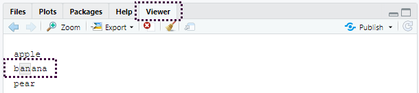

- R Studio의 Viewer 패널에 결과가 표시된다.
- `"an"` 패턴과 일치하는 문자열은 `"banana"`


다음으로 간단한 단계는 (줄바꿈을 제외한) **임의의 문자**와 매칭하는 `.` 이다.

```{r}
str_view(x, ".a.")
```


그런데 `"."` 이 임의의 문자와 매칭된다면, 문자 `"."` 는 어떻게 매칭하겠는가? ’이스케이프’를 사용하여 우리가 특별 동작을 사용하려는 것이 아니라, 정확하게 매칭하고 싶다는 것을 정규표현식에 표현해야 한다. 

정규표현식도 문자열과 마찬가지로 특별한 동작을 이스케이프하기 위해 역슬래시(`\` )를 사용한다. 따라서 `.` 를 매칭하기 위해서는 정규표현식 `\.` 을 써야한다. 그런데 이렇게 하면 문제가 생긴다. 정규표현식을 나타내기 위해 문자열을 사용했고 `\` 도 문자열에서 이스케이프 상징어로 사용하였다. 

따라서 정규표현식 `\.` 를 작성하기 위해서는 문자열 `"\\."` 이 필요하다.

```{r}
# To create the regular expression, we need \\
dot <- "\\."

# But the expression itself only contains one:
writeLines(dot)

# And this tells R to look for an explicit .
str_view(c("abc", "a.c", "bef"), "a\\.c")
```


정규표현식에서 `\` 를 이스케이프 문자로 사용한다면 문자 `\` 는 도대체 어떻게 매칭하겠는가? 정규표현식 `\\` 를 만들어 이스케이프해야 한다. 앞의 정규표현식을 만들려면 `\` 를 이스케이프하는 문자열이 필요하다. 즉, 문자 `\` 을 매칭하기 위해서 `"\\\\"` 라고 작성해야 한다. 즉, 하나를 매칭하기 위해 네 개의 역슬래시가 필요하다!

```{r}
x <- "a\\b"
writeLines(x)
str_view(x, "\\\\")
```


여기서 정규표현식은 `\.` 과 같이 쓰고 정규표현식을 나타내는 문자열은 `"\\."` 과 같이 쓸 것이다.


#### 연습문제

1. 다음의 각 문자열 `"\", "\\", "\\\"` 이 `\` 과 매칭되지 않는 이유를 설명하라.
2. 시퀀스 `"'\` 를 어떻게 매칭하겠는가?
3. 정규표현식 `\..\..\..` 은 어떤 패턴과 매칭되겠는가? 문자열로 어떻게 표현하겠는가?


### 앵커

기본적으로 정규표현식은 문자열의 일부를 매치한다. 정규표현식을 **앵커로 고정(anchor)** 하여 문자열의 시작 또는 끝과 매칭하면 유용한 경우가 많다. 다음을 사용할 수 있다.

- `^` : 문자열의 시작과 매칭
- `$` : 문자열의 끝과 매칭

```{r}
x <- c("apple", "banana", "pear")
str_view(x, "^a")
```


```{r}
str_view(x, "a$")
```

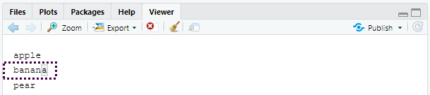


두 기호를 올바로 기억하기 위해, [에반 미슐라](https://twitter.com/emisshula/status/323863393167613953)가 알려준 다음의 연상 구문을 시도해보자. 파워(`^` )로 시작하면, 돈(`$` )으로 끝나게 된다.

정규표현식을 문자열 전체와 강제로 매칭하도록 하려면 `^` 와 `$` 로 고정하라.

```{r}
x <- c("apple pie", "apple", "apple cake")
str_view(x, "apple")
```


```{r}
str_view(x, "^apple$")
```


단어 사이의 경계(boundary)를 매칭시키려면 `\b` 를 사용하면 된다. 나는 R에서 이 방법을 자주 사용하지는 않지만 RStudio에서 다른 함수의 구성요소인 함수의 이름을 찾고자 할 때 한 번씩 사용한다. 예를 들어 `\bsum\b` 를 사용하여 `summarize, summary, rowsum` 등이 매칭되는 것을 피할 수 있다.


#### 연습문제

1. 문자열 `"$^$"` 을 어떻게 매칭하겠는가?

2. `stringr::words` 의 일반적인 단어의 말뭉치(corpus)에서 다음에 해당하는 단어들을 찾는 정규표현식을 구하라.

   1. “y”로 시작.
   2. “x”로 끝남.
   3. 정확히 세 글자. (`str_length()` 를 사용하는 부정행위를 하지 말 것!)
   4. 7개 이상의 글자.

   이 리스트는 길기 때문에 `str_view()` 의 `match` 인수를 이용하여 매칭되는 단어들만, 혹은 매칭되지 않는 단어들만 볼 수 있다.


### 문자 클래스와 대체구문

하나 이상의 문자를 매칭하는 특별한 패턴들이 많이 있다. 우린 이미 하나를 보았는데, 줄바꿈을 제외하고 임의의 문자를 매칭하는 `.` 이다. 이 밖에도 네 개의 유용한 도구가 있다.

- `\d` 는 임의의 숫자와 매치한다.
- `\s` 는 임의의 여백 문자(whitespace, 예를 들어 공백, 탭, 줄바꿈)와 매치한다.
- `[abc]` 는 a, b 또는 c와 매치한다.
- `[^abc]` 는 a, b, 또는 c를 제외한 임의의 문자와 매치한다.

`\d` 나 `\s` 를 포함하는 정규표현식을 만들기 위해서는 해당 문자열에서 `\` 을 이스케이프 해야 하므로 `"\\d"` 나 `"\\s"` 로 입력해야 한다는 것을 기억하라.

단일 문자를 포함하는 문자형 클래스는 정규표현식에서 메타문자 하나를 포함하고 싶을때 역슬래시 이스케이프의 대안이 될 수 있다. 많은 사람들에게 가독성이 좋아진다.

```{r}
# Look for a literal character that normally has special meaning in a regex
str_view(c("abc", "a.c", "a*c", "a c"), "a[.]c")
```

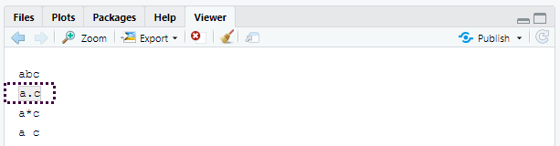


```{r}
str_view(c("abc", "a.c", "a*c", "a c"), ".[*]c")
```


```{r}
str_view(c("abc", "a.c", "a*c", "a c"), "a[ ]")
```


이 방법은 대부분 (전부는 아님) 정규표현식 메타문자에 적용된다: `$` `.` `|` `?` `*` `+` `(` `)` `[` `{`. 안타깝게도 문자 클래스 내에서 조차 특수 의미가 있는 문자가 몇 있으며 백슬래시 이스케이프와 함께 해야 한다. `]` `\` `^` `-`.

대체구문을 이용하여 하나 이상의 대체 패턴 사이에서 선택하도록 할 수 있다. 예를 들어 `abc|d..f` 는 `"abc"` 또는 `"deaf"` 중 하나와 매치한다. `|` 는 우선순위가 높다. 따라서 `abc|xyz` 는 `abc` 혹은 `xyz` 와 매칭하라는 의미이지 `abcyz` 나 `abxyz` 와 매칭하라는 의미가 아니다. 수식 표현에서와 같이 연산 우선순위가 조금이라도 헷갈린다면 의도한 바를 분명히 하기 위해 괄호를 사용하라.

```{r}
str_view(c("grey", "gray"), "gr(e|a)y")
```

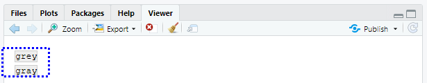


#### 연습문제

1. 다음에 해당하는 모든 단어를 찾는 정규표현식을 작성하라.
   1. 모음으로 시작함
   2. 자음만 포함함 (힌트: ‘비’-자음 매칭에 대해 생각해보라.)
   3. `ed` 로 끝나지만 `eed` 로 끝나지는 않음
   4. `ing` 혹은 `ize` 로 끝남
2. 다음의 규칙을 데이터기반으로 증명하라. ‘c 뒤를 제외하고는 i가 e 앞’ (영어 스펠링에서 ei와 ie가 헷갈릴 경우 이 두 글자 앞에 c 가 나온 경우를 제외하고는 ei가 맞다는 규칙)
3. ‘q’ 다음은 항상 ‘u’ 인가?
4. 미국 영어가 아닌 영국 영어로 쓰여진 단어를 매칭하는 정규표현식을 작성하라.
5. 여러분의 나라에서 일반적으로 쓰이는 전화번호를 매칭하는 정규표현식을 작성하라.


### 반복

다음 단계는 패턴이 몇 회 매칭하는지를 조정하는 것이다.

- `?` : 0 또는 1회
- `+` : 1회 이상
- `*` : 0회 이상

```{r}
x <- "1888 is the longest year in Roman numerals: MDCCCLXXXVIII"
str_view(x, "CC?")
```


```{r}
str_view(x, "CC+")
```

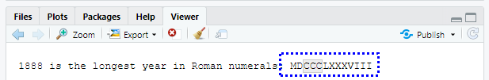


```{r}
str_view(x, 'C[LX]+')
```


이 연산자의 우선순위는 낮음을 주목하라. 예를 들어 `colou?r` 를 사용하여 미국식이나 영국식 스펠링을 매치할 수 있다. 따라서 `bana(na)+` 에서와 같이 대부분의 경우 괄호가 필요하다.

또한 매칭 횟수를 정확하게 지정할 수 있다.

- `{n}` : 정확히 n회
- `{n,}` : n회 이상
- `{,m}` : 최대 m회
- `{n,m}` : n과 m회 사이

```{r}
str_view(x, "C{2}")
```


```{r}
str_view(x, "C{2,}")
```


```{r}
str_view(x, "C{2,3}")
```


기본값으로 이러한 매칭은 ‘그리디(greedy)’ 매칭이다. 즉, 가능한 가장 긴 문자열과 매칭한다. 이를 ‘게으르게(lazy)’ 만들 수 있다. 뒤에 `?` 를 넣으면 가장 짧은 문자열과 매칭된다. 정규표현식의 고급 기능이지만 이런 것도 있다는 것을 알아놓으면 유용하다.

```{r}
str_view(x, 'C{2,3}?')
```

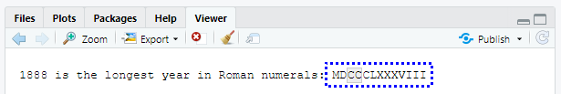


```{r}
str_view(x, 'C[LX]+?')
```

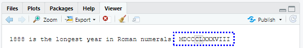


#### 연습문제

1. `?, +, *` 이 같음을 `{m,n}` 형식으로 설명하라.
2. 다음의 정규표현식이 어떤 것과 매칭하는지를 말로 설명하라. (사용하는 것이 정규표현식인지 아니면 그것을 정의하는 문자열인지 주의 깊게 읽고 확인하라.)
   1. `^.*$`
   2. `"\\{.+\\}"`
   3. `\d{4}-\d{2}-\d{2}`
   4. `"\\\\{4}"`
3. 다음의 모든 단어를 찾는 정규표현식을 작성하라.
   1. 세 개의 자음으로 시작.
   2. 세 개 이상의 모음이 연달아 있음.
   3. 두 개 이상의 모음-자음 쌍이 연달아 있음.
4. 다음의 초보자 정규표현식 십자말풀이를 풀어보라. https://regexcrossword.com/challenges/beginner


### 그룹화와 역참조

앞서 괄호를 사용하여 복잡한 표현을 명확하게 하는 법을 배웠다. 괄호는 또한 (number 1, 2 등) 숫자달린 캡쳐 그룹을 생성한다. 캡쳐 그룹은 괄호 내에서 정규표현식의 일부와 매치되는 문자열 부분을 저장한다. `\1, \2` 등과 같이 역참조(backreference)로 캡쳐 그룹에 매칭된 텍스트를 참조할 수 있다. 예를 들어 다음의 정규표현식은 두 글자가 반복되는 과일 이름과 매칭한다.

```{r}
fruit <- c("banana", "coconut", "cucumber", "jujube", "papaya", "salal berry")
str_view(fruit, "(..)\\1", match = TRUE)
```

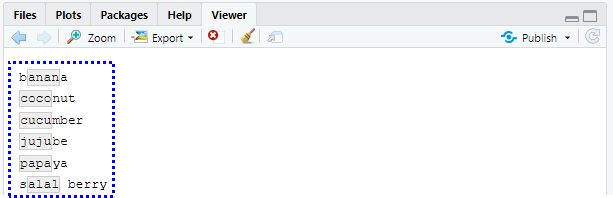


(`str_match()` 와 함께 쓰면 왜 유용한지 곧 알게 될 것이다.)


#### 연습문제

1. 다음의 표현식이 어떤 것과 매칭할지 말로 설명하라.
   1. `(.)\1\1`
   2. `"(.)(.)\\2\\1"`
   3. `(..)\1`
   4. `"(.).\\1.\\1"`
   5. `"(.)(.)(.).*\\3\\2\\1"`
2. 다음의 단어와 매칭하는 정규표현식을 작성하라.
   1. 같은 문자로 시작하고 끝남.
   2. 두 문자 반복이 있음(예를 들어 ’church’는 ’ch’를 두 번 반복).
   3. 적어도 세 곳에서 반복되는 문자가 있음(예컨대, ’eleven’은 ’e’가 세 개).


## 패턴 매칭              {#tools}

이제 정규표현식의 기초를 배웠으므로 실제 문제에 적용하는 법에 대해 알아보자. 이 절에서는 다음을 수행하는 다양한 **stringr** 함수들을 배울 것이다.

- 어떤 문자열이 패턴과 매칭하는지 결정.
- 매칭의 위치를 찾기.
- 매칭의 내용을 추출.
- 매칭된 것을 새 값으로 교체.
- 매칭를 기반으로 문자열 분할.

계속 진행하기 전에 주의할 점은, 정규표현식은 너무 강력해서 모든 문제를 정규표현식 하나로 접근하려고 하기 쉽다는 것이다. 제이미 자윈스키(Jamie Zawinski)의 말을 들어보자.

> 문제에 직면했을 때 어떤 사람들은 ’풀 수 있어. 정규표현식을 사용하면 돼’라고 생각한다. 이제 그들에겐 풀어야 할 문제가 두 개이다.

조심하라는 뜻으로 이메일 주소가 유효한지를 검사하는 다음의 정규표현식을 살펴보라.

```
(?:(?:\r\n)?[ \t])*(?:(?:(?:[^()<>@,;:\\".\[\] \000-\031]+(?:(?:(?:\r\n)?[ \t]
)+|\Z|(?=[\["()<>@,;:\\".\[\]]))|"(?:[^\"\r\\]|\\.|(?:(?:\r\n)?[ \t]))*"(?:(?:
\r\n)?[ \t])*)(?:\.(?:(?:\r\n)?[ \t])*(?:[^()<>@,;:\\".\[\] \000-\031]+(?:(?:(
?:\r\n)?[ \t])+|\Z|(?=[\["()<>@,;:\\".\[\]]))|"(?:[^\"\r\\]|\\.|(?:(?:\r\n)?[ 
\t]))*"(?:(?:\r\n)?[ \t])*))*@(?:(?:\r\n)?[ \t])*(?:[^()<>@,;:\\".\[\] \000-\0
31]+(?:(?:(?:\r\n)?[ \t])+|\Z|(?=[\["()<>@,;:\\".\[\]]))|\[([^\[\]\r\\]|\\.)*\
](?:(?:\r\n)?[ \t])*)(?:\.(?:(?:\r\n)?[ \t])*(?:[^()<>@,;:\\".\[\] \000-\031]+
(?:(?:(?:\r\n)?[ \t])+|\Z|(?=[\["()<>@,;:\\".\[\]]))|\[([^\[\]\r\\]|\\.)*\](?:
(?:\r\n)?[ \t])*))*|(?:[^()<>@,;:\\".\[\] \000-\031]+(?:(?:(?:\r\n)?[ \t])+|\Z
|(?=[\["()<>@,;:\\".\[\]]))|"(?:[^\"\r\\]|\\.|(?:(?:\r\n)?[ \t]))*"(?:(?:\r\n)
?[ \t])*)*\<(?:(?:\r\n)?[ \t])*(?:@(?:[^()<>@,;:\\".\[\] \000-\031]+(?:(?:(?:\
r\n)?[ \t])+|\Z|(?=[\["()<>@,;:\\".\[\]]))|\[([^\[\]\r\\]|\\.)*\](?:(?:\r\n)?[
 \t])*)(?:\.(?:(?:\r\n)?[ \t])*(?:[^()<>@,;:\\".\[\] \000-\031]+(?:(?:(?:\r\n)
?[ \t])+|\Z|(?=[\["()<>@,;:\\".\[\]]))|\[([^\[\]\r\\]|\\.)*\](?:(?:\r\n)?[ \t]
)*))*(?:,@(?:(?:\r\n)?[ \t])*(?:[^()<>@,;:\\".\[\] \000-\031]+(?:(?:(?:\r\n)?[
 \t])+|\Z|(?=[\["()<>@,;:\\".\[\]]))|\[([^\[\]\r\\]|\\.)*\](?:(?:\r\n)?[ \t])*
)(?:\.(?:(?:\r\n)?[ \t])*(?:[^()<>@,;:\\".\[\] \000-\031]+(?:(?:(?:\r\n)?[ \t]
)+|\Z|(?=[\["()<>@,;:\\".\[\]]))|\[([^\[\]\r\\]|\\.)*\](?:(?:\r\n)?[ \t])*))*)
*:(?:(?:\r\n)?[ \t])*)?(?:[^()<>@,;:\\".\[\] \000-\031]+(?:(?:(?:\r\n)?[ \t])+
|\Z|(?=[\["()<>@,;:\\".\[\]]))|"(?:[^\"\r\\]|\\.|(?:(?:\r\n)?[ \t]))*"(?:(?:\r
\n)?[ \t])*)(?:\.(?:(?:\r\n)?[ \t])*(?:[^()<>@,;:\\".\[\] \000-\031]+(?:(?:(?:
\r\n)?[ \t])+|\Z|(?=[\["()<>@,;:\\".\[\]]))|"(?:[^\"\r\\]|\\.|(?:(?:\r\n)?[ \t
]))*"(?:(?:\r\n)?[ \t])*))*@(?:(?:\r\n)?[ \t])*(?:[^()<>@,;:\\".\[\] \000-\031
]+(?:(?:(?:\r\n)?[ \t])+|\Z|(?=[\["()<>@,;:\\".\[\]]))|\[([^\[\]\r\\]|\\.)*\](
?:(?:\r\n)?[ \t])*)(?:\.(?:(?:\r\n)?[ \t])*(?:[^()<>@,;:\\".\[\] \000-\031]+(?
:(?:(?:\r\n)?[ \t])+|\Z|(?=[\["()<>@,;:\\".\[\]]))|\[([^\[\]\r\\]|\\.)*\](?:(?
:\r\n)?[ \t])*))*\>(?:(?:\r\n)?[ \t])*)|(?:[^()<>@,;:\\".\[\] \000-\031]+(?:(?
:(?:\r\n)?[ \t])+|\Z|(?=[\["()<>@,;:\\".\[\]]))|"(?:[^\"\r\\]|\\.|(?:(?:\r\n)?
[ \t]))*"(?:(?:\r\n)?[ \t])*)*:(?:(?:\r\n)?[ \t])*(?:(?:(?:[^()<>@,;:\\".\[\] 
\000-\031]+(?:(?:(?:\r\n)?[ \t])+|\Z|(?=[\["()<>@,;:\\".\[\]]))|"(?:[^\"\r\\]|
\\.|(?:(?:\r\n)?[ \t]))*"(?:(?:\r\n)?[ \t])*)(?:\.(?:(?:\r\n)?[ \t])*(?:[^()<>
@,;:\\".\[\] \000-\031]+(?:(?:(?:\r\n)?[ \t])+|\Z|(?=[\["()<>@,;:\\".\[\]]))|"
(?:[^\"\r\\]|\\.|(?:(?:\r\n)?[ \t]))*"(?:(?:\r\n)?[ \t])*))*@(?:(?:\r\n)?[ \t]
)*(?:[^()<>@,;:\\".\[\] \000-\031]+(?:(?:(?:\r\n)?[ \t])+|\Z|(?=[\["()<>@,;:\\
".\[\]]))|\[([^\[\]\r\\]|\\.)*\](?:(?:\r\n)?[ \t])*)(?:\.(?:(?:\r\n)?[ \t])*(?
:[^()<>@,;:\\".\[\] \000-\031]+(?:(?:(?:\r\n)?[ \t])+|\Z|(?=[\["()<>@,;:\\".\[
\]]))|\[([^\[\]\r\\]|\\.)*\](?:(?:\r\n)?[ \t])*))*|(?:[^()<>@,;:\\".\[\] \000-
\031]+(?:(?:(?:\r\n)?[ \t])+|\Z|(?=[\["()<>@,;:\\".\[\]]))|"(?:[^\"\r\\]|\\.|(
?:(?:\r\n)?[ \t]))*"(?:(?:\r\n)?[ \t])*)*\<(?:(?:\r\n)?[ \t])*(?:@(?:[^()<>@,;
:\\".\[\] \000-\031]+(?:(?:(?:\r\n)?[ \t])+|\Z|(?=[\["()<>@,;:\\".\[\]]))|\[([
^\[\]\r\\]|\\.)*\](?:(?:\r\n)?[ \t])*)(?:\.(?:(?:\r\n)?[ \t])*(?:[^()<>@,;:\\"
.\[\] \000-\031]+(?:(?:(?:\r\n)?[ \t])+|\Z|(?=[\["()<>@,;:\\".\[\]]))|\[([^\[\
]\r\\]|\\.)*\](?:(?:\r\n)?[ \t])*))*(?:,@(?:(?:\r\n)?[ \t])*(?:[^()<>@,;:\\".\
[\] \000-\031]+(?:(?:(?:\r\n)?[ \t])+|\Z|(?=[\["()<>@,;:\\".\[\]]))|\[([^\[\]\
r\\]|\\.)*\](?:(?:\r\n)?[ \t])*)(?:\.(?:(?:\r\n)?[ \t])*(?:[^()<>@,;:\\".\[\] 
\000-\031]+(?:(?:(?:\r\n)?[ \t])+|\Z|(?=[\["()<>@,;:\\".\[\]]))|\[([^\[\]\r\\]
|\\.)*\](?:(?:\r\n)?[ \t])*))*)*:(?:(?:\r\n)?[ \t])*)?(?:[^()<>@,;:\\".\[\] \0
00-\031]+(?:(?:(?:\r\n)?[ \t])+|\Z|(?=[\["()<>@,;:\\".\[\]]))|"(?:[^\"\r\\]|\\
.|(?:(?:\r\n)?[ \t]))*"(?:(?:\r\n)?[ \t])*)(?:\.(?:(?:\r\n)?[ \t])*(?:[^()<>@,
;:\\".\[\] \000-\031]+(?:(?:(?:\r\n)?[ \t])+|\Z|(?=[\["()<>@,;:\\".\[\]]))|"(?
:[^\"\r\\]|\\.|(?:(?:\r\n)?[ \t]))*"(?:(?:\r\n)?[ \t])*))*@(?:(?:\r\n)?[ \t])*
(?:[^()<>@,;:\\".\[\] \000-\031]+(?:(?:(?:\r\n)?[ \t])+|\Z|(?=[\["()<>@,;:\\".
\[\]]))|\[([^\[\]\r\\]|\\.)*\](?:(?:\r\n)?[ \t])*)(?:\.(?:(?:\r\n)?[ \t])*(?:[
^()<>@,;:\\".\[\] \000-\031]+(?:(?:(?:\r\n)?[ \t])+|\Z|(?=[\["()<>@,;:\\".\[\]
]))|\[([^\[\]\r\\]|\\.)*\](?:(?:\r\n)?[ \t])*))*\>(?:(?:\r\n)?[ \t])*)(?:,\s*(
?:(?:[^()<>@,;:\\".\[\] \000-\031]+(?:(?:(?:\r\n)?[ \t])+|\Z|(?=[\["()<>@,;:\\
".\[\]]))|"(?:[^\"\r\\]|\\.|(?:(?:\r\n)?[ \t]))*"(?:(?:\r\n)?[ \t])*)(?:\.(?:(
?:\r\n)?[ \t])*(?:[^()<>@,;:\\".\[\] \000-\031]+(?:(?:(?:\r\n)?[ \t])+|\Z|(?=[
\["()<>@,;:\\".\[\]]))|"(?:[^\"\r\\]|\\.|(?:(?:\r\n)?[ \t]))*"(?:(?:\r\n)?[ \t
])*))*@(?:(?:\r\n)?[ \t])*(?:[^()<>@,;:\\".\[\] \000-\031]+(?:(?:(?:\r\n)?[ \t
])+|\Z|(?=[\["()<>@,;:\\".\[\]]))|\[([^\[\]\r\\]|\\.)*\](?:(?:\r\n)?[ \t])*)(?
:\.(?:(?:\r\n)?[ \t])*(?:[^()<>@,;:\\".\[\] \000-\031]+(?:(?:(?:\r\n)?[ \t])+|
\Z|(?=[\["()<>@,;:\\".\[\]]))|\[([^\[\]\r\\]|\\.)*\](?:(?:\r\n)?[ \t])*))*|(?:
[^()<>@,;:\\".\[\] \000-\031]+(?:(?:(?:\r\n)?[ \t])+|\Z|(?=[\["()<>@,;:\\".\[\
]]))|"(?:[^\"\r\\]|\\.|(?:(?:\r\n)?[ \t]))*"(?:(?:\r\n)?[ \t])*)*\<(?:(?:\r\n)
?[ \t])*(?:@(?:[^()<>@,;:\\".\[\] \000-\031]+(?:(?:(?:\r\n)?[ \t])+|\Z|(?=[\["
()<>@,;:\\".\[\]]))|\[([^\[\]\r\\]|\\.)*\](?:(?:\r\n)?[ \t])*)(?:\.(?:(?:\r\n)
?[ \t])*(?:[^()<>@,;:\\".\[\] \000-\031]+(?:(?:(?:\r\n)?[ \t])+|\Z|(?=[\["()<>
@,;:\\".\[\]]))|\[([^\[\]\r\\]|\\.)*\](?:(?:\r\n)?[ \t])*))*(?:,@(?:(?:\r\n)?[
 \t])*(?:[^()<>@,;:\\".\[\] \000-\031]+(?:(?:(?:\r\n)?[ \t])+|\Z|(?=[\["()<>@,
;:\\".\[\]]))|\[([^\[\]\r\\]|\\.)*\](?:(?:\r\n)?[ \t])*)(?:\.(?:(?:\r\n)?[ \t]
)*(?:[^()<>@,;:\\".\[\] \000-\031]+(?:(?:(?:\r\n)?[ \t])+|\Z|(?=[\["()<>@,;:\\
".\[\]]))|\[([^\[\]\r\\]|\\.)*\](?:(?:\r\n)?[ \t])*))*)*:(?:(?:\r\n)?[ \t])*)?
(?:[^()<>@,;:\\".\[\] \000-\031]+(?:(?:(?:\r\n)?[ \t])+|\Z|(?=[\["()<>@,;:\\".
\[\]]))|"(?:[^\"\r\\]|\\.|(?:(?:\r\n)?[ \t]))*"(?:(?:\r\n)?[ \t])*)(?:\.(?:(?:
\r\n)?[ \t])*(?:[^()<>@,;:\\".\[\] \000-\031]+(?:(?:(?:\r\n)?[ \t])+|\Z|(?=[\[
"()<>@,;:\\".\[\]]))|"(?:[^\"\r\\]|\\.|(?:(?:\r\n)?[ \t]))*"(?:(?:\r\n)?[ \t])
*))*@(?:(?:\r\n)?[ \t])*(?:[^()<>@,;:\\".\[\] \000-\031]+(?:(?:(?:\r\n)?[ \t])
+|\Z|(?=[\["()<>@,;:\\".\[\]]))|\[([^\[\]\r\\]|\\.)*\](?:(?:\r\n)?[ \t])*)(?:\
.(?:(?:\r\n)?[ \t])*(?:[^()<>@,;:\\".\[\] \000-\031]+(?:(?:(?:\r\n)?[ \t])+|\Z
|(?=[\["()<>@,;:\\".\[\]]))|\[([^\[\]\r\\]|\\.)*\](?:(?:\r\n)?[ \t])*))*\>(?:(
?:\r\n)?[ \t])*))*)?;\s*)
```

이는 (이메일 주소는 놀랍게도 실제로는 단순하지 않기 때문에) 다소 극단적인 예이지만, 실제 코드에서 사용된다. 자세한 내용은 [스택오버플로 토론](http://stackoverflow.com/a/201378) 을 참조하라.

우리는 프로그래밍 언어를 사용하고 있으며, 활용할 수 있는 다른 도구들이 있다는 것을 잊지 않아야 한다. 하나의 복잡한 정규표현식을 작성하는 것보다, 간단한 정규표현식을 여러 개 작성하는 것이 쉬운 경우가 많다. 문제를 해결해줄 단일 정규표현식이 떠오르지 않는다면, 잠시 뒤로 물러서서, 문제를 작은 조각들로 분해하여, 작은 문제들을 하나씩 해결하면서 다음 단계로 나아갈 수 있는지 생각해보라.


### 매칭 탐지

문자형 벡터가 패턴과 매칭하는지 확인하려면, `str_detect()` 를 사용하라. 이 함수는 입력과 같은 길이의 논리형 벡터를 반환한다.

```{r}
x <- c("apple", "banana", "pear")
str_detect(x, "e")
```


논리형 벡터를 수치형 맥락에서 사용할 경우, `FALSE` 는 0 이 되고, `TRUE` 는 1 이 된다는 것을 명심하라. 따라서 긴 벡터에서의 매치 결과가 궁금할 때는, `sum()` 과 `mean()` 을 유용하게 사용할 수 있다.

```{r}
# How many common words start with t?
sum(str_detect(words, "^t"))
# What proportion of common words end with a vowel?
mean(str_detect(words, "[aeiou]$"))
```


복잡한 논리적 조건문이 있을 때(예를 들어 `d` 가 아니라면, `c`가 아닌 `a`나 `b`를 매치), 하나의 정규표현식을 작성하는 것보다, 여러 `str_detect()` 호출을 논리 연산자와 함께 묶는 것이 쉬울 때가 많다. 예를 들어 모음을 포함하지 않는 모든 단어를 찾는 두 가지 방법이 있다.

```{r}
# Find all words containing at least one vowel, and negate
no_vowels_1 <- !str_detect(words, "[aeiou]")
# Find all words consisting only of consonants (non-vowels)
no_vowels_2 <- str_detect(words, "^[^aeiou]+$")
identical(no_vowels_1, no_vowels_2)
```


결과는 같지만, 나는 첫 번째 방법이 이해하기가 훨씬 쉽다고 생각한다. 정규표현식이 지나치게 복잡해질 경우, 작은 조각들로 분해하여, 각 조각에 이름을 주고, 논리적 연산으로 결합해보자. `str_detect()` 는 일반적으로 패턴과 매칭하는 요소를 선택하는 데 사용한다. 논리형 서브셋하기, 또는 편리한 `str_subset()` 래퍼로 이 작업을 수행할 수 있다.

```{r}
words[str_detect(words, "x$")]
str_subset(words, "x$")
```


그러나 가지고 있는 문자열은 일반적으로 데이터프레임의 열일 것이므로, 대신 `filter` 를 사용하는 것이 좋다.

```{r}
df <- tibble(
  word = words, 
  i = seq_along(word)
)
df %>% 
  filter(str_detect(word, "x$"))
```


`str_detect()` 의 변형은 `str_count()` 이다. 단순히 yes 또는 no 대신, 하나의 문자열에서 몇 번 매칭되는지를 알려준다.

```{r}
x <- c("apple", "banana", "pear")
str_count(x, "a")

# On average, how many vowels per word?
mean(str_count(words, "[aeiou]"))
```


`str_count()` 는 `mutate()` 와 함께 쓰는 것이 자연스럽다.

```{r}
df %>% 
  mutate(
    vowels = str_count(word, "[aeiou]"),
    consonants = str_count(word, "[^aeiou]")
  )
```


매칭들끼리 서로 겹치지 않는다는 것을 주의하라. 예를 들어 `"abababa"` 에서 `"aba"` 패턴이 몇 번 매칭하는가? 정규표현식에선 세 번이 아닌 두 번이라고 답한다.

```{r}
str_count("abababa", "aba")
str_view_all("abababa", "aba")
```


`str_view_all()` 의 용법에 주의하라. 곧 배우겠지만 많은 stringr 함수는 짝으로 제공된다. 즉, 단일 매칭에 동작하는 함수와, 모든 매칭에 동작하는 함수가 있다. 후자는 접미사 `_all` 이 붙는다.


#### 연습문제

1. 다음 문제들을 두 가지 방식으로 각각 풀어보라. 하나의 정규표현식을 사용해보고 또, 여러 `str_detect()` 호출을 결합해보라.
   1. x 로 시작 하거나 끝나는 모든 단어를 찾아라.
   2. 모음으로 시작하고 자음으로 끝나는 모든 단어를 찾아라.
   3. 각기 다른 모음을 하나 이상씩 포함하는 단어가 있는가?
2. 어떤 단어가 가장 많은 모음을 갖는가? 어떤 단어가 모음의 비율이 가장 높은가? (힌트: 분모는 무엇인가?)


### 매칭 추출

매칭한 실제 텍스트를 추출하려면 `str_extract()` 를 사용하라. 이를 보기 위해 좀 더 복잡한 예제가 필요하다. 하버드 문장데이터(**http://bit.ly/Harvardsentences** )를 보려고 하는데, 이는 VOIP 시스템을 테스트하도록 설계되었지만, 정규표현식을 연습하는 데에도 유용하다. 이들은 `stringr::sentences` 에서 제공된다.

```{r}
length(sentences)
head(sentences)
```


색상을 포함하는 모든 문장을 찾고 싶다고 가정해보자. 먼저 색상 이름 벡터를 생성한 다음, 이를 하나의 정규표현식으로 변환한다.

```{r}
colours <- c("red", "orange", "yellow", "green", "blue", "purple")
colour_match <- str_c(colours, collapse = "|")
colour_match
```


이제 색상을 포함하는 문장을 선택할 수 있고, 그런 다음 매칭된 색상이 무엇인지 추출할 수 있다.

```{r}
has_colour <- str_subset(sentences, colour_match)
matches <- str_extract(has_colour, colour_match)
head(matches)
```


`str_extract()` 는 첫 번째 매칭만 추출한다는 것을 주의하라. 매칭이 두 개 이상인 모든 문장을 우선 선택해보면 이를 가장 쉽게 볼 수 있다.

```{r}
more <- sentences[str_count(sentences, colour_match) > 1]
str_view_all(more, colour_match)
```

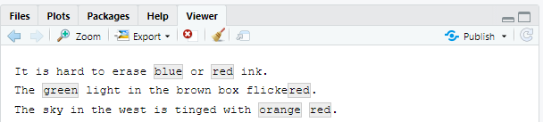


```{r}
str_extract(more, colour_match)
```


이는 stringr 함수의 일반적인 패턴이다. 매칭 하나로 작업하면 훨씬 단순한 데이터 구조를 사용할 수 있기 때문이다. 매칭 모두를 얻으려면 `str_extract_all()` 를 사용하면 된다. 이는 리스트를 반환한다.

```{r}
str_extract_all(more, colour_match)
```


[리스트](https://sulgik.github.io/r4ds/strings.html#lists) 와 [반복](https://sulgik.github.io/r4ds/strings.html#iteration) 에서 리스트에 관해 자세한 내용을 배울 것이다.

`str_extract_all()` 에서 `simplify = TRUE` 를 하면 짧은 매칭이 가장 긴 것과 같은 길이로 확장된 행렬을 반환한다.

```{r}
str_extract_all(more, colour_match, simplify = TRUE)

x <- c("a", "a b", "a b c")
str_extract_all(x, "[a-z]", simplify = TRUE)
```


#### 연습문제

1. 앞의 예에서 매칭된 정규표현식이 색상이 아닌 ’flickered’에 매칭한 것을 눈치챘을지 모르겠다. 이 문제를 해결하기 위해 정규식을 수정하라.
2. 하버드 문장 데이터에서 다음을 추출하라.
   1. 각 문장의 첫 번째 단어.
   2. `ing` 로 끝나는 모든 단어.
   3. 모든 복수형.

### 그룹화 매칭

이 장 앞부분에서 연산 우선순위를 명확히 할 목적과 역참조 목적으로 괄호 사용에 대해 이야기했었다. 이 외에도 복잡한 매치의 일부를 추출하기 위해서도 괄호를 사용할 수 있다. 예를 들어 문장에서 명사를 추출하고 싶다고 가정하자. 휴리스틱 방법으로 ‘a’ 또는 ‘the’ 다음에 오는 단어를 찾아 볼 것이다. 정규표현식에서 ’단어’를 정의하는 것은 약간 까다롭기 때문에, 여기서 다음의 간단한 근사법을 이용한다. 적어도 하나 이상의 문자(공백 제외) 시퀀스.

```{r}
noun <- "(a|the) ([^ ]+)"

has_noun <- sentences %>%
  str_subset(noun) %>%
  head(10)
has_noun %>% 
  str_extract(noun)
```


`str_extract()` 는 완전한 매치를 제공하는 반면, `str_match()` 는 각각 개별 요소를 제공한다. `str_match()` 는 문자형 벡터 대신 행렬을 반환하는데, 이 행렬에는 완전한 매치가 하나의 열로, 그 다음으로 각 그룹마다 열이 하나씩 따른다.

```{r}
has_noun %>% 
  str_match(noun)
```


(예상했지만, 명사 검출하는 이 휴리스틱 방법은 좋지 않다. smooth나 parked 같은 형용사도 검출하고 있다.)

데이터가 티블인 경우, `tidyr::extract()` 를 사용하는 것이 더 쉽다. 이 함수는 `str_match()` 처럼 동작하지만, 매치를 명명할 것을 사용자에게 요청하고, 그 후 새로운 열로 배치한다.

```{r}
tibble(sentence = sentences) %>% 
  tidyr::extract(
    sentence, c("article", "noun"), "(a|the) ([^ ]+)", 
    remove = FALSE
  )
```


`str_extract()` 처럼, 각 문자열의 모든 매치를 원한다면 `str_match_all()` 이 필요하다.


#### 연습문제

1. ‘one’, ‘two’, ‘three’ 등과 같은 ‘숫자’ 다음에 오는 모든 단어를 구하라. 숫자와 단어 모두를 추출하라.
2. 줄임말을 모두 찾아라. 아포스트로피 이전과 이후 조각을 분리하라.


### 매칭 치환

`str_replace()` 와 `str_replace_all()` 을 이용하여 매치를 새로운 문자열로 치환할 수 있다. 가장 간단한 용법은 패턴을 고정된 문자열로 치환하는 것이다.

```{r}
x <- c("apple", "pear", "banana")
str_replace(x, "[aeiou]", "-")
str_replace_all(x, "[aeiou]", "-")
```


`str_replace_all()` 을 사용하면 명명된 벡터를 제공하여 다중 치환을 수행할 수 있다.

```{r}
x <- c("1 house", "2 cars", "3 people")
str_replace_all(x, c("1" = "one", "2" = "two", "3" = "three"))
```


고정된 문자열로 치환하는 대신, 매치의 구성요소를 삽입하기 위해 역참조를 사용할 수 있다. 다음 코드는 두 번째와 세 번째 단어의 순서를 바꾼다.

```{r}
sentences %>% 
  str_replace("([^ ]+) ([^ ]+) ([^ ]+)", "\\1 \\3 \\2") %>% 
  head(5)
```


#### 연습문제

1. 문자열의 모든 슬래시를 역슬래시로 치환하라.
2. `replace_all()` 을 사용하여 `str_to_lower()` 의 간단한 버전을 구현하라.
3. 단어의 첫 번째와 마지막 문자를 바꿔라. 여전히 단어가 되는 문자열은 무엇인가?


### 문자열 분할

문자열을 조각으로 분할하려면 `str_split()` 을 사용하면 된다. 예를 들어 문장을 단어로 분할할 수 있다.

```{r}
sentences %>%
  head(5) %>% 
  str_split(" ")
```


각 구성요소가 포함하는 조각의 개수가 다를 수 있으므로, 이 함수는 리스트를 반환한다. 길이가 1인 벡터로 작업하는 경우, 가장 쉬운 것은 리스트의 첫 번째 요소를 추출하는 것이다.

```{r}
"a|b|c|d" %>% 
  str_split("\\|") %>% 
  .[[1]]
```


한편, 리스트를 반환하는 다른 **stringr** 함수처럼 `simplify = TRUE` 를 사용하여 행렬을 반환할 수도 있다.

```{r}
sentences %>%
  head(5) %>% 
  str_split(" ", simplify = TRUE)
#>      [,1]    [,2]    [,3]    [,4]      [,5]  [,6]    [,7]    
#> [1,] "The"   "birch" "canoe" "slid"    "on"  "the"   "smooth"
#> [2,] "Glue"  "the"   "sheet" "to"      "the" "dark"  "blue"  
#> [3,] "It's"  "easy"  "to"    "tell"    "the" "depth" "of"    
#> [4,] "These" "days"  "a"     "chicken" "leg" "is"    "a"     
#> [5,] "Rice"  "is"    "often" "served"  "in"  "round" "bowls."
#>      [,8]          [,9]   
#> [1,] "planks."     ""     
#> [2,] "background." ""     
#> [3,] "a"           "well."
#> [4,] "rare"        "dish."
#> [5,] ""            ""
```


조각을 최대 개수만큼 요청할 수도 있다.

```{r}
fields <- c("Name: Hadley", "Country: NZ", "Age: 35")
fields %>% str_split(": ", n = 2, simplify = TRUE)
#>      [,1]      [,2]    
#> [1,] "Name"    "Hadley"
#> [2,] "Country" "NZ"    
#> [3,] "Age"     "35"
```


또한, 패턴으로 문자열을 분할하는 대신 문자, 줄, 문장 및 단어 경계 (`boundary()` )로 분할할 수도 있다.

```{r}
x <- "This is a sentence.  This is another sentence."
str_view_all(x, boundary("word"))
```

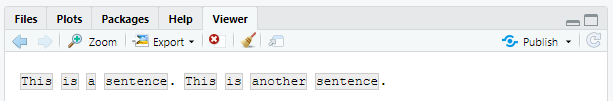


```{r}
str_split(x, " ")[[1]]
#> [1] "This"      "is"        "a"         "sentence." ""          "This"     
#> [7] "is"        "another"   "sentence."
str_split(x, boundary("word"))[[1]]
#> [1] "This"     "is"       "a"        "sentence" "This"     "is"      
#> [7] "another"  "sentence"
```


#### 연습문제

1. `"apples, pears, and bananas"` 와 같은 문자열을 개별 구성요소로 분할하라.
2. 왜 `" "` 보다 `boundary("word")` 로 분할하는 것이 좋은가?
3. 빈 문자열 (`""` )로 분할하면 어떻게 되는가? 실험해 본 후, 설명서를 읽어라.


### 매치 찾기

`str_locate()` 와 `str_locate_all()` 을 사용하면 각 매치의 시작과 종료 위치를 알 수 있다. 이는 원하는 바를 완벽하게 수행하는 함수가 없을 때 특히 유용하다. `str_locate()` 를 사용하여 매칭 패턴을 찾을 수 있으며 `str_sub()` 를 사용하여, 매칭 패턴을 추출하거나 수정할 수 있다.


## 기타 패턴 유형    {#other_patterns}

문자열로 된 패턴을 사용하면 자동으로 `regex()` 호출로 래핑된다.

```{r}
fruit <- c("banana", "Banana", "BANANA")
# The regular call:
str_view(fruit, "nana")
# Is shorthand for
str_view(fruit, regex("nana"))
```


`regex()` 의 다른 인수를 사용하여 매치의 세부사항을 제어할 수 있다.

- `ignore_case = TRUE` 를 하면 문자가 대문자나 소문자 형태 모두로 매칭된다. 이때 항상 현재의 로케일을 사용한다.

  ```{r}
  bananas <- c("banana", "Banana", "BANANA")
  str_view(bananas, "banana")
  ```

  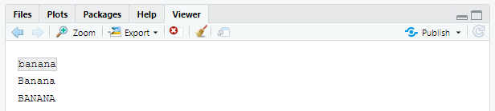

  

  ```{r}
  str_view(bananas, regex("banana", ignore_case = TRUE))
  ```

  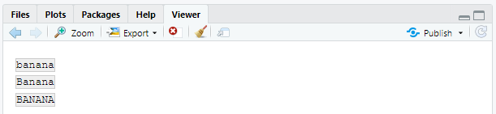

  

- `multiline = TRUE` 를 하면 `^` 와 `$` 이 전체 문자열의 시작, 끝이 아니라, 각 라인의 시작과 끝이 매칭된다.

  ```{r}
  x <- "Line 1\nLine 2\nLine 3"
  str_extract_all(x, "^Line")[[1]]
  str_extract_all(x, regex("^Line", multiline = TRUE))[[1]]
  ```

- `comments = TRUE` 를 하면 복잡한 정규표현식을 이해하기 쉽도록 설명과 공백을 사용할 수 있게 된다. `#` 뒤에 나오는 다른 문자들처럼 공백도 무시된다. 공백 문자를 매치하기 위해서는 `“\\”` 로 이스케이프 해야 한다.

  ```{r}
  phone <- regex("
    \\(?     # optional opening parens
    (\\d{3}) # area code
    [) -]?   # optional closing parens, space, or dash
    (\\d{3}) # another three numbers
    [ -]?    # optional space or dash
    (\\d{3}) # three more numbers
    ", comments = TRUE)
  
  str_match("514-791-8141", phone)
  ```


- `dotall = TRUE` 를 하면 `.` 이 `\n` 을 포함한 모든 것에 매칭된다.

  ```{r}
  str_detect("\nX\n", ".X.")
  str_detect("\nX\n", regex(".X.", dotall = TRUE))
  ```


`regex()` 대신 사용할 수 있는 세 가지 함수가 있다.

- `fixed()` 는 지정된 일련의 바이트와 정확히 매치한다. 이 함수는 모든 특수 정규표현식을 무시하고 매우 낮은 수준에서 동작한다. 이를 사용하여 복잡한 이스케이프를 피할 수 있으며 정규표현식보다 훨씬 속도가 빠르다. 다음의 소규모 벤치마크는 단순한 예시에 대해 약 3배 빠르다는 것을 보여준다.

  ```{r}
  microbenchmark::microbenchmark(
    fixed = str_detect(sentences, fixed("the")),
    regex = str_detect(sentences, "the"),
    times = 20
  )
  ```


  `fixed()` 를 비영어에 사용할 때는 조심하라. 같은 문자를 나타내는 방법이 여러 가지이기 때문에 문제가 되는 경우가 많다. 예를 들어 ’á’를 정의하는 방법에는 두 가지가 있다. 즉, 단일한 문자로 하거나, ’a’와 악센트로 하는 방법이다.

  ```{r}
  a1 <- "\u00e1"
  a2 <- "a\u0301"
  c(a1, a2)
  a1 == a2
  ```


  동일하게 렌더링하지만 다르게 정의되었기 때문에 `fixed()` 가 매치를 찾지 못한다. 대신, 인간의 문자 비교 규칙을 존중하는 `coll()` (아래에 정의됨)을 사용할 수 있다.

  ```{r}
  str_detect(a1, fixed(a2))
  str_detect(a1, coll(a2))
  ```


- `coll()` 은 표준 정렬(collation) 규칙을 사용하여 문자열을 비교한다. 대소문자를 구분하지 않는(case-insensitive) 매치를 수행할 때 유용하다. `coll()` 은 문자 비교 규칙을 제어하는 로케일 파라미터를 취한다는 것을 주의해야 한다. 불행하게도 세계의 각 지역은 다른 규칙을 사용한다!

  ```{r}
  # That means you also need to be aware of the difference
  # when doing case insensitive matches:
  i <- c("I", "İ", "i", "ı")
  i
  
  str_subset(i, coll("i", ignore_case = TRUE))
  str_subset(i, coll("i", ignore_case = TRUE, locale = "tr"))
  ```


  `fixed()` 와 `regex()` 모두에 `ignore_case` 인수가 있지만, 로케일 선택을 허용하지는 않는다. 이들은 항상 기본 로케일을 사용한다. 다음 코드를 통해 이를 알아볼 수 있다. (**stringi** 에서 더 살펴보자)

  ```{r}
  stringi::stri_locale_info()
  ```


  `coll()` 의 단점은 속도이다. 어느 문자가 같은지 인식하는 규칙이 복잡하기 때문에, `coll()` 은 `regex()` 와 `fixed()` 에 비해 상대적으로 느리다.

- `str_split()` 에서 보았듯이 `boundary()` 를 사용하여 경계를 매치할 수 있다. 다른 함수들과도 사용할 수 있다.

  ```{r}
  x <- "This is a sentence."
  str_view_all(x, boundary("word"))
  ```

  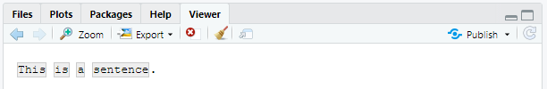

  

  ```{r}
  str_extract_all(x, boundary("word"))
  ```


### 연습문제

1. `regex()` vs `fixed()` 를 사용하여, 어떻게 `\` 를 포함하는 모든 문자열을 찾겠는가?
2. `sentences` 에서 가장 자주 나오는 단어 다섯 가지는 무엇인가?


## 정규 표현식의 기타 용도   {#reg_other_usage}

베이스 R 의 다음의 두 함수도 정규표현식을 사용한다.

- `apropos()` 는 전역 환경에서 사용할 수 있는 모든 객체를 검색한다. 함수의 이름을 기억할 수 없는 경우에 유용하다.

  ```{r}
  apropos("replace")
  #> [1] "%+replace%"       "replace"          "replace_na"      
  #> [4] "setReplaceMethod" "str_replace"      "str_replace_all" 
  #> [7] "str_replace_na"   "theme_replace"
  ```


- `dir()` 은 디렉터리에 있는 모든 파일을 나열한다. `pattern` 인자는 정규표현식을 취해, 매치하는 파일 이름만 반환한다. 예를 들어 현재 디렉터리에 있는 모든 R 파일(R 마크다운 파일의 경우의 패턴은 `"\\.Rmd$"`)을 다음과 같이 찾을 수 있다.

  ```{r}
  head(dir(pattern = "\\.R$"))
  ```
  

  (`*.Rmd` 같은 ’글로브(globs) 패턴’에 익숙한 경우, `glob2rx()` 를 사용하여 이를 정규표현식으로 변환할 수 있다.)


## `stringi`     {#stringi}

`stringr` 은 **`stringi `** 패키지 기반으로 만들어졌다. **`stringr`** 은 학습할 때 유용한데, 왜냐하면 이 패키지는 자주 사용하는 문자열 조작 함수들을 다루기 위해 엄선된 최소한의 함수들만 보여주기 때문이다. 반면, **`stringi`** 는 전체를 포괄하도록 설계되었고, 필요한 거의 모든 함수를 포함한다. **`stringi`** 에는 234 개의 함수가 있지만, **`stringr`** 에는 46개가 있다.

`stringr` 에서 잘 안될 경우, **`stringi`** 에서 한 번 찾아보는 것이 좋다. 두 패키지는 매우 유사하게 동작하므로, **`stringr`** 에서 배운 것을 자연스럽게 활용할 수 있을 것이다. 주요 차이점은 접두사이다(`str_` 과 `stri_` ).

### 연습문제

1. 다음을 수행하는 **stringi** 함수를 찾아라.
2. 단어의 수를 계산.
3. 중복 문자열을 찾음.
4. 랜덤 텍스트를 생성.
5. `stri_sort()` 에서 정렬에 사용할 언어를 어떻게 제어하겠는가?

## Reference  {-}
https://sulgik.github.io/r4ds/strings.html
